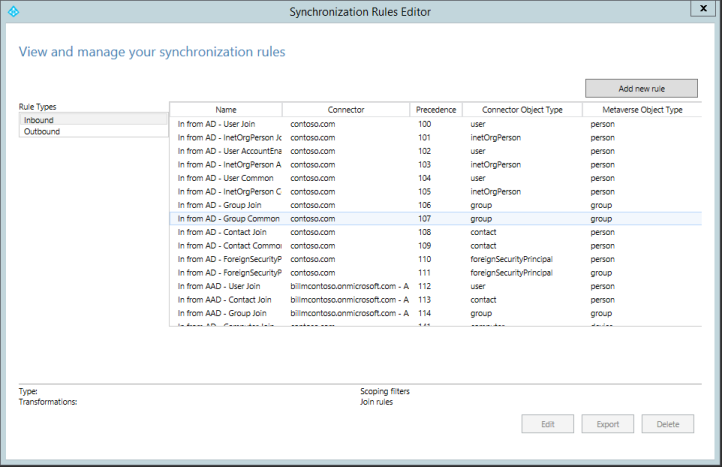
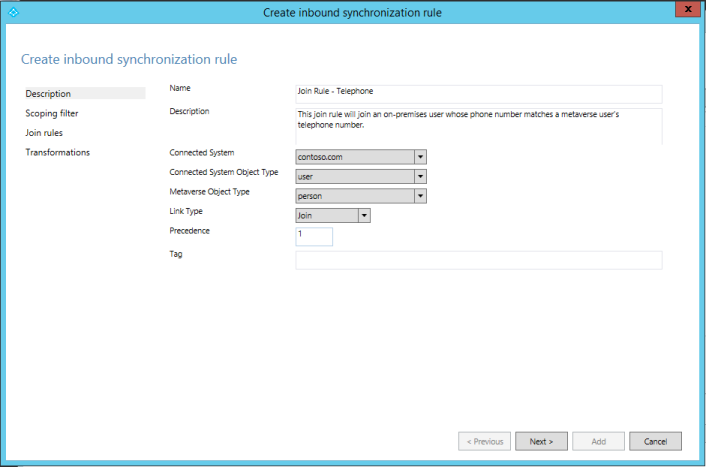
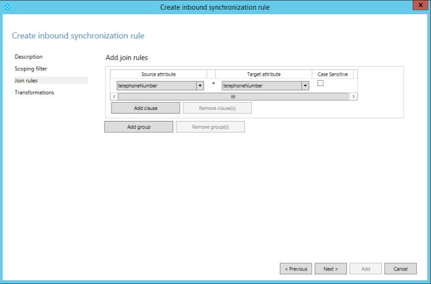

<properties 
	pageTitle="Gestione di Azure AD Connect" 
	description="Informazioni su come estendere la configurazione predefinita e attività operative per Azure AD Connect." 
	services="active-directory" 
	documentationCenter="" 
	authors="billmath" 
	manager="terrylan" 
	editor="lisatoft"/>

<tags 
	ms.service="active-directory" 
	ms.workload="identity" 
	ms.tgt_pltfrm="na" 
	ms.devlang="na" 
	ms.topic="article" 
	ms.date="04/02/2015" 
	ms.author="billmath"/>

# Gestione di Azure AD Connect 

<a href="/it-it/documentation/articles/active-directory-aadconnect/" title="Che cos&apos;è?" class="current">Che cos'è?</a> <a href="/it-it/documentation/articles/active-directory-aadconnect-how-it-works/" title="Come funziona">Come funziona</a> <a href="/it-it/documentation/articles/active-directory-aadconnect-get-started/" title="Introduzione">Introduzione</a> <a href="/it-it/documentation/articles/active-directory-aadconnect-get-manage/" title="">titleGestiretitleGestire</a>

Argomenti operativi avanzati che permettono di personalizzare Azure Active Directory Connect per soddisfare le esigenze e i requisiti dell'organizzazione.

## Modifica della configurazione predefinita
Nella maggior parte dei casi, la configurazione predefinita di Azure AD Connect è sufficiente per estendere le directory locali nel cloud. Tuttavia, in alcuni casi può essere necessario modificarla per adattarla alla logica di business dell'organizzazione. Benché in questi casi sia possibile modificare la configurazione predefinita, è bene tenere presenti alcuni aspetti.

Se si intende eseguire l'aggiornamento o passare da Azure AD Sync o DirSync, considerare quanto segue:

- Dopo l'aggiornamento di Azure AD Sync a una versione più recente, verrà ripristinata la maggior parte delle impostazioni predefinite.
- Le modifiche apportate alle regole di sincronizzazione predefinite vengono perdute dopo aver applicato un aggiornamento.
- Le regole di sincronizzazione predefinite eliminate vengono ricreate durante un aggiornamento a una versione più recente.
- Le regole di sincronizzazione personalizzate create restano inalterate dopo aver applicato un aggiornamento a una versione più recente.

Quando è necessario modificare la configurazione predefinita, eseguire le operazioni seguenti:

- Evitare di modificare un flusso di attributi di una regola di sincronizzazione predefinita. Creare invece una nuova regola di sincronizzazione con una priorità superiore (valore numerico inferiore) che contenga il flusso di attributi necessario.
- Esportare le regole di sincronizzazione personalizzate usando l'Editor regole di sincronizzazione. In questo modo, viene fornito uno script di PowerShell che è possibile usare per ricrearle facilmente nel caso di uno scenario di ripristino di emergenza.
- Se è necessario modificare l'ambito o l'impostazione di unione in una regola di sincronizzazione predefinita, documentare questa necessità e riapplicare la modifica dopo l'aggiornamento a una versione più recente di Azure AD Connect.

 

## Uso dell'Editor regole di sincronizzazione

In Azure AD Connect è possibile configurare e ottimizzare il flusso di oggetti e di attributi tra Azure AD e le directory locali mediante la configurazione di regole di sincronizzazione. Le regole di sincronizzazione possono essere configurate usando l'Editor regole di sincronizzazione. L'Editor regole di sincronizzazione viene installato durante l'installazione di Azure AD Connect. Per usare l'editor, è necessario essere un membro del gruppo ADSyncAdmins o del gruppo Administrators specificato durante l'installazione di Azure AD Connect.

Nella schermata seguente sono visualizzate tutte le regole di sincronizzazione create per la configurazione durante l'installazione di Azure AD Connect con l'opzione di installazione rapida. Ogni riga nella tabella corrisponde a una regola di sincronizzazione. A sinistra in Tipi di regola sono elencati due tipi diversi: In ingresso e In uscita. I tipi In ingresso e In uscita derivano dalla visualizzazione dei metaverse. Ovvero, vengono passate informazioni dalle directory ai metaverse. Per In uscita si intendono le regole in cui informazioni e attributi vengono inviati dalle directory, come Active Directory o Azure AD locale.

 

Per creare una nuova regola, selezionare Aggiungi nuova regola e quindi configurare la regola. Si supponga, ad esempio, di voler creare una regola di unione in cui qualsiasi utente presente nella directory locale viene unito all'oggetto metaverse che ha lo stesso numero di telefono. A questo scopo, è necessario creare la nuova regola e specificare il sistema connesso, in questo caso contoso.com, il tipo di oggetto del sistema connesso, l'utente, il tipo di oggetto metaverse, la persona e il tipo di collegamento dell'unione.

 

Nella schermata Regole di unione specificare telephoneNumber in Attributo di origine e in Attributo di destinazione. È tutto. La regola di unione è stata creata correttamente.

 

È possibile usare l'Editor regole di sincronizzazione per applicare logica di business aggiuntiva esternamente alla configurazione predefinita e adattarla alle esigenze dell'organizzazione. Per altre informazioni sull'Editor regole di sincronizzazione, vedere [Informazioni sulla configurazione predefinita](https://msdn.microsoft.com/library/azure/dn800963.aspx).

## Uso del provisioning dichiarativo 
Il provisioning dichiarativo è un tipo di provisioning "senza codice" che può essere impostato e configurato usando l'Editor regole di sincronizzazione. L'editor può essere usato per configurare e creare regole di provisioning personalizzate.

Una parte essenziale del provisioning dichiarativo è il linguaggio delle espressioni usato nei flussi di attributi. Il linguaggio usato è un subset di Microsoft® Visual Basic®, Applications Edition (VBA). Questo linguaggio viene usato in Microsoft Office e verrà riconosciuto anche dagli utenti con esperienza in VBScript. Il linguaggio delle espressioni di provisioning dichiarativo usa solo funzioni e non è un linguaggio strutturato, né include metodi o istruzioni. Le funzioni verranno invece annidate per esprimere flussi di programmi.

Per altre informazioni sul linguaggio delle espressioni, vedere [Informazioni sulle espressioni di provisioning dichiarativo](https://msdn.microsoft.com/library/azure/dn801048.aspx).

## Documentazione aggiuntiva
Parte della documentazione creata per Azure AD Sync è comunque pertinente e si applica anche ad Azure AD Connect. Benché grande sia l'impegno per aggiungere questa documentazione in Azure.com, una sua parte si trova ancora nella sezione specifica di MSDN Library. Per altra documentazione, vedere [Azure AD Connect in MSDN](https://msdn.microsoft.com/library/azure/dn832695.aspx) e [Azure AD Sync in MSDN](https://msdn.microsoft.com/library/azure/dn790204.aspx).

**Risorse aggiuntive**

* [Usare l'infrastruttura di identità locale nel cloud](active-directory-aadconnect-whatis.md)
* [Funzionamento di Azure AD Connect](active-directory-aadconnect-howitworks.md)
* [Introduzione ad Azure AD Connect](active-directory-aadconnect-getstarted.md)
* [Gestione di Azure AD Connect](active-directory-aadconnect-manage.md)
* [Azure AD Connect in MSDN](https://msdn.microsoft.com/library/azure/dn832695.aspx)

<!---HONumber=58-->