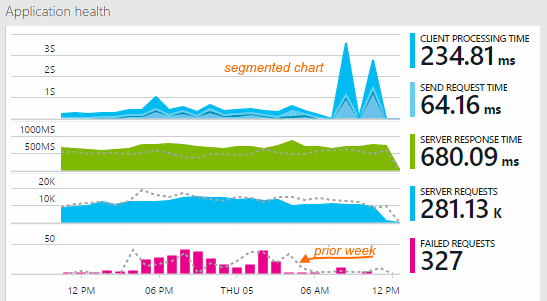
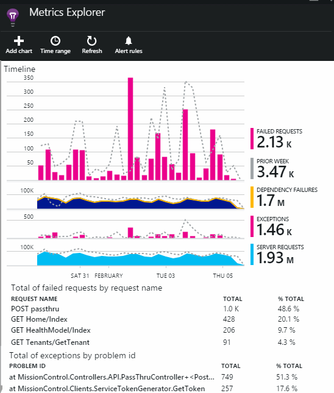
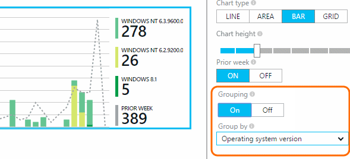

<properties 
	pageTitle="Esaminare le metriche in Application Insights" 
	description="Analizzare l'uso, la disponibilità e le prestazioni dell'applicazione locale o Web di Microsoft Azure con Application Insights." 
	services="application-insights" 
    documentationCenter=""
	authors="alancameronwills" 
	manager="ronmart"/>

<tags 
	ms.service="application-insights" 
	ms.workload="tbd" 
	ms.tgt_pltfrm="ibiza" 
	ms.devlang="na" 
	ms.topic="article" 
	ms.date="05/07/2015" 
	ms.author="awills"/>
 
# Esaminare le metriche in Application Insights

Le metriche in [Application Insights][start] sono valori e un numero di eventi misurati, inviati nella telemetria dall'applicazione. Consentono di rilevare problemi di prestazioni e osservare le tendenze nella modalità di uso dell'applicazione. Esiste una vasta gamma di metriche standard ed è anche possibile creare le proprie metriche ed eventi personalizzati.

Il conteggio delle metriche e degli eventi viene visualizzato nei grafici dei valori aggregati, ad esempio somme, medie o conteggi.

Ad esempio, se si aggiunge Application Insights a un'applicazione Web, di seguito sono riportate le informazioni visualizzate nella parte superiore della panoramica:

Alcuni grafici sono segmentati: l'altezza totale del grafico in qualsiasi punto è la somma delle metriche visualizzate. La legenda per impostazione predefinita mostra le quantità più grandi.

Le linee tratteggiate indicano il valore della metrica di una settimana precedente.

## Valori dei punti

Posizionare il mouse sul grafico per visualizzare i valori delle metriche in quel punto.

Il valore della metrica in un punto particolare è aggregato al sopra dell'intervallo di campionamento precedente. Può variare a seconda dell'intervallo di tempo dell'intero grafico.

L'intervallo di campionamento o il "livello di dettaglio" viene visualizzato nella parte superiore del pannello.

## Intervallo di tempo

È possibile modificare l'intervallo di tempo coperto dalla maggior parte dei grafici o delle griglie in tutti i pannelli.

Se si è in attesa di alcuni dati non ancora visualizzati, fare clic su Aggiorna. I grafici non vengono aggiornati automaticamente. In modalità di rilascio è possibile che ai dati sia necessario un po' di tempo per superare la pipeline di analisi in un grafico.

Nel pannello Panoramica eseguire il trascinamento su una parte del grafico per ingrandirla in un nuovo grafico.

## Esplora metriche

Fare clic su qualsiasi grafico nel pannello Panoramica per visualizzare un set più dettagliato di griglie e grafici correlati. È possibile modificare questi grafici e griglie per concentrarsi sui dettagli a cui si è interessati.

Ad esempio, fare clic sul grafico Richieste non riuscite dell'app Web:

## Cosa significano le cifre?

La legenda sul lato mostra per impostazione predefinita il valore aggregato per il periodo del grafico.

Ogni punto dati del grafico è anche una funzione di aggregazione dei valori di dati ricevuti nell'intervallo di campionamento precedente o nel "livello di dettaglio". Il livello di dettaglio viene visualizzato nella parte superiore del pannello e varia in base alla scala cronologica complessiva del grafico.

Le metriche vengono aggregate in modi diversi:

 * Per una metrica, ad esempio il tempo di risposta, i valori sono **calcolati in media** sul periodo del grafico.
 * Per i conteggi degli eventi, ad esempio le richieste non riuscite, la funzione di aggregazione è la **somma** dei conteggi nel periodo.
 * Per i conteggi degli utenti, la funzione di aggregazione è il numero di utenti **univoci** nel periodo. Se un utente è rilevato più di una volta nel periodo, viene contato una sola volta.

Per verificare se il valore è una somma, una media o un valore univoco, fare clic sul grafico e scorrere fino al valore selezionato. È anche possibile ottenere una breve descrizione della metrica.

 

## Modifica di grafici e griglie

Per aggiungere un nuovo grafico al pannello:

Selezionare un grafico nuovo o esistente per modificare il contenuto visualizzato:

È possibile visualizzare più metriche in un grafico, anche se sono presenti restrizioni sulle combinazioni che è possibile visualizzare insieme. Non appena si sceglie una metrica, alcune vengono disabilitate.

Se si codificano [metriche personalizzate][track] nell'app \(chiamate a TrackMetric e TrackEvent\), verranno elencate qui.

## Segmentare i dati

Selezionare un grafico o una griglia, passare a un raggruppamento e scegliere una proprietà per eseguire il raggruppamento in base a:

Se si codificano [metriche personalizzate][track] nell'app e includono i valori delle proprietà, sarà possibile selezionare la proprietà nell'elenco.

Il grafico è troppo piccolo per dati segmentati? Modificarne l'altezza:

## Filtrare i dati

Per visualizzare solo le metriche per un set di valori di proprietà selezionati:

Se non si seleziona alcun valore per una determinata proprietà, è come se si selezionassero tutti: non sono presenti filtri su quella proprietà.

Si noti il numero di eventi vicino a ogni valore della proprietà. Quando si selezionano i valori di una proprietà, i conteggi vicino ad altri valori di proprietà vengono modificati.

## Rimuovere il traffico di bot e test Web

Usare il filtro **Traffico reale o sintetico** e selezionare **Reale**.

È possibile anche filtrare in base a **Origine del traffico sintetico**.

## Modificare il tipo di grafico

In particolare, si noti che è possibile passare dalle griglie ai grafici e viceversa:

## Salvare il pannello delle metriche

Dopo aver creato alcuni grafici, è possibile salvarli come preferiti. È possibile scegliere se condividerlo con altri membri del team, se si usa un account aziendale.

Per visualizzare nuovamente il pannello, **andare al pannello** e aprire Preferiti:

Se si è scelto l'intervallo di tempo Relativo al momento del salvataggio, il pannello verrà aggiornato con le metriche più recenti. Se si è scelto l'intervallo di tempo Assoluto, verranno visualizzati gli stessi dati ogni volta.

## Reimpostare il pannello

Se si modifica un pannello ma poi si desidera tornare a quello impostato salvato in origine, fare clic su Reimposta.

## Impostazione di avvisi

Per ricevere tramite posta elettronica una notifica dei valori insoliti di una metrica, aggiungere un avviso. È possibile scegliere di inviare il messaggio di posta elettronica agli amministratori di account o a indirizzi di posta elettronica specifici.

[Altre informazioni][alerts]

<!--Link references-->

[alerts]: app-insights-alerts.md
[start]: app-insights-get-started.md
[track]: app-insights-custom-events-metrics-api.md

<!--HONumber=54-->