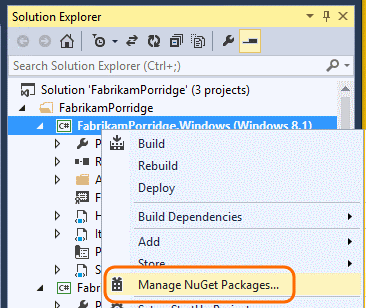

<properties 
	pageTitle="Application Insights per app desktop per Windows." 
	description="Analizzare l'uso e le prestazioni dell'app per Windows con Application Insights." 
	services="application-insights" 
    documentationCenter="windows"
	authors="alancameronwills" 
	manager="keboyd"/>

<tags 
	ms.service="application-insights" 
	ms.workload="tbd" 
	ms.tgt_pltfrm="ibiza" 
	ms.devlang="na" 
	ms.topic="article" 
	ms.date="04/04/2015" 
	ms.author="awills"/>

# Application Insights su app Desktop di Windows

*Application Insights è disponibile in anteprima.*

[AZURE.INCLUDE [app-insights-selector-get-started](../includes/app-insights-selector-get-started.md)]

Application Insights consente di monitorare un'applicazione distribuita in base all'uso e alle prestazioni.

*Sebbene SDK di Application Insights è fatto per essere usato in un'app desktop, questo non è uno scenario attualmente supportato. Se però si desidera provare a livello sperimentale, ecco alcuni suggerimenti per questa operazione.*


## <a name="add"></a> Creare una risorsa Application Insights


1.  Nel [portale di Azure][portal] creare una nuova risorsa di Application Insights. Scegliere l'app ASP.NET o Windows Store per il tipo di applicazione. 

    

    La scelta del tipo di applicazione imposta il contenuto del pannello Panoramica e le proprietà disponibili nell'[area di esplorazione delle metriche][metrics].

2.  Eseguire una copia della chiave di strumentazione.

    

## <a name="sdk"></a>Installare SDK nell'applicazione


1. In Visual Studio è possibile modificare i pacchetti NuGet del progetto di app desktop. 

2. Installare l'Application Insights SDK di base.

    

    In alternativa, è possibile scegliere Application Insights SDK per app Web. In questo modo si fornisce la telemetria del contatore delle prestazioni predefinite.

3. Modificare ApplicationInsights.config \(che è stato aggiunto dall'installazione di NuGet\). Inserire questo comando immediatamente prima del tag di chiusura:

    &lt;InstrumentationKey&gt;\*the key you copied\*&lt;/InstrumentationKey&gt;

    In alternativa è possibile ottenere lo stesso effetto con il codice seguente:
    
    `TelemetryConfiguration.Active.InstrumentationKey = "your key";`

4. Se è stato installato l'SDK per app Web, è anche possibile commentare i moduli di telemetria Web dal file ApplicationInsights.config

## <a name="telemetry"></a>Inserire le chiamate di telemetria

Creare un'`TelemetryClient` istanza e quindi [usarla per inviare dati di telemetria][track].

Usare `TelemetryClient.Flush` per inviare messaggi prima di chiudere l'app \(non è consigliato per altri tipi di app\).

Ad esempio, in un'applicazione Windows Form, è possibile scrivere:

```C#

    public partial class Form1 : Form
    {
        private TelemetryClient tc = new TelemetryClient();
        ...
        private void Form1_Load(object sender, EventArgs e)
        {
            tc.TrackPageView("Form1");
            ...
        }

        protected override void OnClosing(CancelEventArgs e)
        {
            stop = true;
            if (tc != null)
            {
                tc.Flush(); // only for desktop apps
            }
            base.OnClosing(e);
        }

```

Usare l'[API di Application Insights][track] per inviare dati di telemetria. Nelle applicazioni Desktop di Windows, non vengono inviati automaticamente i dati di telemetria. In genere è necessario usare:

* TrackPageView\(pageName\) nel passare a moduli, pagine o tabelle
* TrackEvent\(eventName\) per altre azioni utente
* TrackTrace\(logEvent\) per la [registrazione diagnostica][diagnostic]
* TrackException\(exception\) in clausole catch
* TrackMetric\(name, value\) in un'attività in background per inviare report periodici delle metriche non associate a eventi specifici.

Per visualizzare il numero di utenti e sessioni, impostare un inizializzatore di contesto:

    class TelemetryInitializer: IContextInitializer
    {
        public void Initialize(TelemetryContext context)
        {
            context.User.Id = Environment.UserName;
            context.Session.Id = DateTime.Now.ToFileTime().ToString();
            context.Session.IsNewSession = true;
        }
    }

    static class Program
    {
        ...
        static void Main()
        {
            TelemetryConfiguration.Active.ContextInitializers.Add(
                new TelemetryInitializer());
            ...


## <a name="run"></a>Eseguire il progetto

[Eseguire l'applicazione con F5](http://msdn.microsoft.com/library/windows/apps/bg161304.aspx) e usarla in modo da generare alcuni dati di telemetria.

In Visual Studio verrà visualizzato il conteggio degli eventi che sono stati inviati.


## <a name="monitor"></a>Visualizzare i dati monitorati

Tornare al pannello dell'applicazione nel portale di Azure.

I primi eventi verranno visualizzati in Ricerca diagnostica.

Se si prevedono più dati, fare clic su Aggiorna dopo pochi secondi.

Se si usa TrackMetric o il parametro delle misurazioni di TrackEvent, aprire l'[area di esplorazione delle metriche][metrics] e aprire il pannello Filtri, in cui verranno visualizzate le metriche.


## <a name="usage"></a>Passaggi successivi

[Tenere traccia dell'utilizzo dell'app][track]

[Acquisire ed eseguire ricerche nei log di diagnostica][diagnostic]

[Risoluzione dei problemi][qna]


<!--Link references-->

[diagnostic]: app-insights-diagnostic-search.md
[metrics]: app-insights-metrics-explorer.md
[portal]: http://portal.azure.com/
[qna]: app-insights-troubleshoot-faq.md
[track]: app-insights-custom-events-metrics-api.md


<!--HONumber=54-->