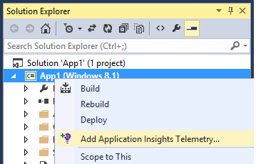

<properties 
	pageTitle="Application Insights per app di Windows Phone e Store" 
	description="Analizzare l'uso e le prestazioni dell'app per dispositivi Windows con Application Insights." 
	services="application-insights" 
    documentationCenter="windows"
	authors="alancameronwills" 
	manager="keboyd"/>

<tags 
	ms.service="application-insights" 
	ms.workload="tbd" 
	ms.tgt_pltfrm="ibiza" 
	ms.devlang="na" 
	ms.topic="article" 
	ms.date="04/02/2015" 
	ms.author="awills"/>

# Application Insights per app di Windows Phone e Store

*Application Insights è disponibile in anteprima.*

[AZURE.INCLUDE [app-insights-selector-get-started](../includes/app-insights-selector-get-started.md)]

Visual Studio Application Insights consente di monitorare un'applicazione monitorata per le operazioni seguenti:

* [**Uso**][windowsUsage]\: acquisire informazioni sul numero di utenti a disposizione e su quali operazioni eseguono con l'app.
* [**Arresti anomali**][windowsCrash]\: ottenere report di diagnostica degli arresti anomali e comprendere l'impatto sugli utenti.

Per molti tipi di applicazioni [Visual Studio può aggiungere Application Insights all'app](#ide) quasi automaticamente. Tuttavia, poiché si sta leggendo questo articolo per una migliore comprensione, verranno illustrati i passaggi manuali.

Sono necessari gli elementi seguenti:

* Una sottoscrizione a [Microsoft Azure][azure].
* Visual Studio 2013 o versione successiva.

## 1\. Creare una risorsa Application Insights 

Nel [portale di Azure][portal] creare una nuova risorsa di Application Insights.

Una [risorsa][roles] in Azure è un'istanza di un servizio. In questa risorsa la telemetria dell'app verrà analizzata e visualizzata.

#### Eseguire una copia della chiave di strumentazione

La chiave identifica la risorsa. È necessaria subito per configurare SDK per l'invio di dati alla risorsa.

## 2\. Aggiungere Application Insights SDK alle app

In Visual Studio aggiungere l'SDK appropriato al progetto.

Se si tratta di un'app di Windows universale, ripetere i passaggi per il progetto Windows Phone e quello Windows.

1. Fare clic con il pulsante destro del mouse in Esplora soluzioni e scegliere **Gestisci pacchetti NuGet**.

    

2. Selezionare **Online**, **Includi versione preliminare** e cercare "Application Insights".

    

3. Selezionare la versione più recente del pacchetto appropriato. I pacchetti disponibili sono:
   * Application Insights per applicazioni Windows: *per app di Windows Store*
   * Application Insights per applicazioni Windows Phone
   * Application Insights per app Web: *usare questa opzione per un'applicazione desktop* 
4. Modificare ApplicationInsights.config \(che è stato aggiunto dall'installazione di NuGet\). Inserire questo comando immediatamente prima del tag di chiusura:

    `<InstrumentationKey>`\*the key you copied\*`</InstrumentationKey>`

**App Windows universali**: ripetere i passaggi per il progetto di Phone e Store.

## 3. Abilitare l'accesso alla rete per l'app

Se l'app non ha già [richiesto l'accesso alla rete in uscita](https://msdn.microsoft.com/library/windows/apps/hh452752.aspx), sarà necessario aggiungere il manifesto come una [funzionalità necessaria](https://msdn.microsoft.com/library/windows/apps/br211477.aspx).

## 4. Eseguire il progetto

[Eseguire l'applicazione con F5](http://msdn.microsoft.com/library/windows/apps/bg161304.aspx) e usarla in modo da generare alcuni dati di telemetria.

In Visual Studio verrà visualizzato il conteggio degli eventi che sono stati ricevuti.

In modalità di debug la telemetria viene inviata non appena viene generata. In modalità di rilascio la telemetria è archiviata nel dispositivo e inviata solo quando l'app viene ripresa.

## 5. Visualizzare i dati monitorati

Aprire Application Insights dal progetto.

All'inizio si vedranno solo uno o due punti. ad esempio:

Se si prevedono più dati, fare clic su Aggiorna dopo pochi secondi.

Per visualizzare altri dettagli, fare clic su qualsiasi grafico.

## 5. Pubblicare l'applicazione in Store

[Pubblicare l'applicazione](http://dev.windows.com/publish) e controllare i dati accumulati quando gli utenti li scaricano e li usano.

## Il metodo automatico

Se si preferisce usare Visual Studio per eseguire i passaggi di installazione, è possibile eseguire questa operazione con Windows Phone, Windows Store e molti altri tipi di app.

### Se si crea un nuovo progetto di app Windows...

Nella finestra di dialogo Nuovo progetto selezionare Application Insights.

Se viene chiesto l'accesso, usare le credenziali dell'account Azure \(che è diverso dall'account di Visual Studio Online\).

### In alternativa, se è un progetto esistente ...

Aggiungere Application Insights da Esplora soluzioni.

## Passaggi successivi

[Tenere traccia dell'utilizzo dell'app][windowsUsage]

[Rilevare e diagnosticare gli arresti anomali nell'app][windowsCrash]

[Acquisire ed eseguire ricerche nei log di diagnostica][diagnostic]

[Usare l'API per inviare dati di telemetria personalizzati][api]

[Risoluzione dei problemi][qna]

<!--Link references-->

[api]: app-insights-api-custom-events-metrics.md
[azure]: insights-perf-analytics.md
[diagnostic]: app-insights-diagnostic-search.md
[portal]: http://portal.azure.com/
[qna]: app-insights-troubleshoot-faq.md
[roles]: app-insights-resources-roles-access-control.md
[windowsCrash]: app-insights-windows-crashes.md
[windowsUsage]: app-insights-windows-usage.md

<!--HONumber=54-->