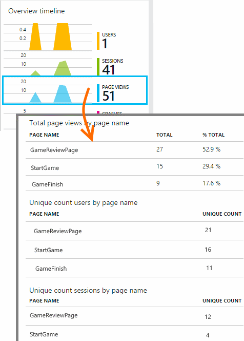

<properties 
	pageTitle="Monitorare l'uso nelle app Windows Store e Phone con Application Insights" 
	description="Analizzare l'uso dell'app per dispositivo Windows con Application Insights." 
	services="application-insights" 
    documentationCenter="windows"
	authors="alancameronwills" 
	manager="ronmart"/>

<tags 
	ms.service="application-insights" 
	ms.workload="tbd" 
	ms.tgt_pltfrm="ibiza" 
	ms.devlang="na" 
	ms.topic="article" 
	ms.date="02/28/2015" 
	ms.author="awills"/>

#  Monitorare l'uso nelle app Windows Store e Windows Phone con Application Insights

*Application Insights è disponibile in anteprima.*

Informazioni sul numero di utenti a disposizione e su quali pagine gli utenti stanno guardando nell'app. Application Insights offre dati predefiniti. Inserendo alcune righe di codice nell'app, sarà possibile avere altre informazioni sui percorsi usati dagli utenti nell'app e sugli obiettivi raggiunti mediante l'applicazione.

Se questa operazione non è stata ancora eseguita, aggiungere [Application Insights al progetto dell'app][windows] e ripubblicarlo.

## Tenere traccia dell'utilizzo

Dalla sequenza temporale Panoramica, fare clic sui grafici relativi agli utenti e alle sessioni per visualizzare altre analisi dettagliate.

* Viene tenuta traccia degli **utenti** in modo anonimo, in modo che venga considerato due volte lo stesso utente in dispositivi diversi.
* Il conteggio di una **sessione** viene eseguito quando l'app viene sospesa (per più di un breve intervallo, per evitare il conteggio di sospensioni accidentali).

#### Segmentazione

Segmentare un grafico per ottenere una suddivisione in base a una serie di criteri. Ad esempio, per visualizzare il numero di utenti che usa ogni versione dell'applicazione, aprire il grafico degli utenti e suddividere in segmenti in base alla versione dell'applicazione:

#### Visualizzazioni pagina

Per individuare i percorsi che usati dagli utenti nell'app, inserire la [telemetria delle visualizzazioni pagina][api] nel codice:

    var telemetry = new TelemetryClient();
    telemetry.TrackPageView("GameReviewPage");

Nel grafico delle visualizzazioni pagina e aprendo i dettagli, vedere i risultati:

Fare clic su qualsiasi pagina per visualizzare i dettagli di occorrenze specifiche.

#### Eventi personalizzati

Mediante l'inserimento di codice per l'invio di eventi personalizzati dall'app, è possibile rilevare il comportamento degli utenti e l'uso delle funzionalità e scenari,

ad esempio:

    telemetry.TrackEvent("GameOver");

i dati verranno visualizzati nella griglia Eventi personalizzati. È possibile vedere una visualizzazione aggregata in Esplora metriche o fare clic su qualsiasi evento per visualizzare occorrenze specifiche.

È possibile aggiungere proprietà numeriche e di stringa a qualsiasi evento.

    // Set up some properties:
    var properties = new Dictionary <string, string> 
       {{"Game", currentGame.Name}, {"Difficulty", currentGame.Difficulty}};
    var measurements = new Dictionary <string, double>
       {{"Score", currentGame.Score}, {"Opponents", currentGame.OpponentCount}};

    // Send the event:
    telemetry.TrackEvent("GameOver", properties, measurements);

Fare clic per visualizzare tutte le occorrenze per visualizzare le proprietà dettagliate, incluse quelle definite.

Per altre informazioni sugli eventi personalizzati, vedere [Riferimento API][api].

## Confronto tra la modalità Debug e Release

#### Debug

Se si compila in modalità di debug, gli eventi vengono inviati non appena vengono generati. Se si perde la connessione a Internet e quindi si chiude l'app prima di recuperare la connettività, la telemetria offline viene rimossa.

#### Release

Se si esegue la compilazione nella configurazione di rilascio, gli eventi vengono archiviati nel dispositivo e inviati alla ripresa dell'applicazione. I dati vengono inviati anche al primo uso dell'applicazione. Se dopo l'avvio la connettività Internet non è disponibile, la telemetria precedente, nonché quella per il ciclo di vita corrente, viene archiviata e inviata alla ripresa successiva.

## Passaggi successivi

[Conoscere gli utenti][knowUsers]

[Altre informazioni su Esplora metriche][metrics]

[Risoluzione dei problemi][qna]

<!--Link references-->

[api]: app-insights-api-custom-events-metrics.md
[knowUsers]: app-insights-overview-usage.md
[metrics]: app-insights-metrics-explorer.md
[qna]: app-insights-troubleshoot-faq.md
[windows]: app-insights-windows-get-started.md

<!--HONumber=54-->