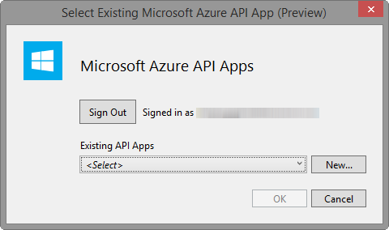
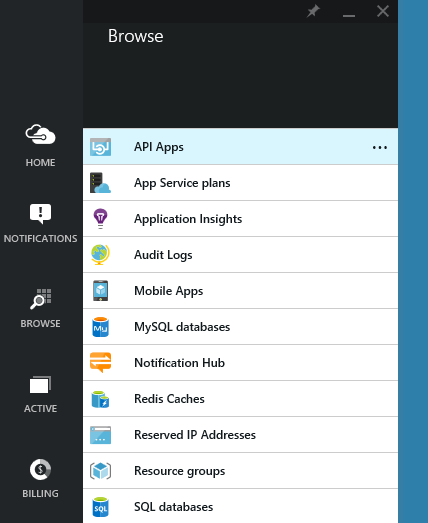

<properties 
	pageTitle="Distribuire un'app per le API del servizio app di Azure" 
	description="Informazioni su come distribuire un progetto app per le API nella sottoscrizione di Azure." 
	services="app-service\api" 
	documentationCenter=".net" 
	authors="bradygaster" 
	manager="wpickett" 
	editor="jimbe"/>

<tags 
	ms.service="app-service-api" 
	ms.workload="web" 
	ms.tgt_pltfrm="dotnet" 
	ms.devlang="na" 
	ms.topic="article" 
	ms.date="02/19/2015" 
	ms.author="bradyg;tarcher"/>

# Distribuire un'app per le API del servizio app di Azure

## Panoramica

Se si sta sviluppando attivamente la propria app per le API usando Visual Studio ed è necessario testare l'API nel cloud, è possibile creare una nuova app per le API nella sottoscrizione di Azure e distribuire il codice usando le pratiche funzionalità di distribuzione del servizio app di Visual Studio.

Questa è la seconda di una serie di tre esercitazioni:

1. Nell'esercitazione [Creare un'app per le API](app-service-dotnet-create-api-app.md) è stato creato un progetto app per le API. 
* In questa esercitazione si distribuirà l'app per le API alla propria sottoscrizione di Azure.
* Nell'esercitazione relativa al [debug di un'app per le API](app-service-dotnet-remotely-debug-api-app.md) verrà usato Visual Studio per eseguire in modalità remota il debug del codice mentre questo è in esecuzione in Azure.

## Distribuire l'app per le API 

In **Esplora soluzioni** fare clic con il pulsante destro del mouse sul progetto (non sulla soluzione), quindi scegliere **Pubblica**.

Scegliere la scheda **Profilo** e fare clic su **App per le API di Microsoft Azure (anteprima)**.

Fare clic su **Nuovo** per effettuare il provisioning di una nuova app per le API nella sottoscrizione di Azure.

Nella finestra di dialogo **Crea un'app per le API** immettere quanto segue:

- In **Nome app per le API**, immettere un nome per l'app. 
- Se sono disponibili più sottoscrizioni di Azure, selezionare quella da usare. In Piano di servizio app selezionare uno dei piani di servizio app esistenti oppure selezionare **Crea nuovo piano di servizio app** e immettere il nome di un nuovo piano. 
- In **Gruppo di risorse** selezionare i gruppi di risorse esistenti oppure selezionare **Crea nuovo gruppo di risorse** e immettere un nome. Il nome deve essere univoco; provare a usare il nome dell'app come un prefisso e ad aggiungere alcune informazioni personali, ad esempio l'ID Microsoft (senza il simbolo @).  
- In **Livello di accesso** selezionare **Disponibile** per chiunque. Questa opzione renderà l'API pubblica completamente, il che è corretto per questa esercitazione. È possibile in un secondo momento limitare l'accesso tramite il portale di Azure.
- Scegliere un'area,  

Fare clic su **OK** per creare l'app per le API nella sottoscrizione. Il processo può richiedere alcuni minuti per consentire a Visual Studio di mostrare una finestra di dialogo che segnala all'utente l'avvio del processo.

Il processo di provisioning crea il gruppo di risorse e l'app per le API nella sottoscrizione di Azure. Visual Studio mostra l'avanzamento nella finestra **Attività del servizio app di Azure**.

Dopo avere effettuato il provisioning dell'app per le API, fare clic con il pulsante destro del mouse sul progetto in Esplora soluzioni e scegliere **Pubblica** per aprire nuovamente la finestra di dialogo di pubblicazione. Il profilo di pubblicazione creato nel passaggio precedente deve essere già selezionato. Fare clic su **Pubblica** per avviare il processo di distribuzione.

La finestra **Attività del servizio app di Azure** mostra l'avanzamento della distribuzione.

## Visualizzare l'app nel portale di Azure

In questa sezione si passerà al portale per visualizzare le impostazioni di base disponibili per le app per le API e apportare le modifiche iterative all'app per le API. Con ogni distribuzione il portale rispecchierà le modifiche che si desidera apportare all'app per le API.

Nel browser passare al [portale di Azure](https://portal.azure.com).

Scegliere il pulsante **Sfoglia** sulla barra laterale e selezionare **App per le API**.

Selezionare l'API creata dall'elenco di app per le API nella sottoscrizione.

Fare clic su **Definizione API**. Il pannello **Definizione API** mostra l'elenco di operazioni API definito al momento della creazione dell'app.

Ora tornare al progetto in Visual Studio. Aggiungere il codice seguente al file **ContactsController.cs**.

	[HttpPost]
	public HttpResponseMessage Post([FromBody] Contact contact)
	{
		// todo: save the contact somewhere
		return Request.CreateResponse(HttpStatusCode.Created);
	}

Questo codice aggiunge un metodo **Post** che consente di registrare nuove istanze `Contact` all'API.

In **Esplora soluzioni** fare clic con il pulsante destro del mouse sul progetto, quindi scegliere **Pubblica**.

Selezionare la configurazione **Debug** dall'elenco a discesa **Configurazione** e fare clic su **Pubblica** per ridistribuire l'app per le API.

Nella scheda **Anteprima** della procedura guidata **Pubblica sul Web** fare clic su **Pubblica**.

Al termine del processo di pubblicazione, tornare al portale e chiudere e riaprire il pannello **Definizione API**. Verrà visualizzato il nuovo endpoint API appena creato e distribuito direttamente nella sottoscrizione di Azure.

## Passaggi successivi

Si è appreso come le funzionalità di distribuzione diretta in Visual Studio consentono di eseguire rapidamente le attività di iterazione e distribuzione e di testare il corretto funzionamento dell'API. Nell'[esercitazione successiva](app-service-dotnet-remotely-debug-api-app.md) verrà illustrato come eseguire il debug dell'app per le API mentre è in esecuzione in Azure.

<!--HONumber=54-->