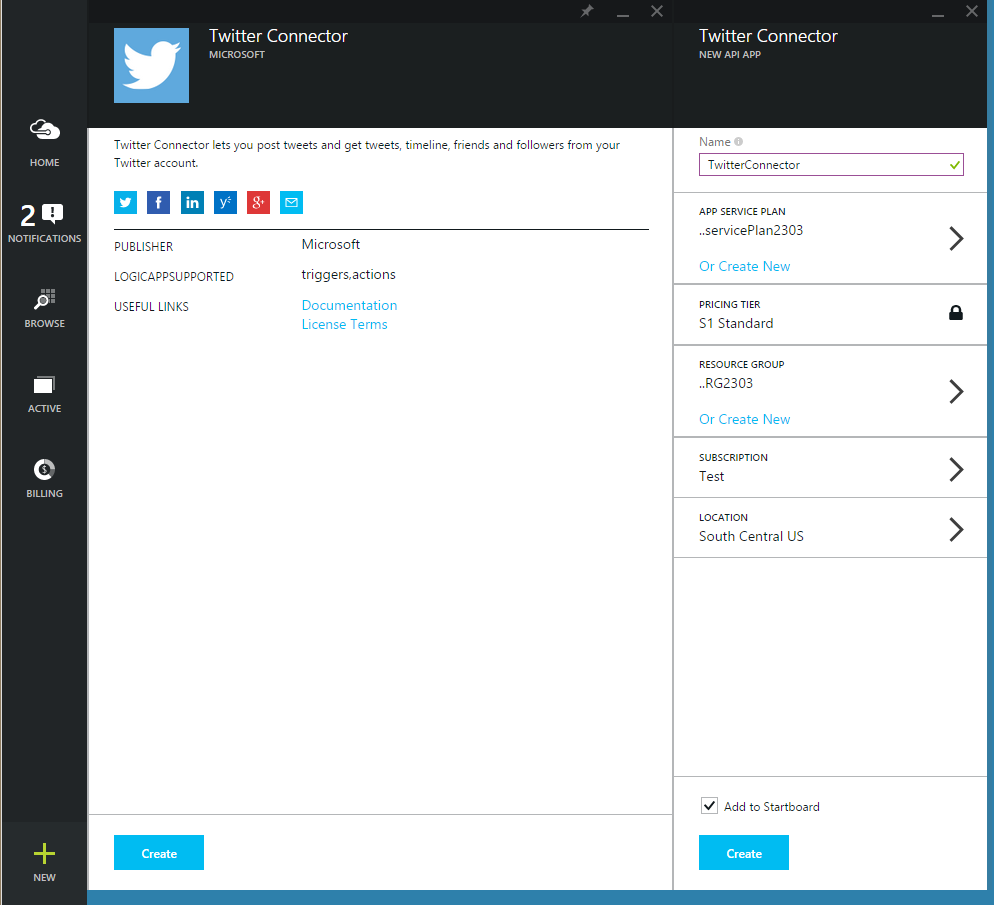
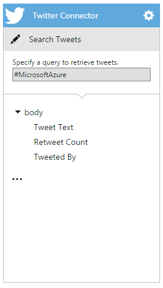

<properties 
	pageTitle="Creare un'app per la logica" 
	description="Introduzione alla creazione di un'app per la logica di base" 
	authors="stepsic-microsoft-com" 
	manager="dwrede" 
	editor="" 
	services="app-service\logic" 
	documentationCenter=""/>

<tags
	ms.service="app-service-logic"
	ms.workload="integration"
	ms.tgt_pltfrm="na"
	ms.devlang="na"
	ms.topic="article"
	ms.date="03/20/2015"
	ms.author="stepsic"/>

#Creare una nuova app per la logica
Questo argomento illustra come iniziare in pochi minuti a usare le app per la logica del servizio app. Verrà illustrato un flusso di lavoro che consente di inviare un set di tweet a cui si è interessati a una cartella Dropbox.

Per usare questo scenario è necessario disporre di:

- Una sottoscrizione di Azure
- Un account Twitter
- Un account Dropbox

<!--- TODO: Add try it now information here -->

##Recupero dei connettori

Prima di tutto, è necessario creare i due connettori che verranno usati:  **Dropbox Connector** e **Twitter Connector**. A questo scopo:

1. Fare clic su **Marketplace** nella schermata iniziale e cercare **Twitter**. 

2. Selezionare Twitter Connector e fare clic sul pulsante di creazione. Verrà visualizzato un pannello per tutte le impostazioni. È possibile mantenere il nome **Twitter Connector**.

3. Digitare un nome di piano in **Crea nuovo piano di servizio app**.
	
	>[AZURE.NOTE]I passaggi in questa sezione presuppongono che si stia creando un nuovo piano di servizio app. Se si usa un piano di servizio app esistente, fare clic su **Seleziona esistente**, selezionare il piano esistente e passare alla sezione successiva.
 
4.  Selezionare un **Piano tariffario** per il nuovo piano.
 
	>[AZURE.NOTE]Per impostazione predefinita, vengono visualizzati solo i piani consigliati per le app per la logica. Fare clic su **Visualizza tutto** per vedere tutti i piani disponibili. Al livello gratuito è possibile eseguire l'app per la logica una volta ogni ora e usare un massimo di 1.000 azioni al mese.

5. Creare un **Gruppo di risorse** per il flusso.

	I gruppi di risorse fungono da contenitori per le app. Tutte le risorse per l'app faranno parte dello stesso gruppo di risorse.

6. Se si dispone di più di una sottoscrizione di Azure, scegliere quella che si intende usare.

7. Scegliere la **Località** di esecuzione dell'app per la logica.

	

8. Fare clic su **Create**. L'operazione di provisioning può richiedere uno o due minuti.

9. Ripetere la procedura con Dropbox.

##Avvio dell'app per la logica

A questo punto è necessario creare l'app per la logica.

1. Fare clic sul pulsante **+ Nuovo** in basso a sinistra nello schermo, espandere **Web e dispositivi mobili** e quindi fare clic su **App per la logica**. 

 	Verrà visualizzato il pannello Crea app per la logica, in cui è possibile specificare alcune impostazioni di base iniziali.

	
	
2. In **Nome** digitare un nome significativo per l'app per la logica.

3. Scegliere il **piano di servizio app** usato durante la creazione dei connettori. La località, la sottoscrizione e il gruppo di risorse dovrebbero essere selezionati automaticamente.

Le impostazioni di base sono state configurate, ma non fare ancora clic su **Crea**. Il prossimo passaggio consiste nell'aggiunta di trigger e azioni al flusso di lavoro.

## Aggiunta di un trigger

I trigger attivano l'esecuzione dell'app per la logica. Si aggiungerà ora un trigger di ricorrenza, che avvia il flusso di lavoro in base a una pianificazione predefinita.

1. Sempre nel pannello **Crea app per la logica** fare clic su **Trigger e azioni**. 

	Verrà visualizzata una finestra di progettazione a schermo intero che mostra il flusso. Sul lato destro è presente un elenco di tutti i servizi che possono disporre di trigger.

2. Nella sezione **Predefinito** fare clic su **Ricorrenza**.
	
	Verrà aggiunta una casella in cui è possibile specificare le impostazioni di ricorrenza.

	

4.  Scegliere la **Frequenza** e l'**Intervallo**, ad esempio una volta ogni ora e quindi fare clic sul segno di spunta verde.

A questo punto si aggiungerà un'azione al flusso.

## Aggiunta di un'azione Twitter

Le azioni sono le operazioni eseguite dal flusso di lavoro. Il numero di possibili azioni è illimitato ed è possibile organizzarle in modo che le informazioni di un'azione vengono passate alla successiva.

1. Nel riquadro destro individuare il **connettore Twitter ** e quindi fare clic su esso. 

2. Dopo il caricamento, fare clic sul pulsante **Autorizza**, accedere al proprio account Twitter e quindi fare clic su **Autorizza app**.

	In questo modo si consente al connettore l'accesso al proprio account Twitter. Viene visualizzato un elenco di possibili operazioni fornite dal connettore Twitter.

	

3. Fare clic su **Ricerca tweet**, quindi in **Specificare una query** digitare ad esempio `#MicrosoftAzure` e fare clic sul segno di spunta verde.

	

Il connettore Twitter fa ora parte del flusso di lavoro.

## Aggiunta di un'operazione Dropbox e creazione dell'app

Il passaggio finale consiste nell'aggiungere un'azione che carica un tweet in un file di Dropbox.

1. Nel riquadro destro fare clic sul **connettore Dropbox**. 
  
2. Al termine del provisioning, fare clic sul pulsante **Autorizza**, accedere al proprio account Dropbox e selezionare **Consenti**.

	
	
	In questo modo si consente al connettore l'accesso al proprio account Dropbox. Viene visualizzato un elenco di possibili operazioni fornite dal connettore Dropbox.
 
4. Fare clic su **Carica file**.

	Verranno visualizzate le impostazioni del connettore Dropbox che è necessario impostare per passare i dati dalla ricerca in Twitter a Dropbox.

	

3. Nel campo **Percorso file** digitare `/tweet.txt`
  
4. Nel campo **Contenuto** fare clic sul pulsante `...` e quindi sull'opzione **Testo tweet**.
 
	Viene immesso il valore `@first(body('twitterconnector')).TweetText` nella casella di testo. Questo valore generato contiene le parti seguenti:

	Parte di contenuto | Descrizione
	------------------------------------------ | ------------
	 `@` | Indica che si sta immettendo una funzione anziché un valore effettivo.
	`actions('twitterconnector').outputs.body` | Ottiene i tweet restituiti dalla query del connettore Twitter.
	`first()` | L'azione di ricerca tweet restituisce un elenco, ma si desidera soltanto caricare un file
	`.TweetText` | Seleziona la proprietà del messaggio tweet.
	
5. Fare clic sul segno di spunta verde per salvare le impostazioni del connettore.

5. Dopo avere completato la progettazione, fare clic su **Visualizzazione codice** nella parte superiore sinistra della finestra di progettazione e notare che si tratta del codice JSON che definisce il flusso di lavoro appena creato nella finestra di progettazione. Questo codice verrà illustrato in modo più approfondito nel [prossimo argomento][Use logic app features].

6. Fare clic sul pulsante **OK** nella parte inferiore dello schermo, quindi sul pulsante **Crea**.

	Verrà creata la nuova app per la logica.

## Gestione dell'app per la logica dopo la creazione

A questo punto l'app per la logica è operativa. Ogni volta che viene eseguito, il flusso di lavoro pianificato verifica la presenza di tweet con l'hashtag specificato. Quando viene trovato un tweet corrispondente, viene inserito nella cartella Dropbox. Infine, ecco come disabilitare l'applicazione e verificarne lo stato.

1. Fare clic su **Sfoglia** sul lato sinistro dello schermo e selezionare **App per la logica**. 
 
2. Fare clic sulla nuova app per la logica appena creata per visualizzare informazioni generali e sullo stato corrente.

3. Per modificare la nuova app per la logica, fare clic su **Trigger e azioni**.
 
5. Per disattivare l'app, fare clic su **Disabilita** nella barra dei comandi.

In meno di 5 minuti è stato possibile configurare una semplice app per la logica eseguita nel cloud. Per altre informazioni sull'uso delle funzionalità delle app per la logica, vedere [Usare le funzionalità delle app per la logica].

<!-- Shared links -->
[Azure portal]: https://portal.azure.com
[Use logic app features]: app-service-logic-use-logic-app-features.md
[Usare le funzionalità delle app per la logica]: app-service-logic-use-logic-app-features.md

<!--HONumber=54-->