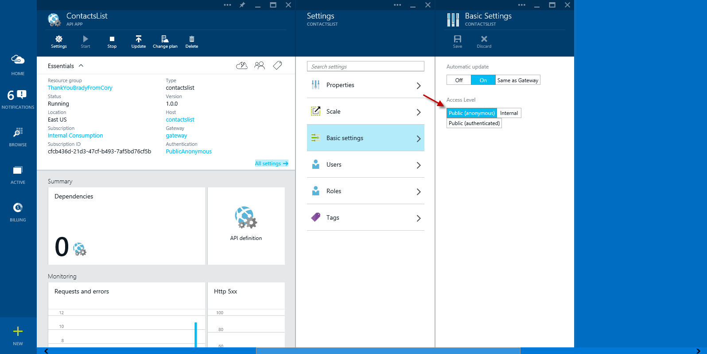

<properties 
   pageTitle="Connettere app mobili e Web ad API SaaS (O365/SharePoint/Salesforce) nel servizio app di Azure" 
   description="Questa esercitazione illustra come usare un'app API SaaS da un'installazione ASP.NET ospitata nel servizio app per app Web di Azure." 
   services="app-service\web" 
   documentationCenter="" 
   authors="syntaxc4" 
   manager="yochayk" 
   editor=""/>

<tags
   ms.service="app-service-web"
   ms.devlang="dotnet"
   ms.topic="article"
   ms.tgt_pltfrm="na"
   ms.workload="web" 
   ms.date="03/24/2015"
   ms.author="cfowler"/>

# Connettere app mobili e Web ad API SaaS (O365/SharePoint/Salesforce) nel servizio app di Azure

Questa esercitazione illustra come usare un'app API da un'installazione ASP.NET ospitata nel [servizio app per app Web](http://go.microsoft.com/fwlink/?LinkId=529714).

## Informazioni generali

Si apprenderà come:

- Usare un'app API da un'installazione ASP.NET ospitata nel servizio app Web.

## Prerequisiti

Questa esercitazione si basa sulla serie di esercitazioni per app API:

1. [Creare un'app API di Azure](app-service-dotnet-create-api-app)
2. [Pubblicare un'app API di Azure](app-service-dotnet-publish-api-app)
3. [Distribuire un'app API di Azure](app-service-dotnet-deploy-api-app)
4. [Eseguire il debug di un'app API di Azure](app-service-dotnet-remotely-debug-api-app)

## Rendere l'app API pubblicamente accessibile

Nel [portale di Azure](http://go.microsoft.com/fwlink/?LinkId=529715) selezionare l'app API. Fare clic sul pulsante **Impostazioni** nella barra dei comandi. Nel riquadro **Impostazioni di base** modificare il **Livello di accesso** in **Pubblico (anonimo)**.

## Creare un'applicazione ASP.NET MVC in Visual Studio

1. Aprire Visual Studio. Usare la finestra di dialogo **Nuovo progetto** per aggiungere una nuova **applicazione Web ASP.NET**. Fare clic su **OK**.

	

1. Selezionare il modello **MVC**. Fare clic su **Modifica autenticazione**, selezionare **Nessuna autenticazione**, quindi fare clic su **OK** per due volte.

	

1. In Esplora soluzioni fare clic con il pulsante destro del mouse sul progetto di applicazione Web appena creato, quindi selezionare **Aggiungi riferimento ad app di Azure**.

	

1. Nell'elenco a discesa **App API esistenti** selezionare l'app API a cui ci si vuole connettere.

	

	>[AZURE.NOTE] Il codice client per la connessione all'app API verrà generato automaticamente da un endpoint API Swagger.

1. Per usare il codice API generato, aprire il file HomeController.cs e sostituire l'azione `Contact` con il codice seguente:

	    public async Task<ActionResult> Contact()
	    {
	        ViewBag.Message = "Your contact page.";
	
	        var contacts = new ContactsList();
	        var response = await contacts.Contacts.GetAsync();
	        var contactList = response.Body;
	
	        return View(contactList);
	    }

	

1. Aggiornare la visualizzazione `Contact` affinché rifletta l'elenco dinamico di contatti con il codice seguente:  
	<pre>// Add to the very top of the view file
	@model IList&lt;MyContactsList.Web.Models.Contact&gt;
	
	// Replace the default email addresses with the following
    &lt;h3&gt;Public Contacts&lt;/h3&gt;
    &lt;ul&gt;
        @foreach (var contact in Model)
        {
            &lt;li&gt;&lt;a href=&quot;mailto:@contact.EmailAddress&quot;&gt;@contact.Name &amp;lt;@contact.EmailAddress&amp;gt;&lt;/a&gt;&lt;/li&gt;
        }
    &lt;/ul&gt; 
	</pre>

	

## Distribuire l'applicazione Web nelle app Web del servizio app

Seguire le istruzioni fornite in [Come distribuire un'app Web di Azure](web-sites-deploy.md).

>[AZURE.NOTE] Se si vuole iniziare a usare il servizio app di Azure prima di iscriversi per ottenere un account Azure, andare alla [pagina di prova del servizio app](http://go.microsoft.com/fwlink/?LinkId=523751), in cui è possibile creare immediatamente un'app Web di base temporanea nel servizio app. Non è necessario fornire una carta di credito né impegnarsi in alcun modo.

## Novità
* Per informazioni su cosa è cambiato nel passaggio da Siti Web al servizio app, vedere: [Servizio app di Azure e impatto sui servizi di Azure esistenti](http://go.microsoft.com/fwlink/?LinkId=529714)
* Per informazioni su cosa è cambiato nel passaggio dal portale precedente a quello nuovo, vedere: [Informazioni di riferimento per l'esplorazione del portale di anteprima](http://go.microsoft.com/fwlink/?LinkId=529715)

<!--HONumber=49-->