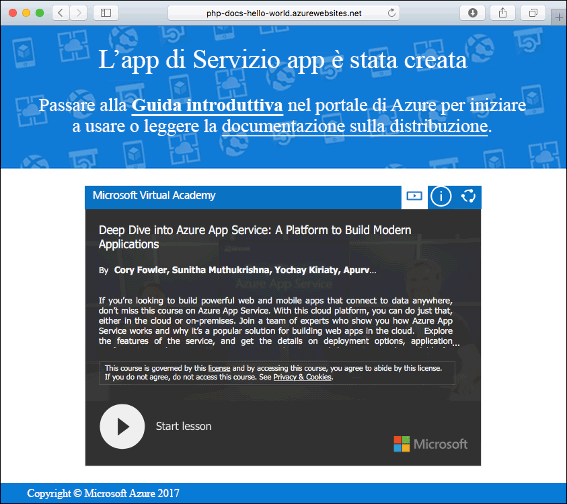

# <a name="create-a-php-web-app-in-azure"></a>Creare un'app Web PHP in Azure

> [!NOTE]
> Questo articolo consente di distribuire un'app nel servizio app in Windows. Per la distribuzione nel servizio app in _Linux_, vedere [Creare un'app Web PHP nel Servizio app in Linux](./containers/quickstart-php.md).
>

Le [app Web di Azure](app-service-web-overview.md) forniscono un servizio di hosting Web ad alta scalabilità e con funzioni di auto-correzione.  Questa guida introduttiva illustra come distribuire un'app PHP in un'app Web di Azure. Si creerà l'app Web usando l'[interfaccia della riga di comando di Azure](https://docs.microsoft.com/cli/azure/get-started-with-azure-cli) in Cloud Shell e si userà un [file ZIP](app-service-deploy-zip.md) per distribuire il codice PHP di esempio nell'app Web.

![App di esempio in esecuzione in Azure]](media/app-service-web-get-started-php/hello-world-in-browser.png)

È possibile eseguire queste procedure con un computer Mac, Windows o Linux. Una volta installati i prerequisiti, sono necessari circa cinque minuti per completare la procedura.

[!INCLUDE [quickstarts-free-trial-note](../../includes/quickstarts-free-trial-note.md)]

## <a name="prerequisites"></a>prerequisiti

Per completare questa guida introduttiva:

* <a href="https://php.net" target="_blank">Installare PHP</a>

## <a name="download-the-sample-locally"></a>Scaricare l'esempio in locale

Scaricare il progetto PHP di esempio da [https://github.com/Azure-Samples/php-docs-hello-world/archive/master.zip](https://github.com/Azure-Samples/php-docs-hello-world/archive/master.zip) ed estrarre l'archivio ZIP.

In una finestra del terminale passare alla directory radice del progetto PHP di esempio (quello contenente _index.php_).

## <a name="run-the-app-locally"></a>Eseguire l'app in locale

Per eseguire l'applicazione in locale, aprire una finestra del terminale e usare il comando `php` per avviare il server Web PHP predefinito.

```bash
php -S localhost:8080
```

Aprire un Web browser e passare all'app di esempio all'indirizzo `http://localhost:8080`.

Nella pagina verrà visualizzato il messaggio **Hello World!** dell'app di esempio.


Nella finestra del terminale premere **CTRL+C** per uscire dal server Web.

[!INCLUDE [Create ZIP file](../../includes/app-service-web-create-zip.md)]

[!INCLUDE [cloud-shell-try-it.md](../../includes/cloud-shell-try-it.md)]

[!INCLUDE [Create resource group](../../includes/app-service-web-create-resource-group.md)]

[!INCLUDE [Create app service plan](../../includes/app-service-web-create-app-service-plan.md)]

## <a name="create-a-web-app"></a>Creare un'app Web

In Cloud Shell creare un'app Web nel piano di servizio app `myAppServicePlan` con il comando [`az webapp create`](/cli/azure/webapp?view=azure-cli-latest#az_webapp_create). 

Nell'esempio seguente sostituire `<app_name>` con un nome app univoco globale. I caratteri validi sono `a-z`, `0-9` e `-`. Il runtime è impostato su `PHP|7.0`. Per visualizzare tutti i runtime supportati, eseguire [`az webapp list-runtimes`](/cli/azure/webapp?view=azure-cli-latest#az_webapp_list_runtimes). 

```azurecli-interactive
az webapp create --resource-group myResourceGroup --plan myAppServicePlan --name <app_name> --runtime "PHP|7.0"
```

Dopo la creazione dell'app Web, l'interfaccia della riga di comando di Azure mostra un output simile all'esempio seguente:

```json
{
  "availabilityState": "Normal",
  "clientAffinityEnabled": true,
  "clientCertEnabled": false,
  "cloningInfo": null,
  "containerSize": 0,
  "dailyMemoryTimeQuota": 0,
  "defaultHostName": "<app_name>.azurewebsites.net",
  "enabled": true,
  < JSON data removed for brevity. >
}
```

Passare all'app Web appena creata. Sostituire _&lt;nome app>_ con un nome di app univoco.

```bash
http://<app name>.azurewebsites.net
```

Ecco l'aspetto che avrà la nuova app Web:



[!INCLUDE [Deploy ZIP file](../../includes/app-service-web-deploy-zip.md)]

## <a name="browse-to-the-app"></a>Passare all'app

Passare all'applicazione distribuita con il Web browser.

```
http://<app_name>.azurewebsites.net
```

Il codice di esempio PHP è in esecuzione in un'app Web del servizio app di Azure.


**Congratulazioni.** La distribuzione della prima app PHP nel servizio app è stata completata.

## <a name="update-locally-and-redeploy-the-code"></a>Aggiornare e ridistribuire il codice in locale

Usando un editor di testo locale, aprire il file `index.php` nell'app PHP e apportare una piccola modifica al testo nella stringa accanto a `echo`:

```php
echo "Hello Azure!";
```

Nella finestra del terminale locale passare alla directory radice dell'applicazione e creare un nuovo file ZIP per il progetto aggiornato.

```
# Bash
zip -r myUpdatedAppFiles.zip .

# PowerShell
Compress-Archive -Path * -DestinationPath myUpdatedAppFiles.zip
``` 

Distribuire il nuovo file ZIP nel servizio app seguendo la stessa procedura disponibile in [Caricare il file ZIP](#upload-the-zip-file).

Tornare alla finestra del browser aperta nel passaggio **Passare all'app** e aggiornare la pagina.


## <a name="manage-your-new-azure-web-app"></a>Gestire la nuova app Web di Azure

Accedere al <a href="https://portal.azure.com" target="_blank">portale di Azure</a> per gestire l'app Web creata.

Nel menu a sinistra fare clic su **Servizi app** e quindi sul nome dell'app Web di Azure.


Verrà visualizzata la pagina di panoramica dell'app Web. Qui è possibile eseguire attività di gestione di base come l'esplorazione, l'arresto, l'avvio, il riavvio e l'eliminazione dell'app.


Il menu a sinistra fornisce varie pagine per la configurazione dell'app. 

[!INCLUDE [cli-samples-clean-up](../../includes/cli-samples-clean-up.md)]

## <a name="next-steps"></a>Passaggi successivi

> [!div class="nextstepaction"]
> [PHP con MySQL](app-service-web-tutorial-php-mysql.md)
