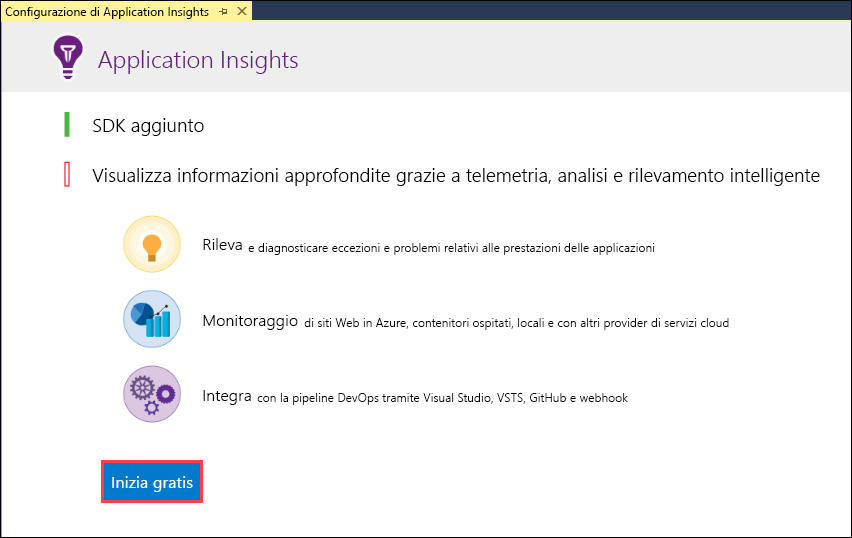
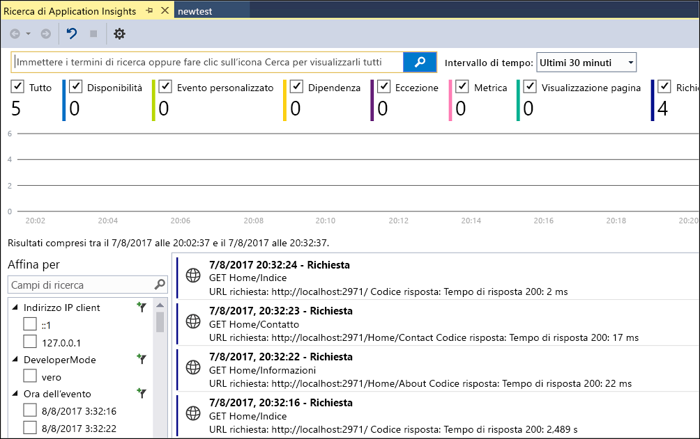
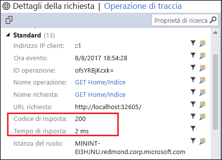
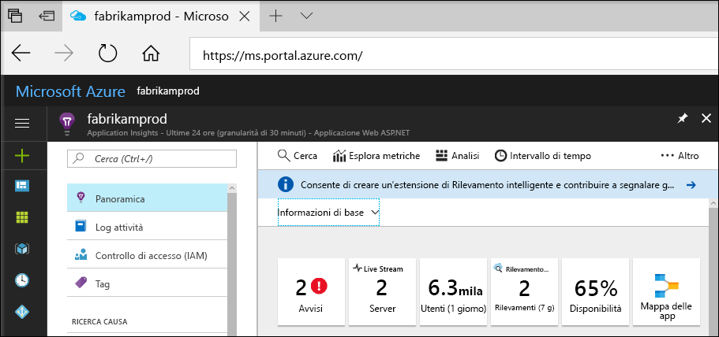
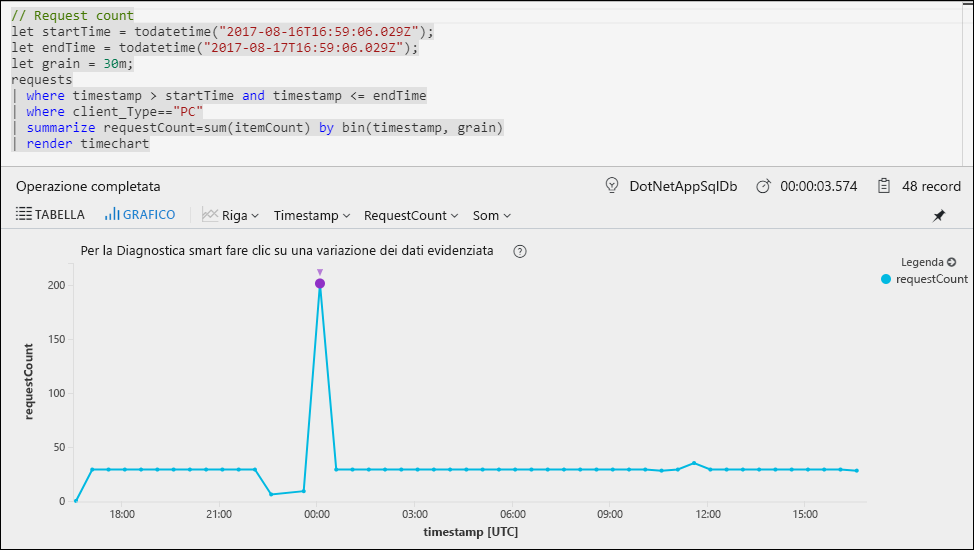
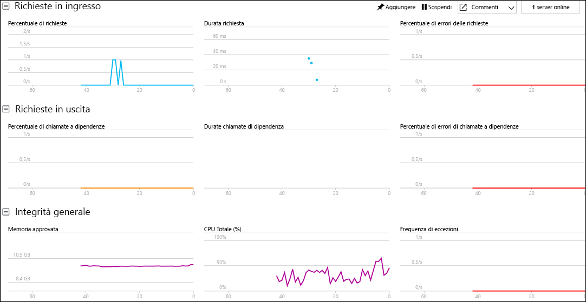

# Iniziare a monitorare l'applicazione Web ASP.NET

Con Azure Application Insights, è possibile monitorare facilmente la disponibilità, le prestazioni e l'uso dell'applicazione Web.  È anche possibile identificare e diagnosticare rapidamente gli errori nell'applicazione senza attendere che vengano segnalati da un utente.  Con le informazioni raccolte da Application Insights sulle prestazioni e sull'efficacia dell'app, è possibile prendere decisioni informate per gestire e migliorare l'applicazione.

Questa guida introduttiva illustra come aggiungere Application Insights a un'applicazione Web ASP.NET esistente e iniziare ad analizzare le statistiche in tempo reale, che rappresentano solo uno dei vari metodi che è possibile usare per analizzare l'applicazione. Se non si ha un'applicazione Web ASP.NET, è possibile crearne una seguendo le istruzioni in [Creare un'app Web ASP.NET in Azure](../app-service/app-service-web-get-started-dotnet.md).

## prerequisiti
Per completare questa guida introduttiva:

- Installare [Visual Studio 2017](https://www.visualstudio.com/downloads/) con i carichi di lavoro seguenti:
    - Sviluppo Web e ASP.NET
    - Sviluppo di Azure

Se non si ha una sottoscrizione di Azure, creare un account [gratuito](https://azure.microsoft.com/free/) prima di iniziare.

## Abilitare Application Insights

1. Aprire il progetto in Visual Studio 2017.
2. Selezionare **Configura Application Insights** dal menu Progetto. Visual Studio aggiunge Application Insights SDK all'applicazione.
3. Fare clic su **Inizia gratis**, selezionare il piano di fatturazione preferito e fare clic su **Registra**.

    

4. Eseguire l'applicazione selezionando **Avvia debug** dal menu **Debug** oppure premendo F5.

## Verificare la configurazione dell'app

Application Insights raccoglie i dati di telemetria per l'applicazione indipendentemente dalla posizione in cui è in esecuzione. Usare la procedura seguente per iniziare a visualizzare questi dati.

1. Aprire Application Insights facendo clic su **Progetto** -> **Application Insights** -> **Cerca nei dati di telemetria della sessione di debug**.  Verranno visualizzati i dati di telemetria per la sessione corrente.  

2. Fare clic sulla prima richiesta nell'elenco (GET Home/Index in questo esempio) per visualizzare i relativi dettagli. Si noti che il codice di stato e il tempo di risposta sono entrambi inclusi insieme ad altre importanti informazioni sulla richiesta.  

## Avviare il monitoraggio nel portale di Azure

È ora possibile aprire Application Insights nel portale di Azure per visualizzare diversi dettagli sull'applicazione in esecuzione.

1. Fare clic con il pulsante destro del mouse sulla cartella **Servizi connessi di Application Insights** in Esplora soluzioni e quindi fare clic su **Apri portale Application Insights**.  Verranno visualizzate alcune informazioni sull'applicazione e diverse opzioni.

    

2. Fare clic su **Mappa app** per ottenere un layout visivo delle relazioni di dipendenza tra i componenti dell'applicazione.  Ogni componente mostra indicatori KPI come carico, prestazioni, errori e avvisi.

    

3. Fare clic sull'icona di **App Analytics**  in uno dei componenti dell'applicazione.  Verrà aperta la finestra **Application Insights - Analisi**, che fornisce un linguaggio di query avanzato per l'analisi di tutti i dati raccolti da Application Insights.  In questo caso viene generata una query che esegue il rendering del conteggio delle richieste sotto forma di grafico.  È possibile scrivere query personalizzate per analizzare altri dati.

    

4. Tornare alla pagina **Panoramica** e fare clic su **Live Stream**.  Verranno visualizzate le statistiche in tempo reale sull'applicazione mentre è in esecuzione.  Sono incluse informazioni come il numero di richieste in ingresso, la durata di tali richieste e gli eventuali errori che si verificano.  È anche possibile esaminare importanti metriche sulle prestazioni, come processore e memoria.

    

A questo punto, se si è pronti per ospitare l'applicazione in Azure, è possibile pubblicarla. Seguire i passaggi descritti in [Creare un'app Web ASP.NET in Azure](../app-service/app-service-web-get-started-dotnet.md#update-the-app-and-redeploy).

## Passaggi successivi
In questa guida introduttiva è stata abilitata un'applicazione per il monitoraggio tramite Azure Application Insights.  Continuare con le esercitazioni per imparare a usare questa soluzione per monitorare le statistiche e rilevare i problemi nell'applicazione.

> [!div class="nextstepaction"]
> [Esercitazioni di Azure Application Insights](app-insights-tutorial-runtime-exceptions.md)