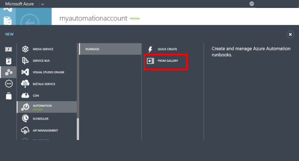

<properties 
	pageTitle="Introduzione all'automazione di Azure" 
	description="Informazioni sull'importazione e sull'esecuzione di un processo di automazione in Azure." 
	services="automation" 
	documentationCenter="" 
	authors="bwren" 
	manager="stevenka" 
	editor=""/>

<tags 
	ms.service="automation" 
	ms.workload="tbd" 
	ms.tgt_pltfrm="na" 
	ms.devlang="na" 
	ms.topic="article" 
	ms.date="1/13/2015" 
	ms.author="bwren"/>

# Introduzione all'automazione di Azure

L'automazione di Microsoft Azure offre agli sviluppatori la possibilità di automatizzare le attività manuali, a esecuzione prolungata, soggette a errori e ripetute di frequente comunemente eseguite negli ambienti cloud. È possibile creare, monitorare, gestire e distribuire risorse nell'ambiente Azure tramite Runbook, che in realtà non sono altro che flussi di lavoro di Windows PowerShell. Per altre informazioni sull'automazione, vedere la [guida introduttiva all'automazione](http://go.microsoft.com/fwlink/p/?LinkId=392861). 

In questa esercitazione vengono illustrati i passaggi per importare un Runbook "Hello World" di esempio nell'automazione di Azure, eseguirlo e quindi visualizzarne l'output.

>[WACOM.NOTE] Per informazioni su come automatizzare operazioni di Azure tramite i [cmdlet di Azure PowerShell](http://msdn.microsoft.com/library/jj156055.aspx), vedere <a href="http://azure.microsoft.com/blog/2014/08/27/azure-automation-authenticating-to-azure-using-azure-active-directory/">Automazione di Azure: autenticazione in Azure usando Azure Active Directory</a>.

## Esempi e Runbook di utilità

Il team di automazione di Azure ha creato diversi esempi di Runbook per semplificare le attività iniziali con l'automazione.  In questi esempi vengono trattati i concetti di base dell'automazione, allo scopo di fornire informazioni su come scrivere Runbook personalizzati.  

Il team di automazione ha inoltre creato dei Runbook di utilità, che è possibile usare come elementi di base per attività di automazione di più ampio respiro.  

>[WACOM.NOTE] È consigliabile scrivere Runbook riutilizzabili, modulari e di piccole dimensioni. È inoltre consigliabile creare Runbook di utilità personalizzati per scenari di utilizzo comuni, dopo aver acquisito familiarità con l'automazione.  

È possibile visualizzare e scaricare gli esempi e i Runbook di utilità del team di automazione dall'area [Script Center](http://go.microsoft.com/fwlink/p/?LinkId=393029) oppure importarli direttamente dalla [Raccolta di Runbook](http://aka.ms/runbookgallery). 

## Community, commenti e suggerimenti sull'automazione

Anche i Runbook della community e di altri team Microsoft sono pubblicati nell'area [Script Center](http://go.microsoft.com/fwlink/?LinkID=391681) e nella [Raccolta di Runbook](http://aka.ms/runbookgallery). 

<strong>Gli utenti sono invitati a fornire commenti e suggerimenti.</strong>  Se si è in cerca di un modulo di integrazione o di una soluzione Runbook di automazione, inviare una richiesta di script in Script Center. Se si desidera condividere idee per nuove funzionalità di automazione, pubblicarle nell'area dedicata al [feedback degli utenti](http://feedback.windowsazure.com/forums/34192--general-feedback).

[WACOM.INCLUDE [create-account-note](../includes/create-account-note.md)]

## Passaggi di alto livello per la presente esercitazione

1. [Creare un account di automazione](#automationaccount)
2. [Importare il Runbook dalla Raccolta di Runbook](#importrunbook)
3. [Pubblicare il Runbook](#publishrunbook)
4. [Avviare il Runbook](#startrunbook)

## Creare un account di automazione

1.	Accedere al [portale di gestione di Azure](http://manage.windowsazure.com).

2.	Nel portale di gestione fare clic su **Crea un account di automazione**.

	>[WACOM.NOTE] Se è già stato creato un account di automazione, andare al passaggio 4.

	

3.	Nella pagina **Aggiungi un nuovo account di automazione** immettere un nome per l'account e quindi fare clic sul segno di spunta.

	

## Importare il Runbook dalla Raccolta di Runbook
 
4.	Nella pagina **Automazione** fare clic sul nuovo account appena creato.
 
	

5.	Fare clic su **RUNBOOK**.

	
  
6.	Fare clic su **Nuovo** > **Runbook** > **Da raccolta**.

	

7.  Selezionare la categoria **Esercitazione**, quindi **Hello World per Automazione di Azure**. Fare clic sul pulsante con la freccia destra.

	

8.  Verificare i contenuti del Runbook, quindi fare clic sul pulsante con la freccia destra.

	

8.	Verificare i dettagli del Runbook, quindi fare clic sul pulsante con il segno di spunta.

	

## Pubblicare il Runbook 

9.	Al termine dell'importazione del Runbook fare clic su **Write-HelloWorld**.

	

9.	Fare clic su **CREA**, quindi su **BOZZA**.  

	È possibile modificare il contenuto di un Runbook in modalità Bozza. Per questo Runbook, non è necessario apportare alcuna modifica.

	  
 
10.	Fare clic su **PUBBLICA** per alzare di livello il Runbook in modo che sia pronto per l'uso in produzione.

	
   
11.	Quando viene richiesto di salvare e pubblicare il Runbook, fare clic su **Sì**.
 
	

## Avviare il Runbook

12.	Con il Runbook **Write-HelloWorld** aperto, fare clic su **AVVIO**.

	
 
13.	Nella pagina **Specificare i valori di parametro del Runbook** immettere un valore per **Nome**, che verrà usato come parametro di input per lo script Write-HelloWorld.ps1, quindi fare clic sul segno di spunta.

	
  
14.	Fare clic su **PROCESSI** per controllare lo stato del Runbook appena avviato e quindi sul timestamp nella colonna **AVVIO PROCESSO** per visualizzare il riepilogo del processo.

	

15.	Nella pagina **RIEPILOGO** è possibile visualizzare il riepilogo, i parametri di input e l'output del processo.
 
	

# Gestione dei servizi di Azure da un Runbook 
Nell'esempio sopra viene illustrato un Runbook di esempio che non gestisce i servizi di Azure. I [cmdlet di Azure](http://msdn.microsoft.com/library/jj156055.aspx) richiedono l'autenticazione in Azure. È possibile seguire le istruzioni nel post di blog sull'argomento [Automazione di Azure: autenticazione in Azure usando Azure Active Directory](http://azure.microsoft.com/blog/2014/08/27/azure-automation-authenticating-to-azure-using-azure-active-directory/) per configurare la sottoscrizione di Azure per la gestione tramite Automazione di Azure.

# Vedere anche

- [Panoramica dell'automazione](http://go.microsoft.com/fwlink/p/?LinkId=392860)
- [Guida alla creazione di Runbook](http://go.microsoft.com/fwlink/p/?LinkID=301740)
- [Forum sull'automazione](http://go.microsoft.com/fwlink/p/?LinkId=390561)
- [Automazione di Azure: autenticazione in Azure usando Azure Active Directory](http://azure.microsoft.com/blog/2014/08/27/azure-automation-authenticating-to-azure-using-azure-active-directory/)

<!--HONumber=35.2-->

<!--HONumber=46--> 

<!--HONumber=46--> 
