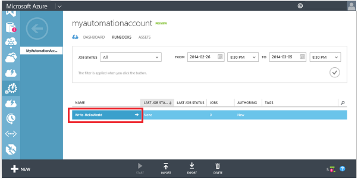

<properties linkid="automation-create-runbook-from-samples" urlDisplayName="Get Started with Azure Automation" pageTitle="Get Started with Azure Automation" metaKeywords="" description="Learn how to import and run an automation job in Azure." metaCanonical="" services="automation" documentationCenter="" title="Get Started with Azure Automation" authors="" solutions="" manager="" editor="" />

Introduzione all'automazione di Azure
=====================================

In questa esercitazione vengono illustrati i passaggi per importare ed eseguire un Runbook di automazione in Microsoft Azure.

L'automazione di Microsoft Azure offre agli sviluppatori la possibilità di automatizzare le attività manuali, a esecuzione prolungata, soggette a errori e ripetute di frequente comunemente eseguite negli ambienti cloud. È possibile creare, monitorare, gestire e distribuire risorse nell'ambiente Azure tramite Runbook, che in realtà non sono altro che flussi di lavoro di Windows PowerShell. Per ulteriori informazioni sull'automazione, vedere la [guida introduttiva all'automazione](http://go.microsoft.com/fwlink/p/?LinkId=392861).

In questa esercitazione vengono illustrati i passaggi per importare un Runbook di esempio in automazione di Azure, eseguirlo e quindi visualizzarne l'output.

Esempi e Runbook di utilità
---------------------------

Il team di automazione di Azure ha creato diversi esempi di Runbook per semplificare le attività iniziali con l'automazione. In questi esempi vengono trattati i concetti di base dell'automazione, allo scopo di fornire informazioni su come scrivere Runbook personalizzati.

Il team di automazione ha inoltre creato dei Runbook di utilità, che è possibile utilizzare come elementi di base per attività di automazione di più ampio respiro.

> [WACOM.NOTE] È consigliabile scrivere Runbook riutilizzabili, modulari e di piccole dimensioni. È inoltre consigliabile creare Runbook di utilità personalizzati per scenari di utilizzo comuni, dopo aver acquisito familiarità con l'automazione.

È possibile visualizzare e scaricare gli esempi e i Runbook di utilità del team di automazione nella sezione [Script Center](http://go.microsoft.com/fwlink/p/?LinkId=393029).

Community, commenti e suggerimenti sull'automazione
---------------------------------------------------

Anche i Runbook della community e di altri team Microsoft sono pubblicati nella sezione [Script Center](http://go.microsoft.com/fwlink/?LinkID=391681).

**Gli utenti sono invitati a fornire commenti e suggerimenti.** Se si è in cerca di una soluzione Runbook o di un modulo di integrazione di PowerShell, inviare una richiesta di script in Script Center. Se si desidera condividere idee per nuove funzionalità di automazione, inviarle nella sezione [User Voice](http://feedback.windowsazure.com/forums/34192--general-feedback).

[WACOM.INCLUDE [create-account-note](../includes/create-account-note.md)]

Download di un Runbook di esempio da Script Center
--------------------------------------------------

1.  Passare a [Script Center](http://go.microsoft.com/fwlink/p/?LinkId=393029) e quindi fare clic su **Hello World for Azure Automation**.

2.  Fare clic sul nome del file **Write-HelloWorld.ps1** accanto a **Download** e quindi salvare il file nel computer.

Importazione del Runbook di esempio in Azure
--------------------------------------------

1.  Accedere al [portale di gestione di Azure](http://manage.windowsazure.com).

2.  Nel portale di gestione fare clic su **Create an Automation Account**.

    > [WACOM.NOTE] Se è già stato creato un account di automazione, andare al passaggio 4.

    

3.  Nella pagina **Add a New Automation Account** immettere un nome per l'account e quindi fare clic sul segno di spunta.

    

4.  Nella pagina **Automation** fare clic sul nuovo account appena creato.

    

5.  Fare clic su **RUNBOOKS**.

    

6.  Fare clic su **IMPORT**.

    

7.  Passare allo script **Write-HelloWorld.ps1** scaricato e quindi fare clic sul segno di spunta.

    

8.  Fare clic su **Write-HelloWorld**.

    

9.  Fare clic su **AUTHOR** e quindi su **DRAFT**. Per questo Runbook, non è necessario apportare alcuna modifica.

    A questo punto è possibile visualizzare il contenuto di **Write-HelloWorld.ps1**. È possibile modificare il contenuto di un Runbook in modalità Bozza.

    

10. Fare clic su **PUBLISH** per alzare di livello il Runbook in modo che sia pronto per l'utilizzo in produzione.

    

11. Quando viene richiesto se salvare e pubblicare il Runbook, fare clic su **Yes**.

    

12. Fare clic su **PUBLISHED** e quindi su **START**.

    

13. Nella pagina **Specify the runbook parameter values** immettere un valore per **Name**, che verrà utilizzato come parametro di input per lo script Write-HelloWorld.ps1, quindi fare clic sul segno di spunta.

    

14. Fare clic su **JOBS** per controllare lo stato del Runbook appena avviato e quindi sul timestamp nella colonna **JOB START** per visualizzare il riepilogo del processo.

    

15. Nella pagina **SUMMARY** è possibile visualizzare il riepilogo, i parametri di input e l'output del processo.

    

Vedere anche
------------

-   [Panoramica dell'automazione](http://go.microsoft.com/fwlink/p/?LinkId=392860)
-   [Guida alla creazione di Runbook](http://go.microsoft.com/fwlink/p/?LinkID=301740)
-   [Forum sull'automazione](http://go.microsoft.com/fwlink/p/?LinkId=390561)

