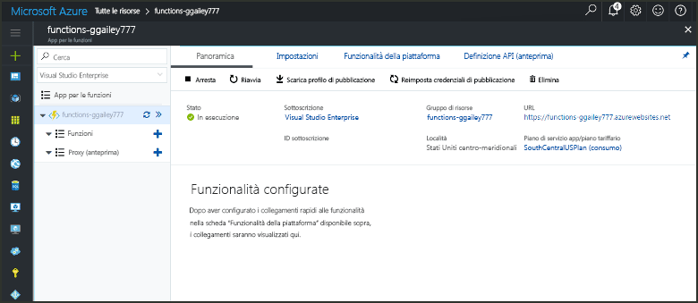
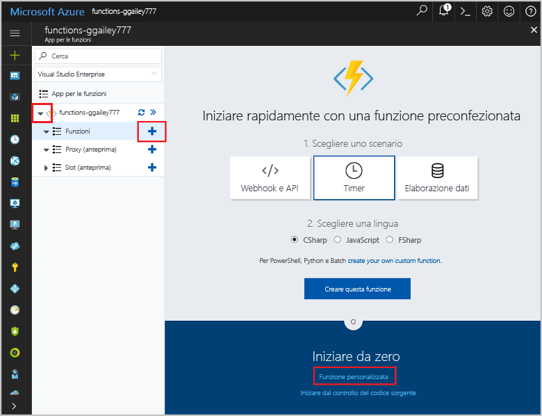
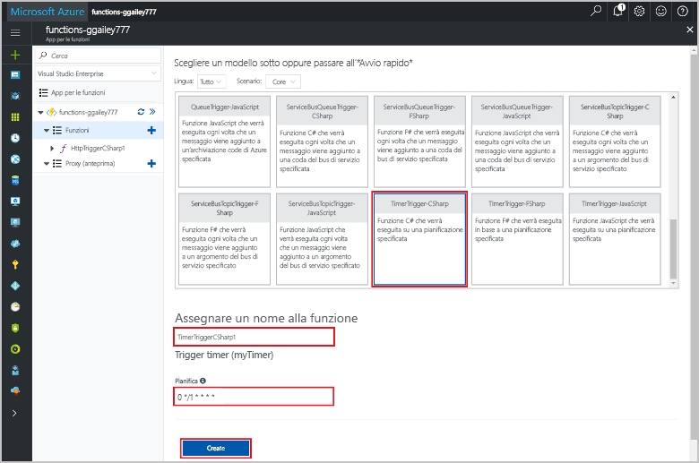

# Creare una funzione in Azure attivata da un timer

Informazioni su come usare Funzioni di Azure per creare una funzione eseguita in base a una pianificazione definita.

## Prerequisiti

Per completare questa esercitazione:

+ Se non si ha una sottoscrizione di Azure, creare un [account gratuito](https://azure.microsoft.com/free/?WT.mc_id=A261C142F) prima di iniziare.

[!INCLUDE [functions-portal-favorite-function-apps](../../includes/functions-portal-favorite-function-apps.md)]

## Creare un'app per le funzioni di Azure

[!INCLUDE [Create function app Azure portal](../../includes/functions-create-function-app-portal.md)]

Si creerà ora una funzione nella nuova app per le funzioni.

## Creare una funzione attivata da un timer

1. Espandere l'app per le funzioni e fare clic sul pulsante **+** accanto a **Funzioni**. Se questa è la prima funzione nell'app per le funzioni, selezionare **Funzione personalizzata**. Verrà visualizzato il set completo di modelli di funzione.

    

2. Selezionare il modello **TimerTrigger** per la lingua desiderata. Usare quindi le impostazioni specificate nella tabella:

    

    | Impostazione | Valore consigliato | Descrizione |
    |---|---|---|
    | **Dare un nome alla funzione** | TimerTriggerCSharp1 | Definisce il nome della funzione attivata dal timer. |
    | **[Pianificazione](http://en.wikipedia.org/wiki/Cron#CRON_expression)** | 0 \*/1 \* \* \* \* | [Espressione CRON](http://en.wikipedia.org/wiki/Cron#CRON_expression) a sei campi che pianifica la funzione in modo che venga eseguita ogni minuto. |

2. Fare clic su **Crea**. Viene creata una funzione nel linguaggio scelto che verrà eseguita ogni minuto.

3. Verificare l'esecuzione visualizzando le informazioni di traccia scritte nei log.

    

È possibile ora modificare la pianificazione della funzione in modo che venga eseguita con meno frequenza, ad esempio ogni ora. 

## Aggiornare la pianificazione del timer

1. Espandere la funzione e fare clic su **Integrazione**. È a questo punto che si definiscono i binding di input e di output e si imposta la pianificazione. 

2. Nel campo **Pianificazione** immettere il nuovo valore `0 0 */1 * * *` e quindi fare clic su **Salva**.  

È ora disponibile una funzione che viene eseguita ogni ora. 

## Pulire le risorse

[!INCLUDE [Next steps note](../../includes/functions-quickstart-cleanup.md)]

## Passaggi successivi

È stata creata una funzione eseguita in base a una pianificazione.

[!INCLUDE [Next steps note](../../includes/functions-quickstart-next-steps.md)]

Per altre informazioni sui trigger timer, vedere [Pianificare l'esecuzione di codice con Funzioni di Azure](functions-bindings-timer.md).