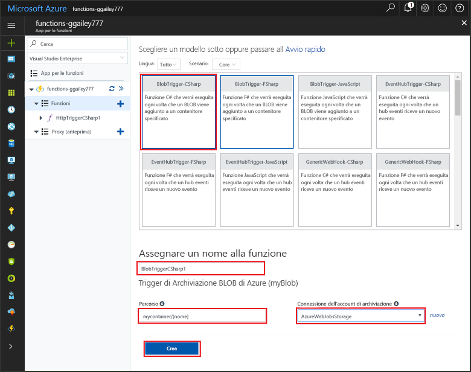
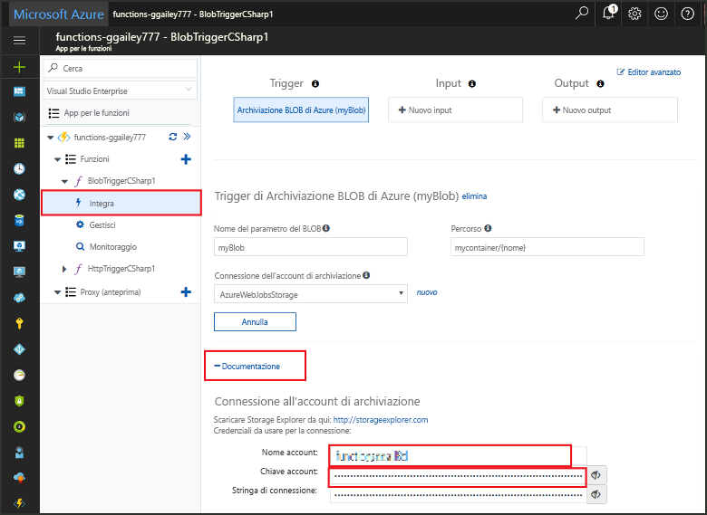
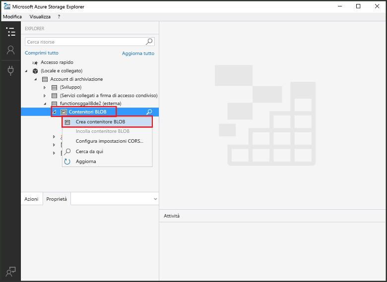
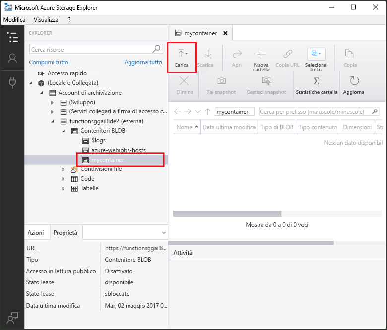

# Creare una funzione attivata dall'archiviazione BLOB di Azure

Informazioni su come creare una funzione attivata nel momento in cui vengono caricati o aggiornati file nell'archiviazione BLOB di Azure.

## Prerequisiti

Prima di eseguire questo esempio, è necessario effettuare queste operazioni:

- Scaricare e installare [Microsoft Azure Storage Explorer](http://storageexplorer.com/).

Se non si ha una sottoscrizione di Azure, creare un [account gratuito](https://azure.microsoft.com/free/?WT.mc_id=A261C142F) prima di iniziare.

[!INCLUDE [functions-portal-favorite-function-apps](../../includes/functions-portal-favorite-function-apps.md)]

## Creare un'app per le funzioni di Azure

[!INCLUDE [Create function app Azure portal](../../includes/functions-create-function-app-portal.md)]

Si creerà ora una funzione nella nuova app per le funzioni.

## Creare una funzione attivata dall'archiviazione BLOB

Espandere l'app per le funzioni, fare clic sul pulsante **+** accanto a **Funzioni** e fare clic sul modello **BlobTrigger** per il linguaggio desiderato. Usare quindi le impostazioni come indicato nella tabella e quindi fare clic su **Crea**.

| Impostazione | Valore consigliato | Descrizione |
|---|---|---|
| **Percorso**   | mycontainer/{name}    | Percorso da monitorare nell'archiviazione BLOB. Il nome file del BLOB viene passato nel binding come parametro _name_.  |
| **Connessione dell'account di archiviazione** | AzureWebJobStorage | È possibile usare la connessione dell'account di archiviazione già usata dall'app per le funzioni oppure crearne una nuova.  |
| **Dare un nome alla funzione** | Univoco nell'app per le funzioni | Nome della funzione attivata dalla coda. |

Connettersi quindi all'account di archiviazione di Azure e creare il contenitore **mycontainer**.

## Creare il contenitore

1. Nella funzione fare clic su **Integrazione**, espandere **Documentazione** e copiare sia **Nome account** sia **Chiave account**. Usare queste credenziali per connettersi all'account di archiviazione. Se si è già connessi all'account di archiviazione, andare al passaggio 4.

    

1. Eseguire lo strumento [Microsoft Azure Storage Explorer](http://storageexplorer.com/), fare clic sull'icona di connessione a sinistra, scegliere **Use a storage account name and key** (Usare il nome e la chiave di un account di archiviazione) e fare clic su **Avanti**.

    

1. Immettere i valori **Nome account** e **Chiave account** definiti nel passaggio 1, fare clic su **Avanti** e quindi su **Connetti**. 

    

1. Espandere l'account di archiviazione associato, fare doppio clic su **Contenitori BLOB**, fare clic su **Crea contenitore BLOB**, digitare `mycontainer` e quindi premere INVIO.

    

Dopo aver creato un contenitore BLOB, è possibile ora testare la funzione caricando un file nel contenitore.

## Testare la funzione

1. Tornare al portale di Azure, selezionare la funzione, espandere i **log** nella parte inferiore della pagina e assicurarsi che lo streaming dei log non sia stato interrotto.

1. In Esplora archivi espandere l'account di archiviazione, **Contenitori BLOB** e **mycontainer**. Fare clic su **Carica** e quindi su **Carica file...**.

    

1. Nella finestra di dialogo **Carica file** fare clic sul campo **File**. Identificare un file nel computer locale, ad esempio un file di immagine, selezionarlo e fare clic su **Apri** e quindi su **Carica**.

1. Tornare ai log di funzione e verificare che il BLOB sia stato letto.

   

    >[!NOTE]
    > Se l'app per le funzioni viene eseguita nel piano a consumo predefinito, è possibile che si verifichi un ritardo di alcuni minuti tra il momento in cui il BLOB viene aggiunto o aggiornato e il momento in cui viene attivata la funzione. Se nelle funzioni attivate dal BLOB è necessaria una bassa latenza, valutare l'opportunità di eseguire l'app per le funzioni in un piano di servizio app.

## Pulire le risorse

[!INCLUDE [Next steps note](../../includes/functions-quickstart-cleanup.md)]

## Passaggi successivi

È stata creata una funzione che viene eseguita nel momento in cui nell'archiviazione BLOB viene aggiunto o aggiornato un BLOB. 

[!INCLUDE [Next steps note](../../includes/functions-quickstart-next-steps.md)]

Per altre informazioni sui trigger dell'archiviazione BLOB, vedere [Binding dell'archiviazione BLOB di Funzioni di Azure](functions-bindings-storage-blob.md).
