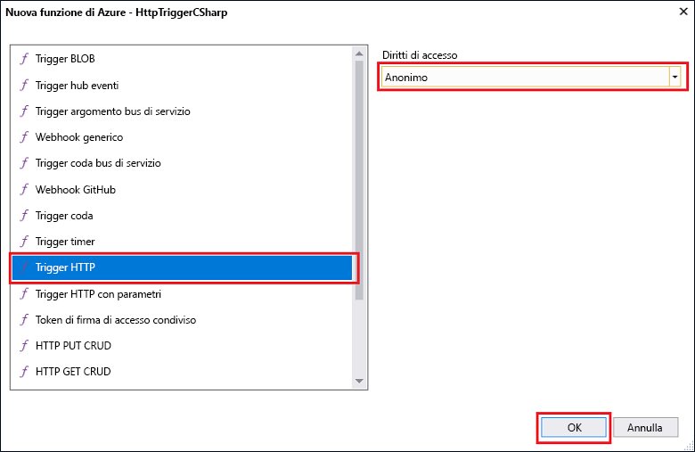

# Creare la prima funzione con Visual Studio 

Funzioni di Azure consente di eseguire il codice in un ambiente senza server senza dover prima creare una macchina virtuale o pubblicare un'applicazione Web. 

Questo argomento illustra come usare Azure Function Tools for Visual Studio 2017 per creare e testare una funzione "hello world" in locale. Il codice della funzione verrà quindi pubblicato in Azure.

## Prerequisiti

Per completare questa esercitazione, installare:

* [Visual Studio 2017 Preview versione 15.3](https://www.visualstudio.com/vs/preview/), con il carico di lavoro **Sviluppo di Azure**.
    
    

[!INCLUDE [quickstarts-free-trial-note](../../includes/quickstarts-free-trial-note.md)]

## Installare Azure Functions Tools for Visual Studio 2017

Prima di iniziare, è necessario scaricare e installare Azure Functions Tools for Visual Studio 2017. Questi strumenti possono essere usati solo con Visual Studio 2017 Preview versione 15.3 o successiva. Se è già stata eseguita l'installazione di Azure Functions Tools, è possibile ignorare questa sezione.

[!INCLUDE [Install the Azure Functions Tools for Visual Studio](../../includes/functions-install-vstools.md)]   

## Creare un progetto Funzioni di Azure in Visual Studio

[!INCLUDE [Create a project using the Azure Functions template](../../includes/functions-vstools-create.md)]

Ora che è stato creato il progetto, si può creare la prima funzione.

## Creare la funzione

In **Esplora soluzioni** fare clic con il pulsante destro del mouse sul nodo del progetto e scegliere **Aggiungi** > **Nuovo elemento**. Selezionare **Funzione di Azure** e fare clic su **Aggiungi**.

Selezionare **HttpTrigger**, digitare un **nome di funzione**, selezionare **Anonimo** in **Diritti di accesso** e fare clic su **Crea**. La funzione creata è accessibile da una richiesta HTTP proveniente da qualsiasi client. 

Ora che è stata creata una funzione attivata tramite HTTP, si può testare la funzione nel computer locale.

## Testare la funzione in locale

[!INCLUDE [Test the function locally](../../includes/functions-vstools-test.md)]

Copiare l'URL della funzione dall'output di runtime di Funzioni di Azure.  

 Incollare l'URL per la richiesta HTTP nella barra degli indirizzi del browser. Aggiungere la stringa di query `&name=<yourname>` all'URL ed eseguire la richiesta. Di seguito è illustrata la risposta nel browser alla richiesta GET locale restituita dalla funzione: 

Per interrompere il debug, fare clic sul pulsante **Interrompi** sulla barra degli strumenti di Visual Studio.

Dopo aver verificato la corretta esecuzione della funzione nel computer locale, è possibile pubblicare il progetto in Azure.

## Pubblicare il progetto in Azure

Per poter pubblicare il progetto, è necessario che la sottoscrizione di Azure includa un'app per le funzioni. È possibile creare un'app per le funzioni direttamente da Visual Studio.

[!INCLUDE [Publish the project to Azure](../../includes/functions-vstools-publish.md)]

## Testare la funzione in Azure

Copiare l'URL di base dell'app per le funzioni dalla pagina del profilo di pubblicazione. Sostituire la parte `localhost:port` dell'URL usato durante il test della funzione in locale con il nuovo URL di base. Come prima, assicurarsi di accodare la stringa di query `&name=<yourname>` all'URL ed eseguire la richiesta.

L'URL che chiama la funzione attivata tramite HTTP sarà simile al seguente:

    http://<functionappname>.azurewebsites.net/api/<functionname>?name=<yourname> 

Incollare questo nuovo URL per la richiesta HTTP nella barra degli indirizzi del browser. Di seguito è illustrata la risposta nel browser alla richiesta GET remota restituita dalla funzione: 

 

## Passaggi successivi

È stato usato Visual Studio per creare un'app per le funzioni C# con una semplice funzione attivata tramite HTTP. 

[!INCLUDE [functions-quickstart-next-steps](../../includes/functions-quickstart-next-steps.md)]

Per altre informazioni sul test e il debug in locale con Azure Functions Core Tools, vedere [Scrivere codice per le funzioni di Azure e testarle in locale](functions-run-local.md). 

