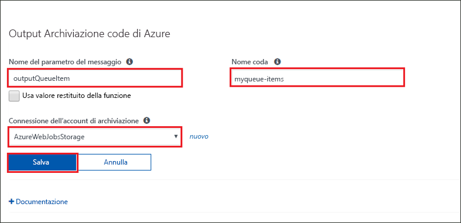
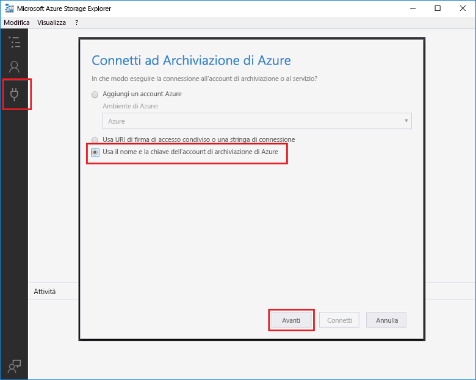
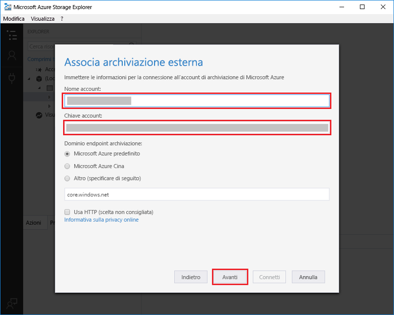
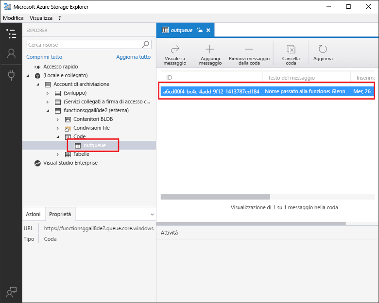

# <a name="add-messages-to-an-azure-storage-queue-using-functions"></a>Aggiungere messaggi a una coda di archiviazione di Azure tramite Funzioni

In Funzioni di Azure, i binding di input e di output forniscono una modalità dichiarativa per connettersi a dati di servizio esterni dalla funzione. Questo argomento illustra come aggiornare una funzione esistente mediante l'aggiunta di un binding di output che invia messaggi all'archiviazione code di Azure.  


Per completare tutti i passaggi di questo argomento, saranno sufficienti meno di cinque minuti.

## <a name="prerequisites"></a>Prerequisiti 

[!INCLUDE [Previous topics](../../includes/functions-quickstart-previous-topics.md)]

È necessario anche scaricare e installare [Esplora archivi di Microsoft Azure](http://storageexplorer.com/). 

[!INCLUDE [functions-portal-favorite-function-apps](../../includes/functions-portal-favorite-function-apps.md)] 

## <a name="add-binding"></a>Aggiungere un binding di output
 
1. Espandere sia l'app per le funzioni sia la funzione.

2. Fare clic su **Integrazione**, su **Nuovo output**, su **Archiviazione code di Azure** e quindi su **Seleziona**.
    
    

3. Usare le impostazioni come indicato nella tabella e quindi fare clic su **Salva**: 

    

    | Impostazione      |  Valore consigliato   | Descrizione                              |
    | ------------ |  ------- | -------------------------------------------------- |
    | **Nome coda**   | myqueue-items    | Nome della coda a cui connettersi nell'account di archiviazione. |
    | **Connessione dell'account di archiviazione** | AzureWebJobStorage | È possibile usare la connessione dell'account di archiviazione già usata dall'app per le funzioni oppure crearne una nuova.  |
    | **Nome del parametro del messaggio** | outQueueItem | Nome del parametro di binding di output. | 

Dopo aver definito un binding di output, è necessario ora aggiornare il codice in modo da usare il binding per aggiungere messaggi a una coda.  

## <a name="update-the-function-code"></a>Aggiornare il codice funzione

1. Fare clic sulla funzione per visualizzare il codice funzione nell'editor. 

2. Per una funzione C#, aggiornare la definizione di funzione come illustrato di seguito in modo da aggiungere il parametro di binding di archiviazione **outQueueItem**. Ignorare questo passaggio per le funzioni JavaScript.

    ```cs   
    public static async Task<HttpResponseMessage> Run(HttpRequestMessage req, 
        ICollector<string> outQueueItem, TraceWriter log)
    {
        ....
    }
    ```

3. Aggiungere il codice seguente alla funzione poco prima che venga restituito il metodo. Usare il frammento appropriato per il linguaggio della funzione.

    ```javascript
    context.bindings.outQueueItem = "Name passed to the function: " + 
                (req.query.name || req.body.name);
    ```

    ```cs
    outQueueItem.Add("Name passed to the function: " + name);     
    ```

4. Fare clic su **Salva** per salvare le modifiche.

Il valore passato al trigger HTTP è incluso in un messaggio aggiunto alla coda.
 
## <a name="test-the-function"></a>Testare la funzione 

1. Dopo aver salvato le modifiche al codice, fare clic su **Esegui**. 

    

2. Controllare i log per assicurarsi che la funzione abbia avuto esito positivo. Quando il binding di output viene usato per la prima volta, nell'account di archiviazione viene creata dal runtime Funzioni una nuova coda denominata **outqueue**.

È possibile quindi connettersi all'account di archiviazione per verificare la nuova coda e il messaggio aggiunto. 

## <a name="connect-to-the-queue"></a>Connettersi alla coda

Ignorare i primi tre passaggi se Esplora archivi è già stato installato e connesso all'account di archiviazione.    

1. Nella funzione fare clic su **Integrazione** e sul nuovo binding di output **Archiviazione code di Azure** e quindi espandere **Documentazione**. Copiare sia **Nome account** sia **Chiave account**. Usare queste credenziali per connettersi all'account di archiviazione.
 
    

2. Eseguire lo strumento [Microsoft Azure Storage Explorer](http://storageexplorer.com/), fare clic sull'icona di connessione a sinistra, scegliere **Use a storage account name and key** (Usare il nome e la chiave di un account di archiviazione) e fare clic su **Avanti**.

    
    
3. Immettere i valori **Nome account** e **Chiave account** definiti nel passaggio 1, fare clic su **Avanti** e quindi su **Connetti**. 
  
    

4. Espandere l'account di archiviazione associato, fare doppio clic su **Code** e verificare che esista una coda denominata **myqueue-items**. Dovrebbe anche essere presente un messaggio nella coda.  
 
    
 

## <a name="clean-up-resources"></a>Pulire le risorse

[!INCLUDE [Next steps note](../../includes/functions-quickstart-cleanup.md)]

## <a name="next-steps"></a>Passaggi successivi

È stato aggiunto un binding di output a una funzione esistente. 

[!INCLUDE [Next steps note](../../includes/functions-quickstart-next-steps.md)]

Per altre informazioni sul binding all'archiviazione code, vedere [Associazioni della coda dell'archiviazione di Funzioni di Azure](functions-bindings-storage-queue.md). 


