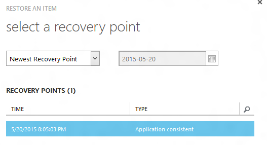
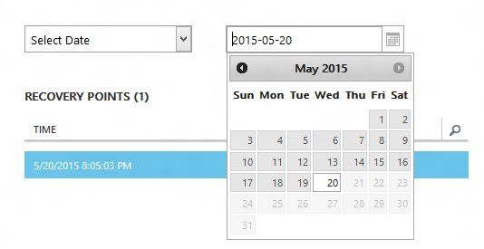

<properties
	pageTitle="Backup di Azure - ripristino configurazione di una macchina virtuale"
	description="Informazioni su come ripristinare una macchina virtuale di Azure"
	services="backup"
	documentationCenter=""
	authors="aashishr"
	manager="shreeshd"
	editor=""/>

<tags
	ms.service="backup"
	ms.workload="storage-backup-recovery"
	ms.tgt_pltfrm="na"
	ms.devlang="na"
	ms.topic="article"
	ms.date="05/27/2015"
	ms.author="aashishr"/>

# Ripristinare una macchina virtuale
È possibile ripristinare una macchina virtuale a una nuova macchina virtuale da backup archiviati in Azure archivio di backup utilizzando l'azione di ripristino.

## Scegliere un elemento da ripristinare

1. Individuare il **elementi protetti** scheda e selezionare la macchina virtuale che si desidera ripristinare in una nuova macchina virtuale.

    

    Il **punto di ripristino** colonna il **elementi protetti** pagina indicherà il numero di punti di ripristino per una macchina virtuale. Il **punto di ripristino più recente** colonna indica l'ora del backup più recente da cui è possibile ripristinare una macchina virtuale.

2. Fare clic su **ripristinare** per aprire la **ripristinare un elemento** procedura guidata.

    

## Selezionare un punto di ripristino

1. Nel **Selezionare un punto di ripristino** dello schermo, è possibile ripristinare dal punto di ripristino più recente o da un punto precedente nel tempo. L'opzione predefinita selezionata quando si apre la procedura guidata è il punto di ripristino più recente.

    

2. Per selezionare un punto precedente nel tempo, scegliere il **selezione data** opzione nell'elenco a discesa e selezionare una data nel controllo calendario facendo clic sull'icona del calendario. Nel controllo, tutte le date che dispongono di punti di ripristino vengono riempite con una gradazione di grigio chiara e sono selezionabili dall'utente.

    

    Quando si fa clic su una data nel controllo calendario, il ripristino punta disponibile in che data verrà visualizzato nella tabella di punti di ripristino seguente. Il **tempo** colonna indica l'ora in cui è stato creato lo snapshot. Il **tipo** colonna viene visualizzato il [coerenza](https://azure.microsoft.com/documentation/articles/backup-azure-vms/#consistency-of-recovery-points) del punto di ripristino. L'intestazione della tabella mostra il numero di punti di ripristino disponibili per il giorno in parentesi.

    

3. Selezionare il punto di ripristino dal **punti di ripristino** tabella e fare clic sulla freccia avanti per passare alla schermata successiva.

## Specificare un percorso di destinazione

1. Nel **Selezionare ripristino istanza** schermata specificare i dettagli del punto in cui ripristinare la macchina virtuale.

  - Specificare il nome della macchina virtuale: In un servizio cloud specificato, il nome della macchina virtuale deve essere univoco. Se si prevede di sostituire una macchina virtuale esistente con lo stesso nome, eliminare prima la macchina virtuale esistente e i dischi dati e quindi ripristinare i dati da un Backup di Azure.
  - Selezionare un servizio cloud per la macchina virtuale: questo campo è obbligatorio per la creazione di una macchina virtuale. È possibile scegliere di utilizzare un servizio cloud esistente o creare un nuovo servizio cloud.

        Whatever cloud service name is picked should be globally unique. Typically, the cloud service name gets associated with a public-facing URL in the form of [cloudservice].cloudapp.net. Azure will not allow you to create a new cloud service if the name has already been used. If you choose to create select create a new cloud service, it will be given the same name as the virtual machine – in which case the VM name picked should be unique enough to be applied to the associated cloud service.

        We only display cloud services and virtual networks that are not associated with any affinity groups in the restore instance details. [Learn More](https://msdn.microsoft.com/en-us/library/azure/jj156085.aspx).

2. Selezionare un account di archiviazione per la macchina virtuale: questo campo è obbligatorio per la creazione della macchina virtuale. È possibile selezionare gli account di archiviazione esistente nella stessa area come archivio di Backup di Azure. Non Supportiamo gli account di archiviazione che ne sono ridondanti o di tipo di archiviazione Premium.

    Se non sono disponibili account di archiviazione con configurazione supportata, creare un account di archiviazione della configurazione supportata prima di avviare l'operazione di ripristino.

    

3. Selezionare una rete virtuale: la rete virtuale (VNET) per la macchina virtuale dovrebbe essere selezionata al momento della creazione della macchina virtuale. Il ripristino dell'interfaccia utente Mostra tutte le reti virtuali all'interno di questa sottoscrizione può essere utilizzato. Non è obbligatorio per selezionare una rete virtuale per la macchina virtuale ripristinata, sarà possibile connettersi alla macchina virtuale ripristinata tramite internet, anche se non viene applicata la rete virtuale.

    Se il servizio cloud selezionato è associato a una rete virtuale, è possibile modificare la rete virtuale.

    

4. Selezionare una subnet: nel caso in cui la rete virtuale dispone di subnet, per impostazione predefinita è verrà selezionata la prima subnet. Scegliere la subnet di propria scelta tra le opzioni di elenco a discesa. Per informazioni su subnet, passare all'estensione delle reti nel [home page del portale](https://manage.windowsazure.com/), accedere a reti virtuali e selezionare la rete virtuale e drill-down in Configure per visualizzare i dettagli di subnet.

    

5. Fare clic sui **Invia** sull'icona della procedura guidata per inviare i dettagli e creare un processo di ripristino.

## Tenere traccia dell'operazione di ripristino
Dopo avere tutte le informazioni nella procedura guidata Ripristino configurazione di input e inviata Azure Backup tenta di creare un processo per tenere traccia dell'operazione di ripristino.

Se la creazione del processo ha esito positivo, verrà visualizzato che viene creato un processo che indica di notifica popup. È possibile ottenere ulteriori dettagli facendo clic sui **Visualizza processo** pulsante che porterà alla **processi** scheda.

Al termine dell'operazione di ripristino verrà contrassegnato come completato nel **processi** scheda.

Dopo aver ripristinato la macchina virtuale potrebbe essere necessario reinstallare le estensioni esistenti nella macchina virtuale originale e [ricreare gli endpoint](virtual-machines-set-up-endpoints) per la macchina virtuale nel portale di Azure.

## Risoluzione dei problemi
Per la maggior parte degli errori, è possibile seguire l'azione consigliata suggerito nei dettagli dell'errore. Ecco alcuni aspetti aggiuntivi per facilitare la risoluzione dei problemi:

| Operazione di backup | Dettagli errore | Soluzione alternativa |
| -------- | -------- | -------|
| Ripristino | Ripristino non riuscito con errore interno del Cloud | <ol><li>Servizio cloud a cui si sta tentando di ripristinare è configurato con le impostazioni DNS. È possibile controllare  $deployment = "ServiceName" Get-AzureDeployment - ServiceName-Slot "Produzione" Get-AzureDns - DnsSettings $deployment. DnsSettings se esiste un indirizzo configurato, ciò significa che le impostazioni DNS siano configurate.  <li>Servizio cloud a cui si sta tentando di ripristinare è configurato con IP riservati e le macchine virtuali esistenti nel servizio cloud sono in stato arrestato. È possibile controllare un servizio cloud è riservato IP tramite il seguente cmdlet powershell: $deployment = "servicename" Get-AzureDeployment - ServiceName-Slot $ "Produzione" Protezione esecuzione programmi. ReservedIPName</ol> |

## Passaggi successivi
- [Gestire le macchine virtuali](backup-azure-manage-vms)

<!---HONumber=GIT-SubDir-->