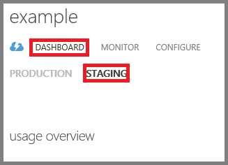
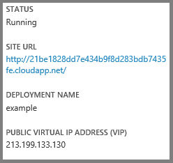

<properties linkid="dev-nodejs-enablestaging" urlDisplayName="Staging Deployment" pageTitle="Stage a cloud service deployment (Node.js) - Azure" metaKeywords="Azure staging, Azure application staging, Azure test environment, Azure staging environment, Azure Virtual IP swap, Azure VIP swap" description="Learn how to deploy your Azure application to a staging environment, then deploy to a production environment using Virtual IP (VIP) swap." metaCanonical=" " services="cloud-services" documentationCenter="Node.js" title="Staging an Application in Azure" authors="" solutions="" manager="" editor="" />

Gestione temporanea di un'applicazione in Azure
===============================================

È possibile distribuire nell'ambiente di gestione temporanea di Azure un'applicazione inclusa in un pacchetto per la verifica prima dello spostamento nell'ambiente di produzione in cui l'applicazione risulterà accessibile su Internet. L'ambiente di gestione temporanea è identico all'ambiente di produzione, ma è possibile accedere all'applicazione di gestione temporanea solo tramite un URL offuscato generato da Azure. Dopo la verifica del funzionamento corretto dell'applicazione, sarà possibile distribuirla nell'ambiente di produzione, tramite uno scambio di indirizzi IP virtuali (VIP, Virtual IP).

**Nota**

I passaggi illustrati in questo articolo riguardano esclusivamente le applicazioni Node ospitate come Servizio cloud di Azure.

Questa attività include i passaggi seguenti:

-   [Passaggio 1: Gestire un'applicazione in modo temporaneo](#step1)
-   [Passaggio 2: Aggiornare un'applicazione in produzione tramite lo scambio di indirizzi VIP](#step2)

Passaggio 1: Gestire un'applicazione in modo temporaneo
-------------------------------------------------------

In questa attività viene illustrato come gestire un'applicazione in modo temporaneo utilizzando **Azure PowerShell**.

1.  Quando si pubblica un servizio, è sufficiente passare il parametro **-Slot** al cmdlet **Publish-AzureServiceProject**.

    **Gestione temporanea tramite Publish-AzureServiceProject -Slot**

2.  Accedere al [portale di gestione di Azure](http://manage.windowsazure.com) e selezionare **Cloud Services**. Dopo la creazione del servizio cloud e l'aggiornamento dello stato della colonna **Staging** in **Running**, fare clic sul nome del servizio.

    

3.  Selezionare **Dashboard** e quindi **Staging**.

    

4.  Si noti il valore nella voce **Site URL** a destra. Il nome DNS è un ID interno offuscato generato da Azure.

    

È ora possibile verificare il corretto funzionamento dell'applicazione nell'ambiente di gestione temporanea, utilizzando l'URL del sito di gestione temporanea.

Per uno scenario di aggiornamento in cui l'applicazione di gestione temporanea è una versione aggiornata di un'applicazione già distribuita in produzione, è possibile [aggiornare l'applicazione nell'ambiente di produzione tramite lo scambio di indirizzi VIP](#step2).

Passaggio 2: Aggiornare un'applicazione in produzione tramite lo scambio di indirizzi VIP
-----------------------------------------------------------------------------------------

Dopo la verifica della versione aggiornata di un'applicazione nell'ambiente di gestione temporanea, sarà possibile renderla rapidamente disponibile in produzione tramite lo scambio degli indirizzi IP virtuali (VIP, Virtual IP) degli ambienti di gestione temporanea e di produzione.

**Nota**

In questo passaggio si presuppone che un'applicazione sia già stata distribuita in produzione e che sia già stata eseguita la gestione temporanea della versione aggiornata dell'applicazione.

1.  Accedere al [portale di gestione di Azure](http://manage.windowsazure.com), fare clic su **Cloud Services** e quindi selezionare il nome del servizio.

2.  Da **Dashboard** selezionare **Staging** e quindi fare clic su **Swap** nella parte inferiore della pagina. Verrà aperta la finestra di dialogo VIP Swap.

    

3.  Verificare le informazioni e quindi fare clic su **OK**. Verrà avviato l'aggiornamento delle due distribuzioni, mentre la distribuzione di gestione temporanea passa in produzione e la distribuzione di produzione passa in gestione temporanea.

La gestione temporanea di una distribuzione e l'aggiornamento di una distribuzione di produzione sono stati eseguiti correttamente tramite lo scambio di indirizzi IP virtuali con la distribuzione in gestione temporanea.

Risorse aggiuntive
------------------

-   [Come distribuire un aggiornamento del servizio in produzione mediante lo scambio di indirizzi IP virtuali in Azure](http://msdn.microsoft.com/en-us/library/windowsazure/ee517253.aspx)
-   [Panoramica della gestione delle distribuzioni in Azure](http://msdn.microsoft.com/en-us/library/windowsazure/hh386336.aspx)

