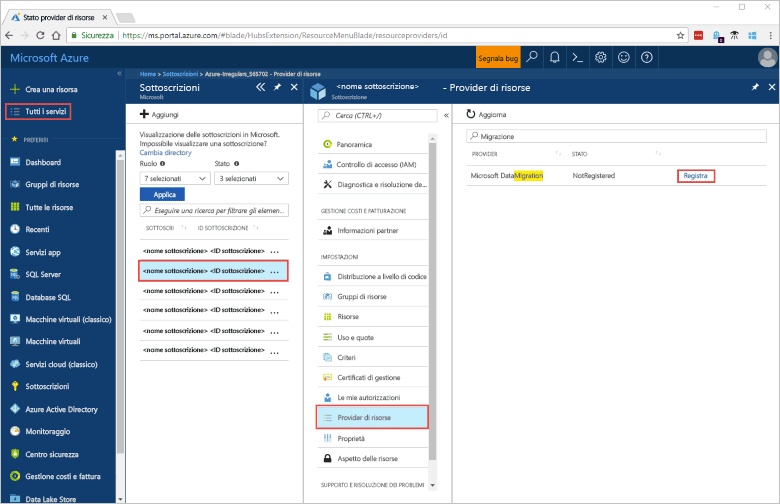
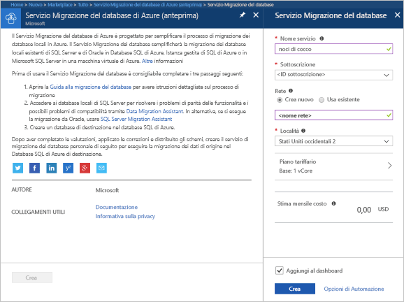
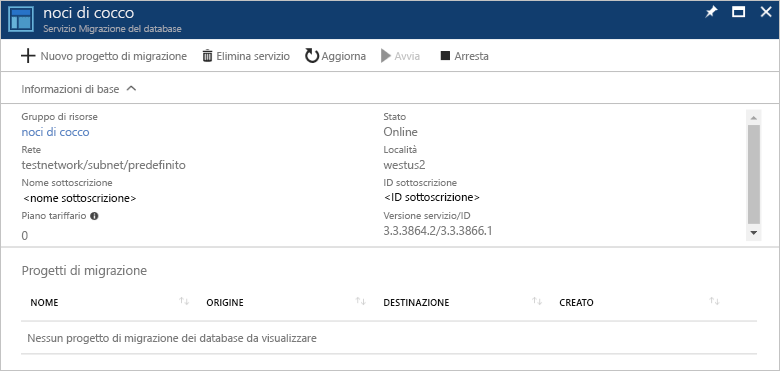

# Creare un'istanza del Servizio Migrazione del database di Azure usando il portale di Azure
In questa guida introduttiva, usare il portale di Azure per creare un'istanza del Servizio Migrazione del database di Azure.  Dopo aver creato il servizio, è possibile usarlo per eseguire la migrazione dei dati da SQL Server locale a un database SQL di Azure.

Se non si ha una sottoscrizione di Azure, creare un account [gratuito](https://azure.microsoft.com/free/) prima di iniziare.

## Accedere al Portale di Azure.
Aprire il Web browser e passare al [portale di Microsoft Azure](https://portal.azure.com/). Immettere le credenziali per accedere al portale. La visualizzazione predefinita è il dashboard del servizio.

## Registrare il provider di risorse
Prima di creare il primo Servizio Migrazione del database, è necessario registrare il provider di risorse Microsoft.DataMigration.

1. Nel portale di Azure selezionare **Tutti i servizi** e quindi **Sottoscrizioni**.

1. Selezionare la sottoscrizione in cui si vuole creare l'istanza del Servizio Migrazione del database di Azure e quindi selezionare **Provider di risorse**.

1. Cercare la migrazione e quindi a destra di Microsoft.DataMigration selezionare **Registra**.

## Creare il Servizio Migrazione del database di Azure
1. Fare clic su **+** per creare un nuovo servizio.  Servizio Migrazione del database è ancora in anteprima.  

1. Cercare "migrazione" nel marketplace, selezionare "Servizio Migrazione del database (anteprima)", quindi fare clic su **crea**.

    

    - Scegliere un **Nome servizio** facile da ricordare e univoco per identificare l'istanza del Servizio Migrazione del database di Azure.
    - Selezionare la **Sottoscrizione** in cui si desidera creare il Servizio Migrazione del database.
    - Creare una nuova **Rete** con un nome univoco.
    - Scegliere la **Posizione** più vicina al server di origine o di destinazione.
    - Selezionare Basic: 1 vCore per il **Piano tariffario**.

1. Fare clic su **Crea**.

Dopo qualche istante, il Servizio Migrazione del database di Azure sarà creato e pronto per l'uso.  Il Servizio Migrazione del database verrà visualizzato come illustrato nell'immagine.

## Pulire le risorse
È possibile pulire le risorse create nella guida introduttiva eliminando il [Gruppo di risorse di Azure](../azure-resource-manager/resource-group-overview.md).  Per eliminare il gruppo di risorse, passare al Servizio Migrazione del database creato, fare clic sul nome del **Gruppo di risorse** e quindi selezionare **Elimina gruppo di risorse**.  Questa azione elimina tutti gli asset nel gruppo di risorse, nonché il gruppo stesso.

## Passaggi successivi
> [!div class="nextstepaction"]
> [Eseguire la migrazione di SQL Server locale in Azure SQL DB](tutorial-sql-server-to-azure-sql.md)