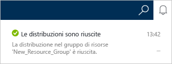
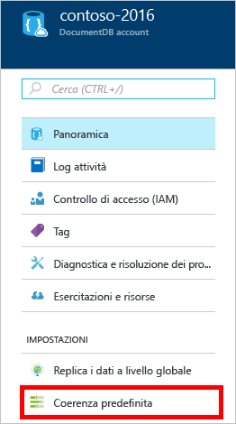
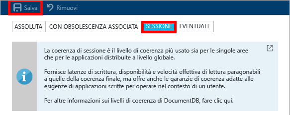

# Come creare un account DocumentDB NoSQL usando il portale di Azure
> [!div class="op_single_selector"]
> * [Portale di Azure](documentdb-create-account.md)
> * [Interfaccia della riga di comando di Azure 1.0](documentdb-automation-resource-manager-cli-nodejs.md)
> * [Interfaccia della riga di comando di Azure 2.0](documentdb-automation-resource-manager-cli.md)
> * [Azure PowerShell](documentdb-manage-account-with-powershell.md)

Per compilare un database con Microsoft Azure DocumentDB, è necessario quanto segue:

* Avere un account Azure. È possibile ottenere un [account Azure gratuito](https://azure.microsoft.com/free) se non se ne ha già uno.
* Creare un account DocumentDB.  

Per creare un account DocumentDB è possibile usare il portale di Azure, i modelli Azure Resource Manager o l'interfaccia della riga di comando di Azure. Questo articolo illustra come creare un account DocumentDB usando il portale di Azure. Per creare un account con Azure Resource Manager o l'interfaccia della riga di comando di Azure, vedere [Automatizzare la creazione dell'account DocumentDB con i modelli Azure Resource Manager e l'interfaccia della riga di comando di Azure](documentdb-automation-resource-manager-cli.md).

Se non si ha familiarità con DocumentDB, è possibile guardare [questo](https://azure.microsoft.com/documentation/videos/create-documentdb-on-azure/) video di quattro minuti a cura di Scott Hanselman per vedere come eseguire le attività più comuni nel portale online.

1. Accedere al [portale di Azure](https://portal.azure.com/).
2. Nel pannello di navigazione a sinistra, fare clic su **Nuovo**, quindi su **Database** e su **NoSQL (DocumentDB)**.

     
3. Nel pannello **Nuovo account** specificare la configurazione per l'account DocumentDB.

    

   * Nella casella **ID** immettere un nome identificativo per l'account DocumentDB.  Quando l'**ID** viene convalidato, nella casella **ID** viene visualizzato un segno di spunta verde. Il valore **ID** diventa il nome host all'interno dell'URI. L' **ID** può contenere solo lettere minuscole, numeri e il carattere '-' e deve avere una lunghezza compresa tra 3 e 50 caratteri. Si noti che al nome dell'endpoint scelto viene aggiunto *documents.azure.com* e il risultato finale sarà l'endpoint dell'account DocumentDB.
   * Nella casella **NoSQL API** (API NoSQL) selezionare il modello di programmazione da usare:

     * **DocumentDB**: l'API DocumentDB è disponibile tramite gli [SDK](documentdb-sdk-dotnet.md) .NET, Java, Node.js, Python e JavaScript, oltre che tramite [REST](https://msdn.microsoft.com/library/azure/dn781481.aspx) HTTP, e consente l'accesso a livello di codice a tutte le funzionalità di DocumentDB.
     * **MongoDB**: DocumentDB offre anche [supporto a livello di protocollo](documentdb-protocol-mongodb.md) per le API **MongoDB**. Quando si sceglie l'opzione API MongoDB, è possibile usare gli SDK MongoDB e gli [strumenti](documentdb-mongodb-mongochef.md) esistenti per comunicare con DocumentDB. È possibile [spostare](documentdb-import-data.md) le app MongoDB esistenti per usare DocumentDB, [senza dover apportare modifiche al codice](documentdb-connect-mongodb-account.md), e sfruttare i vantaggi di un database completamente gestito distribuito come servizio, con scalabilità illimitata, replica globale e altre funzionalità.
   * In **Sottoscrizione**selezionare la sottoscrizione di Azure da usare per l'account DocumentDB. Se l'account ha solo una sottoscrizione, viene selezionato per impostazione predefinita.
   * In **Gruppo di risorse**selezionare o creare un gruppo di risorse per l'account DocumentDB.  Per impostazione predefinita, viene creato un nuovo gruppo di risorse. Per altre informazioni, vedere [Gestire le risorse di Azure mediante il portale](../azure-portal/resource-group-portal.md).
   * Usare **Località** per specificare l'area geografica in cui verrà ospitato l'account DocumentDB.
4. Dopo aver configurato le opzioni del nuovo account DocumentDB, fare clic su **Crea**. Per controllare lo stato della distribuzione, controllare l'hub Notifiche.  

     

   
5. Dopo la creazione, l'account DocumentDB è pronto all'uso con le impostazioni predefinite. La coerenza predefinita dell'account DocumentDB è impostata su **Sessione**.  Per modificarla è possibile fare clic su **Coerenza predefinita** nel menu della risorsa. Per altre informazioni sui livelli di coerenza offerti da DocumentDB, vedere [Livelli di coerenza in DocumentDB](documentdb-consistency-levels.md).

     

     

[How to: Create a DocumentDB account]: #Howto
[Next steps]: #NextSteps

## Passaggi successivi
Ora che è disponibile un account DocumentDB, il passaggio successivo consiste nel creare un database e una raccolta DocumentDB.

Per creare un nuovo database e una nuova raccolta è possibile usare uno dei metodi seguenti:

* Il portale di Azure, come descritto in [Come creare una raccolta DocumentDB usando il portale di Azure](documentdb-create-collection.md).
* Le esercitazioni complete, che includono dati di esempio: [.NET](documentdb-get-started.md), [.NET MVC](documentdb-dotnet-application.md), [Java](documentdb-java-application.md), [Node.js](documentdb-nodejs-application.md) o [Python](documentdb-python-application.md).
* Il codice di esempio [.NET](documentdb-dotnet-samples.md#database-examples), [Node.js](documentdb-nodejs-samples.md#database-examples) o [Python](documentdb-python-samples.md#database-examples) disponibile in GitHub.
* Gli SDK [.NET](documentdb-sdk-dotnet.md), [.NET Core](documentdb-sdk-dotnet-core.md), [Node.js](documentdb-sdk-node.md), [Java](documentdb-sdk-java.md), [Python](documentdb-sdk-python.md) e [REST](https://msdn.microsoft.com/library/azure/mt489072.aspx).

Dopo aver creato il database e la raccolta, è necessario [aggiungere i documenti](documentdb-view-json-document-explorer.md) alle raccolte.

Quando sono presenti documenti in una raccolta, è possibile usare [DocumentDB SQL](documentdb-sql-query.md) per [eseguire query](documentdb-sql-query.md#ExecutingSqlQueries) sui documenti tramite [Esplora query](documentdb-query-collections-query-explorer.md) nel portale, l'[API REST](https://msdn.microsoft.com/library/azure/dn781481.aspx) o uno degli [SDK](documentdb-sdk-dotnet.md).

### Altre informazioni
Per altre informazioni su DocumentDB, vedere le risorse seguenti:

* [Percorso di apprendimento per DocumentDB](https://azure.microsoft.com/documentation/learning-paths/documentdb/)
* [Modello di risorse gerarchico e concetti relativi a DocumentDB](documentdb-resources.md)

