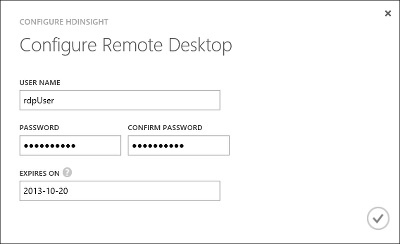
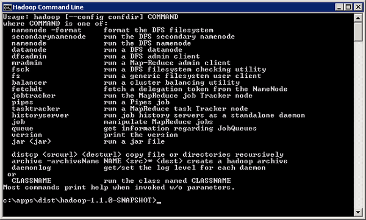

<properties linkid="manage-services-hdinsight-howto-administer-hdinsight" urlDisplayName="Administration" pageTitle="Administer HDInsight clusters with Management Portal | Azure" metaKeywords="" description="Learn how to administer HDInsight Service. Create an HDInsight cluster, open the interactive JavaScript console, and open the Hadoop command console." metaCanonical="" services="hdinsight" documentationCenter="" title="Administer HDInsight clusters using Management Portal" authors="jgao" solutions="" manager="paulettm" editor="cgronlun" />

Amministrazione di cluster HDInsight tramite il portale di gestione
===================================================================

Il portale di gestione di Azure consente di eseguire il provisioning di cluster HDInsight, modificare la password dell'utente di Hadoop e di abilitare RDP in modo da accedere alla console dei comandi di Hadoop nel cluster. Oltre al portale di gestione sono disponibili altri strumenti per amministrare HDInsight.

-   Per ulteriori informazioni sull'amministrazione di HDInsight tramite Azure PowerShell, vedere [Amministrazione di HDInsight tramite PowerShell](/en-us/manage/services/hdinsight/administer-hdinsight-using-powershell/).

-   Per ulteriori informazioni sull'amministrazione di HDInsight tramite gli strumenti da riga di comando multipiattaforma, vedere [Amministrazione di HDInsight tramite l'interfaccia della riga di comando multipiattaforma di Azure](/en-us/manage/services/hdinsight/administer-hdinsight-using-command-line-interface/).

**Prerequisiti:**

Per eseguire le procedure descritte nell'articolo, è necessario disporre di quanto segue:

-   **Sottoscrizione di Azure**. Azure è una piattaforma basata su sottoscrizione. Per informazioni su come ottenere una sottoscrizione, vedere [Opzioni di acquisto](https://www.windowsazure.com/en-us/pricing/purchase-options/), [Offerte per i membri](https://www.windowsazure.com/en-us/pricing/member-offers/) oppure [Versione di valutazione gratuita](https://www.windowsazure.com/en-us/pricing/free-trial/).

Contenuto dell'articolo
-----------------------

-   [Provisioning di cluster HDInsight](#create)
-   [Personalizzazione di cluster HDInsight](#customize)
-   [Modifica di nome utente e password di cluster HDInsight](#password)
-   [Connessione a cluster HDInsight tramite RDP](#rdp)
-   [Concessione/revoca dell'accesso ai servizi HTTP](#httpservice)
-   [Apertura della console dei comandi di Hadoop](#hadoopcmd)
-   [Passaggi successivi](#nextsteps)

Provisioning di cluster HDInsight
---------------------------------

È possibile creare cluster HDInsight in diversi modi. In questo articolo viene spiegato come effettuare questa operazione utilizzando l'opzione Quick Create del portale di gestione di Azure. Per le altre opzioni, vedere [Provisioning di cluster HDInsight](/en-us/manage/services/hdinsight/provision-hdinsight-clusters/).

I cluster HDInsight utilizzano un contenitore dell'archivio BLOB di Azure come file system predefinito. Per ulteriori informazioni sull'esperienza lineare offerta dall'archiviazione BLOB di con cluster HDInsight, vedere [Utilizzo dell'archivio BLOB di Azure con HDInsight](/en-us/manage/services/hdinsight/howto-blob-store/).

È necessario creare un account di archiviazione di Azure nello stesso data center in cui eseguire il provisioning del cluster HDInsight. È attualmente possibile eseguire il provisioning di cluster HDInsight in cinque data center:

-   Asia sudorientale
-   Europa settentrionale
-   Europa occidentale
-   Stati Uniti orientali
-   Stati Uniti occidentali

Per dettagli sulla creazione di un account di archiviazione di Azure, vedere [Come creare un account di archiviazione](/en-us/manage/services/storage/how-to-create-a-storage-account/).

**Per eseguire il provisioning di un cluster HDInsight**

1.  Accedere al [portale di gestione di Azure](https://manage.windowsazure.com/).
2.  Fare clic su **NEW** nella parte inferiore della pagina, quindi su **DATA SERVICES**, **HDINSIGHT** e infine su **QUICK CREATE**.

3.  Specificare un valore in **Cluster Name**, **Cluster Size**, **Cluster Admin Password** e un **account di archiviazione** di Azure, quindi fare clic su **Create HDInsight Cluster**. Lo stato del cluster creato e in esecuzione è *Running*.

    

    Quando si utilizza l'opzione Quick Create per creare un cluster, il nome utente predefinito dell'account amministratore è *admin*. Per assegnare all'account un nome utente diverso, è possibile utilizzare l'opzione Custom Create anziché Quick Create. È anche possibile cambiare il nome dell'account dopo il provisioning.

    Quando si utilizza l'opzione Quick Create per creare un cluster, nell'account di archiviazione specificato viene creato automaticamente un nuovo contenitore con il nome del cluster HDInsight. Se si desidera personalizzare il nome del contenitore che verrà utilizzato dal cluster per impostazione predefinita, utilizzare l'opzione Custom Create.

    > [WACOM.NOTE] Dopo avere scelto un account di archiviazione di Azure per il cluster HDInsight, l'unico modo per modificare l'account consiste nell'eliminare il cluster e crearne uno nuovo con l'account di archiviazione desiderato.

4.  Fare clic sul nuovo cluster creato. Verrà visualizzata la pagina di destinazione:

    

Personalizzazione di cluster HDInsight
--------------------------------------

HDInsight è compatibile con una vasta gamma di componenti Hadoop. Per l'elenco dei componenti verificati e supportati, vedere [Versione di Hadoop inclusa in Azure HDInsight](/en-us/manage/services/hdinsight/versioning-in-hdinsight/). Per personalizzare HDInsight, è possibile scegliere una delle opzioni seguenti:

-   Utilizzare i parametri di personalizzazione del cluster in HDInsight .NET SDK o in Azure PowerShell durante il provisioning del cluster. In questo modo le modifiche alla configurazione vengono mantenute per tutta la durata del cluster e non vengono interessate dalla ricreazione delle immagini dei nodi del cluster che la piattaforma Azure esegue periodicamente per la manutenzione. Per ulteriori informazioni sull'utilizzo dei parametri di personalizzazione dei cluster, vedere [Provisioning di cluster HDInsight](/en-us/manage/services/hdinsight/provision-hdinsight-clusters/).
-   Nel cluster è possibile eseguire alcuni componenti Java nativi, come Mahout o Cascading, sotto forma di file JAR. Tali file JAR possono essere distribuiti nell'archivio BLOB di Azure e inviati ai cluster HDInsight utilizzando i meccanismi di invio dei processi Hadoop. Per ulteriori informazioni, vedere [Invio di processi Hadoop a livello di codice](/en-us/manage/services/hdinsight/submit-hadoop-jobs-programmatically/).

    > [WACOM.NOTE] In caso di problemi durante la distribuzione di file JAR in cluster HDInsight o la chiamata di file JAR in cluster HDInsight, contattare il [Supporto Microsoft](http://www.windowsazure.com/it-it/support/options/).

    > Mahout e Cascading non sono supportati in HDInsight, pertanto in caso di problemi non è possibile rivolgersi al Supporto Microsoft. Per gli elenchi dei componenti supportati, vedere [Novità delle versioni cluster incluse con HDInsight](/en-us/manage/services/hdinsight/versioning-in-hdinsight/).

L'installazione di software personalizzato nel cluster tramite Connessione Desktop remoto non è supportata. È consigliabile evitare di archiviare file nelle unità del nodo head in quanto andranno perse nel caso in cui fosse necessario ricreare i cluster. È consigliabile archiviare i file nell'archivio BLOB di Azure. L'archivio BLOB è persistente.

Modifica di nome utente e password di cluster HDInsight
-------------------------------------------------------

Per un cluster HDInsight possono esistere due account utente. L'account utente del cluster HDInsight viene creato durante il processo di provisioning. È inoltre possibile creare un account utente RDP per accedere al cluster tramite RDP. Vedere la sezione relativa all'[abilitazione di Desktop remoto](#enablerdp).

**Per modificare nome utente e password di cluster HDInsight**

1.  Accedere al [portale di gestione di Azure](https://manage.windowsazure.com/).
2.  Fare clic su **HDINSIGHT** nel riquadro sinistro. Verrà visualizzato un elenco dei cluster HDInsight distribuiti.
3.  Fare clic sul cluster HDInsight di cui reimpostare nome utente e password.
4.  Fare clic su **CONFIGURATION** nella parte superiore della pagina.
5.  Fare clic su **OFF** accanto a **HADOOP SERVICES**.
6.  Fare clic su **SAVE** nella parte inferiore della pagina e attendere il completamento dell'operazione di disabilitazione.
7.  Dopo la disabilitazione del servizio, fare clic su **ON** accanto a **HADOOP SERVICES**.
8.  Immettere un valore in **USER NAME** e **NEW PASSWORD**. Questi saranno il nuovo nome utente e la nuova password del cluster.
9.  Fare clic su **SAVE**.

Connessione a cluster HDInsight tramite RDP
-------------------------------------------

Le credenziali del cluster fornite durante la creazione consentono di accedere ai servizi nel cluster, ma non al cluster stesso tramite Desktop remoto. L'accesso a Desktop remoto è disattivato per impostazione predefinita, pertanto per l'accesso diretto al cluster sono necessarie alcune operazioni di configurazione aggiuntive successive alla creazione.

**Per abilitare Desktop remoto**

1.  Accedere al [portale di gestione di Azure](https://manage.windowsazure.com/).
2.  Fare clic su **HDINSIGHT** nel riquadro sinistro. Verrà visualizzato un elenco dei cluster HDInsight distribuiti.
3.  Fare clic sul cluster HDInsight a cui connettersi.
4.  Fare clic su **CONFIGURATION** nella parte superiore della pagina.
5.  Nella parte inferiore della pagina fare clic su **ENABLE REMOTE**.
6.  Nella procedura guidata **Configure Remote Desktop** immettere nome utente e password di Destkop remoto. Si noti che il nome utente deve essere diverso da quello utilizzato per creare il cluster (*admin* per impostazione predefinita con l'opzione Quick Create). Immettere una data di scadenza nella casella **EXPIRES ON**. Si noti che la data di scadenza deve ricorrere nel futuro e non deve essere successiva a una settimana rispetto alla data odierna. Per impostazione predefinita, si presuppone che l'ora di scadenza del giorno sia la mezzanotte della data specificata. Fare clic sull'icona del segno di spunta.

    

    La data di scadenza deve ricorrere nel futuro e non essere successiva a sette giorni rispetto alla data odierna. L'ora corrisponde alla mezzanotte della data selezionata.

> [WACOM.NOTE] Dopo aver abilitato RDP per un cluster, è necessario aggiornare la pagina per potersi connettere al cluster.

**Per connettersi a un cluster tramite RDP**

1.  Accedere al [portale di gestione di Azure](https://manage.windowsazure.com/).
2.  Fare clic su **HDINSIGHT** nel riquadro sinistro. Verrà visualizzato un elenco dei cluster HDInsight distribuiti.
3.  Fare clic sul cluster HDInsight a cui connettersi.
4.  Fare clic su **CONFIGURATION** nella parte superiore della pagina.
5.  Fare clic su **CONNECT** e seguire le istruzioni.

Concessione/revoca dell'accesso ai servizi HTTP
-----------------------------------------------

Per i cluster HDInsight sono disponibili i servizi Web HTTP seguenti (tutti con endpoint RESTful):

-   ODBC
-   JDBC
-   Ambari
-   Oozie
-   Templeton

Per impostazione predefinita, a questi servizi è concesso l'accesso. È possibile revocare/concedere l'accesso dal portale di gestione.

> [WACOM.NOTE] La concessione/revoca dell'accesso implica la reimpostazione del nome utente e della password del cluster.

**Per concedere/revocare l'accesso ai servizi Web HTTP**

1.  Accedere al [portale di gestione di Azure](https://manage.windowsazure.com/).
2.  Fare clic su **HDINSIGHT** nel riquadro sinistro. Verrà visualizzato un elenco dei cluster HDInsight distribuiti.
3.  Fare clic sul cluster HDInsight da configurare.
4.  Fare clic su **CONFIGURATION** nella parte superiore della pagina.
5.  Fare clic su **ON** o **OFF** accanto a **HADOOP SERVICES**.
6.  Immettere un valore in **USER NAME** e **NEW PASSWORD**. Questi saranno il nuovo nome utente e la nuova password del cluster.
7.  Fare clic su **SAVE**.

È possibile effettuare questa operazione anche con i cmdlet di Azure PowerShell:

-   Grant-AzureHDInsightHttpServicesAccess
-   Revoke-AzureHDInsightHttpServicesAccess

Vedere [Amministrazione di HDInsight tramite PowerShell](/en-us/manage/services/hdinsight/administer-hdinsight-using-powershell/).

Aprire la riga di comando di Hadoop.
------------------------------------

Per connettersi al cluster tramite Desktop remoto e utilizzare la riga di comando di Hadoop, è prima necessario aver abilitato l'accesso Desktop remoto al cluster come descritto nella sezione precedente.

**Per aprire la riga di comando di Hadoop**

1.  Accedere al [portale di gestione di Azure](https://manage.windowsazure.com/).
2.  Fare clic su **HDINSIGHT** nel riquadro sinistro. Verrà visualizzato un elenco dei cluster Hadoop distribuiti.
3.  Fare clic sul cluster HDInsight a cui connettersi.
4.  Fare clic su **CONFIGURATION** nella parte superiore della pagina.
5.  Fare clic su **Connect** nella parte inferiore della pagina.
6.  Fare clic su **Open**.
7.  Immettere le credenziali e quindi fare clic su **OK**. Utilizzare il nome utente e la password configurati durante la creazione del cluster.
8.  Fare clic su **Yes**.
9.  Dal desktop fare doppio clic su **Hadoop Command Line**.

    

    Per ulteriori informazioni sui comandi Hadoop, vedere la [documentazione di riferimento sui comandi Hadoop](http://hadoop.apache.org/docs/current/hadoop-project-dist/hadoop-common/CommandsManual.html).

Nella schermata precedente nel nome della cartella è incorporato il numero di versione di Hadoop. Il numero di versione cambia in base alla versione dei componenti Hadoop installati nel cluster. È possibile utilizzare le variabili d'ambiente di Hadoop per fare riferimento a tali cartelle. Ad esempio:

    cd %hadoop_home%
    cd %hive_home%
    cd %pig_home%
    cd %sqoop_home%   
    cd %hcatalog_home%

Passaggi successivi
-------------------

In questo articolo è stato illustrato come creare un cluster HDInsight tramite il portale di gestione di Azure e come aprire lo strumento da riga di comando di Hadoop. Per ulteriori informazioni, vedere gli articoli seguenti:

-   [Amministrazione di HDInsight tramite PowerShell](/en-us/manage/services/hdinsight/administer-hdinsight-using-powershell/)
-   [Amministrazione di HDInsight tramite l'interfaccia della riga di comando multipiattaforma](/en-us/manage/services/hdinsight/administer-hdinsight-using-command-line-interface/)
-   [Provisioning di cluster HDInsight](/en-us/manage/services/hdinsight/provision-hdinsight-clusters/)
-   [Invio di processi Hadoop a livello di codice](/en-us/manage/services/hdinsight/submit-hadoop-jobs-programmatically/)
-   [Introduzione all'utilizzo di Azure HDInsight](/en-us/manage/services/hdinsight/get-started-hdinsight/)
-   [Versione di Hadoop inclusa in Azure HDInsight](/en-us/manage/services/hdinsight/versioning-in-hdinsight/)

