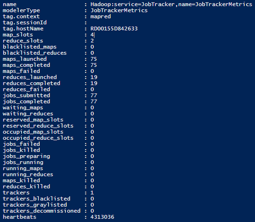

<properties linkid="manage-services-hdinsight-use-Ambari" urlDisplayName="Monitor HDInsight clusters using the Ambari API" pageTitle="Monitor HDInsight clusters using the Ambari API | Azure" metaKeywords="" description="Use the Apache Ambari APIs for provisioning, managing, and monitoring Hadoop clusters. Ambari's intuitive operator tools and APIs hide the complexity of Hadoop." services="hdinsight" documentationCenter="" title="Monitor HDInsight clusters using the Ambari API" umbracoNaviHide="0" disqusComments="1" authors="jgao" editor="cgronlun" manager="paulettm" />

Monitoraggio di cluster HDInsight con l'API Ambari
==================================================

Informazioni sul monitoraggio di cluster HDInsight versione 2.1 con API Ambari

**Tempo previsto per il completamento:** 15 minuti

Contenuto dell'articolo
-----------------------

-   [Informazioni su Ambari](#whatisambari)
-   [Prerequisiti](#prerequisites)
-   [Avvio rapido](#jumpstart)
-   [API Ambari di monitoraggio](#monitor)
-   [Passaggi successivi](#nextsteps)

Informazioni su Ambari
----------------------

[Apache Ambari](http://ambari.apache.org/) viene utilizzato per il provisioning, la gestione e il monitoraggio di cluster Apache Hadoop. Comprende una raccolta di strumenti operatore intuitivi e un set affidabile di API che nascondono la complessità di Hadoop, semplificando le operazioni sui cluster. Per ulteriori informazioni sulle API, vedere [Ambari API reference](https://github.com/apache/ambari/blob/trunk/ambari-server/docs/api/v1/index.md).

Attualmente HDInsight supporta solo la funzione di monitoraggio di Ambari. L'API Ambari v1.0 è supportata dal cluster HDInsight versione 2.1 e 3.0. In questo articolo viene descritta solo l'esecuzione di API Ambari su cluster HDInsight versione 2.1.

Prerequisiti
------------

Prima di iniziare questa esercitazione, è necessario disporre di quanto segue:

-   **Una workstation** in cui sia stato installato e configurato Azure PowerShell. Per istruzioni, vedere [Come installare e configurare Azure PowerShell](../install-configure-powershell/). Per eseguire script di PowerShell, è necessario eseguire Azure PowerShell come amministratore e impostare i criteri di esecuzione su *RemoteSigned*. Vedere la pagina relativa all'[esecuzione di script di Windows PowerShell](http://technet.microsoft.com/en-us/library/ee176949.aspx).

    [Curl](http://curl.haxx.se) è facoltativo. Può essere installato da [questo collegamento](http://curl.haxx.se/download.html).

    > [WACOM.NOTE] Quando si utilizza il comando curl in Windows, per i valori delle opzioni sostituire le virgolette alle virgolette singole.

-   **Un cluster HDInsight di Azure**. Per istruzioni sul provisioning del cluster, vedere [Introduzione a HDInsight](../hdinsight-get-started/) o [Provisioning di cluster HDInsight](../hdinsight-provision-clusters/). Per completare l'esercitazione sono necessari i dati seguenti:

    <table data-morhtml="true" border="1">
	<tr data-morhtml="true"><th data-morhtml="true">Propriet&agrave; del cluster</th><th data-morhtml="true">Nome variabile di PowerShell</th><th data-morhtml="true">Valore</th><th data-morhtml="true">Descrizione</th></tr>
	<tr data-morhtml="true"><td data-morhtml="true">Nome del cluster HDInsight</td><td data-morhtml="true">$clusterName</td><td data-morhtml="true"></td><td data-morhtml="true">Il nome del cluster HDInsight.</td></tr>
	<tr data-morhtml="true"><td data-morhtml="true">Nome utente cluster</td><td data-morhtml="true">$clusterUsername</td><td data-morhtml="true"></td><td data-morhtml="true">Nome utente del cluster specificato al momento del provisioning.</td></tr>
	<tr data-morhtml="true"><td data-morhtml="true">Password cluster</td><td data-morhtml="true">$clusterPassword</td><td data-morhtml="true"></td><td data-morhtml="true">Password dell'utente del cluster.</td></tr>
	</table>

    > [WACOM.NOTE] L'inserimento dei valori nelle tabelle potrà essere utile per completare questa esercitazione.

Avvio rapido
------------

È possibile utilizzare Ambari per monitorare cluster HDInsight in vari modi.

**Utilizzo di Azure PowerShell**

Di seguito è riportato uno script di PowerShell che consente di ottenere informazioni sul jobtracker di MapReduce:

    $clusterName = "<HDInsightClusterName>"
    $clusterUsername = "<HDInsightClusterUsername>"
    $clusterPassword = "<HDInsightClusterPassword>"

    $ambariUri = "https://$clusterName.azurehdinsight.net:443/ambari"
    $uriJobTracker = "$ambariUri/api/v1/clusters/$clusterName.azurehdinsight.net/services/mapreduce/components/jobtracker"

    $passwd = ConvertTo-SecureString $clusterPassword -AsPlainText -Force
    $creds = New-Object System.Management.Automation.PSCredential ($clusterUsername, $passwd)

    $response = Invoke-RestMethod -Method Get -Uri $uriJobTracker -Credential $creds -OutVariable $OozieServerStatus 

    $response.metrics.'mapred.JobTracker'

L'output è:

**Utilizzo di curl**

Di seguito è riportato un esempio di recupero di informazioni sul cluster mediante Curl:

    curl -u <username>:<password> -k https://<ClusterName>.azurehdinsight.net:443/ambari/api/v1/clusters/<ClusterName>.azurehdinsight.net

L'output è:

    {"href":"https://hdi0211v2.azurehdinsight.net/ambari/api/v1/clusters/hdi0211v2.azurehdinsight.net/",
     "Clusters":{"cluster_name":"hdi0211v2.azurehdinsight.net","version":"2.1.3.0.432823"},
     "services"[
       {"href":"https://hdi0211v2.azurehdinsight.net/ambari/api/v1/clusters/hdi0211v2.azurehdinsight.net/services/hdfs",
        "ServiceInfo":{"cluster_name":"hdi0211v2.azurehdinsight.net","service_name":"hdfs"}},
       {"href":"https://hdi0211v2.azurehdinsight.net/ambari/api/v1/clusters/hdi0211v2.azurehdinsight.net/services/mapreduce",
        "ServiceInfo":{"cluster_name":"hdi0211v2.azurehdinsight.net","service_name":"mapreduce"}}],
     "hosts":[
       {"href":"https://hdi0211v2.azurehdinsight.net/ambari/api/v1/clusters/hdi0211v2.azurehdinsight.net/hosts/headnode0",
        "Hosts":{"cluster_name":"hdi0211v2.azurehdinsight.net",
                 "host_name":"headnode0"}},
       {"href":"https://hdi0211v2.azurehdinsight.net/ambari/api/v1/clusters/hdi0211v2.azurehdinsight.net/hosts/workernode0",
        "Hosts":{"cluster_name":"hdi0211v2.azurehdinsight.net",
                 "host_name":"workernode0"}}]}

API Ambari di monitoraggio
--------------------------

La tabella seguente riporta alcune delle chiamate API Ambari di monitoraggio più comuni. Per ulteriori informazioni sull'API, vedere [Ambari API reference](https://github.com/apache/ambari/blob/trunk/ambari-server/docs/api/v1/index.md).

<table data-morhtml="true" border="1">
<tr data-morhtml="true"><th data-morhtml="true">Chiamata API di monitoraggio</th><th data-morhtml="true">URI</th><th data-morhtml="true">Descrizione</th></tr>
<tr data-morhtml="true"><td data-morhtml="true">Get clusters</td><td data-morhtml="true">/api/v1/clusters</td><td data-morhtml="true"></td></tr>
<tr data-morhtml="true"><td data-morhtml="true">Get cluster info.</td><td data-morhtml="true">/api/v1/clusters/&lt;ClusterName&gt;.azurehdinsight.net</td><td data-morhtml="true">cluster, servizi, hosts</td></tr>
<tr data-morhtml="true"><td data-morhtml="true">Get services</td><td data-morhtml="true">/api/v1/clusters/&lt;ClusterName&gt;.azurehdinsight.net/services</td><td data-morhtml="true">I servizi comprendono: hdfs, mapreduce</td></tr>
<tr data-morhtml="true"><td data-morhtml="true">Get services info.</td><td data-morhtml="true">/api/v1/clusters/&lt;ClusterName&gt;.azurehdinsight.net/services/&lt;ServiceName&gt;</td><td data-morhtml="true"></td></tr>
<tr data-morhtml="true"><td data-morhtml="true">Get service components</td><td data-morhtml="true">/api/v1/clusters/&lt;ClusterName&gt;.azurehdinsight.net/services/&lt;ServiceName&gt;/components</td><td data-morhtml="true">HDFS: namenode, datanode MapReduce: jobtracker; tasktracker</td></tr>
<tr data-morhtml="true"><td data-morhtml="true">Get component info.</td><td data-morhtml="true">/api/v1/clusters/&lt;ClusterName&gt;.azurehdinsight.net/services/&lt;ServiceName&gt;/components/&lt;ComponentName&gt;</td><td data-morhtml="true">ServiceComponentInfo, componenti host, metriche</td></tr>
<tr data-morhtml="true"><td data-morhtml="true">Get hosts</td><td data-morhtml="true">/api/v1/clusters/&lt;ClusterName&gt;.azurehdinsight.net/hosts</td><td data-morhtml="true">headnode0, workernode0</td></tr>
<tr data-morhtml="true"><td data-morhtml="true">Get host info.</td><td data-morhtml="true">/api/v1/clusters/&lt;ClusterName&gt;.azurehdinsight.net/hosts/&lt;HostName&gt; 
</td><td data-morhtml="true"></td></tr>
<tr data-morhtml="true"><td data-morhtml="true">Get host components</td><td data-morhtml="true">/api/v1/clusters/&lt;ClusterName&gt;.azurehdinsight.net/hosts/&lt;HostName&gt;/host_components
</td><td data-morhtml="true">namenode, resourcemanager</td></tr>
<tr data-morhtml="true"><td data-morhtml="true">Get host component info.</td><td data-morhtml="true">/api/v1/clusters/&lt;ClusterName&gt;.azurehdinsight.net/hosts/&lt;HostName&gt;/host_components/&lt;ComponentName&gt;
</td><td data-morhtml="true">HostRoles, componente, host, metriche</td></tr>
<tr data-morhtml="true"><td data-morhtml="true">Get configurations</td><td data-morhtml="true">/api/v1/clusters/&lt;ClusterName&gt;.azurehdinsight.net/configurations 
</td><td data-morhtml="true">Tipi di config: core-site, hdfs-site, mapred-site, hive-site</td></tr>
<tr data-morhtml="true"><td data-morhtml="true">Get configuration info.</td><td data-morhtml="true">/api/v1/clusters/&lt;ClusterName&gt;.azurehdinsight.net/configurations?type=&lt;ConfigType&gt;&amp;tag=&lt;VersionName&gt; 
</td><td data-morhtml="true">Tipi di config: core-site, hdfs-site, mapred-site, hive-site</td></tr>
</table>

Passaggi successivi
-------------------

In questa esercitazione si è appreso come utilizzare le chiamate API Ambari di monitoraggio. Per ulteriori informazioni, vedere:

-   [Amministrazione di cluster HDInsight tramite il portale di gestione](../hdinsight-administer-use-management-portal/)
-   [Amministrazione di cluster HDInsight tramite Azure PowerShell](../hdinsight-administer-use-powershell/)
-   [Amministrazione di cluster HDInsight tramite l'interfaccia della riga di comando](../hdinsight-administer-use-command-line/)
-   [Documentazione relativa a HDInsight](/it-it/documentation/services/hdinsight/)
-   [Introduzione all'utilizzo di HDInsight](../hdinsight-get-started/)

[ambari-home]: http://ambari.apache.org/
[ambari-api-reference]: https://github.com/apache/ambari/blob/trunk/ambari-server/docs/api/v1/index.md

[curl]: http://curl.haxx.se
[curl-download]: http://curl.haxx.se/download.html

[microsoft-hadoop-SDK]: http://hadoopsdk.codeplex.com/wikipage?title=Ambari%20Monitoring%20Client

[Powershell-install]: ../install-configure-powershell/
[Powershell-script]: http://technet.microsoft.com/en-us/library/ee176949.aspx 

[hdinsight-admin-powershell]: ../hdinsight-administer-use-powershell/
[hdinsight-admin-portal]: ../hdinsight-administer-use-management-portal/
[hdinsight-admin-cli]: ../hdinsight-administer-use-command-line/
[hdinsight-documentation]: /it-it/documentation/services/hdinsight/
[hdinsight-get-started]: ../hdinsight-get-started/
[hdinsight-provision]: ../hdinsight-provision-clusters/

[img-jobtracker-output]: ./media/hdinsight-monitor-use-ambari-api/hdi.ambari.monitor.jobtracker.output.png

