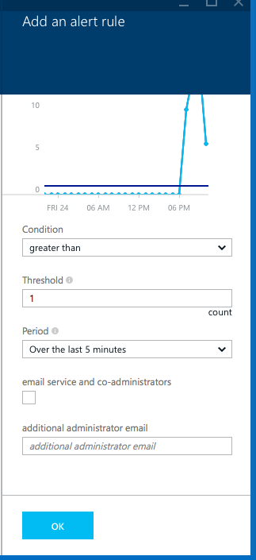

<properties 
	pageTitle="Ricevere notifiche di avviso" 
	description="Ricevere una notifica quando vengono soddisfatte le condizioni delle regole di avviso." 
	authors="stepsic-microsoft-com" 
	manager="ronmart" 
	editor="" 
	services="azure-portal" 
	documentationCenter="na"/>

<tags 
	ms.service="azure-portal" 
	ms.workload="na" 
	ms.tgt_pltfrm="na" 
	ms.devlang="na" 
	ms.topic="article" 
	ms.date="04/25/2015" 
	ms.author="stepsic"/>

# Ricevere notifiche di avviso

È possibile ricevere avvisi basati su metriche di monitoraggio o eventi nei servizi Azure.

Per una regola di avviso su un valore di metrica, quando il valore di una specifica metrica supera una soglia definita, la regola di avviso diventa attiva e può inviare una notifica. Per una regola di avviso sugli eventi, una regola può inviare una notifica su *ogni* evento o solo quando si verifica un certo numero di eventi.

Quando si crea una regola di avviso, è possibile selezionare opzioni per l'invio di una notifica tramite posta elettronica all'amministratore o al coamministratore del servizio o a un altro amministratore da specificare. Una notifica tramite posta elettronica viene inviata quando la regola diventa attiva e quando viene risolta una condizione di avviso.

Per configurare e ottenere informazioni sulle regole di avviso a livello di codice, è possibile usare l'[API REST](https://msdn.microsoft.com/library/azure/dn931945.aspx) o [.NET SDK](https://www.nuget.org/packages/Microsoft.Azure.Insights/).

## Creare una regola di avviso

1. Nel [portale](https://portal.azure.com/) fare clic su **Sfoglia** e quindi su una risorsa che si intende monitorare.

2. Fare clic sulla sezione **Regole di avviso** in **Operazioni**.

3. Fare clic sul comando **Aggiungi avviso**. 

4. È possibile denominare la regola di avviso e scegliere una descrizione che verrà visualizzata nella notifica inviata tramite posta elettronica.

5. Quando si seleziona **Metriche**, è possibile scegliere una condizione e un valore soglia per la metrica. Si tratta del periodo di tempo usato da Azure per monitorare e tracciare l'attività di avviso. 

6. È inoltre possibile scegliere **Eventi** e ricevere una notifica quando si verifica un determinato evento. 

7. Infine, si può scegliere di inviare la notifica tramite posta elettronica agli amministratori responsabili.

Pochi minuti dopo aver fatto clic su **Salva**, all'utente verrà comunicato se la metrica prescelta supera la soglia.

## Gestire le regole di avviso

Dopo aver creato una regola di avviso, è possibile visualizzare un'anteprima della soglia di avviso raffrontata alla metrica del giorno precedente.

Questa regola di avviso può chiaramente essere modificata e **disabilitata** o **abilitata**, se si desidera interrompere temporaneamente la ricezione di notifiche ad essa correlate.

## Passaggi successivi

* [Monitorare le metriche del servizio](insights-how-to-customize-monitoring.md) per assicurarsi che il servizio sia disponibile e reattivo.
* [Abilitare il monitoraggio e la diagnostica](insights-how-to-use-diagnostics.md) per raccogliere metriche dettagliate e ad alta frequenza sul servizio.
* [Monitorare la disponibilità e i tempi di risposta di qualsiasi pagina Web](app-insights-monitor-web-app-availability.md) con Application Insights per definire se la pagina è inattiva.
* [Monitorare le prestazioni dell'applicazione](insights-perf-analytics.md) se si desidera comprendere esattamente il comportamento del codice nel cloud.
* [Visualizzare eventi e registri di controllo](insights-debugging-with-events.md) per informazioni su tutti gli eventi che si sono verificati nel servizio.
* [Tenere traccia dello stato del servizio](insights-service-health.md) per scoprire quando Azure ha subito un calo delle prestazioni o interruzioni del servizio.

<!---HONumber=58-->