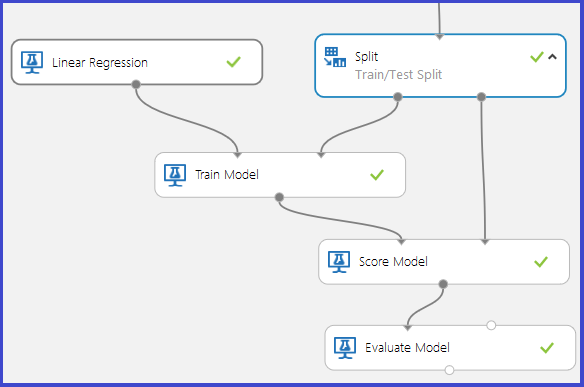

<properties 
	pageTitle="Debug del modello in Azure Machine Learning | Azure" 
	description="Viene illustrato come eseguire il debug del modello in Azure Machine Learning." 
	services="machine-learning"
	documentationCenter="" 
	authors="bradsev" 
	manager="paulettm" 
	editor="cgronlun"/>

<tags 
	ms.service="machine-learning" 
	ms.workload="data-services" 
	ms.tgt_pltfrm="na" 
	ms.devlang="na" 
	ms.topic="article" 
	ms.date="02/13/2015" 
	ms.author="bradsev" />

# Debug del modello in Azure Machine Learning

In questo articolo viene illustrato come eseguire il debug dei modelli in Microsoft Azure Machine Learning. In particolare, vengono forniti i potenziali motivi per i quali possono verificarsi i due scenari di errore riportati di seguito durante l'esecuzione di un modello:

* il modulo Training modello genera un errore 
* il modulo Punteggio modello produce risultati non corretti 

## Il modulo Training modello genera un errore

Il modulo Training modello attende i seguenti 2 input:

1. Il tipo di modello di regressione o classificazione dalla raccolta di modelli forniti da Azure Machine Learning
2. I dati di training con una colonna Etichetta specificata. La colonna Etichetta specifica la variabile da stimare. Il resto delle colonne incluse rappresentano le caratteristiche.

Questo modulo genera un errore nei casi seguenti:

1. La colonna Etichetta è specificata in modo errato perché è selezionata più di una colonna come etichetta oppure perché è selezionato un indice di colonna non corretto. Ad esempio, il secondo caso è applicabile se è stato usato un indice di colonna pari a 30 con un set di dati di input dotato di 25 colonne soltanto.

2. Il set di dati non contiene nessuna colonna per le caratteristiche. Ad esempio, se il set di dati di input dispone solo di 1 colonna, contrassegnata come colonna Etichetta, non sono presenti caratteristiche con cui creare il modello. In questo caso, il modulo Training modello genera un errore.

3. Il set di dati di input (caratteristiche o etichetta) contiene Infinity come valore.

## Il modulo Punteggio modello non produce risultati corretti

In un tipico grafico di training/testing per l'apprendimento sorvegliato, il modulo Dividi separa il set di dati originale in due parti: una usata per eseguire il training del modello e l'altra riservata alla classificazione delle prestazioni del modello sottoposto a training sui dati. Il modello sottoposto a training viene quindi utilizzato per calcolare il punteggio dei dati di test, dopo il quale vengono valutati i risultati per determinare la precisione del modello.

Il modulo Punteggio modello richiede due input:

1. Un output del modello sottoposto a training dal modulo Training modello
2. Un set di dati diverso da quello per cui il modello è stato sottoposto a training

Può accadere che, nonostante il buon esito dell'esperimento, il modulo Punteggio modello produca risultati non corretti. Ciò può essere dovuto a diversi scenari:

1. Se l'etichetta specificata è categorica e un modello di regressione è sottoposto a training sui dati, può essere prodotto un output errato dal modulo Punteggio modello. Questo si verifica perché la regressione richiede una variabile di risposta continua. In questo caso sarebbe più opportuno usare un modello di classificazione. 
2. Analogamente, se un modello di classificazione è sottoposto a training su un set di dati con numeri a virgola mobile nella colonna Etichetta, tale modello può produrre risultati indesiderati. Questo si verifica perché la classificazione richiede una variabile di risposta discreta che ammette solo valori all'interno di un set di classi finito e solitamente di dimensioni ridotte.
3. Se il set di dati non contiene tutte le caratteristiche usate per eseguire il training del modello, il modulo Punteggio modello produce un errore.
4. Il modulo Punteggio errore non produce nessun output corrispondente a una riga nel set di dati che contiene un valore mancante o infinito per una delle sue caratteristiche.
5. Il modulo Punteggio modello può produrre output identici per tutte le righe nel set di dati. Ciò potrebbe verificarsi, ad esempio, quando si tenta di eseguire una classificazione usando insiemi di decisioni se il numero minimo di esempi per nodo foglia è scelto per essere più del numero di esempi di training disponibili.

<!--HONumber=49-->