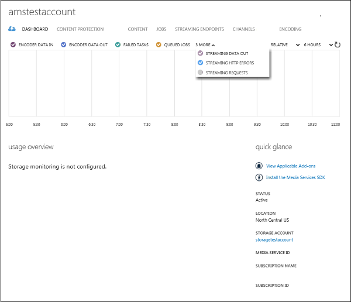
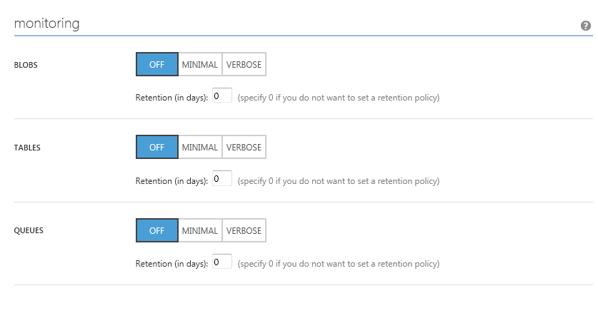

<properties linkid="manage-services-mediaservices-monitor-a-media-services-account" urlDisplayName="How to monitor" pageTitle="Monitor a Media Services Account - Azure" metaKeywords="" description="Describes how to configure monitoring for your Media Services account in Azure." metaCanonical="" services="media-services" documentationCenter="" title="How to Monitor a Media Services Account" authors="migree" solutions="" manager="" editor="" />

Come monitorare un account di Servizi multimediali
==================================================

Nel dashboard di Servizi multimediali di Azure vengono presentate metriche di utilizzo e informazioni relative all'account che è possibile utilizzare per gestire il proprio account di Servizi multimediali.

You can monitor the number of queued encoding jobs, failed encoding tasks, active encoding jobs represented by the input and output data from the encoder, as well as the blob storage usage associated with your Media Services account. Se si trasferiscono informazioni in streaming ai clienti, è inoltre possibile recuperare varie metriche relative allo streaming. È possibile scegliere di monitorare i dati relativi alle ultime 6 o 24 ore oppure agli ultimi 7 giorni.

**Nota** Al monitoraggio dei dati di archiviazione nel portale di gestione di Azure sono associati costi aggiuntivi. Per ulteriori informazioni, vedere [Analisi archiviazione e fatturazione](http://go.microsoft.com/fwlink/?LinkId=256667).

Procedura: Monitorare di un account di Media Services
-----------------------------------------------------

1.  Nel [portale di gestione](http://go.microsoft.com/fwlink/?LinkID=256666) fare clic su **Media Services**, quindi sul nome dell'account di Servizi multimediali per aprire il dashboard.

    

2.  Per monitorare i processi o i dati di codifica è sufficiente iniziare a inviare processi di codifica a Servizi multimediali, oppure iniziare a trasmettere contenuti in streaming ai clienti utilizzando lo streaming on demand di contenuti multimediali di Azure. I dati di monitoraggio dovrebbero iniziare a essere visualizzati nel dashboard dopo circa un'ora.

Procedura: Monitoraggio dell'utilizzo dell'archiviazione BLOB (facoltativo)
---------------------------------------------------------------------------

1.  Fare clic sul nome dello **STORAGE ACCOUNT** nella sezione **quick glance**.
2.  Nella pagina dell'account di archiviazione fare clic sul collegamento **configure page** e scorrere verso il basso fino alle impostazioni **monitoring** per i servizi BLOB, tabelle e accodamento, illustrati di seguito.

    **Nota** I BLOB sono l'unico tipo di archiviazione supportata in Servizi multimediali.

    

3.  In **monitoring** impostare il livello di monitoraggio e i criteri di conservazione dei dati per i BLOB:

-   Per impostare il livello di monitoraggio, selezionare una delle opzioni seguenti:

    **Minimal**: consente di raccogliere metriche come ingresso/uscita, disponibilità, latenza e percentuali di successo aggregate per i servizi BLOB, tabelle e accodamento.

    **Verbose**: oltre alle metriche minime, consente di raccogliere lo stesso set di metriche per ogni operazione di archiviazione eseguita nell'API del servizio di archiviazione di Azure. Le metriche dettagliate consentono un'analisi più accurata dei problemi che si verificano durante l'elaborazione dell'applicazione.

    **Off**: consente di disattivare il monitoraggio. I dati di monitoraggio esistenti vengono mantenuti fino al termine del periodo di conservazione.

-   Per impostare i criteri di conservazione dei dati, in **Retention (in days)** immettere il numero desiderato di giorni, da 1 a 365. Se non si desidera impostare criteri di conservazione, immettere zero. Se non vengono impostati criteri di conservazione, i dati di monitoraggio dovranno essere eliminati manualmente. È consigliabile impostare criteri di conservazione in base al periodo in cui si desidera conservare dati di analisi dell'archiviazione per l'account, in modo che i dati inutilizzati possano essere eliminati dal sistema senza costi aggiuntivi.

1.  Dopo aver configurato il monitoraggio, fare clic su **Save**. Analogamente a quanto accade per le metriche di Servizi multimediali, i dati di monitoraggio dovrebbero iniziare a essere visualizzati nel dashboard dopo circa un'ora. Le metriche vengono archiviate nell'account di archiviazione in quattro tabelle denominate \$MetricsTransactionsBlob, \$MetricsTransactionsTable, \$MetricsTransactionsQueue e \$MetricsCapacityBlob. Per ulteriori informazioni, vedere [Informazioni sulle metriche di Analisi archiviazione](http://go.microsoft.com/fwlink/?LinkId=256668).

<!-- Images -->
[dashboard]: ./media/media-services-monitor-services-account/media-services-dashboard.png
[storage_options_scoped]: ./media/media-services-monitor-services-account/storagemonitoringoptions_scoped.png

