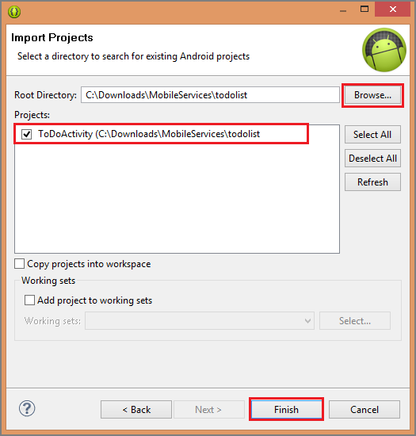

<properties pageTitle="Get Started with Azure Mobile Services for Android apps" metaKeywords="Azure android application, mobile service android, getting started Azure android, azure droid, getting started droid windows" description="Follow this tutorial to get started using Azure Mobile Services for Android development." metaCanonical="" services="" documentationCenter="Mobile" title="Get started with Mobile Services" authors="glenga" solutions="" manager="" editor="" />

Introduzione a Servizi mobili
=============================

[Windows Store C\#](/it-it/documentation/articles/mobile-services-dotnet-backend-windows-store-dotnet-get-started "Windows Store C#") [Windows Store JavaScript](/it-it/documentation/articles/mobile-services-dotnet-backend-windows-store-javascript-get-started "Windows Store JavaScript") [Windows Phone](/it-it/documentation/articles/mobile-services-dotnet-backend-windows-phone-get-started "Windows Phone") [iOS](/it-it/documentation/articles/mobile-services-dotnet-backend-ios-get-started "iOS") [Android](/it-it/documentation/articles/mobile-services-dotnet-backend-android-get-started "Android")
[Back-end .NET](/it-it/documentation/articles/mobile-services-dotnet-backend-android-get-started/ "Back-end .NET") | [Back-end JavaScript](/it-it/documentation/articles/mobile-services-android-get-started/ "Back-end JavaScript")

In questa esercitazione viene illustrato come aggiungere un servizio back-end basato sul cloud a un'app per Android mediante Servizi mobili di Azure. In questa esercitazione si creeranno sia un nuovo servizio mobile che una semplice app *To do list* che archivia i dati dell'app nel nuovo servizio mobile. Il servizio mobile che verrà creato utilizza i linguaggi .NET supportati tramite Visual Studio per la logica di business sul lato server e per la gestione del servizio mobile. Per creare un servizio mobile che consenta di scrivere la logica di business sul lato server in JavaScript, vedere la [versione per back-end JavaScript](/it-it/documentation/articles/mobile-services-android-get-started/) di questo argomento.

Di seguito è riportata una schermata dell'app completata:

Per completare questa esercitazione, è necessario disporre di [Android Developer Tools](https://go.microsoft.com/fwLink/p/?LinkID=280125) che include l'IDE (Integrated Development Environment) di Eclipse, il plug-in Android Developer Tools (ADT) e l'ultima piattaforma Android. È necessario Android 4.2 o versione successiva.

Il progetto di guida introduttiva scaricato contiene Mobile Services SDK per Android. Questo progetto richiede Android 4.2 o versione successiva, invece Mobile Services SDK richiede solo Android 2.2 o versione successiva.

**Nota**

Per completare l'esercitazione, è necessario un account Azure. Se non si dispone di un account, è possibile creare un account di valutazione gratuita in pochi minuti. Per informazioni dettagliate, vedere la pagina relativa alla [versione di valutazione gratuita di Azure](http://www.windowsazure.com/it-it/pricing/free-trial/?WT.mc_id=AE564AB28).

Creazione di un nuovo servizio mobile
-------------------------------------

[WACOM.INCLUDE [mobile-services-create-new-service](../includes/mobile-services-create-new-service.md)]

Download del servizio mobile sul computer locale
------------------------------------------------

Dopo aver creato il servizio mobile scaricare il progetto di servizio mobile personalizzato da eseguire sul computer locale o sulla macchina virtuale.

1.  Fare clic sul servizio mobile appena creato, quindi nella scheda Quickstart fare clic su **Android** in **Choose platform** ed espandere **Create a new Android app**.

2.  Se necessario, scaricare e installare [Visual Studio Professional 2013](https://go.microsoft.com/fwLink/p/?LinkID=391934) o una versione successiva.

3.  Fare clic su **Download** in **Download and publish your service to the cloud**.

    Verrà scaricato il progetto di Visual Studio che implementerà il servizio mobile. Salvare il file del progetto compresso nel computer locale e prendere nota del percorso.

4.  Inoltre, scaricare il proprio profilo di pubblicazione, salvare il file scaricato nel computer locale e prendere nota del percorso.

Test del servizio mobile
------------------------

[WACOM.INCLUDE [mobile-services-dotnet-backend-test-local-service](../includes/mobile-services-dotnet-backend-test-local-service.md)]

Pubblicazione del servizio mobile
---------------------------------

[WACOM.INCLUDE [mobile-services-dotnet-backend-publish-service](../includes/mobile-services-dotnet-backend-publish-service.md)]

Creazione di una nuova app per Android
--------------------------------------

In questa sezione si creerà una nuova app per Android connessa al servizio mobile.

1.  Nel [portale di gestione](https://manage.windowsazure.com/) fare clic su **Mobile Services** e quindi sul servizio mobile appena creato.

2.  Nella scheda Quickstart fare clic su **Android** in **Choose platform** ed espandere **Create a new Android app**.

3.  Se necessario, scaricare e installare [Android Developer Tools](https://go.microsoft.com/fwLink/p/?LinkID=280125) nel computer locale o nella macchina virtuale.

4.  Fare clic su **Create TodoItem table** per creare una tabella in cui archiviare i dati dell'app.

5.  In **Download and run your app** fare clic su **Download**.

	Verrà scaricato il progetto per l'applicazione *To do list* di esempio connessa al servizio mobile. Salvare il file del progetto compresso nel computer locale e prendere nota del percorso.

Esecuzione dell'app per Android
-------------------------------

La fase finale di questa esercitazione prevede la compilazione e l'esecuzione della nuova app.

1.  Individuare il percorso in cui sono stati salvati i file compressi del progetto ed espanderli nel computer in uso.

2.  In Eclipse fare clic su **File**, quindi su **Import**, espandere **Android**, fare clic su **Existing Android Code into Workspace** e quindi su **Next**.

	

3.  Fare clic su **Browse**, individuare il percorso dei file espansi del progetto, fare clic su **OK**, verificare che il progetto TodoActivity sia selezionato, quindi fare clic su **Finish**.

	

    I file del progetto verranno importati nell'area di lavoro corrente.

	

4.  Scegliere **Run** dal menu **Run** per avviare il progetto nell'emulatore di Android.

    **Nota**

    Per poter eseguire il progetto nell'emulatore di Android, è necessario definire almeno un Android Virtual Device (AVD). Utilizzare AVD Manager per creare e gestire questi dispositivi.

5.  Nell'app digitare un testo significativo, ad esempio *Complete the tutorial* e quindi fare clic su **Add**.

    ![][10]

    Verrà inviata una richiesta POST al nuovo servizio mobile ospitato in Azure. I dati della richiesta vengono inseriti nella tabella TodoItem. Gli elementi archiviati nella tabella vengono restituiti dal servizio mobile e i dati vengono visualizzati nell'elenco.

    **Nota**

    È possibile esaminare il codice che accede al servizio mobile per eseguire una query e inserire i dati, disponibile nel file ToDoActivity.java.

<!-- Anchors. -->
[Getting started with Mobile Services]:#getting-started
[Create a new mobile service]:#create-new-service
[Define the mobile service instance]:#define-mobile-service-instance
[Next Steps]:#next-steps

<!-- Images. -->
[0]: ./media/mobile-services-dotnet-backend-android-get-started/mobile-quickstart-completed-android.png
[1]: ./media/mobile-services-dotnet-backend-android-get-started/mobile-quickstart-steps-vs.png

[6]: ./media/mobile-services-dotnet-backend-android-get-started/mobile-portal-quickstart-android.png
[7]: ./media/mobile-services-dotnet-backend-android-get-started/mobile-quickstart-steps-android.png
[8]: ./media/mobile-services-dotnet-backend-android-get-started/mobile-eclipse-quickstart.png

[10]: ./media/mobile-services-dotnet-backend-android-get-started/mobile-quickstart-startup-android.png
[11]: ./media/mobile-services-dotnet-backend-android-get-started/mobile-data-tab.png
[12]: ./media/mobile-services-dotnet-backend-android-get-started/mobile-data-browse.png

[14]: ./media/mobile-services-dotnet-backend-android-get-started/mobile-services-import-android-workspace.png
[15]: ./media/mobile-services-dotnet-backend-android-get-started/mobile-services-import-android-project.png

<!-- URLs. -->
[Get started with data]: /it-it/documentation/articles/mobile-services-dotnet-backend-android-get-started-data
[Get started with authentication]: /it-it/documentation/articles/mobile-services-dotnet-backend-android-get-started-users
[Get started with push notifications]: /it-it/documentation/articles/mobile-services-dotnet-backend-android-get-started-push
[Android SDK]: https://go.microsoft.com/fwLink/p/?LinkID=280125
[Mobile Services Android SDK]: https://go.microsoft.com/fwLink/p/?LinkID=266533

[Management Portal]: https://manage.windowsazure.com/