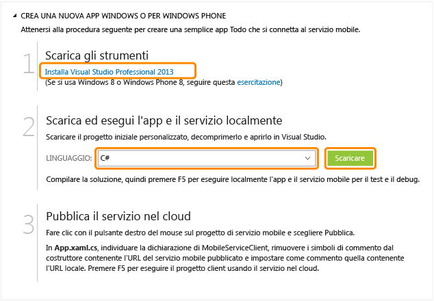

<properties linkid="develop-mobile-tutorials-get-started" pageTitle="Get Started with Mobile Services for Windows Store apps | Mobile Dev Center" metaKeywords="" description="Follow this tutorial to get started using Azure Mobile Services for Windows Store development in C#, VB, or JavaScript. " metaCanonical="" services="" documentationCenter="Mobile" title="Get started with Mobile Services" authors="glenga" solutions="" manager="" editor="" />

Introduzione a Servizi mobili
=============================

[Windows Store C\#](/en-us/documentation/articles/mobile-services-dotnet-backend-windows-store-dotnet-get-started "Windows Store C#") [Windows Store JavaScript](/en-us/documentation/articles/mobile-services-dotnet-backend-windows-store-javascript-get-started "Windows Store JavaScript") [Windows Phone](/en-us/documentation/articles/mobile-services-dotnet-backend-windows-phone-get-started "Windows Phone") [iOS](/en-us/documentation/articles/mobile-services-dotnet-backend-ios-get-started "iOS") [Android](/en-us/documentation/articles/mobile-services-dotnet-backend-android-get-started "Android")
[Back-end .NET](/en-us/documentation/articles/mobile-services-dotnet-backend-windows-store-dotnet-get-started/ "Back-end .NET") | [Back-end JavaScript](/en-us/documentation/articles/mobile-services-windows-store-get-started/ "Back-end JavaScript")

In questa esercitazione viene illustrato come aggiungere un servizio back-end basato su cloud a un'app di Windows Store mediante Servizi mobili di Azure. In questa esercitazione si creeranno sia un nuovo servizio mobile che una semplice app *To do list* che archivia i dati dell'app nel nuovo servizio mobile. Il servizio mobile che verrà creato utilizza i linguaggi .NET supportati tramite Visual Studio per la logica di business sul lato server e per la gestione del servizio mobile. Per creare un servizio mobile che consenta di scrivere la logica di business sul lato server in JavaScript, vedere la [versione per back-end JavaScript](/en-us/documentation/articles/mobile-services-windows-store-get-started) di questo argomento.

> [WACOM.NOTE]In questo argomento viene illustrato come creare un nuovo progetto di servizio mobile e un'app di Windows Store app utilizzando il portale di gestione di Azure. Visual Studio 2013 Update 2 consente di aggiungere un nuovo progetto di servizio mobile a una soluzione Visual Studio esistente. Per ulteriori informazioni, vedere [Guida introduttiva: aggiunta di un servizio mobile (back-end .NET)](http://msdn.microsoft.com/en-us/library/windows/apps/dn629482.aspx)

Di seguito è riportata una schermata dell'app completata:


Il completamento di questa esercitazione costituisce un prerequisito per tutte le altre esercitazioni di Servizi mobili relative ad app di Windows Store.

> [WACOM.NOTE]Per completare l'esercitazione, è necessario un account Azure. Se non si dispone di un account, è possibile creare un account di valutazione gratuita in pochi minuti. Per informazioni dettagliate, vedere la pagina relativa alla [versione di valutazione gratuita di Azure](http://www.windowsazure.com/en-us/pricing/free-trial/?WT.mc_id=A0E0E5C02&returnurl=http%3A%2F%2Fwww.windowsazure.com%2Fen-us%2Fdocumentation%2Farticles%2Fmobile-services-dotnet-backend-windows-store-get-started%2F).
> Per completare questa esercitazione, è necessario disporre di [Visual Studio Professional 2013](https://go.microsoft.com/fwLink/p/?LinkID=257546). È disponibile una versione di valutazione gratuita.

Creazione di un nuovo servizio mobile
-------------------------------------

[WACOM.INCLUDE [mobile-services-dotnet-backend-create-new-service](../includes/mobile-services-dotnet-backend-create-new-service.md)]

Creazione di una nuova app di Windows Store
-------------------------------------------

Dopo aver creato il servizio mobile, è possibile seguire una facile guida introduttiva nel portale di gestione per creare una nuova app o modificare un'app esistente per connettersi al servizio mobile.

In questa sezione si creerà una nuova app di Windows Store connessa al servizio mobile.

1.  Nel portale di gestione fare clic su **Mobile Services** e quindi sul servizio mobile appena creato.

2.  Nella scheda Quickstart fare clic su **Windows** in **Choose platform** ed espandere **Create a new Windows Store app**.

    ![][6]

    Di seguito sono visualizzati i tre semplici passaggi per creare un'app di Windows Store connessa al servizio mobile.

	

1.  Se necessario, scaricare e installare [Visual Studio Professional 2013](https://go.microsoft.com/fwLink/p/?LinkID=257546) nel computer locale o nella macchina virtuale.

2.  In **Download and run your app and service locally** selezionare un linguaggio per l'app di Windows Store, quindi fare clic su **Download**.

	Verrà scaricata una soluzione che contiene progetti sia per il servizio mobile, sia per l'applicazione *To do list* di esempio connessa al servizio mobile. Salvare il file del progetto compresso nel computer locale e prendere nota del percorso.

1.  In **Publish your service to the cloud** scaricare il proprio profilo di pubblicazione, salvare il file scaricato nel computer locale e prendere nota del percorso.

Test dell'app nel servizio mobile locale
----------------------------------------

[WACOM.INCLUDE [mobile-services-dotnet-backend-test-local-service-dotnet](../includes/mobile-services-dotnet-backend-test-local-service-dotnet.md)]

> [WACOM.NOTE]È possibile esaminare il codice che accede al servizio mobile per eseguire una query e inserire i dati, disponibile nel file MainPage.xaml.cs.

Pubblicazione del servizio mobile
---------------------------------

[WACOM.INCLUDE [mobile-services-dotnet-backend-publish-service](../includes/mobile-services-dotnet-backend-publish-service.md)]

1.  Nel progetto di app di Windows Store aprire il file App.xaml.cs, individuare il codice che crea un'istanza di [MobileServiceClient](http://msdn.microsoft.com/en-us/library/Windowsazure/microsoft.windowsazure.mobileservices.mobileserviceclient.aspx), rimuovere i simboli di commento dal codice che crea il client utilizzando *localhost*, quindi rimuovere i simboli di commento dal codice che crea il client utilizzando l'URL del servizio remoto, che ha un aspetto simile al seguente:

    ``` {}
    public static MobileServiceClient MobileService = new MobileServiceClient(
                "https://todolist.azure-mobile.net/",
                "XXXX-APPLICATION-KEY-XXXXX");
    ```

    Il client accederà al servizio mobile pubblicato in Azure.

2.  Premere **F5** per ricompilare il progetto e avviare l'app.

3.  Nell'app digitare un testo significativo, ad esempio *Complete the tutorial*, in **Insert a TodoItem**, quindi fare clic su **Save**.

    Verrà inviata una richiesta POST al nuovo servizio mobile ospitato in Azure.


Passaggi successivi
-------------------

Dopo aver completato la guida introduttiva, è possibile eseguire altre importanti attività in Servizi mobili:

-   [Introduzione ai dati](/en-us/documentation/articles/mobile-services-dotnet-backend-windows-store-dotnet-get-started-data) <br/>
    Ulteriori informazioni sull'archiviazione e sulle query dei dati mediante Servizi mobili.

-   [Introduzione all'autenticazione](/en-us/documentation/articles/mobile-services-dotnet-backend-windows-store-dotnet-get-started-users) <br/>
    Informazioni sull'autenticazione degli utenti dell'app con un provider di identità.

-   [Introduzione alle notifiche push](/en-us/documentation/articles/mobile-services-dotnet-backend-windows-store-dotnet-get-started-push) <br/>
    Informazioni sull'invio di una notifica push di base all'app.

<!-- Anchors. -->
[Getting started with Mobile Services]:#getting-started
[Create a new mobile service]:#create-new-service
[Define the mobile service instance]:#define-mobile-service-instance
[Next Steps]:#next-steps

<!-- Images. -->
[0]: ./media/mobile-services-dotnet-backend-windows-store-dotnet-get-started/mobile-quickstart-completed.png

[6]: ./media/mobile-services-dotnet-backend-windows-store-dotnet-get-started/mobile-portal-quickstart.png
[7]: ./media/mobile-services-dotnet-backend-windows-store-dotnet-get-started/mobile-quickstart-steps.png
[8]: ./media/mobile-services-dotnet-backend-windows-store-dotnet-get-started/mobile-service-startup.png

[10]: ./media/mobile-services-dotnet-backend-windows-store-dotnet-get-started/mobile-quickstart-startup.png


<!-- URLs. -->
[Get started with data]: /en-us/documentation/articles/mobile-services-dotnet-backend-windows-store-dotnet-get-started-data
[Get started with authentication]: /en-us/documentation/articles/mobile-services-dotnet-backend-windows-store-dotnet-get-started-users
[Get started with push notifications]: /en-us/documentation/articles/mobile-services-dotnet-backend-windows-store-dotnet-get-started-push
[Visual Studio Professional 2013]: https://go.microsoft.com/fwLink/p/?LinkID=257546
[Mobile Services SDK]: http://go.microsoft.com/fwlink/?LinkId=257545
[JavaScript and HTML]: mobile-services-win8-javascript/
[Management Portal]: https://manage.windowsazure.com/
[JavaScript backend version]: /en-us/documentation/articles/mobile-services-windows-store-get-started
[Get started with data in Mobile Services using Visual Studio 2012]: /en-us/documentation/articles/mobile-services-windows-store-dotnet-get-started-data-vs2012
