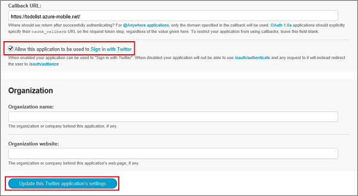

<properties linkid="develop-mobile-how-to-guides-register-for-twitter-authentication" urlDisplayName="Register for Twitter Authentication" pageTitle="Register for Twitter authentication - Mobile Services" metaKeywords="Azure registering application, Azure Twitter authentication, application authenticate, authenticate mobile services, Mobile Services Twitter" description="Learn how to use Twitter authentication with your Azure Mobile Services application." metaCanonical="" services="" documentationCenter="" title="Register your apps for Twitter login with Mobile Services" authors="" solutions="" manager="" editor="" />

Registrazione delle app per l'autenticazione di Twitter con Servizi mobili
==========================================================================

In questo argomento viene illustrato come registrare le proprie app in modo da poter utilizzare Twitter per l'autenticazione con Servizi mobili di Azure.

**Nota**

Per completare la procedura descritta in questo argomento, è necessario disporre di un account Twitter con un indirizzo di posta elettronica verificato. Per creare un nuovo account Twitter, visitare il sito [twitter.com](http://go.microsoft.com/fwlink/p/?LinkID=268287).

1.  Passare al sito Web [Twitter Developers](http://go.microsoft.com/fwlink/p/?LinkId=268300), eseguire l'accesso con le credenziali dell'account Twitter e quindi fare clic su **Create project...**.

	![][1]

2.  Immettere i valori per l'app in **Name**, **Description** e **Web Site**, quindi digitare l'URL del servizio mobile in **Callback URL**.

	![][2]

    > [WACOM.NOTE]Per un servizio mobile back-end .NET pubblicato in Azure tramite Visual Studio, l'URL di reindirizzamento è l'URL del servizio mobile con l'aggiunta del percorso *signin-google*, ovvero il servizio mobile come servizio .NET, ad esempio `https://todolist.azure-mobile.net/signin-twitter`.
    > Il valore **Web Site** è obbligatorio ma non è utilizzato.

3.  Nella parte inferiore della pagina, leggere e accettare le condizioni, digitare le parole CAPTCHA corrette e quindi fare clic su **Create your Twitter application**.

	
	L'app verrà registrata e verranno visualizzati i dettagli dell'applicazione.

1.  Prendere nota dei valori in **Consumer key** e **Consumer secret**.

	![][4]

    **Nota sulla sicurezza**

	Il segreto consumer è un'importante credenziale di sicurezza. Non condividere questo valore con altri né distribuirlo con l'app.

2.  Fare clic sulla scheda **Settings**, scorrere verso il basso e selezionare **Allow this application to be used to sign in with Twitter**, quindi fare clic su **Update this Twitter application's settings**.

	

È ora possibile utilizzare un account di accesso Twitter per l'autenticazione nell'app fornendo i valori di chiave e segreto consumer a Servizi mobili.

<!-- Anchors. -->

<!-- Images. -->
[1]: ./media/mobile-services-how-to-register-twitter-authentication/mobile-services-twitter-developers.png
[2]: ./media/mobile-services-how-to-register-twitter-authentication/mobile-services-twitter-register-app1.png
[3]: ./media/mobile-services-how-to-register-twitter-authentication/mobile-services-twitter-register-app2.png
[4]: ./media/mobile-services-how-to-register-twitter-authentication/mobile-services-twitter-app-details.png
[5]: ./media/mobile-services-how-to-register-twitter-authentication/mobile-services-twitter-register-settings.png

<!-- URLs. -->

[Twitter Developers]: http://go.microsoft.com/fwlink/p/?LinkId=268300
[Get started with authentication]: /it-it/develop/mobile/tutorials/get-started-with-users-dotnet/

[Azure Management Portal]: https://manage.windowsazure.com/