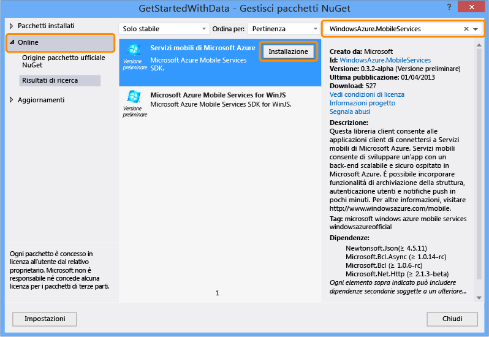
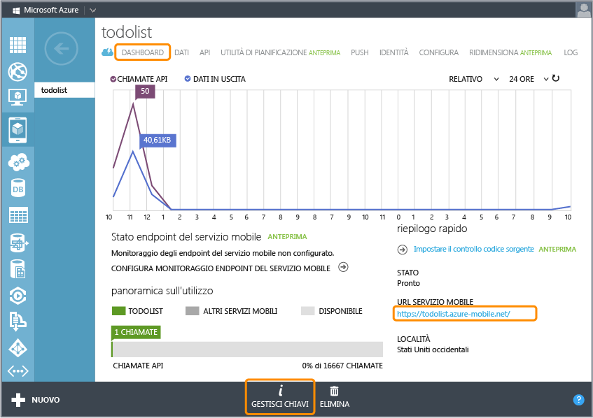

<properties linkid="develop-mobile-tutorials-get-started-with-data-wp8" urlDisplayName="Get Started with Data" pageTitle="Get started with data (WP8) - Azure Mobile Services" metaKeywords="" description="Learn how to get started using data from your Azure Mobile Services Windows Phone 8 app." metaCanonical="" services="" documentationCenter="Mobile" title="Get started with data in Mobile Services" authors="glenga" solutions="" manager="" editor="" />

Introduzione ai dati in Servizi mobili
======================================

[Windows Store C\#](/en-us/develop/mobile/tutorials/get-started-with-data-dotnet "Windows Store C#")[Windows Store JavaScript](/en-us/develop/mobile/tutorials/get-started-with-data-js "Windows Store JavaScript")[Windows Phone](/en-us/develop/mobile/tutorials/get-started-with-data-wp8 "Windows Phone")[iOS](/en-us/develop/mobile/tutorials/get-started-with-data-ios "iOS")[Android](/en-us/develop/mobile/tutorials/get-started-with-data-android "Android")[HTML](/en-us/develop/mobile/tutorials/get-started-with-data-html "HTML")[Xamarin.iOS](/en-us/develop/mobile/tutorials/get-started-with-data-xamarin-ios "Xamarin.iOS")[Xamarin.Android](/en-us/develop/mobile/tutorials/get-started-with-data-xamarin-android "Xamarin.Android")[Back-end .NET](/it-it/documentation/articles/mobile-services-dotnet-backend-windows-phone-get-started-data/ "Back-end .NET") | [Back-end JavaScript](/it-it/documentation/articles/mobile-services-windows-phone-get-started-data/ "Back-end JavaScript")

In questo argomento viene illustrato come utilizzare Servizi mobili di Azure per sfruttare i dati in un'app per Windows Phone 8. In questa esercitazione si scaricherà un'app che archivia dati in memoria, si creerà un nuovo servizio mobile e lo si integrerà con l'app e quindi si effettuerà l'accesso al portale di gestione di Azure per visualizzare le modifiche apportate ai dati durante l'esecuzione dell'app.

[guarda l'esercitazione](http://go.microsoft.com/fwlink/?LinkID=298628) [Riproduci video](http://go.microsoft.com/fwlink/?LinkID=298628) 12:54

**Nota**

In questa esercitazione viene descritto come è possibile utilizzare Servizi mobili di Azure per archiviare e recuperare i dati da un'app per Windows Phone 8 e vengono pertanto riproposte molte delle procedure già completate nella guida introduttiva a Servizi mobili. Se si tratta della prima esperienza con Servizi mobili, è consigliabile iniziare dall'esercitazione [Introduzione a Servizi mobili](/en-us/develop/mobile/tutorials/get-started-wp8).

In questa esercitazione vengono descritte le operazioni di base seguenti:

1.  [Download del progetto dell'app per Windows Phone 8](#download-app)
2.  [Creazione del servizio mobile](#create-service)
3.  [Aggiunta di una tabella dati per l'archiviazione](#add-table)
4.  [Aggiornamento dell'app per l'utilizzo di Servizi mobili](#update-app)
5.  [Test dell'app in Servizi mobili](#test-app)

Per completare questa esercitazione, è necessario disporre di [Windows Phone 8 SDK](http://go.microsoft.com/fwlink/p/?LinkID=268374) in esecuzione in Windows 8.

**Nota**

Per completare questa esercitazione, è necessario disporre di un account Azure in cui sia abilitata la funzionalità Servizi mobili di Azure.

-   Se non si dispone di un account, è possibile creare un account di valutazione gratuita in pochi minuti. Per informazioni dettagliate, vedere la pagina relativa alla [versione di valutazione gratuita di Azure](http://www.windowsazure.com/it-it/pricing/free-trial/?WT.mc_id=A756A2826&returnurl=http%3A%2F%2Fwww.windowsazure.com%2Fen-us%2Fdevelop%2Fmobile%2Ftutorials%2Fget-started-with-data-wp8%2F).

Download del progettoDownload del progetto GetStartedWithData
-------------------------------------------------------------

Questa esercitazione è basata sull'[app GetStartedWithData](http://go.microsoft.com/fwlink/p/?LinkId=271146) che è un'app per Windows Phone 8. L'interfaccia utente di questa app è identica a quella dell'app generata dalla guida introduttiva di Servizi mobili, ma in questo caso gli elementi aggiunti vengono archiviati nella memoria locale.

1.  Scaricare l'app di esempio GetStartedWithData dal [sito degli esempi di codice di Developer Network](http://go.microsoft.com/fwlink/p/?LinkId=271146).

2.  In Visual Studio 2012 Express per Windows Phone 8 aprire il progetto scaricato ed esaminare il file MainPage.xaml.cs.

   Si noti che gli oggetti **TodoItem** aggiunti sono archiviati in un oggetto **ObservableCollection<TodoItem>** in memoria.

3.  Premere **F5** per ricompilare il progetto e avviare l'app.

4.  Nell'app digitare un testo nella casella di testo e quindi fare clic sul pulsante **Save**.

    

    Si noti che il testo salvato è visualizzato nell'elenco riportato di seguito.

Creazione del servizio mobileCreazione di un nuovo servizio mobile nel portale di gestione
------------------------------------------------------------------------------------------

[WACOM.INCLUDE [mobile-services-create-new-service-data](../includes/mobile-services-create-new-service-data.md)]

Aggiunta di una nuova tabellaAggiunta di una nuova tabella al servizio mobile
-----------------------------------------------------------------------------

[WACOM.INCLUDE [mobile-services-create-new-service-data-2](../includes/mobile-services-create-new-service-data-2.md)]

Aggiornamento dell'appAggiornamento dell'app per l'utilizzo del servizio mobile per l'accesso ai dati
-----------------------------------------------------------------------------------------------------

Ora che il servizio mobile è pronto, è possibile aggiornare l'app in modo che gli elementi vengano archiviati in Servizi mobili anziché nella raccolta locale.

1.  In **Esplora soluzioni** in Visual Studio fare clic con il pulsante destro del mouse sul nome del progetto e quindi scegliere **Manage NuGet Packages**.

2.  Nel riquadro sinistro selezionare la categoria **Online**, cercare `WindowsAzure.MobileServices`, fare clic su **Installa** nel pacchetto di **Servizi mobili di Azure**, quindi accettare il contratto di licenza.

    

   La libreria client per i servizi di Servizi mobili verrà aggiunta al progetto.

1.  Nel portale di gestione fare clic su **Mobile Services** e quindi sul servizio mobile appena creato.

2.  Fare clic sulla scheda **Dashboard** e prendere nota del valore di **Site URL**, quindi fare clic su **Manage keys** e prendere nota del valore di **Application key**.

     

   Questi valori sono necessari per accedere al servizio mobile dal codice dell'app.

1.  In Visual Studio aprire il file App.xaml.cs e aggiungere o rimuovere i simboli di commento dall'istruzione `using` seguente:

         using Microsoft.WindowsAzure.MobileServices;

2.  Nello stesso file, rimuovere i simboli di commento dal codice che definisce la variabile **MobileService** e specificare l'URL e la chiave dell'applicazione indicati nel servizio mobile nel costruttore **MobileServiceClient**, senza modificare l'ordine.

         //public static MobileServiceClient MobileService = new MobileServiceClient( 
         //    "AppUrl", 
         //    "AppKey" 
         //); 

    Verrà creata una nuova istanza di **MobileServiceClient** utilizzata per accedere al servizio mobile.

1.  Nel file MainPage.xaml.cs aggiungere o rimuovere i simboli di commento dalle istruzioni `using` seguenti:

         using Microsoft.WindowsAzure.MobileServices;
         using Newtonsoft.Json;

2.  Nello stesso file sostituire la definizione della classe **TodoItem** con il codice seguente:

         public class TodoItem
         {
             public string Id { get; set; }

             [JsonProperty(PropertyName = "text")]
             public string Text { get; set; }

             [JsonProperty(PropertyName = "complete")]
             public bool Complete { get; set; }
         }

3.  Aggiungere i simboli di commento alla riga che definisce la raccolta **items** esistente, quindi rimuovere i simboli di commento dalle righe seguenti:

         private MobileServiceCollection<TodoItem, TodoItem> items;
         private IMobileServiceTable<TodoItem> todoTable = 
             App.MobileService.GetTable<TodoItem>();

     Questo codice consente di creare una raccolta di associazione compatibile con Servizi mobili (**items**) e una classe proxy per la tabella di database SQL **TodoItem** (**todoTable**). 

4.  Nel metodo **InsertTodoItem** rimuovere la riga di codice per l'impostazione della proprietà **TodoItem**.**Id**, aggiungere il modificatore **async** al metodo e rimuovere i simboli di commento dalla riga di codice seguente:

         await todoTable.InsertAsync(todoItem);

    Questo codice consente di inserire un nuovo elemento nella tabella.

1.  Nel metodo **RefreshTodoItems** aggiungere il modificatore **async** al metodo, quindi rimuovere i simboli di commento dalla riga di codice seguente:

         items = await todoTable.ToCollectionAsync();

     In questo modo verrà impostata l'associazione alla raccolta di elementi in todoTable, che contiene tutti gli oggetti TodoItem restituiti dal servizio mobile. 

2.  Nel metodo **UpdateCheckedTodoItem** aggiungere il modificatore **async** al metodo, quindi rimuovere i simboli di commento dalla riga di codice seguente:

          await todoTable.UpdateAsync(item);

    In questo modo un aggiornamento dell'elemento verrà inviato al servizio mobile.

Una volta aggiornata l'app per consentire l'utilizzo di Servizi mobili per l'archiviazione back-end, è possibile verificarne il funzionamento in Servizi mobili.

Test dell'appTest dell'app nel nuovo servizio mobile
----------------------------------------------------

1.  In Visual Studio premere F5 per eseguire l'app.

2.  Come in precedenza, digitare un testo nella casella di testo e quindi fare clic sul pulsante **Save**.

        Un nuovo elemento verrà inviato come inserimento al servizio mobile.

3.  Nel [portale di gestione](https://manage.windowsazure.com/) fare clic su **Mobile Services** e quindi sul servizio mobile.

4.  Fare clic sulla scheda **Data** e quindi su **Browse**.

   
          
   Si noti che la tabella **TodoItem** ora contiene dati, con valori ID generati da Servizi mobili, e che alla tabella sono state aggiunte automaticamente colonne per garantire la corrispondenza con la classe TodoItem nell'app.

L'esercitazione **Introduzione ai dati** per Windows Phone 8 è terminata.

Passaggi successivi
-------------------

In questa esercitazione vengono illustrate le nozioni di base per consentire a un'app per Windows Phone 8 di utilizzare dati in Servizi mobili. In seguito, è consigliabile eseguire l'esercitazione seguente, basata sull'app GetStartedWithData creata in questa esercitazione:

-   [Utilizzo di script per la convalida e la modifica di dati](/en-us/develop/mobile/tutorials/validate-modify-and-augment-data-wp8)
    
    Ulteriori informazioni sull'utilizzo di script del server in Servizi mobili per convalidare e modificare i dati inviati dall'app.

-   [Utilizzo del paging per ridefinire le query](/en-us/develop/mobile/tutorials/add-paging-to-data-wp8)
    
    Ulteriori informazioni su come utilizzare il paging nelle query per controllare la quantità di dati gestiti in un'unica richiesta.

Una volta completata la serie relativa ai dati, è possibile provare a eseguire una delle esercitazioni per Windows Phone 8 seguenti:

-   [Introduzione all'autenticazione](/en-us/develop/mobile/tutorials/get-started-with-users-wp8)
    
    Informazioni sull'autenticazione degli utenti dell'app.

-   [Introduzione alle notifiche push](/en-us/develop/mobile/tutorials/get-started-with-push-wp8)
    
    Informazioni sull'invio di una notifica push di base all'app con Servizi mobili.

