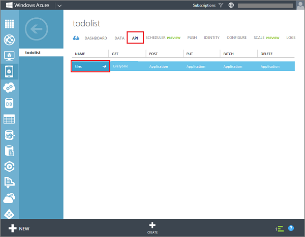

<properties linkid="develop-mobile-tutorials-create-pull-notifications-js" urlDisplayName="Define a custom API that supports pull notifications" pageTitle="Define a custom API that supports pull notifications - Azure Mobile Services" metaKeywords="" description="Learn how to Define a custom API that supports periodic notifications in Windows Store apps that use Azure Mobile Services." metaCanonical="" services="" documentationCenter="" title="Define a custom API that supports periodic notifications" authors="glenga" solutions="" manager="" editor="" />

Definizione di un'API personalizzata che supporta le notifiche periodiche
=========================================================================

[Windows Store C\#](/en-us/develop/mobile/tutorials/create-pull-notifications-dotnet "Windows Store C#")[Windows Store JavaScript](/en-us/develop/mobile/tutorials/create-pull-notifications-js "Windows Store JavaScript")

In questo argomento viene illustrato come utilizzare un'API personalizzata che supporta le notifiche periodiche in un'app di Windows Store. Se le notifiche periodiche sono abilitate, Windows accederà periodicamente all'endpoint dell'API personalizzata e utilizzerà il file XML restituito, in un formato specifico del riquadro, per aggiornare il riquadro dell'app nel menu Start. Per ulteriori informazioni, vedere [Notifiche periodiche](http://msdn.microsoft.com/en-us/library/windows/apps/jj150587.aspx).

Questa funzionalità verrà aggiunta all'app creata durante l'esercitazione [Introduzione a Servizi mobili](/en-us/develop/mobile/tutorials/get-started/#create-new-service) o [Introduzione ai dati](/en-us/develop/mobile/tutorials/started-with-data-js). A questo scopo, verranno eseguiti i passaggi seguenti:

1.  [Definizione dell'API personalizzata](#define-custom-api)
2.  [Aggiornamento dell'app per l'abilitazione delle notifiche periodiche](#update-app)
3.  [Test dell'app](#test-app)

Questa esercitazione è basata sul progetto di guida introduttiva per Servizi mobili. Prima di iniziare questa esercitazione, è necessario completare le procedure illustrate in [Introduzione a Servizi mobili](/en-us/develop/mobile/tutorials/get-started/#create-new-service) o [Introduzione ai dati](/en-us/develop/mobile/tutorials/started-with-data-js).

Definizione dell'API personalizzata
-----------------------------------

1.  Accedere al [portale di gestione di Azure](https://manage.windowsazure.com/), fare clic su **Mobile Services** e quindi sull'app.

   	![][0]

2.  Fare clic sulla scheda **API** e quindi su **Create a custom API**.

   	![][1]

   	Verrà visualizzata la finestra di dialogo **Create a new custom API**.

3.  Impostare **Get permission** su **Everyone**, digitare *tiles* in **API name**, quindi fare clic sul segno di spunta.

   	![][2]

   	Verrà creata la nuova API con accesso GET pubblico.

4.  Fare clic sulla nuova voce tiles nella tabella dell'API.

    

5.  Fare clic sulla scheda **Script** e sostituire il codice esistente con quello riportato di seguito:

         exports.get = function(request, response) {
             var wns = require('wns');
             var todoItems = request.service.tables.getTable('TodoItem');
             todoItems.where({
                 complete: false
             }).read({
                 success: sendResponse
             });
            
             function sendResponse(results) {
                 var tileText = {
                     text1: "My todo list"
                 };
                 var i = 0;
                 console.log(results)
                 results.forEach(function(item) {
                     tileText["text" + (i + 2)] = item.text;
                     i++;
                 });
                 var xml = wns.createTileSquareText01(tileText);
                 response.set('content-type', 'application/xml');
                 response.send(200, xml);
             }
         };

    Questo codice restituisce le prime tre voci non completate dalla tabella TodoItem, quindi le carica in un oggetto JSON passato alla funzione **wns**.**createTileSquareText01**. Questa funzione restituisce l'XML del modello di riquadro seguente:

         <tile>
             <visual>
                 <binding template="TileSquareText01">
                     <text id="1">My todo list</text>
                     <text id="2">Task 1</text>
                     <text id="3">Task 2</text>
                     <text id="4">Task 3</text>
                 </binding>
             </visual>
         </tile>

    Viene utilizzata la funzione **exports.get** in quanto il client invierà una richiesta GET per accedere al modello di riquadro.

   	
<b>Nota</b>
            
Lo script di questa API personalizzata utilizza il <a href="http://go.microsoft.com/fwlink/p/
            LinkId=306750">modulo wns</a> di Node.js, al quale viene fatto riferimento utilizzando la funzione <strong>require</strong>. Questo modulo è diverso rispetto all'<a href="http://go.microsoft.com/fwlink/p/
            LinkId=260591">oggetto wns</a> restituito dall'<a href="http://msdn.microsoft.com/en-us/library/windowsazure/jj554217.aspx">oggetto push</a>, che viene utilizzato per l'invio di notifiche push da script del server.

   	

Si procederà quindi alla modifica dell'app di guida introduttiva per avviare notifiche periodiche che aggiornano il riquadro animato richiedendo la nuova API personalizzata.

Aggiornamento dell'app Aggiornamento dell'app per l'abilitazione delle notifiche periodiche
-------------------------------------------------------------------------------------------

1.  In Visual Studio premere F5 per eseguire l'app di guida introduttiva creata nell'esercitazione precedente.

2.  Verificare che sia visualizzata almeno una voce. Se non sono presenti voci, digitare un testo in **Insert a TodoItem**, quindi fare clic su **Save**.

3.  In Visual Studio espandere la cartella `\js` in Esplora soluzioni, aprire il progetto default.js e quindi aggiungere le righe di codice seguenti dopo il codice che definisce la variabile **client**:

         var notifications = Windows.UI.Notifications;
         var recurrence = notifications.PeriodicUpdateRecurrence.hour;
         var url = new Windows.Foundation.Uri(client.applicationUrl, "/api/tiles");

         notifications.TileUpdateManager.createTileUpdaterForApplication().startPeriodicUpdate(url, recurrence);

    Questo codice consente di attivare le notifiche periodiche per richiedere i dati del modello di riquadro dalla nuova API personalizzata **tiles**. Selezionare il valore di [PeriodicUpdateRecurrance] più adatto alla frequenza di aggiornamento dei dati desiderata.

Test dell'app
-------------

1.  In Visual Studio premere F5 per eseguire di nuovo l'app.

    Verranno abilitate le notifiche periodiche.

2.  Passare alla schermata Start, individuare il riquadro animato per l'app e osservare che i dati dell'elemento sono ora visualizzati nel riquadro.

   	

Passaggi successivi
-------------------

Dopo avere creato una notifica periodica, per ulteriori informazioni vedere anche gli articoli relativi a Servizi mobili seguenti:

-   [Introduzione alle notifiche push](/en-us/develop/mobile/tutorials/get-started-with-push-js)
    Le notifiche periodiche sono gestite da Windows e vengono inviate solo in base a una pianificazione predefinita. Le notifiche push possono essere inviate dal servizio mobile su richiesta e possono essere di tipo avviso popup, riquadro e notifiche non elaborate.

-   [Riferimento per gli script del server di Servizi mobili](http://go.microsoft.com/fwlink/?LinkId=262293)
    Ulteriori informazioni sulla creazione di API personalizzate.

<!-- Images. -->
[0]: ./media/mobile-services-windows-store-javascript-create-pull-notifications/mobile-services-selection.png
[1]: ./media/mobile-services-windows-store-javascript-create-pull-notifications/mobile-custom-api-create.png
[2]: ./media/mobile-services-windows-store-javascript-create-pull-notifications/mobile-custom-api-create-dialog.png
[3]: ./media/mobile-services-windows-store-javascript-create-pull-notifications/mobile-custom-api-select.png
[4]: ./media/mobile-services-windows-store-javascript-create-pull-notifications/mobile-custom-api-live-tile.png
