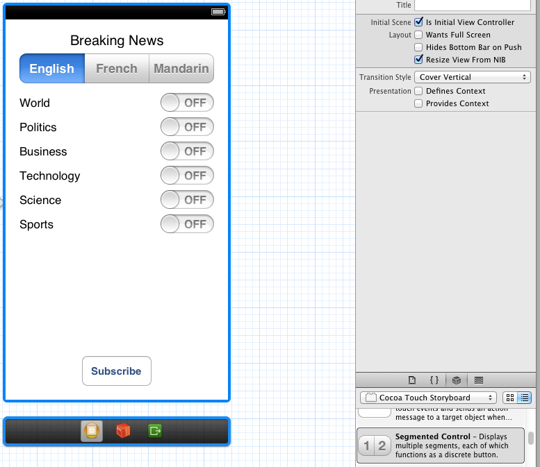
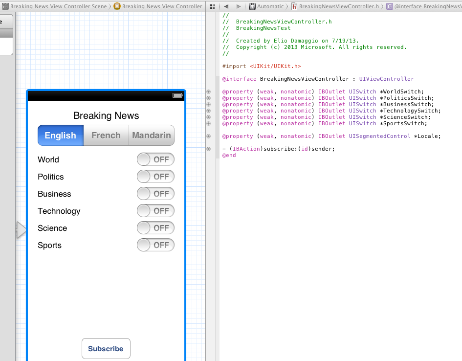

<properties linkid="develop-notificationhubs-tutorials-send-localized-breaking-news-iOS" urlDisplayName="Localized Breaking News" pageTitle="Notification Hubs Localized Breaking News Tutorial for iOS" metaKeywords="" description="Learn how to use Azure Service Bus Notification Hubs to send localized breaking news notifications (iOS)." metaCanonical="" services="mobile-services,notification-hubs" documentationCenter="" title="Use Notification Hubs to send localized breaking news to iOS devices" authors="ricksal" solutions="" manager="" editor="" />

Utilizzo di Hub di notifica per inviare notizie localizzate ai dispositivi iOS
==============================================================================

[Windows Store C\#](/en-us/manage/services/notification-hubs/breaking-news-localized-dotnet "Windows Store C#")[iOS](/en-us/manage/services/notification-hubs/breaking-news-localized-ios "iOS")

In questo argomento viene illustrato come utilizzare la funzionalità relativa ai **modelli** di Hub di notifica di Azure per trasmettere notifiche relative alle ultime notizie localizzate in base alla lingua e al dispositivo. In questa esercitazione verrà utilizzata l'app di Windows Store creata in [Utilizzo di Hub di notifica per inviare le ultime notizie](/en-us/manage/services/notification-hubs/breaking-news-ios). Al termine, sarà possibile effettuare la registrazione per le categorie di proprio interesse, specificare la lingua in cui ricevere le notifiche e ricevere solo notifiche push per le categorie selezionate nella lingua scelta.

In questa esercitazione vengono descritte le operazioni di base per abilitare questo scenario:

1.  [Concetti relativi ai modelli](#concepts)
2.  [Interfaccia utente dell'app](#ui)
3.  [Compilazione dell'app per iOS](#building-client)
4.  [Invio di notifiche dal back-end](#send)

Lo scenario è composto da due parti:

-   l'app per iOS consente ai dispositivi client di specificare una lingua e di sottoscrivere categorie diverse di ultime notizie;

-   il back-end trasmette le notifiche utilizzando le funzionalità relative ai **tag** e ai **modelli** di Hub di notifica di Azure.

Prerequisiti
------------

È necessario aver completato l'esercitazione [Utilizzo di Hub di notifica per inviare le e ultime notizie](/en-us/manage/services/notification-hubs/breaking-news-ios) e disporre del relativo codice, in quanto questa esercitazione è basata direttamente su tale codice.

È inoltre necessario disporre di Visual Studio 2012.

concettiConcetti relativi ai modelli
------------------------------------

In [Utilizzo di Hub di notifica per inviare le ultime notizie](/en-us/manage/services/notification-hubs/breaking-news-ios) è stata creata un'app che utilizza i **tag** per sottoscrivere le notifiche per diverse categorie di notizie. Molte app, tuttavia, sono destinate a più mercati ed è necessario localizzarle. Questo significa che il contenuto delle notifiche deve essere localizzato e inviato al set di dispositivi corretto. In questo argomento verrà illustrato come utilizzare la funzionalità relativa ai **modelli** di Hub di notifica per inviare facilmente notifiche relative alle ultime notizie localizzate.

Nota: un possibile modo per inviare notifiche localizzate consiste nel creare più versioni di ogni tag. Per supportare l'inglese, il francese e il mandarino, ad esempio, sono necessari tre tag diversi per le ultime notizie internazionali: "world\_en", "world\_fr" e "world\_ch". È quindi necessario inviare una versione localizzata delle ultime notizie internazionali a ogni tag. In questo argomento verranno utilizzati i modelli per evitare la proliferazione di tag e la necessità di inviare più messaggi.

In linea generale, i modelli consentono di specificare in che modo uno specifico dispositivo deve ricevere una notifica. Il modello definisce lo specifico formato di payload da utilizzare, facendo riferimento alle proprietà del messaggio inviato dal back-end dell'app. In questo caso verrà inviato un messaggio indipendente dalle impostazioni locali, che contiene tutte le lingue supportate:

    {
        "News_English": "...",
        "News_French": "...",
        "News_Mandarin": "..."
    }

Si procederà quindi a verificare che i dispositivi effettuino la registrazione con un modello che faccia riferimento alla proprietà corretta. Per un'app per iOS che deve essere registrata per le notizie in francese, ad esempio, si effettuerà la registrazione nel modo seguente:

    {
        aps:{
            alert: "$(News_French)"
        }
    }

I modelli rappresentano uno strumento particolarmente efficace. Per ulteriori informazioni, vedere l'articolo relativo alle [linee guida su Hub di notifica](http://msdn.microsoft.com/it-it/library/jj927170.aspx). Un riferimento al linguaggio di espressione dei modelli è disponibile in [Procedura: Hub notifiche di Service Bus (app per iOS)](http://msdn.microsoft.com/it-it/library/jj927168.aspx).

Interfaccia utente dell'appInterfaccia utente dell'app
------------------------------------------------------

L'app Breaking News creata nell'argomento [Utilizzo di Hub di notifica per inviare le ultime notizie](/en-us/manage/services/notification-hubs/breaking-news-ios) verrà ora modificata in modo da inviare notizie localizzate utilizzando modelli.

In MainStoryboard\_iPhone.storyboard, un controllo Segmented con le tre lingue supportate: inglese, francese e mandarino.

Assicurarsi quindi di aggiungere un elemento IBOutlet in ViewController.h come illustrato di seguito:

Interfaccia utente appCompilazione dell'app per iOS
---------------------------------------------------

Per adattare le app client alla ricezione di messaggi localizzati è necessario sostituire le registrazioni *native*, ovvero prive di modello, con registrazioni modello.

1.  In Notification.h aggiungere il metodo *retrieveLocale*, quindi modificare i metodi store e subscribe come illustrato di seguito:

         - (void) storeCategoriesAndSubscribeWithLocale:(int) locale categories:(NSSet*) categories completion: (void (^)(NSError* error))completion;

         - (void) subscribeWithLocale:(int) locale categories:(NSSet*) categories completion:(void (^)(NSError *))completion;
            
         - (NSSet*) retrieveCategories;
            
         - (int) retrieveLocale;

    In Notification.m modificare il metodo *storeCategoriesAndSubscribe* aggiungendo il parametro relativo alle impostazioni locali e archiviandolo nelle impostazioni predefinite dell'utente:

         - (void) storeCategoriesAndSubscribeWithLocale:(int) locale categories:(NSSet *)categories completion:(void (^)(NSError *))completion {
             NSUserDefaults* defaults = [NSUserDefaults standardUserDefaults];
             [defaults setValue:[categories allObjects] forKey:@"BreakingNewsCategories"];
             [defaults setInteger:locale forKey:@"BreakingNewsLocale"];
             [defaults synchronize];
                
             [self subscribeWithLocale: locale categories:categories completion:completion];
         }

    Modificare quindi il metodo *subscribe* in modo da includere le impostazioni locali:

         - (void) subscribeWithLocale: (int) locale categories:(NSSet *)categories completion:(void (^)(NSError *))completion{
             SBNotificationHub* hub = [[SBNotificationHub alloc] initWithConnectionString:@"<connection string>" notificationHubPath:@"<hub name>"];
                
             NSString* localeString;
             switch (locale) {
                 case 0:
                     localeString = @"English";
                     break;
                 case 1:
                     localeString = @"French";
                     break;
                 case 2:
                     localeString = @"Mandarin";
                     break;
             }
                
             NSString* template = [NSString stringWithFormat:@"{\"aps\":{\"alert\":\"$(News_%@)\"},\"inAppMessage\":\"$(News_%@)\"}", localeString, localeString];
                
             [hub registerTemplateWithDeviceToken:self.deviceToken name:@"newsTemplate" jsonBodyTemplate:template expiryTemplate:@"0" tags:categories completion:completion];
         }

    Si noti che si sta ora utilizzando il metodo *registerTemplateWithDeviceToken* anziché *registerNativeWithDeviceToken*. Quando si effettua la registrazione per un modello, è necessario fornire il modello json e un nome per il modello. Questo perché l'app potrebbe richiedere la registrazione di modelli diversi. Assicurarsi di registrare le categorie come tag, poiché è necessario ricevere notifiche per le notizie.

    Aggiungere infine un metodo per recuperare le impostazioni locali dalle impostazioni predefinite dell'utente:

         - (int) retrieveLocale {
             NSUserDefaults* defaults = [NSUserDefaults standardUserDefaults];
                
             int locale = [defaults integerForKey:@"BreakingNewsLocale"];
                
             return locale < 0?0:locale;
          }

2.  Ora che è stata modificata la classe Notifications, è necessario assicurarsi che ViewController utilizzi il nuovo UISegmentControl. Aggiungere la riga seguente nel metodo *viewDidLoad* per assicurarsi che vengano mostrate le impostazioni locali attualmente selezionate:

         self.Locale.selectedSegmentIndex = [notifications retrieveLocale];

    Nel metodo *subscribe* modificare quindi la chiamata a *storeCategoriesAndSubscribe* come segue:

         [notifications storeCategoriesAndSubscribeWithLocale: self.Locale.selectedSegmentIndex categories:[NSSet setWithArray:categories] completion: ^(NSError* error) {
             if (!error) {
                 UIAlertView *alert = [[UIAlertView alloc] initWithTitle:@"Notification" message:
                                       @"Subscribed!" delegate:nil cancelButtonTitle:
                                       @"OK" otherButtonTitles:nil, nil];
                 [alert show];
             } else {
                 NSLog(@"Error subscribing: %@", error);
             }
         }];

3.  Aggiornare infine il metodo *didRegisterForRemoteNotificationsWithDeviceToken* in AppDelegate.m, affinché sia possibile aggiornare correttamente la registrazione all'avvio dell'applicazione. Modificare la chiamata al metodo *subscribe* delle notifiche come segue:

         NSSet* categories = [notifications retrieveCategories];
         int locale = [notifications retrieveLocale];
         [notifications subscribeWithLocale: locale categories:categories completion:^(NSError* error) {
             if (error != nil) {
                 NSLog(@"Error registering for notifications: %@", error);
             }
         }];

Invio di notifiche localizzateInvio di notifiche localizzate dal back-end
-------------------------------------------------------------------------

[WACOM.INCLUDE [notification-hubs-localized-back-end](../includes/notification-hubs-localized-back-end.md)]

Passaggi successivi
-------------------

Per ulteriori informazioni sull'utilizzo dei modelli, vedere:

-   [Utilizzo di Hub di notifica per inviare notifiche agli utenti: ASP.NET](/en-us/manage/services/notification-hubs/notify-users-aspnet)
-   [Utilizzo di Hub di notifica per inviare notifiche agli utenti: Servizi mobili](/en-us/manage/services/notification-hubs/notify-users)
-   [Linee guida su Hub di notifica](http://msdn.microsoft.com/it-it/library/jj927170.aspx)

In [Procedure di Hub di notifica per iOS](http://msdn.microsoft.com/it-it/library/jj927168.aspx) è disponibile un riferimento al linguaggio di espressione dei modelli.

<!-- Anchors. -->
[Template concepts]: #concepts
[The app user interface]: #ui
[Building the iOS app]: #building-client
[Send notifications from your back-end]: #send
[Next Steps]: #next-steps

<!-- Images. -->

[13]: ./media/notification-hubs-ios-send-localized-breaking-news/ios_localized1.png
[14]: ./media/notification-hubs-ios-send-localized-breaking-news/ios_localized2.png

<!-- URLs. -->
[How To: Service Bus Notification Hubs (iOS Apps)]: http://msdn.microsoft.com/it-it/library/jj927168.aspx
[Use Notification Hubs to send breaking news]: /en-us/manage/services/notification-hubs/breaking-news-ios
[Mobile Service]: /en-us/develop/mobile/tutorials/get-started
[Notify users with Notification Hubs: ASP.NET]: /en-us/manage/services/notification-hubs/notify-users-aspnet
[Notify users with Notification Hubs: Mobile Services]: /en-us/manage/services/notification-hubs/notify-users
[Submit an app page]: http://go.microsoft.com/fwlink/p/?LinkID=266582
[My Applications]: http://go.microsoft.com/fwlink/p/?LinkId=262039
[Live SDK for Windows]: http://go.microsoft.com/fwlink/p/?LinkId=262253
[Get started with Mobile Services]: /en-us/develop/mobile/tutorials/get-started/#create-new-service
[Get started with data]: /en-us/develop/mobile/tutorials/get-started-with-data-ios
[Get started with authentication]: /en-us/develop/mobile/tutorials/get-started-with-users-ios
[Get started with push notifications]: /en-us/develop/mobile/tutorials/get-started-with-push-ios
[Push notifications to app users]: /en-us/develop/mobile/tutorials/push-notifications-to-users-ios
[Authorize users with scripts]: /en-us/develop/mobile/tutorials/authorize-users-in-scripts-ios
[JavaScript and HTML]: /en-us/develop/mobile/tutorials/get-started-with-push-js.md

[Azure Management Portal]: https://manage.windowsazure.com/
[Windows Developer Preview registration steps for Mobile Services]: ../HowTo/mobile-services-windows-developer-preview-registration.md
[wns object]: http://go.microsoft.com/fwlink/p/?LinkId=260591
[Notification Hubs Guidance]: http://msdn.microsoft.com/it-it/library/jj927170.aspx
[Notification Hubs How-To for iOS]: http://msdn.microsoft.com/it-it/library/jj927168.aspx
