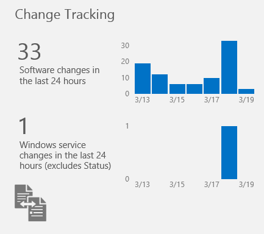

<properties 
   pageTitle="Identificare le differenze con la funzionalità di rilevamento modifiche"
   description="È possibile usare l'Intelligence Pack Configuration Change Tracking in Microsoft Azure Operational Insights per identificare facilmente le modifiche apportate al software e ai servizi Windows nel proprio ambiente."
   services="operational-insights"
   documentationCenter=""
   authors="bandersmsft"
   manager="jwhit"
   editor="tysonn" />
<tags 
   ms.service="operational-insights"
   ms.devlang="na"
   ms.topic="article"
   ms.tgt_pltfrm="na"
   ms.workload="na"
   ms.date="03/20/2015"
   ms.author="banders" />

# Identificare le differenze con la funzionalità di rilevamento modifiche

È possibile usare l'Intelligence Pack per il rilevamento delle modifiche di configurazione in Microsoft Azure Operational Insights per identificare facilmente le modifiche apportate al software e ai servizi Windows nel proprio ambiente. Questa funzionalità può semplificare l'individuazione dei problemi operativi.

Installare l'Intelligence Pack per aggiornare l'agente Operations Manager e il modulo di configurazione di base per Operational Insights. Le modifiche al software installato e ai servizi Windows nei server monitorati vengono lette e i dati vengono inviati al servizio Operational Insights nel cloud per l'elaborazione. Viene applicata la logica ai dati ricevuti, quindi questi ultimi vengono registrati nel servizio cloud. I server in cui vengono rilevate le modifiche vengono visualizzati nel dashboard Rilevamento modifiche. Usando le informazioni nel dashboard Change Tracking, è possibile visualizzare facilmente le modifiche apportate all'infrastruttura del server.

## Uso di Change Tracking

Prima di poter usare Change Tracking in Operational Insights, è necessario avere installato l'Intelligence Pack. Per altre informazioni sull'installazione di Intelligence Pack, vedere [Usare la raccolta per aggiungere o rimuovere Intelligence Pack](operational-insights-add-intelligence-packs.md). 

Dopo l'installazione, è possibile visualizzare il riepilogo delle modifiche relative ai server monitorati tramite il riquadro **Change Tracking** nella pagina **Overview** in Operational Insights. 

È possibile vedere le modifiche all'infrastruttura e quindi analizzare i dettagli per le categorie seguenti:

- Modifiche per tipo di configurazione per i servizi software e di Windows.

- Modifiche software ad applicazioni e aggiornamenti per singoli server.

- Numero totale di modifiche software per ogni applicazione.

- Modifiche dei servizi di Windows per singoli server.

### Per visualizzare le modifiche di qualsiasi tipo

1. Nella pagina **Overview** fare clic sul riquadro **Change Tracking**.

2. Nel dashboard **Change Tracking** esaminare le informazioni di riepilogo in uno dei pannelli dei tipi di modifiche e quindi fare clic su un tipo per visualizzare le relative informazioni dettagliate nella pagina **Search**.

3. In una pagina di ricerca qualsiasi è possibile visualizzare i risultati in base all'ora, ai dettagli e alla cronologia di ricerca. È anche possibile filtrare per facet in modo da limitare i risultati.

4. In una pagina di ricerca qualsiasi è possibile **esportare** i dettagli dei risultati in un file con estensione CSV, che può essere aperto in Excel o in un'altra applicazione per la visualizzazione o la modifica.

<!--HONumber=52-->