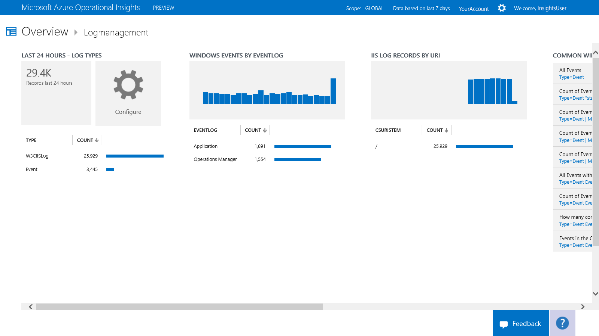

<properties 
   pageTitle="Come usare Log Management" 
   description="Log Management in Microsoft Azure Operational Insights permette di visualizzare gli eventi del log raccolti dai server monitorati." 
   services="operational-insights" 
   documentationCenter="" 
   authors="bandersmsft" 
   manager="jwhit" 
   editor=""/>

<tags
   ms.service="operational-insights"
   ms.devlang="na"
   ms.topic="article"
   ms.tgt_pltfrm="na"
   ms.workload="operational-insights" 
   ms.date="03/20/2015"
   ms.author="banders"/>

# Usare Log Management 

Prima di poter usare Log Management in Microsoft Azure Operational Insights, è necessario disporre dell'Intelligence Pack installato. Poiché questo Intelligence Pack deve essere configurato e non raccoglie alcun elemento per impostazione predefinita, viene abilitato per impostazione predefinita in ogni nuova area di lavoro. Se è stato rimosso, è possibile aggiungerlo di nuovo dalla Intelligence Packs Gallery. Vedere [Usare la raccolta per aggiungere o rimuovere Intelligence Pack](operational-insights-add-intelligence-packs.md). 

È possibile aggiungere nuovi log per raccogliere eventi e scegliere i livelli o la gravità degli eventi da raccogliere per i log.
Dopo la configurazione di Log Management, verranno applicati i criteri di raccolta e verrà avviata la raccolta di eventi.
È possibile accedere ad alcuni elenchi dettagliati iniziali degli eventi dei log raccolti dai server monitorati tramite il riquadro **Log Management** nella pagina **Overview** in Operational Insights. 

Il riquadro apre la pagina **Log Management**, in cui è possibile visualizzare un riepilogo degli eventi contenuti nei log.
In alternativa, è possibile usare direttamente la ricerca, come per tutti gli altri tipi di dati.

Questa pagina include informazioni dettagliate sulle categorie seguenti:

- Registri eventi di Windows
- Log di IIS
- Altri log aggiunti

## Formato di file dei log di IIS

L'unico formato di log di IIS supportato attualmente è W3C. Si tratta tuttavia del formato più comune ed è il formato predefinito in IIS 7 e IIS 8. Se si accede a NCSA o si usa il formato nativo di IIS, Operational Insights non rileverà quindi tali log. Anche se si usa il formato W3C, non tutti i campi vengono registrati per impostazione predefinita. Per altre informazioni su questo formato, vedere [Selezionare i campi W3C da registrare (IIS 7)](https://technet.microsoft.com/library/cc754702(v=WS.10).aspx). 

> [AZURE.TIP] Per assicurare un'esperienza di ricerca ottimale, è consigliabile selezionare la registrazione di tutti i campi per ogni sito Web usando **Registrazione** in IIS. È anche consigliabile cambiare la pianificazione **Aggiornamento file di registro** per i nuovi log e impostarla su **Ogni ora**, in modo che i file più piccoli vengano caricati sul cloud, risparmiando larghezza di banda.

## Raccogliere registri eventi di Windows da Operations Manager o dagli agenti connessi direttamente

1. Nella pagina **Overview** fare clic sul riquadro **Log Management**. 

2. Nel dashboard **Log Management** fare clic sul riquadro **Configure**.
 
3. Digitare il nome del registro eventi da cui si vogliono raccogliere informazioni. In caso di dubbi sul nome da usare, selezionare le proprietà del registro eventi di Windows nel **Visualizzatore eventi**, copiare il nome nel campo **NomeCompleto**, quindi incollarlo nella casella **Collect events from the following Event Logs**.

4. Fare clic su **+** per aggiungere il log.

5. Selezionare i livelli o le gravità degli eventi da raccogliere per il log. **Gli eventi Controllo riuscito** e **Controllo non riuscito** non sono supportati in questa versione.

6. Ripetere i passaggi precedenti per ogni log da cui si vogliono raccogliere informazioni, quindi fare clic su **Save**.

7. Gli eventi dovrebbero essere visualizzati in Operational Insights entro pochi minuti e sarà quindi possibile eseguire ricerche nei dati. 

## Per raccogliere i log di IIS da Operations Manager o dagli agenti connessi direttamente

1. Nella pagina **Overview** fare clic sul riquadro **Log Management**. 

2. Nel dashboard **Log Management** fare clic sul riquadro **Configure**.
 
3. In **IIS LOGS** selezionare **Collect logs from Operations Manager**.

## Raccogliere log di IIS e/o eventi di Windows da Diagnostica di Azure
Questa opzione è configurabile dal portale di gestione di Azure, non dal portale di Operational Insights. Nella propria area di lavoro passare alla scheda **Archiviazione** e abilitare la raccolta di log da quell'account di archiviazione.

## Usare i file di log
 
1. Nella pagina **Overview** fare clic sul riquadro **Log Management**.

2. Nel dashboard **Log Management** visualizzare i registi eventi e scegliere quello da usare.
  
3. Fare clic su qualsiasi elemento per visualizzare le informazioni dettagliate corrispondenti nella pagina **Search**.

4. È possibile eseguire ricerche aggiuntive sui risultati iniziali, quindi analizzare i log correlati.

 
# Risorse aggiuntive
- [Requisiti per il formato dei log di IIS in Azure Operational Insights](http://blogs.technet.com/b/momteam/archive/2014/09/19/iis-log-format-requirements-in-system-center-advisor.aspx)
- Per informazioni sulle altre origini dati e sui tipi di log di cui la community richiede l'implementazione, vedere il [forum relativo a commenti e suggerimenti](http://feedback.azure.com/forums/267889-azure-operational-insights/category/88086-log-management-and-log-collection-policy).

<!--HONumber=52-->