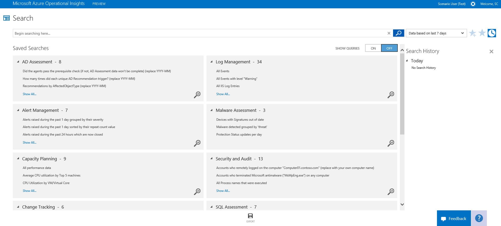

<properties 
	pageTitle="Ricerca in Operational Insights" 
	description="È possibile usare la funzionalità di ricerca in Azure Operational Insights per trovare i dati desiderati." 
	services="operational-insights" 
	documentationCenter="" 
	authors="bandersmsft" 
	manager="jwhit" 
	editor=""/>

<tags 
	ms.service="operational-insights" 
	ms.workload="na" 
	ms.tgt_pltfrm="na" 
	ms.devlang="na" 
	ms.topic="article" 
	ms.date="03/20/2015" 
	ms.author="banders"/>

# Ricerca in Operational Insights
Un elemento fondamentale di Microsoft Azure Operational Insights è la funzionalità di ricerca, che permette di combinare e correlare qualsiasi dato di computer da più origini nell'ambiente. Gli Intelligence Packs sono basati anche sulla ricerca per offrire le metriche specifiche per una particolare area problematica.

## Cercare dati
È possibile usare la funzionalità di ricerca in Azure Operational Insights per trovare i dati desiderati. 

Nella pagina **Search** è possibile creare una query e quindi, durante la ricerca, filtrare i risultati usando controlli facet. È anche possibile creare query avanzate per trasformare, filtrare e creare report sui risultati.

Le query di ricerca più comuni sono visualizzate nella maggior parte delle pagine di ricerca. In tutta la console di Operational Insights è possibile fare clic su riquadri o analizzare altri elementi per visualizzarne i dettagli usando la funzionalità di ricerca.
È possibile usare facet e controlli di filtro per perfezionare i risultati. La digitazione assistita con il completamento automatico semplifica l'apprendimento della sintassi e permette di produrre rapidamente risultati.

##Argomenti della libreria di Azure 
- [Cercare il riferimento alla sintassi](https://msdn.microsoft.com/library/azure/dn884655.aspx  "Search Syntax Reference")
- [Riferimenti al campo Ricerca e ai facet](https://msdn.microsoft.com/library/azure/dn884648.aspx "Search field and facet reference")  
 
 
## Post di blog ed esercitazioni utili per apprendere la sintassi di ricerca
- [Procedura relativa alla ricerca in Azure Operational Insights: Parte I - Come filtrare i Big Data](http://blogs.msdn.com/b/dmuscett/archive/2014/10/19/advisor-search-first-steps-how-to-filter-data-part-i.aspx)
- [Procedura relativa alla ricerca in Azure Operational Insights: Parte II - Altre informazioni su filtri, uso degli operatori booleani, dimensione temporale, numeri e intervalli](http://blogs.msdn.com/b/dmuscett/archive/2014/10/19/advisor-search-how-to-part-ii-more-on-filtering-using-boolean-operators-and-the-time-dimension.aspx)
- [Procedura relativa alla ricerca in Azure Operational Insights: Parte III - Modifica dei risultati: la pipeline "|" e i comandi per la ricerca](http://blogs.msdn.com/b/dmuscett/archive/2014/10/19/advisor-search-how-to-part-iii-manipulating-results-the-pipeline-and-search-commands.aspx)
- [Procedura relativa alla ricerca in Azure Operational Insights: Parte IV - Introduzione al comando MEASURE](http://blogs.msdn.com/b/dmuscett/archive/2014/10/29/operational-insights-search-how-to-part-iv-introducing-the-measure-command.aspx)
- [Procedura relativa alla ricerca in Azure Operational Insights: Parte V - Funzioni statistiche Max() e Min() con il comando Measure](http://blogs.msdn.com/b/dmuscett/archive/2014/10/29/azure-operational-insights-search-howto-part-v-max-and-min-statistical-functions-with-measure-command.aspx)
- [Procedura relativa alla ricerca in Azure Operational Insights: Parte VI - Funzione Avg() con il comando Measure ed esplorazione di Type=PerfHourly](http://blogs.msdn.com/b/dmuscett/archive/2014/10/31/azure-operational-insights-search-how-to-part-vi-measure-avg-and-an-exploration-of-type-perfhourly.aspx)
- [Procedura relativa alla ricerca in Azure Operational Insights: Parte VII - Funzione Sum() con il comando Measure e comando Where](http://blogs.msdn.com/b/dmuscett/archive/2014/11/10/azure-operational-insights-search-hot-to-part-vii-measure-sum-and-where-command.aspx)

## Post di blog - Casi di utilizzo della ricerca
- [Ricerca nei log di IIS W3C Microsoft Azure Operational Insights](http://blogs.msdn.com/b/dmuscett/archive/2014/09/20/w3c-iis-logs-search-in-system-center-advisor-limited-preview.aspx)
- [Monitoraggio degli errori del backup di SQL con la ricerca e i dashboard di Azure Operational Insights](http://blogs.msdn.com/b/dmuscett/archive/2015/02/21/monitoring-sql-backup-failures-with-azure-operational-insights-search-and-dashboards.aspx)
- [Equivalenti della funzione di ricerca di Operational Insights rispetto alle regole di avviso relative agli eventi del Management Pack di IIS](http://blogs.msdn.com/b/dmuscett/archive/2014/11/05/iis-mp-event-alerting-rules-s-opinsights-searches-equivalents.aspx)
- [Raccolta di query di ricerca utili di Operational Insights](http://blogs.msdn.com/b/dmuscett/archive/2014/10/19/advisor-searches-collection.aspx)

<!--HONumber=52-->