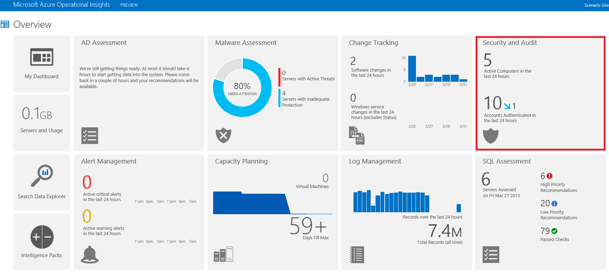
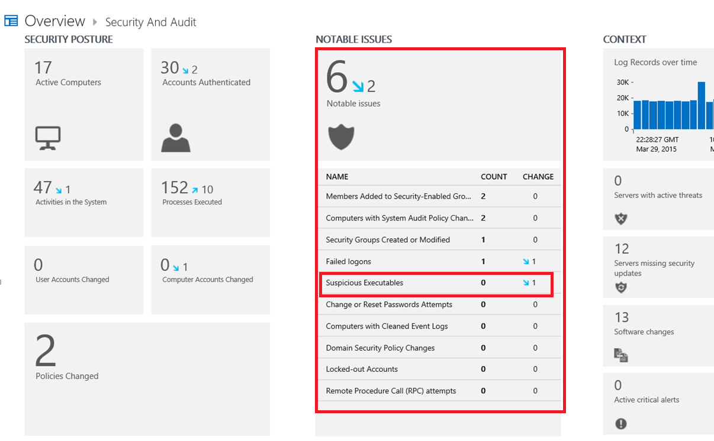
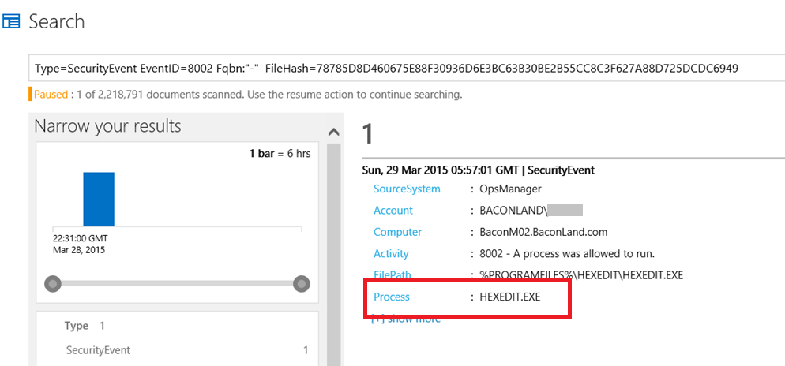
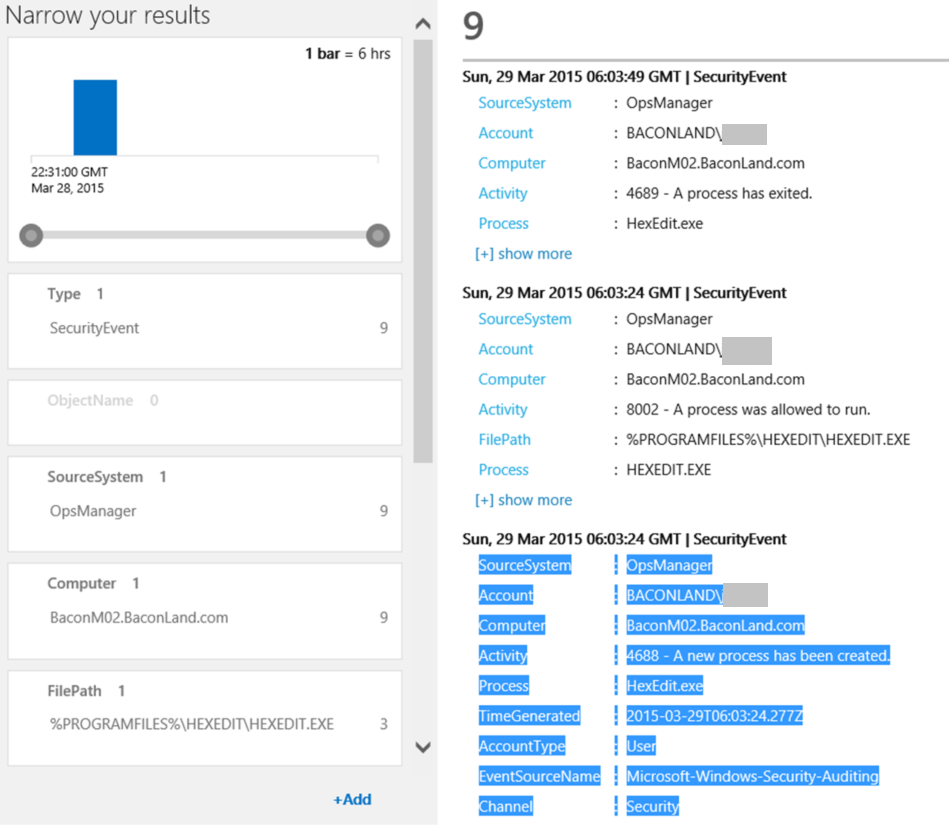

<properties 
   pageTitle="Esplorare i dati di sicurezza e controllo di Operational Insights"
   description="Informazioni su come usare l'intelligence pack Security and Audit per ottenere una panoramica completa sulla situazione della sicurezza IT all'interno dell'organizzazione grazie alla disponibilità di query di ricerca predefinite relative a problemi rilevanti che richiedono attenzione"
   services="operational-insights"
   documentationCenter=""
   authors="bandersmsft"
   manager="jwhit"
   editor="tysonn" /> <tags 
   ms.service="operational-insights"
   ms.devlang="na"
   ms.topic="article"
   ms.tgt_pltfrm="na"
   ms.workload="na"
   ms.date="04/30/2015"
   ms.author="banders" />

# Esplorare i dati di sicurezza e controllo di Operational Insights

[AZURE.INCLUDE [operational-insights-note-moms](../includes/operational-insights-note-moms.md)]

L'intelligence pack Security and Audit di Operational Insights consente di ottenere una panoramica completa sulla situazione della sicurezza IT all'interno dell'organizzazione grazie alla disponibilità di query di ricerca predefinite relative a problemi rilevanti che richiedono attenzione.

Contenuto dell'articolo:

- Condurre una semplice indagine riguardo a un file eseguibile sospetto
- Procedure consigliate per le analisi forensi
- Procedure consigliate per l'esecuzione di indagini in caso di violazione della sicurezza
- Procedure consigliate per gli scenari di controllo

## Condurre una semplice indagine riguardo a un file eseguibile sospetto

1. Accedere a Operational Insights.
2. Nella pagina **Overview** rivedere le informazioni visualizzate nel riquadro **Security and Audit** e quindi fare clic sugli elementi di interesse. 
3. Nella pagina **Security and Audit** rivedere le informazioni riportate nel pannello **NOTABLE ISSUES**. Nella schermata di esempio per la giornata odierna sono visualizzati 6 problemi rilevanti, 2 dei quali risalgono a ieri. In questo esempio è presente 1 file eseguibile sospetto. Fare clic su **Suspicious Executables** nel pannello **NOTABLE ISSUES**. 
4. Nella pagina Search vengono visualizzati la query e i risultati relativi al file eseguibile sospetto selezionato. Nell'esempio viene restituito 1 risultato e viene visualizzato il relativo hash file. Fare clic sull'ID **FILEHASH**.  
5. Nella pagina Search vengono visualizzate informazioni aggiuntive sul file eseguibile, inclusi il relativo percorso e il nome del processo. Fare clic su **Process &lt;file name&gt;**, nell'esempio HEXEDIT.EXE.  
6. Nella pagina Search il nome del processo viene aggiunto alla query tra virgolette. In questo esempio il nome è "**HEXEDIT.EXE"**. 
7. Nella casella Search rimuovere qualsiasi informazione tranne il nome del processo e le virgolette e quindi fare clic sull'icona Search. 
8. Nella pagina Search vengono visualizzate informazioni dettagliate sul processo, inclusi i computer sui quali viene eseguito e l'account utente usato, nonché la data e l'ora in cui è stato creato l'evento relativo al processo.
9. Le informazioni trovate consentono di eseguire le azioni correttive necessarie. Se, ad esempio, risulta che il file eseguibile è un malware, è necessario rimuoverlo da tutti i computer che ha infettato. Il file eseguibile viene rimosso e Operational Insights riceve eventi di log e controllo aggiornati relativi ai computer. I valori presenti nel pannello NOTABLE ISSUES verranno modificati il giorno successivo.

## Procedure consigliate per le analisi forensi

**Cercare le prove**

Quando si esegue un'analisi forense usando l'intelligence pack Security and Audit, si cercano le prove lasciate da potenziali utenti malintenzionati. Indipendentemente dalle operazioni svolte dagli utenti nel proprio ambiente IT, molte delle attività a cui partecipano generano elementi di sicurezza. È importante notare che spesso gli autori degli attacchi eliminano i log e che questa operazione è in genere la prima misura adottata per cancellare le tracce.

Tuttavia, che gli utenti accedano ai propri computer in modalità locale o remota, la prova dell'accesso è archiviata nei registri eventi. Operational Insights raccoglie questi elementi *nel momento stesso in cui vengono generati*, prima che chiunque possa alterarli, e consente di eseguire diversi tipi di analisi correlando i dati tra più computer.

**Informazioni sulla configurazione e la raccolta di eventi di controllo**

Per sfruttare al massimo l'intelligence pack Security and Audit, configurare il livello di eventi di controllo raccolti dall'ambiente Windows più adatto alle proprie esigenze usando le seguenti risorse.

- [Come configurare le impostazioni dei criteri di sicurezza](https://technet.microsoft.com/library/dn135243(v=ws.10).aspx)

- [Configurazione dei criteri di controllo avanzati](https://technet.microsoft.com/library/jj852202(v=ws.10).aspx)

- [Suggerimenti per i criteri di controllo](https://technet.microsoft.com/library/dn487457.aspx)

**Abilitare AppLocker**

È inoltre consigliabile abilitare gli eventi di AppLocker per ottenere informazioni dettagliate sulle esecuzioni di processi nel proprio ambiente IT. Per altre informazioni , vedere l'articolo relativo alla [configurazione dei criteri di AppLocker solo a scopo di controllo](https://technet.microsoft.com/library/hh994622.aspx)

**Configurare il livello di controllo per gli eventi di Windows**

L'ambiente di elaborazione di Windows offre la possibilità di configurare il livello di acquisizione di record correlati alla sicurezza. È ad esempio possibile configurare l'ambiente in modo che venga generato un evento ogni volta che un utente accede a un file oppure lo legge o lo apre. Il livello di dettaglio che si desidera ottenere varia in base alle specifiche esigenze. Tutte le opzioni abilitate, tuttavia, sono associate a un costo, perché è necessario archiviare tutte le informazioni raccolte. Per questo motivo, negli ambienti IT di molte organizzazioni si decide di non abilitare la raccolta di dati relativi alla lettura o scrittura di oggetti. Ogni volta che un utente accede a un file possono essere generati migliaia di eventi, alcuni dei quali assolutamente superflui. Il livello di raccolta che viene scelto dipende dal giudizio dell'utente.

>[AZURE.NOTE]Se si usa l'agente diretto e si dispone di un server proxy nell'organizzazione, è necessario configurarlo per consentire all'agente di accedere a Operational Insights. Per altre informazioni, vedere [Configurare le impostazioni di proxy e firewall](operational-insights-proxy-firewall.md).

## Procedure consigliate per l'esecuzione di indagini in caso di violazione della sicurezza

**Individuazione di modelli di attività anomale**

Le violazioni della sicurezza in genere originano da credenziali legittime e prevedono il tentativo da parte di un utente malintenzionato di ottenere privilegi elevati tramite attacchi. L'intelligence pack Security and Audit non è preposto al rilevamento delle intrusioni, bensì all'analisi e all'individuazione di modelli di attività anomale con problemi rilevanti. È consigliabile, ad esempio, analizzare le attività anomale seguenti e tutte le altre eventualmente visualizzate nel pannello **Notable Issues**.

- Accessi insoliti a un computer da parte di un utente che normalmente non lo usa

- Enumerazione di rete insolita da utenti o computer atipici

- Nuovi account utente creati con diritti amministrativi

- Modifiche apportate a criteri di registrazione o sicurezza

- File eseguibili sospetti

## Procedere consigliate per gli scenari di controllo

È possibile che l'organizzazione debba rispettare criteri e normative di conformità per computer e reti la cui applicazione richiede l'uso di record di controllo estesi. Se, ad esempio, l'organizzazione opera nel settore finanziario, è possibile che debba mantenere record che indicano quale utente ha eseguito una specifica operazione sulla rete in un particolare momento. Potrebbe inoltre essere necessario generare a richiesta report dettagliati dell'attività di un utente specifico o di un server selezionato ed essere in grado di tornare indietro nel tempo di molti mesi, a volte anche di anni.

L'intelligence pack Security and Audit consente di raccogliere dati di controllo in tutto l'ambiente IT, indipendentemente dal fatto che i computer siano in locale o nel cloud. Tutti i dati di controllo vengono archiviati, indicizzati e, con una sottoscrizione Premium a Operational Insights, archiviati per un tempo illimitato. In questo modo è possibile visualizzare i dati di controllo, eseguire ricerche e correlare diversi tipi di dati e computer per ottenere risultati completi per qualsiasi intervallo di tempo a partire dall'inizio della raccolta dei dati.

**Usare Criteri di gruppo per raccogliere dati di controllo**

Tutti i dati di controllo che si desidera raccogliere e inviare a Operational Insights sono completamente gestiti con Criteri di gruppo, che consente di definire configurazioni di sicurezza come parte di un oggetto Criteri di gruppo. Tali configurazioni sono collegate a contenitori Active Directory come siti, domini e unità organizzative e consentono di gestire le impostazioni di sicurezza. I dati dei criteri vengono registrati e successivamente inviati al servizio Operational Insights.

**Usare AppLocker per raccogliere dati di controllo**

Se oltre alle impostazioni dei criteri locali si usa AppLocker per raccogliere dati di controllo, Operational Insights raccoglierà tali dati consentendone la visualizzazione.

<!--HONumber=54-->