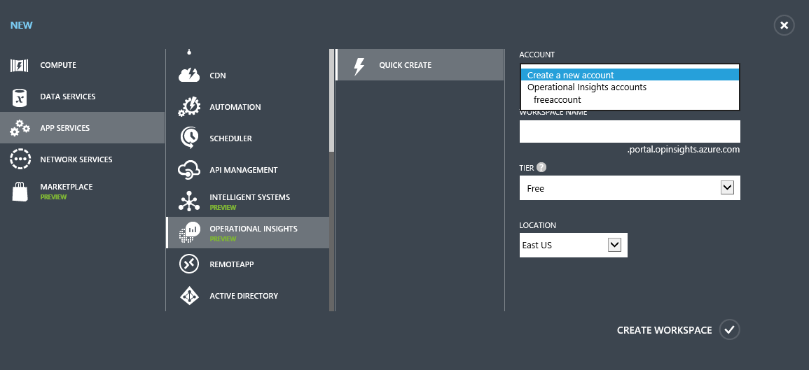
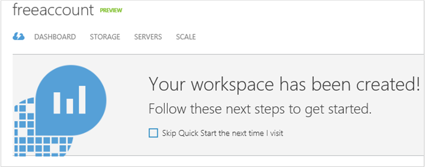
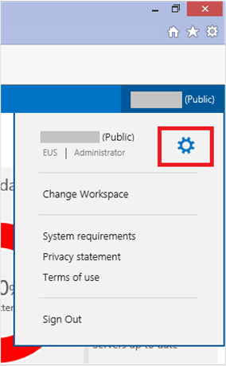
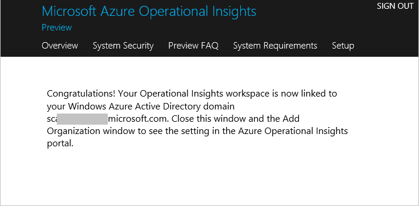

<properties 
    pageTitle="Impostare l'area di lavoro e gestire le impostazioni" 
    description="Informazioni su come impostare l'area di lavoro e gestire le impostazioni in Microsoft Azure Operational Insights" 
    services="operational-insights" 
    documentationCenter="" 
    authors="bandersmsft" 
    manager="jwhit" 
    editor=""/>

<tags 
    ms.service="operational-insights" 
    ms.workload="operational-insights" 
    ms.tgt_pltfrm="na" 
    ms.devlang="na" 
    ms.topic="article" 
    ms.date="04/30/2015" 
    ms.author="banders"/>

# Configurare l'area di lavoro e gestire le impostazioni 

[AZURE.INCLUDE [operational-insights-note-moms](../includes/operational-insights-note-moms.md)]

Per creare una nuova area di lavoro di Microsoft Azure Operational Insights, scegliere un nome per l'area di lavoro, associarlo al proprio account e scegliere una posizione geografica. Un'area di lavoro di Operational Insights è sostanzialmente un contenitore che include informazioni sull'account e semplici informazioni di configurazione per l'account stesso. All'interno dell'organizzazione è possibile usare più aree di lavoro di Operational Insights per gestire diversi set di dati raccolti dall'intera infrastruttura IT o da una parte di essa.

Dopo aver creato l'area di lavoro, è possibile usarla per eseguire altre attività, come gestire Operational Insights, visualizzare i dati di utilizzo nel dashboard, selezionare gli account di archiviazione, connettere direttamente gli agenti o connettersi a System Center Operations Manager. È inoltre possibile gestire le impostazioni per ogni area di lavoro.

Per informazioni aggiuntive sulla creazione di un'area di lavoro usando Azure, fare riferimento al video seguente:

> [AZURE.VIDEO creating-a-workspace-for-azure-customers-opinsights]

## Numero di aree di lavoro necessarie
Un'area di lavoro viene considerata come una risorsa di Azure all'interno del portale di gestione di Azure.

È possibile creare una nuova area di lavoro o stabilire un collegamento a un'area di lavoro di anteprima esistente aperta in precedenza per l'uso con System Center Operations Manager, ma non ancora associata a una sottoscrizione di Azure \(necessaria per la fatturazione\). Un'area di lavoro rappresenta il livello a cui i dati vengono raccolti, aggregati, analizzati e presentati nel portale di Operational Insights. È possibile scegliere di disporre di più aree di lavoro per separare i dati di ambienti e sistemi diversi. Ogni gruppo di gestione di Operations Manager \(e tutti i relativi agenti\) o singoli agenti o macchine virtuali possono essere connessi a una sola area di lavoro.

A ogni area di lavoro possono essere associati più account utente, ciascuno dei quali \(account Microsoft o account aziendale\) può avere accesso a diverse aree di lavoro di Operational Insights. Per impostazione predefinita, l'account Microsoft o l'account aziendale usato per creare l'area di lavoro diventa l'amministratore di quest'ultima. L'amministratore può quindi invitare altri account Microsoft o scegliere utenti da Azure Active Directory.

##Collegare un'area di lavoro esistente a una sottoscrizione di Azure

È possibile creare un'area di lavoro da [opinsights.azure.com](http://opinsights.azure.com). Per le aree di lavoro, tuttavia, esistono determinate limitazioni. La principale è il limite di 500 MB al giorno di caricamento dati se si usa un account gratuito. Per apportare modifiche a questa area di lavoro, è necessario **collegare l'area di lavoro esistente a una sottoscrizione di Azure**.

>[AZURE.IMPORTANT]Per collegare un'area di lavoro, è necessario che l'account di Azure abbia già accesso a tale area. In altri termini, è necessario che l'account usato per accedere al portale di Azure sia **lo stesso** account usato per accedere all'area di lavoro di Operational Insights. Se non si tratta dello stesso account, vedere [Aggiungere un utente a un'area di lavoro esistente](#addusertoexistingworkspace).

1. Accedere al portale di gestione di Azure.
2. Fare clic su **+ Nuovo** nella parte inferiore sinistra del portale.
3. Fare clic su **Servizi app**, scorrere fino a **Operational Insights** e selezionarlo.
4. Fare clic su **Creazione rapida**.
5. Nell'elenco **Account** sono riportate le aree di lavoro esistenti *non ancora* collegate alla sottoscrizione di Azure. Selezionare un account.

	>[AZURE.NOTE][Aggiungere un utente a un'area di lavoro esistente](#addusertoexistingworkspace)

6. Compilare i campi rimanenti e selezionare **Crea area di lavoro**.

## Eseguire l'aggiornamento dell'area di lavoro a un piano a pagamento

In Operational Insights sono disponibili tre tipi di piano per l'area di lavoro: **Free**, **Standard** e **Premium**. Si supponga di avere sottoscritto un piano di tipo *Free* e di avere raggiunto il limite massimo di 500 MB di dati. Per raccogliere dati oltre questo limite, è necessario aggiornare l'area di lavoro a un '\*\*piano con pagamento in base al consumo\*\*'. Il tipo di piano può essere cambiato in qualsiasi momento. Per altre informazioni sui prezzi di Operational Insights, vedere l'articolo relativo ai [dettagli sui prezzi](http://azure.microsoft.com/pricing/operational-insights/)

>[AZURE.IMPORTANT]È possibile modificare i piani relativi alle aree di lavoro solo se queste sono *collegate* a una sottoscrizione di Azure. Se l'area di lavoro è stata creata in Azure o se è *già* stata collegata, è possibile ignorare questo messaggio. Se l'area di lavoro è stata creata da [opinsights.azure.com](http://opinsights.azure.com), seguire la procedura riportata in [Collegare un'area di lavoro esistente a una sottoscrizione di Azure](#linkworkspace).

### Cambiare il tipo di piano

Nel portale di gestione di Azure passare all'area di lavoro di Operational Insights per cui si desidera eseguire l'aggiornamento:

Selezionare l'area di lavoro e selezionare **SCALE** dalle schede nella parte superiore dello schermo

Al termine scegliere il piano a cui si desidera eseguire l'aggiornamento e fare clic su **SAVE**. Le modifiche verranno riflesse nel portale e sarà possibile raccogliere dati oltre il limite del piano "Free".

## Modificare il nome dell'area di lavoro

Se si è l'amministratore di un'area di lavoro di Microsoft Azure Operational Insights, è possibile modificarne il nome.

###Per modificare il nome dell'area di lavoro

1. Fare clic sul nome dell'area di lavoro. 
  

2. Fare clic sull'icona di configurazione. 
  

3. Nella pagina **Settings** di Operational Insights, nella sezione **Manage User Accounts**, fare clic su **Manage users**. 
  

4. Nel portale di Operational Insights, nella pagina **Settings**, immettere il nuovo nome nel campo **Workspace name**.

5. Fare clic su **Save**.

## Modificare le informazioni utente

È possibile cambiare il nome associato a un utente di Operational Insights, ma non è possibile cambiare il nome dell'account Microsoft associato all'utente.

Per gli utenti con un account Microsoft, è anche possibile modificare le impostazioni di notifica. Se si usa un account aziendale tramite Azure Active Directory, non è attualmente possibile usare la funzionalità **Notifications** in Operational Insights.

### Per modificare le informazioni utente
1. Nella pagina **Settings** di Operational Insights, nella sezione **User Information**, immettere il nome nei campi **First name** e **Last name**.

2. Per gli utenti di account Microsoft, modificare le impostazioni di notifica. Per impostazione predefinita, tutti gli utenti ricevono una notifica quando viene generato un avviso. Se si desidera che gli utenti non ricevano più le notifiche, deselezionare l'opzione **Receive email notifications of new Operational Insights alerts**.

3. Fare clic su **Save**.

## Modificare le impostazioni di notifica

Per impostazione predefinita, tutti gli utenti associati a un account di Operational Insights ricevono un messaggio di posta elettronica che riepiloga eventuali avvisi relativi alla valutazione della configurazione generati negli ultimi sette giorni. Nella pagina **Settings** gli utenti possono decidere se ricevere queste notifiche di posta elettronica.

>[AZURE.NOTE]Le notifiche sono disponibili solo per gli utenti con un account Microsoft. Se si usa un account aziendale tramite Azure Active Directory, non è attualmente possibile usare la funzionalità **Notifications** in Operational Insights.

Se non sono visualizzati tutti i messaggi di posta elettronica previsti, verificare i filtri per la posta indesiderata. Assicurarsi che i messaggi di posta elettronica inviati da *operationalinsights@opinsights.azure.com* non vengano esclusi tramite i filtri.

1. Nella pagina **Settings** di Operational Insights, nella sezione **User Information**, deselezionare l'opzione **Receive email notifications of new Operational Insights alerts**.

2. Fare clic su **Save**.

##Aggiungere un utente a un'area di lavoro esistente

Per aggiungere un utente o un gruppo a un'area di lavoro di Operational Insights, seguire questa procedura. L'utente o il gruppo potrà visualizzare e agire su tutti gli avvisi associati a questa area di lavoro.

>[AZURE.NOTE]Se si desidera aggiungere un utente o un gruppo dal proprio account aziendale di Azure Active Directory, è necessario assicurarsi innanzitutto di aver associato il proprio account di Operational Insights al dominio Active Directory. Vedere [Aggiungere un'organizzazione di Azure Active Directory a un'area di lavoro esistente](#).

### Per aggiungere un utente a un'area di lavoro esistente
1. Fare clic sul nome dell'area di lavoro.
2. Fare clic sull'icona di configurazione.
3. Nella pagina **Settings** di Operational Insights, nella sezione **Manage User Accounts**, fare clic su **Manage users**. 
  

4. Nella finestra **Manage Users** fare clic su **Add**. 
  

5. Se l'account di Operational Insights è associato ad Active Directory, specificare **Organizational account**.

    >[AZURE.NOTE]

6. Immettere le nuove informazioni utente per l'account Microsoft o l'account aziendale. Se si aggiunge un account aziendale, è possibile immettere parte del nome del gruppo o dell'utente oppure l'alias di posta elettronica e quindi fare clic su **Check Names** per individuare l'utente o il gruppo specifico.
 
    >[AZURE.NOTE]Per prestazioni ottimali, limitare il numero di gruppi di Active Directory associati a un singolo account di Operational Insights a due, ovvero uno per gli amministratori e uno per gli utenti. L'uso di più gruppi potrebbe compromettere le prestazioni di Operational Insights.

7. Selezionare il ruolo per il nuovo utente: **Administrator** o **User**. 
  

8. Fare clic su **OK**.
    
    Se si aggiunge un account Microsoft, all'indirizzo di posta elettronica fornito viene inviato un invito ad aggiungere l'account. Dopo che l'utente avrà seguito le istruzioni contenute nell'invito a iscriversi a Operational Insights, questi può visualizzare gli avvisi e le informazioni per l'account di Operational Insights e potrà visualizzare le informazioni utente nella finestra **Manage Users**.
 
    Se si aggiunge un account aziendale, l'utente potrà immediatamente accedere a Operational Insights. 
  

## Aggiungere un'organizzazione di Azure Active Directory a un'area di lavoro esistente

È possibile associare l'area di lavoro di Operational Insights a un dominio Azure Active Directory. Questo consente di aggiungere utenti da Active Directory direttamente nell'area di lavoro di Operational Insights senza richiedere un account Microsoft separato.

### Per aggiungere un'organizzazione di Azure Active Directory a un'area di lavoro esistente

1. Nella pagina Settings di Operational Insights fare clic su **Add Organization**. 
  

2. Rivedere le informazioni sugli account aziendali e quindi fare clic su **Next**.

3. Immettere le informazioni sull'identità per l'amministratore del dominio di Azure Active Directory e quindi fare clic su **Sign in**.

4. Fare clic su **Grant access** per consentire a Operational Insights di usare le informazioni sull'identità nel dominio Active Directory. 
 

## Modificare un account utente esistente

È possibile modificare il ruolo account per un utente associato all'account di Operational Insights account. Per il ruolo sono disponibili le opzioni seguenti:

 - *Administrator*: può gestire gli utenti, visualizzare ed eseguire operazioni su tutti gli avvisi e aggiungere e rimuovere i server

 - *User*: può visualizzare ed eseguire operazioni su tutti gli avvisi e aggiungere e rimuovere i server

### Per modificare un account
1. Nella pagina **Settings** di Operational Insights, nella sezione **Manage User Accounts**, fare clic su **Manage users**.

2. Nella finestra **Manage Users** selezionare il nome dell'utente che si desidera modificare e quindi fare clic su **Edit user**.

3. Selezionare il ruolo dell'utente: **Administrator** o **User**.

4. Fare clic su **OK**.

## Rimuovere un utente da un'area di lavoro di Operational Insights

Per rimuovere un utente da un'area di lavoro di Operational Insights, seguire questa procedura. Si noti che questo non comporta la chiusura dell'area di lavoro dell'utente, ma rimuove l'associazione tra l'utente e l'area di lavoro stessa. Se è associato a più aree di lavoro, un utente sarà comunque in grado di accedere a Operational Insights.

### Per rimuovere un utente da un'area di lavoro

1. Nella pagina **Settings** di Operational Insights, nella sezione **Manage User Account**, fare clic su **Manage users**.

2. Nella finestra **Manage Users** fare clic sul nome dell'utente che si desidera rimuovere e quindi fare clic su **Remove user**.

3. Fare clic su **OK** per confermare che si desidera rimuovere l'utente.

## Chiudere l'area di lavoro di Operational Insights

Quando si chiude un'area di lavoro di Operational Insights, tutti i dati relativi a tale area verranno eliminati dal servizio di Operational Insights non più di 30 giorni dopo la chiusura dell'area di lavoro stessa.

Se si è un amministratore e vi sono più utenti associati all'area di lavoro, l'associazione tra quest'ultima e gli utenti viene interrotta. Se gli utenti sono associati ad altre aree di lavoro, potranno continuare a usare tali aree di lavoro di Operational Insights. Tuttavia, se non sono associati ad altre aree di lavoro, per usare Operational Insights dovranno crearne una nuova.

### Per chiudere un'area di lavoro di Operational Insights

1. Nella pagina **Settings** di Operational Insights, nella sezione **Close Workspace**, fare clic su **Close Workspace**.

2. Selezionare uno dei motivi per la chiusura dell'area di lavoro o immettere un motivo diverso nella casella di testo.

3. Fare clic su **Close workspace**.

<!--HONumber=54-->