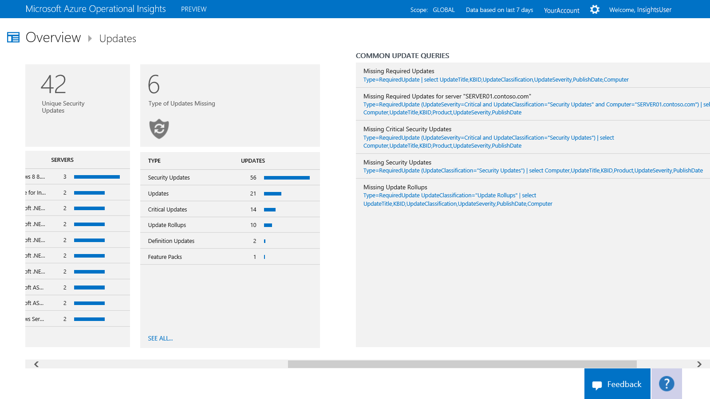

<properties 
   pageTitle="Aggiornare i server con gli aggiornamenti del sistema"
   description="Informazioni su come usare l'Intelligence Pack System Updates in Microsoft Azure Operational Insights per applicare gli aggiornamenti mancanti ai server nell'infrastruttura."
   services="operational-insights"
   documentationCenter=""
   authors="bandersmsft"
   manager="jwhit"
   editor="tysonn" />
<tags 
   ms.service="operational-insights"
   ms.devlang="na"
   ms.topic="article"
   ms.tgt_pltfrm="na"
   ms.workload="na"
   ms.date="03/20/2015"
   ms.author="banders" />

# Aggiornare i server con gli aggiornamenti del sistema

È possibile usare l'Intelligence Pack System Updates in Microsoft Azure Operational Insights per applicare gli aggiornamenti mancanti ai server nell'infrastruttura. Installare l'Intelligence Pack per aggiornare l'agente Operations Manager e il modulo di configurazione di base per Operational Insights. Le informazioni di aggiornamento vengono lette sui server monitorati e i dati di aggiornamento vengono quindi inviati al servizio Operational Insights nel cloud per l'elaborazione. Viene applicata la logica ai dati di aggiornamento, che vengono quindi registrati dal servizio cloud. Gli eventuali aggiornamenti mancanti rilevati vengono visualizzati nel dashboard **Updates**. È possibile usare il dashboard **Updates** per elaborare gli aggiornamenti mancanti e sviluppare un piano per applicarli ai server su cui sono necessari.

## Usare gli aggiornamenti del sistema per aggiornare i server

Prima di poter usare gli aggiornamenti di sistema in Microsoft Azure Operational Insights, è necessario disporre dell'Intelligence Pack installato. Per altre informazioni sull'installazione di Intelligence Pack, vedere [Usare la raccolta per aggiungere o rimuovere Intelligence Pack](operational-insights-add-intelligence-packs.md). Dopo l'installazione, è possibile visualizzare gli aggiornamenti mancanti nei server monitorati usando il riquadro **System Update Assessment** nella pagina **Overview** in Operational Insights. 

Il riquadro apre il dashboard **Updates**, in cui è possibile visualizzare un riepilogo generale degli aggiornamenti mancanti. Questa pagina include informazioni dettagliate sulle categorie seguenti:

- Server a cui mancano aggiornamenti delle sicurezza

- Server non aggiornati di recente

- Aggiornamenti da applicare a server specifici

- Tipo di aggiornamenti mancanti

È possibile fare clic su qualsiasi riquadro o elemento per visualizzarne i dettagli nella pagina **Search** e ottenere altre informazioni sull'aggiornamento mancante. 

## Risultati di ricerca##
I risultati della ricerca per gli aggiornamenti comprendono:

- Server

- Titolo dell'aggiornamento

- ID della Knowledge Base

- Prodotto a cui è destinato l'aggiornamento

- Gravità dell'aggiornamento

- Data di pubblicazione

I risultati della ricerca relativa a *Server* includono:

- Nome server

- Nome della versione del sistema operativo

- Metodo di abilitazione degli aggiornamenti automatici

- Giorni trascorsi dall'ultimo aggiornamento

- Versione dell'agente di Windows Update

## Per usare gli aggiornamenti

1. Nella pagina **Overview** fare clic sul riquadro **System Update Assessment**.

2. Nel dashboard **Updates** visualizzare le categorie degli aggiornamenti e scegliere quella da usare.

3. Fare clic su un riquadro o qualsiasi elemento per visualizzarne le informazioni dettagliate nella pagina **Search**.

4. Con le informazioni trovate, è possibile creare un piano per applicare gli aggiornamenti mancanti.

<!--HONumber=52-->