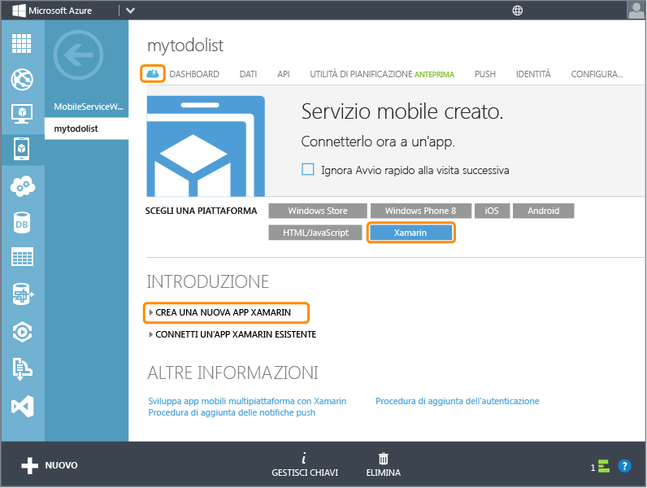
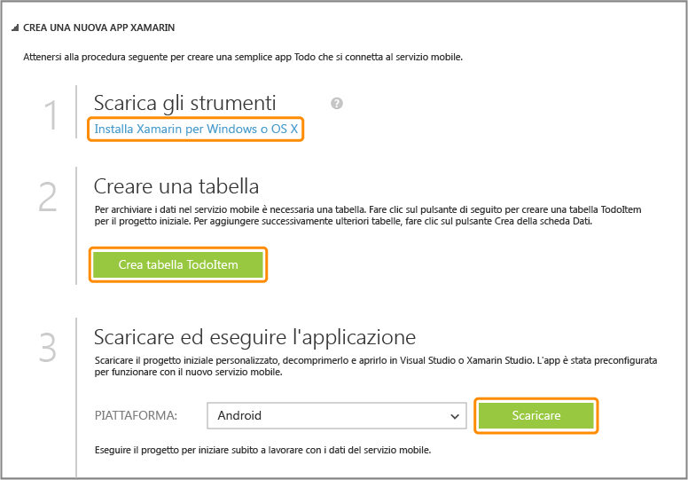
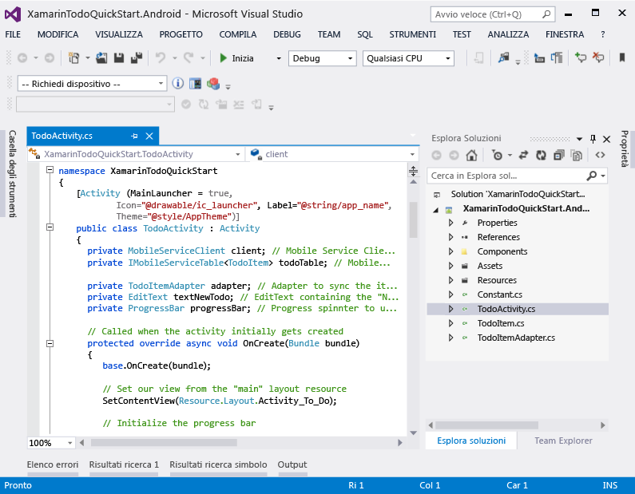

<properties pageTitle="Get Started with Mobile Services for Xamarin.Android" metaKeywords="Azure Xamarin.Android application, mobile service XamarinAndroid, getting started Azure Xamarin.Android" writer="craigd" description="Learn how to use Azure Mobile Services with your Xamarin.Android app." metaCanonical="" documentationCenter="Mobile" title="Get started with Mobile Services" />

Introduzione a Servizi mobili
=============================

[Windows Store](/it-it/documentation/articles/mobile-services-windows-store-get-started "Windows Store") [Windows Phone](/it-it/documentation/articles/mobile-services-windows-phone-get-started "Windows Phone") [iOS](/it-it/documentation/articles/mobile-services-ios-get-started "iOS") [Android](/it-it/documentation/articles/mobile-services-android-get-started "Android") [HTML](/it-it/documentation/articles/mobile-services-html-get-started "HTML") [Xamarin.iOS](/it-it/documentation/articles/partner-xamarin-mobile-services-ios-get-started "Xamarin.iOS") [Xamarin.Android](/it-it/documentation/articles/partner-xamarin-mobile-services-android-get-started "Xamarin.Android") [Sencha](/it-it/documentation/articles/partner-sencha-mobile-services-get-started/ "Sencha") [PhoneGap](/it-it/documentation/articles/mobile-services-javascript-backend-phonegap-get-started/ "PhoneGap")

In questa esercitazione viene illustrato come aggiungere un servizio back-end basato su cloud a un'app per Android mediante Servizi mobili di Azure. In questa esercitazione si creeranno sia un nuovo servizio mobile che una semplice app *To do list* che archivia i dati dell'app nel nuovo servizio mobile.

Di seguito è riportata una schermata dell'app completata:

[guarda l'esercitazione](http://channel9.msdn.com/Series/Windows-Azure-Mobile-Services/Getting-Started-with-Xamarin-and-Windows-Azure-Mobile-Services) [Riproduci video](http://channel9.msdn.com/Series/Windows-Azure-Mobile-Services/Getting-Started-with-Xamarin-and-Windows-Azure-Mobile-Services) 10:05

Per completare questa esercitazione, è necessario disporre di [Xamarin.Android](http://xamarin.com/download), che installa Xamarin Studio e un plug-in di Visual Studio (in Windows), nonché della piattaforma Android più recente. È necessario Android 4.2 SDK o una versione successiva.

Il progetto di guida introduttiva scaricato contiene il componente Servizi mobili di Azure per Xamarin.Android. Mentre questo progetto è destinato ad Android 4.2 o versione successiva, con Mobile Services SDK è richiesto solo Android 2.2 o una versione successiva.

**Nota**

Per completare l'esercitazione, è necessario un account Azure. Se non si dispone di un account, è possibile creare un account di valutazione gratuita in pochi minuti. Per informazioni dettagliate, vedere la pagina relativa alla [versione di valutazione gratuita di Azure](http://www.windowsazure.com/it-it/pricing/free-trial/?WT.mc_id=A9C9624B5).

Creazione di un nuovo servizio mobile
-------------------------------------

[WACOM.INCLUDE [mobile-services-create-new-service](../includes/mobile-services-create-new-service.md)]

Creazione di una nuova appCreazione di una nuova app per Xamarin.Android
---------------------------------------------------------------------------------------------------------

Dopo aver creato il servizio mobile, è possibile seguire una facile guida introduttiva nel portale di gestione per creare una nuova app o modificare un'app esistente per connettersi al servizio mobile.

In questa sezione si creerà una nuova app per Xamarin.Android connessa al servizio mobile.

1.  Nel portale di gestione fare clic su **Mobile Services** e quindi sul servizio mobile appena creato.

2.  Nella scheda Quickstart fare clic su **Xamarin.Android** in **Choose platform** ed espandere **Create a new Android app**.

    

    Di seguito sono visualizzati i tre semplici passaggi per creare un'app per Xamarin.Android connessa al servizio mobile.

    

3.  Fare clic su **Create TodoItem table** per creare una tabella in cui archiviare i dati dell'app.

4.  In **Download and run app** fare clic su **Download**.

    Verrà scaricato il progetto per l'applicazione *To do list* di esempio connessa al servizio mobile. Salvare il file del progetto compresso nel computer locale e prendere nota del percorso.

Esecuzione dell'app per Android
-------------------------------

La fase finale di questa esercitazione prevede la compilazione e l'esecuzione della nuova app.

1.  Individuare il percorso in cui sono stati salvati i file compressi del progetto ed espanderli nel computer in uso.

2.  In Xamarin Studio o Visual Studio fare clic su **File**, quindi su **Apri**, passare ai file di esempio non compressi e selezionare **XamarinTodoQuickStart.Android.sln** per aprirlo.

 	

	

1.  Premere il pulsante **Esegui** per compilare il progetto e avviare l'app. Verrà chiesto di selezionare un emulatore o un dispositivo USB collegato.

    **Nota**

    Per poter eseguire il progetto nell'emulatore di Android, è necessario definire almeno un Android Virtual Device (AVD). Utilizzare AVD Manager per creare e gestire questi dispositivi.

2.  Nell'app digitare un testo significativo, ad esempio *Complete the tutorial* e quindi fare clic su **Add**.

    

    Verrà inviata una richiesta POST al nuovo servizio mobile ospitato in Azure. I dati della richiesta vengono inseriti nella tabella TodoItem. Gli elementi archiviati nella tabella vengono restituiti dal servizio mobile e i dati vengono visualizzati nell'elenco.

    > [WACOM.NOTE]
    > È possibile esaminare il codice che accede al servizio mobile per eseguire una query e inserire i dati, disponibile nel file ToDoActivity.cs C\#.

3.  Nel portale di gestione fare clic sulla scheda **Data** e quindi sulla tabella **TodoItems**.

    

    In questo modo sarà possibile visualizzare i dati inseriti nella tabella dall'app.

    

Passaggi successivi
-------------------

Dopo aver completato la guida introduttiva, è possibile eseguire altre importanti attività in Servizi mobili:

-   [Introduzione ai dati](/en-us/develop/mobile/tutorials/get-started-with-data-xamarin-android)
    Ulteriori informazioni sull'archiviazione e sulle query dei dati mediante Servizi mobili.

-   [Introduzione all'autenticazione](/en-us/develop/mobile/tutorials/get-started-with-users-xamarin-android)
    Informazioni sull'autenticazione degli utenti dell'app con un provider di identità.

-   [Introduzione alle notifiche push](/en-us/develop/mobile/tutorials/get-started-with-push-xamarin-android)
    Informazioni sull'invio di una notifica push di base all'app.

