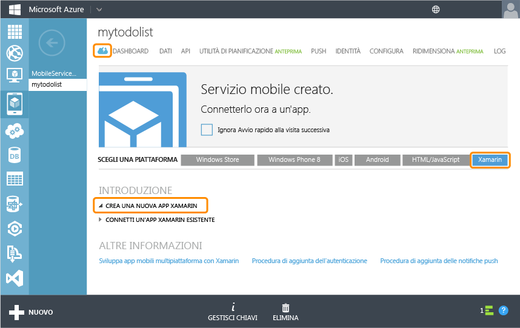
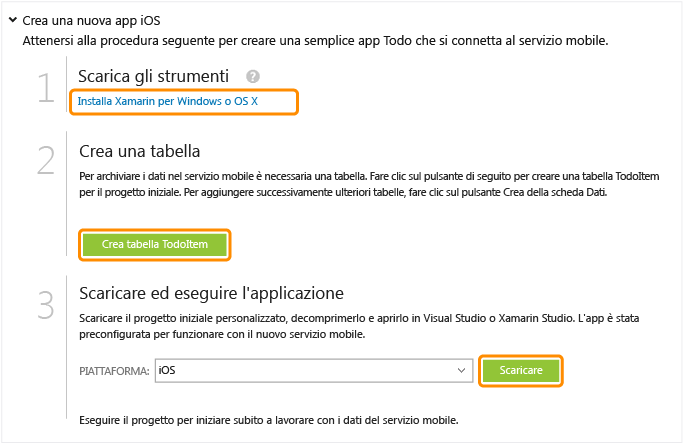
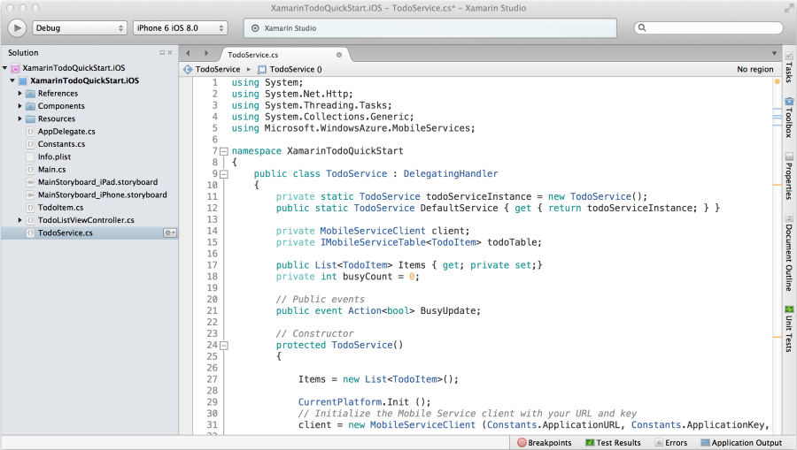
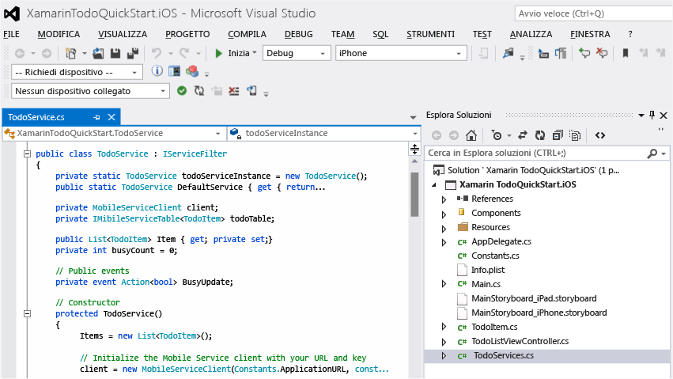

<properties pageTitle="Get Started with Mobile Services for Xamarin iOS apps" metaKeywords="" description="Follow this tutorial to get started using Azure Mobile Services for Xamarin iOS development." metaCanonical="" services="mobile" documentationCenter="Mobile" title="Get started with Mobile Services" authors="craigd" solutions="" manager="" editor="" />

Introduzione a Servizi mobili
=============================

[Windows Store](/en-us/documentation/articles/mobile-services-windows-store-get-started "Windows Store") [Windows Phone](/en-us/documentation/articles/mobile-services-windows-phone-get-started "Windows Phone") [iOS](/en-us/documentation/articles/mobile-services-ios-get-started "iOS") [Android](/en-us/documentation/articles/mobile-services-android-get-started "Android") [HTML](/en-us/documentation/articles/mobile-services-html-get-started "HTML") [Xamarin.iOS](/en-us/documentation/articles/partner-xamarin-mobile-services-ios-get-started "Xamarin.iOS") [Xamarin.Android](/en-us/documentation/articles/partner-xamarin-mobile-services-android-get-started "Xamarin.Android") [Sencha](/en-us/documentation/articles/partner-sencha-mobile-services-get-started/ "Sencha") [PhoneGap](/en-us/documentation/articles/mobile-services-javascript-backend-phonegap-get-started/ "PhoneGap")

In questa esercitazione viene illustrato come aggiungere un servizio back-end basato su cloud a un'app per Xamarin.iOS mediante Servizi mobili di Azure. In questa esercitazione si creeranno sia un nuovo servizio mobile che una semplice app *To do list* che archivia i dati dell'app nel nuovo servizio mobile.

Se si preferisce guardare un video, nel clip a destra vengono eseguiti gli stessi passaggi dell'esercitazione.

[guarda l'esercitazione](http://channel9.msdn.com/Series/Windows-Azure-Mobile-Services/Getting-Started-with-Xamarin-and-Windows-Azure-Mobile-Services) [Riproduci video](http://channel9.msdn.com/Series/Windows-Azure-Mobile-Services/Getting-Started-with-Xamarin-and-Windows-Azure-Mobile-Services) 10:05

Di seguito è riportata una schermata dell'app completata:

Per completare questa esercitazione, è necessario disporre di XCode 4.5 e iOS 5.0 o versioni successive nonché di [Xamarin Studio](http://xamarin.com/download) per OS X oppure del plug-in Xamarin Visual Studio per Visual Studio in Windows.

**Nota**

Per completare l'esercitazione, è necessario un account Azure. Se non si dispone di un account, è possibile creare un account di valutazione gratuita in pochi minuti. Per informazioni dettagliate, vedere la pagina relativa alla [versione di valutazione gratuita di Azure](http://www.windowsazure.com/en-us/pricing/free-trial/?WT.mc_id=A643EE910&returnurl=http%3A%2F%2Fwww.windowsazure.com%2Fen-us%2Fdevelop%2Fmobile%2Ftutorials%2Fget-started-xamarin-ios%2F).

Creazione di un nuovo servizio mobile
-------------------------------------

[WACOM.INCLUDE [mobile-services-create-new-service](../includes/mobile-services-create-new-service.md)]

Creazione di una nuova appCreazione di una nuova app per Xamarin.IOS
--------------------------------------------------------------------

Dopo aver creato il servizio mobile, è possibile seguire una facile guida introduttiva nel portale di gestione per creare una nuova app o modificare un'app esistente per connettersi al servizio mobile.

In questa sezione si creerà una nuova app per Xamarin.iOS connessa al servizio mobile.

1.  Nel portale di gestione fare clic su **Mobile Services** e quindi sul servizio mobile appena creato.

2.  Nella scheda Quickstart fare clic su **Xamarin.iOS** in **Choose platform** ed espandere **Create a new Xamarin.iOS app**.

    

    Di seguito sono visualizzati i tre semplici passaggi per creare un'app per Xamarin.iOS connessa al servizio mobile.

    

3.  Se necessario, scaricare e installare [Xcode] 4.4 o versione successiva e [Xamarin Studio](http://xamarin.com/download).

4.  Fare clic su **Create TodoItems table** per creare una tabella in cui archiviare i dati dell'app.

5.  In **Download and run app** fare clic su **Download**.

    Viene scaricato il progetto per l'applicazione di esempio *To do list* collegato al servizio mobile e viene fatto riferimento al componente Servizi mobili di Azure per Xamarin.iOS. Salvare il file di progetto compresso nel computer locale e prendere nota dell'ubicazione in cui è stato salvato.

Esecuzione dell'appEsecuzione della nuova app per Xamarin.iOS
-------------------------------------------------------------

La fase finale di questa esercitazione prevede la compilazione e l'esecuzione della nuova app.

1.  Individuare il percorso in cui sono stati salvati i file compressi del progetto ed espanderli nel computer in uso, quindi aprire il file di soluzione **XamarinTodoQuickStart.iOS.sln** in Xamarin Studio o in Visual Studio.

    

    

2.  Fare clic su **Esegui** per compilare il progetto e avviare l'applicazione nell'emulatore iPhone, che è l'impostazione predefinita per questo progetto.

3.  Nell'app digitare un testo significativo, ad esempio *Complete the tutorial*, quindi fare clic sull'icona con il segno PIÙ (**+**).

    

    Verrà inviata una richiesta POST al nuovo servizio mobile ospitato in Azure. I dati della richiesta vengono inseriti nella tabella TodoItem. Gli elementi archiviati nella tabella vengono restituiti dal servizio mobile e i dati vengono visualizzati nell'elenco.

    **Nota**

    È possibile esaminare il codice che accede al servizio mobile per eseguire una query e inserire i dati, disponibile nel file TodoService.cs C\#.

4.  Nel portale di gestione fare clic sulla scheda **Data** e quindi sulla tabella **TodoItems**.

    

    In questo modo sarà possibile visualizzare i dati inseriti nella tabella dall'app.

    

Passaggi successivi
-------------------

Dopo aver completato la guida introduttiva, è possibile eseguire altre importanti attività in Servizi mobili:

-   [Introduzione ai dati](/en-us/develop/mobile/tutorials/get-started-with-data-xamarin-ios)
    
    Ulteriori informazioni sull'archiviazione e sulle query dei dati mediante Servizi mobili.

-   [Introduzione all'autenticazione](/en-us/develop/mobile/tutorials/get-started-with-users-xamarin-ios)
    
    Informazioni sull'autenticazione degli utenti dell'app con un provider di identità.

-   [Introduzione alle notifiche push](/en-us/develop/mobile/tutorials/get-started-with-push-xamarin-ios)
    
    Informazioni sull'invio di una notifica push di base all'app.

