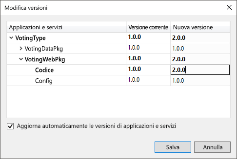
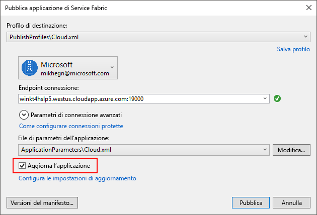

# <a name="create-a-net-service-fabric-application-in-azure"></a>Creare un'applicazione .NET Service Fabric in Azure
Azure Service Fabric è una piattaforma di sistemi distribuiti per la distribuzione e la gestione di microservizi e contenitori scalabili e affidabili. 

In questa guida introduttiva viene illustrato come distribuire la prima applicazione .NET in Service Fabric. Al termine, sarà disponibile un'applicazione di voto con un front-end Web ASP.NET Core che salva i risultati delle votazioni in un servizio back-end con stato nel cluster.


Usando questa applicazione, si apprenderà come:
> [!div class="checklist"]
> * Creare un'applicazione mediante .NET e Service Fabric
> * Usare ASP.NET Core come front-end Web
> * Archiviare i dati dell'applicazione in un servizio con stato
> * Eseguire il debug dell'applicazione in locale
> * Distribuire l'applicazione in un cluster in Azure
> * Scalare orizzontalmente l'applicazione in più nodi
> * Eseguire un aggiornamento in sequenza delle applicazioni

## <a name="prerequisites"></a>Prerequisiti
Per completare questa guida introduttiva:
1. [Installare Visual Studio 2017](https://www.visualstudio.com/) con i carichi di lavoro **Sviluppo di Azure** e **Sviluppo ASP.NET e Web**.
2. [Installare Git](https://git-scm.com/)
3. [Installare Microsoft Azure Service Fabric SDK](http://www.microsoft.com/web/handlers/webpi.ashx?command=getinstallerredirect&appid=MicrosoftAzure-ServiceFabric-CoreSDK)
4. Eseguire il comando seguente per consentire a Visual Studio di eseguire la distribuzione nel cluster Service Fabric locale:
    ```powershell
    Set-ExecutionPolicy -ExecutionPolicy Unrestricted -Force -Scope CurrentUser
    ```

## <a name="download-the-sample"></a>Scaricare l'esempio
In una finestra di comando eseguire il comando seguente per clonare il repository dell'app di esempio nel computer locale.
```
git clone https://github.com/Azure-Samples/service-fabric-dotnet-quickstart
```

## <a name="run-the-application-locally"></a>Eseguire l'applicazione in locale
Fare clic con il pulsante destro del mouse sull'icona di Visual Studio nel menu Start e scegliere **Esegui come amministratore**. Per connettere il debugger ai servizi, è necessario eseguire Visual Studio come amministratore.

Aprire la soluzione di Visual Studio **Voting.sln** dal repository che è stato clonato.

Per distribuire l'applicazione, premere **F5**.

> [!NOTE]
> La prima volta che si esegue e si distribuisce l'applicazione, Visual Studio crea un cluster locale per il debug. Questa operazione può richiedere del tempo. Lo stato della creazione del cluster verrà visualizzato nella finestra di output di Visual Studio.

Al termine della distribuzione, avviare un browser e aprire la pagina `http://localhost:8080`, ovvero il front-end Web dell'applicazione.


È ora possibile aggiungere un set di opzioni per le votazioni e iniziare a raccogliere i voti. L'applicazione viene eseguita e archivia tutti i dati nel cluster di Service Fabric, senza che sia necessario un database separato.

## <a name="walk-through-the-voting-sample-application"></a>Descrizione dettagliata dell'applicazione di voto di esempio
L'applicazione di voto è costituita da due servizi:
- Il servizio front-end Web (VotingWeb) - Un servizio front-end Web ASP.NET Core che gestisce la pagina Web e che espone le API Web per la comunicazione con il servizio back-end.
- Il servizio back-end (VotingData) - Un servizio Web ASP.NET Core che espone un'API per l'archiviazione dei risultati delle votazioni in un oggetto Reliable Dictionary reso persistente su disco.


Quando l'utente vota nell'applicazione, si verificano gli eventi seguenti:
1. JavaScript invia la richiesta di voto all'API Web nel servizio front-end Web come una richiesta HTTP PUT.

2. Il servizio front-end Web usa un proxy per individuare e inoltrare una richiesta PUT HTTP al servizio back-end.

3. Il servizio back-end accetta la richiesta in ingresso e archivia il risultato aggiornato in un oggetto Reliable Dictionary, che viene replicato in più nodi all'interno del cluster e reso persistente su disco. Tutti i dati dell'applicazione sono archiviati nel cluster, quindi non è necessario alcun database.

## <a name="debug-in-visual-studio"></a>Eseguire il debug in Visual Studio
Durante il debug dell'applicazione in Visual Studio, viene usato un cluster di sviluppo locale di Service Fabric. È possibile modificare l'esperienza di debug in base allo specifico scenario. In questa applicazione, i dati vengono archiviati nel servizio back-end tramite un oggetto Reliable Dictionary. Visual Studio rimuove l'applicazione per impostazione predefinita quando si arresta il debugger. La rimozione dell'applicazione determina la rimozione anche dei dati nel servizio back-end. Per rendere persistenti i dati tra le sessioni di debug, è possibile modificare la proprietà **Modalità di debug applicazione** del progetto **Voting** in Visual Studio.

Per osservare che cosa avviene nel codice, completare la procedura seguente:
1. Aprire il file **VotesController.cs** e impostare un punto di interruzione nel metodo **Put** dell'API Web (riga 47). È possibile eseguire una ricerca nel file usando Esplora soluzioni in Visual Studio.

2. Aprire il file **VoteDataController.cs** e impostare un punto di interruzione nel metodo **Put** dell'API Web (riga 50).

3. Tornare al browser e fare clic su un'opzione di voto oppure aggiungere una nuova opzione di voto. È stato raggiunto il primo punto di interruzione nel controller API del front-end Web.
    - In questa posizione, il codice JavaScript nel browser invia una richiesta al controller API Web nel servizio front-end.
    
    

    - Prima di tutto, costruire l'URL del proxy inverso per il servizio back-end **(1)**.
    - Inviare quindi la richiesta PUT HTTP al proxy inverso **(2)**.
    - Infine, restituire la risposta dal servizio back-end al client **(3)**.

4. Premere **F5** per continuare.
    - Ora ci troviamo al punto di interruzione nel servizio back-end.
    
    

    - Nella prima riga del metodo **(1)** usiamo `StateManager` per ottenere o aggiungere un oggetto Reliable Dictionary denominato `counts`.
    - Tutte le interazioni con i valori in un oggetto Reliable Dictionary richiedono una transazione, che viene creata dall'istruzione using **(2)**.
    - Nella transazione, aggiorniamo quindi il valore della chiave pertinente per l'opzione di voto e viene eseguito il commit dell'operazione **(3)**. Dopo la restituzione del metodo Commit, i dati vengono aggiornati nel dizionario e replicati negli altri nodi del cluster. A questo punto, i dati sono archiviati in modo sicuro nel cluster e il servizio back-end può eseguire il failover in altri nodi, rendendo comunque disponibili i dati.
5. Premere **F5** per continuare.

Per interrompere la sessione di debug, premere **MAIUSC+F5**.

## <a name="deploy-the-application-to-azure"></a>Distribuzione dell'applicazione in Azure
Per distribuire l'applicazione in un cluster in Azure, è possibile scegliere di creare un proprio cluster oppure usare un cluster di entità.

I cluster di entità sono cluster Service Fabric gratuiti e disponibili per un periodo di tempo limitato ospitati in Azure e gestiti dal team di Service Fabric, in cui chiunque può distribuire applicazioni e ottenere informazioni sulla piattaforma. Per ottenere l'accesso a un cluster di entità, [seguire le istruzioni](http://aka.ms/tryservicefabric). 

Per informazioni sulla creazione di un cluster, vedere [Creare il primo cluster di Service Fabric di Azure](service-fabric-get-started-azure-cluster.md).

> [!Note]
> Il servizio front-end Web è configurato per l'ascolto del traffico in ingresso sulla porta 8080. Assicurarsi che tale porta sia aperta nel cluster. Se si usa il cluster di entità, questa porta è aperta.
>

### <a name="deploy-the-application-using-visual-studio"></a>Distribuire l'applicazione tramite Visual Studio
Ora che l'applicazione è pronta, è possibile distribuirla in un cluster direttamente da Visual Studio.

1. Fare clic con il pulsante destro del mouse su **Voting** in Esplora soluzioni e scegliere **Pubblica**. Verrà visualizzata la finestra di dialogo Pubblica.

    

2. Digitare l'endpoint della connessione del cluster nel campo **Endpoint connessione** e fare clic su **Pubblica**. Durante la registrazione per il cluster di entità, l'endpoint della connessione viene fornito nel browser. Ad esempio, `winh1x87d1d.westus.cloudapp.azure.com:19000`.

3. Aprire un browser e digitare l'indirizzo del cluster, ad esempio `http://winh1x87d1d.westus.cloudapp.azure.com`. A questo punto, sarà visualizzata l'applicazione in esecuzione nel cluster in Azure.


## <a name="scale-applications-and-services-in-a-cluster"></a>Ridimensionare applicazioni e servizi in un cluster
I servizi di Service Fabric possono essere facilmente ridimensionati in un cluster per supportare le modifiche del carico sui servizi. È possibile ridimensionare un servizio modificando il numero di istanze in esecuzione nel cluster. Sono disponibili diversi sistemi per garantire la scalabilità dei servizi: è possibile usare gli script o i comandi di PowerShell oppure l'interfaccia della riga di comando di Service Fabric (sfctl). In questo esempio verrà usato Service Fabric Explorer.

Service Fabric Explorer è in esecuzione in tutti i cluster di Service Fabric ed è accessibile da un browser, passando alla porta di gestione HTTP (19080) del cluster, ad esempio `http://winh1x87d1d.westus.cloudapp.azure.com:19080`.

Per scalare il servizio front-end Web, seguire questa procedura:

1. Aprire Service Fabric Explorer nel cluster, ad esempio `http://winh1x87d1d.westus.cloudapp.azure.com:19080`.
2. Fare clic sui puntini di sospensione accanto al nodo **fabric:/Voting/VotingWeb** nella visualizzazione ad albero e scegliere **Scale Service** (Ridimensiona servizio).

    

    Ora è possibile scegliere di modificare il numero di istanze del servizio front-end Web.

3. Impostare il numero su **2** e fare clic su **Scale Service** (Ridimensiona servizio).
4. Fare clic sul nodo **fabric:/Voting/VotingWeb** nella visualizzazione ad albero ed espandere il nodo della partizione (rappresentato da un GUID).

    

    È ora possibile vedere che il servizio dispone di due istanze. Nella visualizzazione ad albero viene indicato su quali nodi vengono eseguite le istanze.

Con questa semplice attività di gestione abbiamo raddoppiato le risorse disponibili per il servizio front-end per l'elaborazione del carico utente. È importante comprendere che non sono necessarie più istanze di un servizio perché questo venga eseguito in modo affidabile. In caso di problemi di un servizio, Service Fabric assicura l'esecuzione di una nuova istanza del servizio nel cluster.

## <a name="perform-a-rolling-application-upgrade"></a>Eseguire un aggiornamento in sequenza delle applicazioni
Durante la distribuzione di nuovi aggiornamenti per l'applicazione, Service Fabric distribuisce gli aggiornamenti in modo sicuro. Gli aggiornamenti in sequenza non comportano tempi di inattività durante l'aggiornamento e consentono il rollback automatico in caso di errori.

Per aggiornare l'applicazione, eseguire le operazioni seguenti:

1. Aprire il file **Index.cshtml** in Visual Studio. È possibile cercare il file in Esplora soluzioni in Visual Studio.
2. Modificare il titolo della pagina, ad esempio aggiungendo testo.
    ```html
        <div class="col-xs-8 col-xs-offset-2 text-center">
            <h2>Service Fabric Voting Sample v2</h2>
        </div>
    ```
3. Salvare il file.
4. Fare clic con il pulsante destro del mouse su **Voting** in Esplora soluzioni e scegliere **Pubblica**. Verrà visualizzata la finestra di dialogo Pubblica.
5. Fare clic sul pulsante **Versione manifesto** per modificare la versione del servizio e dell'applicazione.
6. Modificare la versione dell'elemento **Codice** in **VotingWebPkg**, ad esempio in "2.0.0", e fare clic su **Salva**.

    
7. Nella finestra di dialogo **Pubblica applicazione di Service Fabric** selezionare la casella di controllo Aggiorna l'applicazione e fare clic su **Pubblica**.

    
8. Aprire il browser e passare all'indirizzo del cluster sulla porta 19080, ad esempio `http://winh1x87d1d.westus.cloudapp.azure.com:19080`.
9. Fare clic sul nodo **Applicazioni** nella visualizzazione ad albero, quindi su **Upgrades in Progress** (Aggiornamenti in corso) nel riquadro destro. È possibile osservare che l'aggiornamento viene distribuito attraverso i domini di aggiornamento del cluster, verificando l'integrità di ogni dominio prima di procedere a quello successivo.
    

    Service Fabric garantisce la sicurezza degli aggiornamenti attendendo due minuti dopo l'aggiornamento del servizio in ogni nodo del cluster. L'intero aggiornamento richiederà circa 8 minuti.

10. Durante l'esecuzione dell'aggiornamento, è comunque possibile usare l'applicazione. Poiché nel cluster sono in esecuzione due istanze del servizio, alcune delle richieste potrebbero ottenere la versione aggiornata dell'applicazione, mentre altre potrebbero ancora ottenere la versione precedente.

## <a name="next-steps"></a>Passaggi successivi
In questa guida introduttiva si è appreso come:

> [!div class="checklist"]
> * Creare un'applicazione mediante .NET e Service Fabric
> * Usare ASP.NET Core come front-end Web
> * Archiviare i dati dell'applicazione in un servizio con stato
> * Eseguire il debug dell'applicazione in locale
> * Distribuire l'applicazione in un cluster in Azure
> * Scalare orizzontalmente l'applicazione in più nodi
> * Eseguire un aggiornamento in sequenza delle applicazioni

Per altre informazioni su Service Fabric e .NET, fare riferimento a questa esercitazione:
> [!div class="nextstepaction"]
> [Applicazione .NET in Service Fabric](service-fabric-tutorial-create-dotnet-app.md)
