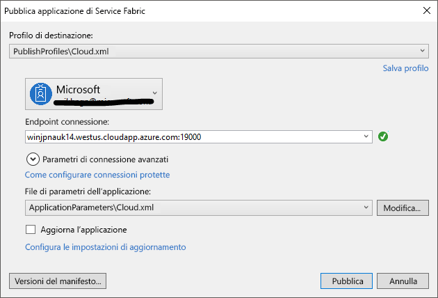

# <a name="deploy-an-application-to-a-party-cluster-in-azure"></a>Distribuire un'applicazione in un cluster di entità in Azure
Questa esercitazione è la seconda parte di una serie e illustra come distribuire un'applicazione di Azure Service Fabric in un cluster di entità in Azure.

Nella seconda parte della serie di esercitazioni si apprenderà come:
> [!div class="checklist"]
> * [Creare un'applicazione di Service Fabric .NET](service-fabric-tutorial-create-dotnet-app.md)
> * Distribuire l'applicazione in un cluster remoto
> * [Configurare l'integrazione continua e la distribuzione continua usando Visual Studio Team Services](service-fabric-tutorial-deploy-app-with-cicd-vsts.md)
> * [Configurare il monitoraggio e la diagnostica per l'applicazione](service-fabric-tutorial-monitoring-aspnet.md)

In questa serie di esercitazioni si apprenderà come:
> [!div class="checklist"]
> * Distribuire un'applicazione in un cluster remoto usando Visual Studio
> * Rimuovere un'applicazione da un cluster usando Service Fabric Explorer

## <a name="prerequisites"></a>prerequisiti
Prima di iniziare questa esercitazione:
- Se non si ha una sottoscrizione di Azure, creare un [account gratuito](https://azure.microsoft.com/free/?WT.mc_id=A261C142F)
- [Installare Visual Studio 2017](https://www.visualstudio.com/) e installare i carichi di lavoro **Sviluppo di Azure** e **Sviluppo ASP.NET e Web**.
- [Installare Service Fabric SDK](service-fabric-get-started.md)

## <a name="download-the-voting-sample-application"></a>Scaricare l'applicazione di voto di esempio
Se l'applicazione di voto di esempio non è stata compilata nella [parte 1 di questa serie di esercitazioni](service-fabric-tutorial-create-dotnet-app.md), è possibile scaricarla. In una finestra di comando eseguire il comando seguente per clonare il repository dell'app di esempio nel computer locale.

```
git clone https://github.com/Azure-Samples/service-fabric-dotnet-quickstart
```

## <a name="set-up-a-party-cluster"></a>Configurare un cluster di entità
I cluster di entità sono cluster Service Fabric gratuiti e disponibili per un periodo di tempo limitato ospitati in Azure e gestiti dal team di Service Fabric, in cui chiunque può distribuire applicazioni e ottenere informazioni sulla piattaforma. Gratuitamente.

Per accedere a un cluster di entità, passare a questo sito: http://aka.ms/tryservicefabric e seguire le istruzioni per ottenere l'accesso a un cluster. È necessario un account Facebook o GitHub per ottenere l'accesso a un cluster di entità.

Se si vuole, è possibile usare un proprio cluster anziché il cluster di entità.  Il front-end Web ASP.NET Core usa il proxy inverso per comunicare con il back-end del servizio con stato.  Nei cluster di entità e nel cluster di sviluppo locale il proxy inverso è abilitato per impostazione predefinita.  Se si distribuisce l'applicazione di voto di esempio in un proprio cluster, è necessario [abilitare il proxy inverso nel cluster](service-fabric-reverseproxy.md#setup-and-configuration).

> [!NOTE]
> I cluster di entità non sono protetti, quindi le applicazioni e tutti i dati inseriti negli stessi possono essere visibili ad altri utenti. Non distribuire elementi che gli altri utenti non devono vedere. Assicurarsi di leggere tutti i dettagli nelle Condizioni per l'utilizzo.

## <a name="deploy-the-app-to-the-azure"></a>Distribuire l'app in Azure
Ora che l'applicazione è pronta, è possibile distribuirla nel cluster di entità direttamente da Visual Studio.

1. Fare clic con il pulsante destro del mouse su **Voting** in Esplora soluzioni e scegliere **Pubblica**.

    

2. Digitare l'endpoint della connessione del cluster di entità nel campo **Endpoint connessione** e fare clic su **Pubblica**.

    Completata la pubblicazione, dovrebbe essere possibile inviare una richiesta all'applicazione usando un browser.

3. Aprire il browser preferito, digitare l'indirizzo del cluster (l'endpoint di connessione senza le informazioni sulla porta, ad esempio win1kw5649s.westus.cloudapp.azure.com).

    Deve apparire lo stesso risultato visualizzato quando si esegue l'applicazione in locale.

    

## <a name="remove-the-application-from-a-cluster-using-service-fabric-explorer"></a>Rimuovere l'applicazione da un cluster usando Service Fabric Explorer
Service Fabric Explorer è un'interfaccia utente grafica che consente di esplorare e gestire le applicazioni in un cluster Service Fabric.

Per rimuovere l'applicazione dal cluster di entità:

1. Passare a Service Fabric Explorer usando il collegamento indicato nella pagina di iscrizione al cluster di entità. Ad esempio, http://win1kw5649s.westus.cloudapp.azure.com:19080/Explorer/index.html.

2. In Service Fabric Explorer passare al nodo **fabric://Voting** nella visualizzazione struttura ad albero sul lato sinistro.

3. Fare clic sul pulsante **Azione** nel riquadro **Informazioni di base** a destra e scegliere **Elimina applicazione**. Confermare l'eliminazione dell'istanza di applicazione per rimuovere l'istanza dell'applicazione in esecuzione nel cluster.


## <a name="remove-the-application-type-from-a-cluster-using-service-fabric-explorer"></a>Rimuovere il tipo di applicazione da un cluster usando Service Fabric Explorer
Le applicazioni vengono distribuite come tipi di applicazioni in un cluster Service Fabric, che consente di avere più istanze e versioni dell'applicazione in esecuzione nel cluster. Dopo avere rimosso l'istanza dell'applicazione in esecuzione, è anche possibile rimuovere il tipo, per completare la pulizia della distribuzione.

Per altre informazioni sul modello di applicazione in Service Fabric, vedere [Modellare un'applicazione in Service Fabric](service-fabric-application-model.md).

1. Passare al nodo **VotingType** nella visualizzazione struttura ad albero.

2. Fare clic sul pulsante **Azione** nel riquadro **Informazioni di base** a destra e scegliere **Unprovision Type** (Annulla provisioning tipo). Confermare l'annullamento del provisioning del tipo di applicazione.


L'esercitazione è terminata.

## <a name="next-steps"></a>Passaggi successivi
Questa esercitazione illustra come:

> [!div class="checklist"]
> * Distribuire un'applicazione in un cluster remoto usando Visual Studio
> * Rimuovere un'applicazione da un cluster usando Service Fabric Explorer

Passare all'esercitazione successiva:
> [!div class="nextstepaction"]
> [Impostare l'integrazione continua usando Visual Studio Team Services](service-fabric-tutorial-deploy-app-with-cicd-vsts.md)
