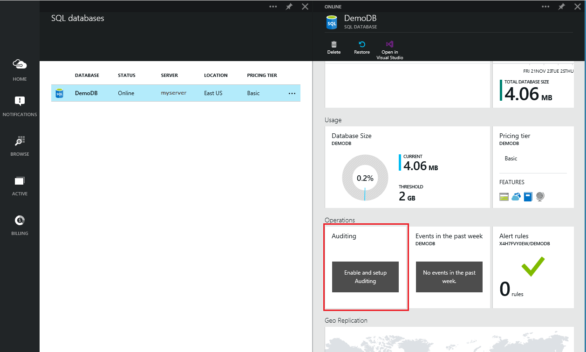

<properties title="Get started with SQL database auditing" pageTitle="Get started with SQL database auditing | Azure" description="Get started with SQL database auditing" metaKeywords="" services="sql-database" solutions="data-management" documentationCenter="" authors="jeffreyg" videoId="" scriptId=""  />

<tags ms.service="sql-database" ms.workload="data-management" ms.tgt_pltfrm="na" ms.devlang="na" ms.topic="article" ms.date="01/01/1900" ms.author="jeffreyg"/>

# Introduzione al controllo del database SQL

Il servizio di controllo del database SQL di Azure tiene traccia degli eventi di database e scrive gli eventi controllati in un log di controllo nell'account di archiviazione di Azure. Il servizio di controllo è disponibile in anteprima per i livelli di servizio Basic, Standard e Premium. Per abilitare il controllo, [iscriversi all'anteprima][iscriversi all'anteprima].

Il controllo consente di agevolare la conformità alle normative, comprendere le attività del database e ottenere informazioni su eventuali discrepanze e anomalie che potrebbero indicare problemi aziendali o sospette violazioni della sicurezza.

Gli strumenti di controllo abilitano e facilitano il rispetto degli standard di conformità, ma non garantiscono la conformità. Per altre informazioni sui programmi di Azure che supportano la conformità agli standard, vedere il [Centro protezione Azure][Centro protezione Azure].

-   [Nozioni di base sul controllo del database SQL di Azure][Nozioni di base sul controllo del database SQL di Azure]
-   [Configurare il controllo per il database][Configurare il controllo per il database]
-   [Analizzare i log di controllo e i report][Analizzare i log di controllo e i report]

## Nozioni di base sul controllo del database SQL di Azure</a>

Il controllo si configura nel portale di anteprima di Azure e non fa differenza se il database è stato creato usando il portale di Azure o il portale di anteprima di Azure. Il controllo del database SQL consente di:

-   **Conservare** un audit trail di eventi selezionati. Definire categorie di azioni ed eventi di database da registrare.
-   **Creare report** sulle attività del database. I report preconfigurati e il dashboard consentono di iniziare rapidamente a usare il monitoraggio degli eventi e delle attività.
-   **Analizzare** i report. Individuare eventi sospetti, attività insolite e tendenze.

È possibile controllare le attività e gli eventi seguenti:

-   **Accesso ai dati**
-   **Modifiche dello schema (DDL)**
-   **Modifiche dei dati (DML)**
-   **Account, ruoli e autorizzazioni (DCL)**
-   **Eccezioni di sicurezza**

Per altri dettagli sulle attività e gli eventi registrati, scaricare il file di [riferimento sul formato dei log di controllo][riferimento sul formato dei log di controllo].

È anche possibile scegliere l'account di archiviazione in cui salvare i log di controllo.

### Stringa di connessione con sicurezza abilitata

Quando si configura il controllo, Azure fornisce una stringa di connessione con sicurezza abilitata per il database. Verranno registrati solo gli eventi e le attività delle applicazioni client che usano questa stringa di connessione, quindi è necessario aggiornare le applicazioni client esistenti in modo che usino il nuovo formato di stringa.

Formato tradizionale della stringa di connessione: \<*nome server*\>.database.windows.net

Stringa di connessione con sicurezza abilitata: \<*nome server*\>.database.**secure**.windows.net

## </a>Configurare il controllo per il database

1.  [Iscriversi all'anteprima della funzionalità di controllo][iscriversi all'anteprima].
2.  È anche necessario [iscriversi all'anteprima dei nuovi livelli di servizio][iscriversi all'anteprima dei nuovi livelli di servizio] e creare un database Basic, Standard o Premium.
3.  Avviare il [portale di anteprima di Azure][portale di anteprima di Azure] all'indirizzo <https://portal.azure.com>.
4.  Fare clic sul database che si vuole controllare e fare clic su **Anteprima controllo** per abilitare l'anteprima del controllo e avviare il pannello di configurazione del controllo.

    

5.  Nel pannello di configurazione del controllo selezionare l'account di archiviazione di Azure in cui salvare i log. **Suggerimento:** per sfruttare al massimo i modelli di report preconfigurati, usare lo stesso account di archiviazione per tutti i database controllati.

    ![][1]

6.  In **Opzioni di controllo** fare clic su **Tutto** per registrare tutti gli eventi oppure scegliere singoli tipi di evento.

    ![][2]

7.  Selezionare **Salva questa configurazione come predefinita** per applicare le impostazioni a tutti i future database nel server e a qualsiasi database per cui non è stato ancora configurato il controllo. In seguito sarà possibile eseguire l'override delle impostazioni per qualsiasi database seguendo la stessa procedura.

    ![][3]

8.  Fare clic su **Mostra stringhe di connessione database** e quindi copiare o prendere nota della stringa di connessione con sicurezza abilitata appropriata per l'applicazione. Usare questa stringa per qualsiasi applicazione client di cui si vogliono monitorare le attività.

    ![][4]

9.  Fare clic su **OK**.

## Analizzare i log di controllo e i report</a>

I log di controllo vengono aggregati in un'unica tabella di Azure Store denominata **AuditLogs** nell'account di archiviazione di Azure selezionato durante la configurazione. È possibile visualizzare i file di log con uno strumento come [Azure Storage Explorer][Azure Storage Explorer].

È possibile scaricare un modello di report dashboard preconfigurato in formato [foglio di calcolo di Excel][foglio di calcolo di Excel], che consente di analizzare rapidamente i dati di log. Per usare il modello nei log di controllo sono necessari Excel 2013 o versione successiva e Power Query, disponibile per il download [qui][qui].

Il modello contiene dati di esempio fittizi ed è possibile configurare Power Query per l'importazione diretta del log di controllo dall'account di archiviazione di Azure.

Per istruzioni dettagliate sull'uso del modello di report, scaricare il documento con la [procedura][procedura].

![][5]

<!--Anchors-->
<!--Image references-->
<!--Link references-->

  [iscriversi all'anteprima]: http://go.microsoft.com/fwlink/?LinkId=404163
  [Centro protezione Azure]: http://azure.microsoft.com/en-us/support/trust-center/compliance/
  [Nozioni di base sul controllo del database SQL di Azure]: #subheading-1
  [Configurare il controllo per il database]: #subheading-2
  [Analizzare i log di controllo e i report]: #subheading-3
  [riferimento sul formato dei log di controllo]: http://go.microsoft.com/fwlink/?LinkId=506733
  [iscriversi all'anteprima dei nuovi livelli di servizio]: https://account.windowsazure.com/PreviewFeatures?fid=premiumdb
  [portale di anteprima di Azure]: https://portal.azure.com
  
  [1]: ./media/sql-database-auditing-get-started/sql-database-get-started-storageaccount.png
  [2]: ./media/sql-database-auditing-get-started/sql-database-auditing-eventtype.png
  [3]: ./media/sql-database-auditing-get-started/sql-database-get-started-saveconfigasdefault.png
  [4]: ./media/sql-database-auditing-get-started/sql-database-get-started-connectionstring.png
  [Azure Storage Explorer]: http://azurestorageexplorer.codeplex.com/
  [foglio di calcolo di Excel]: http://go.microsoft.com/fwlink/?LinkId=403540
  [qui]: http://www.microsoft.com/en-us/download/details.aspx?id=39379
  [procedura]: http://go.microsoft.com/fwlink/?LinkId=506731
  [5]: ./media/sql-database-auditing-get-started/sql-database-auditing-dashboard.png
