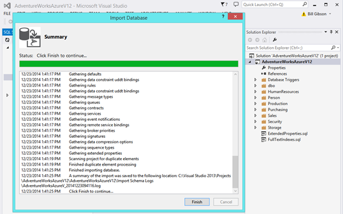
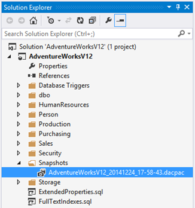

<properties 
   pageTitle="Migrazione mediante Visual Studio e SSDT" 
   description="Database SQL di Microsoft Azure, migrazione del database, importazione del database, esportazione del database, migrazione guidata" 
   services="sql-database" 
   documentationCenter="" 
   authors="pehteh" 
   manager="jeffreyg" 
   editor="monicar"/>

<tags
   ms.service="sql-database"
   ms.devlang="NA"
   ms.topic="article"
   ms.tgt_pltfrm="NA"
   ms.workload="data-management" 
   ms.date="04/14/2015"
   ms.author="pehteh"/>

#Aggiornare il database sul posto, quindi distribuire database SQL di Azure

Utilizzare questa opzione quando la migrazione di un database all’anteprima della versione più recente di database SQL V12 di Azure richiede modifiche dello schema che non possono essere risolte utilizzando la procedura guidata di migrazione di SQL Azure (SAMW). Ciò si verifica se il database utilizza funzionalità di SQL Server non supportate o non ancora supportate in database SQL di Azure. In questa opzione, Visual Studio viene utilizzato innanzitutto per creare un progetto di database dal database di origine. La piattaforma di destinazione del progetto viene quindi impostata sul database SQL V12 di Azure e il progetto viene compilato per identificare tutti i problemi di compatibilità. SAMW consente di risolvere molti, ma non tutti, i problemi di compatibilità, pertanto viene utilizzato per elaborare tutti gli script nei progetti come primo passaggio. L’utilizzo di SAMW è facoltativo, ma consigliato. La compilazione del progetto dopo l'elaborazione dei file di script con SAMW consentirà l’identificazione dei restanti problemi che devono essere risolti manualmente utilizzando gli strumenti di modifica T-SQL in Visual Studio. Una volta compilato correttamente il progetto, lo schema viene pubblicato nuovamente in una copia (scelta consigliata) del database di origine per aggiornare il relativo schema e i dati sul posto. Il database aggiornato viene quindi distribuito in Azure, direttamente o mediante l’esportazione e l’importazione di un file BACPAC, utilizzando le tecniche descritte nell’opzione 1.
 
Dal momento che questa opzione implica l’aggiornamento dello schema del database sul posto prima della distribuzione in Azure, è consigliabile eseguire questa operazione su una copia del database. Lo strumento di confronto degli schemi di Visual Studio può essere utilizzato per esaminare il set completo delle modifiche che verranno applicate al database prima di pubblicare il progetto.

L’utilizzo di SAMW è facoltativo ma consigliato. SAMW consentirà di rilevare problemi di compatibilità nel corpo di funzioni, stored procedure e trigger che altrimenti non verranno rilevati fino alla distribuzione. Se è necessario eseguire la distribuzione del solo schema, è possibile pubblicare lo schema aggiornato direttamente da Visual Studio al database SQL di Azure.

## Passaggi della migrazione

1.	Aprire **Esplora oggetti di SQL Server** in Visual Studio. Utilizzare **Aggiungi SQL Server** per connettersi all'istanza di SQL Server contenente il database in corso di migrazione. Individuare il database in Esplora risorse, fare clic su di esso e selezionare **Crea nuovo progetto...** 

2.	Configurare le impostazioni di importazione su **Importa solo oggetti con ambito applicazione**. Deselezionare le opzioni per importare gli account di accesso, le autorizzazioni e le impostazioni del database a cui si fa riferimento.

3.	Fare clic su **Avvia** per importare il database e creare il progetto che conterrà un file di script T-SQL per ogni oggetto nel database. I file di script vengono nidificati nelle cartelle all'interno del progetto.

4.	In Esplora soluzioni di Visual Studio fare clic con il pulsante destro del mouse sul progetto di database e scegliere Proprietà. Verrà aperta la pagina **Impostazioni progetto** in cui è necessario configurare la piattaforma di destinazione su database SQL V12 di Microsoft Azure.

5.	Facoltativo: fare clic con il pulsante destro del mouse sul progetto e scegliere **Compila** per compilare il progetto (questa operazione non è strettamente necessaria a questo punto, ma, se eseguita, fornirà una linea di base per il numero di problemi di compatibilità del progetto e l'efficacia dei passaggi successivi).

6.	Facoltativo: fare clic con il pulsante destro del mouse sul progetto e scegliere **Esegui snapshot progetto**. Eseguendo uno snapshot all'inizio e potenzialmente nelle fasi successive durante la trasformazione, è possibile utilizzare lo strumento di confronto degli schemi per confrontare lo schema in ogni fase.

 - L’esecuzione dello snapshot del progetto consente di creare un file con estensione dacpac con timestamp, contenente lo schema completo del progetto. È possibile modificare il nome del file per indicare in quale fase del processo è stato creato questo snapshot. 

7.	Elaborare i file di script importati utilizzando la procedura guidata di migrazione di SQL Azure. Utilizzare l'opzione di cartella e selezionare la cartella radice del progetto. 

8.	La procedura guidata elaborerà ciascun file di script in questa cartella e in tutte le sottocartelle. Nella pagina successiva verrà visualizzato un riepilogo dei risultati. 
9.	Fare clic su Avanti per visualizzare un elenco di riepilogo dei file che sono stati modificati. 

>Si noti che vengono eseguite copie temporanee sia dei file originali prima dell’elaborazione, sia dei file interessati dopo l'elaborazione nei percorsi indicati nella parte superiore della pagina.

10.	Scegliere Sovrascrivi e OK nella finestra di dialogo di conferma. I file originali verranno sovrascritti con i file modificati. Si noti che verranno sovrascritti solo i file che sono stati effettivamente modificati.
11.	Facoltativa. Utilizzare Confronto schema per confrontare il progetto a uno snapshot precedente oppure al database originale per comprendere quali modifiche sono state apportate mediante la procedura guidata. A questo punto è inoltre possibile eseguire un altro snapshot. 

12.	Compilare nuovamente il progetto (vedere il passaggio precedente) per determinare quali errori rimangono.

13.	Lavorare agli errori sistematici per risolvere ciascun problema. Valutare l'impatto di ciascuna modifica sulle applicazioni che utilizzano il database.

14.	Quando il database è privo di errori, fare clic con il pulsante destro del mouse sul progetto e selezionare **Pubblica** per compilare e pubblicare il database in una copia del database di origine (si consiglia di utilizzare una copia, almeno inizialmente). L'obiettivo di questo passaggio consiste nell’aggiornare lo schema del database di origine e apportare le modifiche conseguenti ai dati nel database.
- Prima della pubblicazione, a seconda della versione di SQL Server di origine, potrebbe essere necessario reimpostare la piattaforma di destinazione del progetto per consentire la distribuzione. Se si esegue la migrazione di un database SQL Server precedente, non è necessario introdurre nel progetto alcuna funzionalità che non sia supportata nell’SQL Server di origine, a meno che il database non venga prima migrato a una versione più recente di SQL Server. 
- È necessario configurare il passaggio della pubblicazione per abilitare le opzioni di pubblicazione appropriate. Ad esempio, se gli oggetti non supportati nel progetto sono stati eliminati o commentati, devono essere eliminati dal database. Pertanto, è necessario consentire alla pubblicazione di eliminare i dati nel database di destinazione. 
- Se si prevede di pubblicare più volte 

15.	Distribuire il database copiato in database SQL di Azure utilizzando le tecniche descritte nell’opzione 1.

## Convalida della migrazione

Dopo aver completato la migrazione, è consigliabile confrontare lo schema nel database migrato con lo schema nel database di origine, per acquisire familiarità con eventuali modifiche apportate e verificare che non causino problemi durante la migrazione delle applicazioni nel nuovo database. È possibile utilizzare lo strumento Confronto schema incluso negli strumenti di SQL Server in Visual Studio per eseguire il confronto. È possibile confrontare il database nel database SQL di Azure con il database SQL Server originale o a uno snapshot eseguito quando il database è stato importato per la prima volta nel progetto.

1.	Connettersi al server nel database SQL di Azure contenente il database migrato e individuare il database. 

2.	Fare clic con il pulsante destro del mouse sul database e scegliere **Confronto schema...**. Verrà aperto un nuovo confronto schema con il database di Azure selezionato come origine sul lato sinistro. Utilizzare il menu a discesa Seleziona destinazione sul lato destro per selezionare il database di destinazione o il file di snapshot per il confronto.

3.	Con l'origine e la destinazione selezionate, fare clic su Confronta per attivare il confronto. Il caricamento dello schema da un database complesso nel database SQL di Azure può richiedere molto tempo. Il caricamento dello schema e l’esecuzione di altre attività di metadati in un database SQL di Azure richiederà meno tempo con un livello di prezzo più alto.

4.	Una volta completato il confronto, esaminare le differenze. Di norma, a meno che siano presenti problemi, non devono essere applicate modifiche a uno schema.

Nel confronto degli schemi sotto Adventure Works 2014, il database SQL V12 di Azure a sinistra trasformato e migrato tramite la procedura guidata di migrazione di SQL Azure viene confrontato con il database di origine in SQL Server a destra.

<!---HONumber=58-->