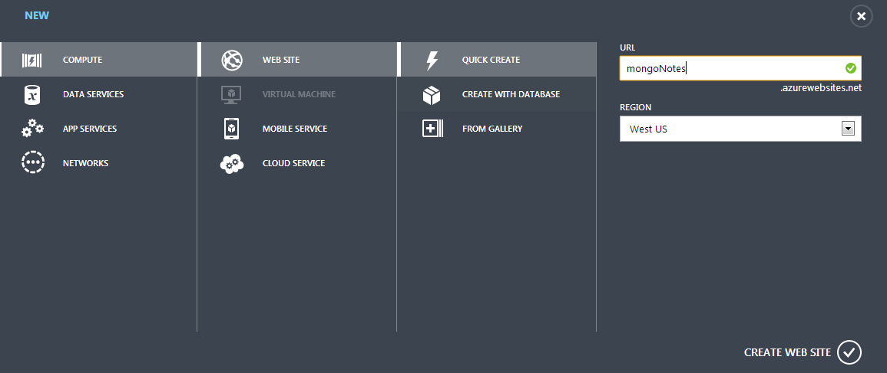
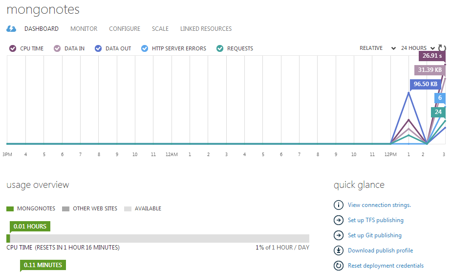
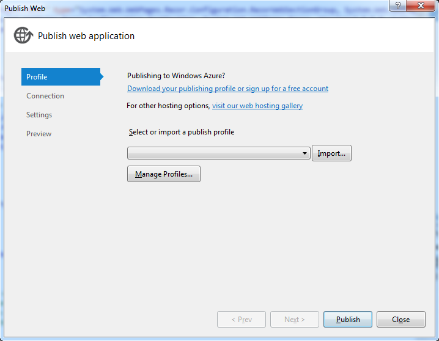
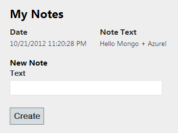

<properties linkid="develop-net-tutorials-website-with-mongodb-mongolab" urlDisplayName="Web Site with MongoDB on MongoLab" pageTitle="Create a Web Site that uses MongoDB on MongoLab (.NET)" metaKeywords="" description="Learn how to create an Azure web site that stores data in MongoDB hosted by MongoLab." metaCanonical="" services="web-sites" documentationCenter=".NET" title="Create a C# ASP.NET Application on Azure with MongoDB using the MongoLab Add-On" authors="" solutions="" manager="" editor="" />

Creazione di un'applicazione C\# ASP.NET in Azure con MongoDB mediante il componente aggiuntivo MongoLab
========================================================================================================

*Autore: Eric Sedor, MongoLab*

Salve, benvenuti nel database MongoDB distribuito come servizio. In questa esercitazione si apprenderà come:

1.  [Eseguire il provisioning del database](#provision) - Il componente aggiuntivo [MongoLab](http://mongolab.com) di Azure Store fornisce un database MongoDB ospitato nel cloud di Azure e gestito dalla piattaforma database cloud di MongoLab.
2.  [Creare l'app](#create) - Sarà una semplice applicazione C\# ASP.NET MVC per prendere note.
3.  [Distribuire l'app](#deploy) - Collegando alcuni hook di configurazione, il push del codice diventerà davvero semplice.
4.  [Gestire il database](#manage) - Verrà infine illustrato il portale di gestione del database basato sul Web di MongoLab, in cui è possibile cercare, visualizzare e modificare i dati con facilità.

In qualsiasi momento nel corso di questa esercitazione, sarà possibile inviare un messaggio di posta elettronica con eventuali domande a <support@mongolab.com>.

Avvio rapido
------------

Se si dispone già di un'applicazione Azure e di un sito Web che si desidera utilizzare o si conosce già Azure Store, utilizzare questa sezione per iniziare rapidamente. In caso contrario, passare alla sezione [Provisioning del database](#provision) più avanti.

1.  Aprire Azure Store.

     
2.  Acquistare il componente aggiuntivo MongoLab.

     
3.  Fare clic sul componente aggiuntivo MongoLab nell'elenco Add-Ons e fare clic su **Connection Info**.

     
4.  Copiare MONGOLAB\_URI negli Appunti.

     

     **Questo URI contiene il nome utente e la password per il database. Trattare queste informazioni come dati sensibili e non condividerle.**
5.  Aggiungere il valore all'elenco Connection Strings nel menu Configuration dell'applicazione Web di Azure:

     
6.  In **Name** immettere MONGOLAB\_URI.
7.  In **Value** incollare la stringa di connessione ottenuta nella sezione precedente.
8.  Selezionare **Custom** nell'elenco a discesa Type (anziché la voce predefinita **SQLAzure**).
9.  In Visual Studio installare il driver Mongo C\# selezionando **Strumenti \> Gestione pacchetti libreria \> Console di Gestione pacchetti**. Nella console di gestione dei pacchetti, digitare **Install-Package mongocsharpdriver** e premere **INVIO**.
10. Configurare un hook nel codice per ottenere l'URI di connessione MongoLab da una variabile di ambiente:

        using MongoDB.Driver;  
 		...
 		private string connectionString = System.Environment.GetEnvironmentVariable("CUSTOMCONNSTR_MONGOLAB_URI");
 		...
 		MongoServer server = MongoServer.Create(connectionString);  

    Nota: Azure aggiunge il prefisso **CUSTOMCONNSTR\_** alla stringa di connessione dichiarata in origine. Per questo motivo il codice fa riferimento a **CUSTOMCONNSTR\_MONGOLAB\_URI.** anziché a **MONGOLAB\_URI**.

Si passerà ora all'esercitazione completa.

Provisioning del database
-------------------------

[WACOM.INCLUDE [howto-provision-mongolab](../includes/howto-provision-mongolab.md)]

Creazione dell'app
------------------

In questa sezione verrà trattata la creazione di un progetto C\# ASP.NET di Visual Studio e illustrato l'utilizzo del driver C\# MongoDB per creare una semplice app per prendere appunti. L'obiettivo è poter visitare il sito Web, scrivere una nota e visualizzare tutte le note lasciate in precedenza.

L'attività di sviluppo verrà eseguita in Visual Studio Express 2012 per il Web.

### Creare il progetto

Per iniziare, verrà utilizzato un modello di Visual Studio per questa app di esempio. Assicurarsi di utilizzare .NET Framework 4.0.

1.  Selezionare **File \> nuovo progetto**. Viene visualizzata la finestra di dialogo Nuovo progetto:

     
2.  Selezionare **Installati \> Modelli \> Visual C\# \> Web**.
3.  Selezionare .**.NET Framework 4** dal menu a discesa Versione .NET (*note: Al momento Framework 4.5 non è utilizzabile*).

    
4.  Scegliere **Applicazione Web ASP.NET MVC 4**.
5.  Digitare *mongoNotes* come **Nome progetto**. Se si sceglie un nome diverso, sarà necessario modificare il codice fornito in tutto il presente tutorial.
6.  Fare clic su **OK**. Viene visualizzata la finestra di dialogo del modello di progetto:

     
7.  Selezionare **Applicazione Internet** e fare clic su **OK**. Il progetto viene compilato.
8.  Scegliere **Strumenti \> Gestione pacchetti libreria \> Console di Gestione pacchetti**. Nella console di gestione dei pacchetti, digitare **Install-Package mongocsharpdriver** e premere **INVIO**.

     
     Il driver MongoDB C\# è integrato con il progetto e la riga seguente viene aggiunta automaticamente al file *packages.config*:

        < package id="mongocsharpdriver" version="1.8" targetFramework="net40" / >

### Aggiungere un modello di nota

In primo luogo, stabilire un modello per le note, semplicemente con una data e un contenuto di testo.

1.  In Esplora soluzioni fare clic con il pulsante destro del mouse su **Modelli** e scegliere **Aggiungi \> Classe**. Denominare la nuova classe *Note.cs*.
2.  Sostituire il codice generato automaticamente per questa classe con il seguente:

         using System;
         using System.Collections.Generic;
         using System.Linq;
         using System.Web;
         using MongoDB.Bson.Serialization.Attributes;
         using MongoDB.Bson.Serialization.IdGenerators;
         using MongoDB.Bson;
                    
         namespace mongoNotes.Models
         {
             public class Note
             {
                 public Note()
                 {
                     Date = DateTime.UtcNow;
                 }
                    
                 private DateTime date;
            
                 [BsonId(IdGenerator = typeof(CombGuidGenerator))]
                 public Guid Id { get; set; }
            
                 [BsonElement("Note")]
                 public string Text { get; set; }
            
                 [BsonElement("Date")]
                 public DateTime Date {
                     get { return date.ToLocalTime(); }
                     set { date = value;}
                 }
             }
         }

### Aggiungere un livello di accesso ai dati

È importante stabilire un mezzo di accesso a MongoDB per recuperare e salvare le note. Il livello di accesso ai dati farà uso del modello di nota e verrà integrato in HomeController più avanti.

1.  In Esplora soluzioni fare clic con il pulsante destro del mouse sul progetto **mongoNotes** e selezionare **Aggiungi \> Nuova cartella**. Denominare la cartella **DAL**.
2.  Fare clic con il pulsante destro del mouse su **DAL** in Esplora soluzioni e selezionare **Aggiungi \> Classe**. Denominare la nuova classe *Dal.cs*.
3.  Sostituire il codice generato automaticamente per questa classe con il seguente:

         using System;
         using System.Collections.Generic;
         using System.Linq;
         using System.Web;
         using mongoNotes.Models;
         using MongoDB.Driver;
         using System.Configuration;

         namespace mongoNotes
         {
             public class Dal : IDisposable
             {
                 private MongoServer mongoServer = null;
                 private bool disposed = false;
            
                 private string connectionString = System.Environment.GetEnvironmentVariable("CUSTOMCONNSTR_MONGOLAB_URI");
            
                 private string dbName = "myMongoApp";
                 private string collectionName = "Notes";
            
                 // Default constructor.        
                 public Dal()
                 {
                 }
               
                 public List<Note> GetAllNotes()
                 {
                     try
                     {
                         MongoCollection<Note> collection = GetNotesCollection();
                         return collection.FindAll().ToList<Note>();
                     }
                     catch (MongoConnectionException)
                     {
                         return new List<Note>();
                     }
                 }
            
                 // Creates a Note and inserts it into the collection in MongoDB.
                 public void CreateNote(Note note)
                 {
                     MongoCollection<Note> collection = getNotesCollectionForEdit();
                     try
                     {
                         collection.Insert(note, SafeMode.True);
                     }
                     catch (MongoCommandException ex)
                     {
                         string msg = ex.Message;
                     }
                 }
            
                 private MongoCollection<Note> GetNotesCollection()
                 {
                     MongoServer server = MongoServer.Create(connectionString);
                     MongoDatabase database = server[dbName];
                     MongoCollection<Note> noteCollection = database.GetCollection<Note>(collectionName);
                     return noteCollection;
                 }
            
                 private MongoCollection<Note> getNotesCollectionForEdit()
                 {
                     MongoServer server = MongoServer.Create(connectionString);
                     MongoDatabase database = server[dbName];
                     MongoCollection<Note> notesCollection = database.GetCollection<Note>(collectionName);
                     return notesCollection;
                 }
            
                 # region IDisposable
            
                 public void Dispose()
                 {
                     this.Dispose(true);
                     GC.SuppressFinalize(this);
                 }
            
                 protected virtual void Dispose(bool disposing)
                 {
                     if (!this.disposed)
                     {
                         if (disposing)
                         {
                             if (mongoServer != null)
                             {
                                 this.mongoServer.Disconnect();
                             }
                         }
                     }
            
                     this.disposed = true;
                 }
            
                 # endregion
             }
         }

4.  Notare il frammento seguente nel codice qui sopra:

         private string connectionString = System.Environment.GetEnvironmentVariable("CUSTOMCONNSTR_MONGOLAB_URI");
         private string dbName = "myMongoApp";  

    Qui si accedere a una variabile di ambiente che è possibile configurare in seguito. Se un'istanza locale di mongo è in esecuzione a scopo di sviluppo, potrebbe essere necessario impostare temporaneamente questo valore su "localhost".

	Impostare anche il nome del database. In particolare, impostare il valore **dbName** sul nome immesso quando si è eseguito il provisioning del componente aggiuntivo MongoLab.

1. Esaminare infine il codice seguente in **GetNotesCollection()**:

        MongoServer server = MongoServer.Create(connectionString);
        MongoDatabase database = server[dbName];
        MongoCollection<Note> notesCollection = database.GetCollection<Note>  

     Non vi sono modifiche da apportare qui. È sufficiente sapere che questo è il metodo tramite cui si ottiene un oggetto MongoCollection per l'esecuzione di inserimenti, aggiornamenti e query, come illustrato di seguito per **GetAllNotes()**:

        collection.FindAll().ToList<Note>();

Per ulteriori informazioni sull'utilizzo del driver C\# MongoDB, vedere la [guida introduttiva al driver CSharp](http://www.mongodb.org/display/DOCS/CSharp+Driver+Quickstart "guida introduttiva al driver CSharp") sul sito mongodb.org.

### Aggiungere una visualizzazione di creazione

A questo punto è necessario aggiungere una visualizzazione per la creazione di una nuova nota.

1.  Fare clic con il pulsante destro del mouse sulla voce **Visualizzazioni \> Home** in Esplora soluzioni, quindi selezionare **Aggiungi \> Visualizzazione**. Denominare la nuova visualizzazione **Create** e fare clic su **Aggiungi**.
2.  Sostituire il codice generato automaticamente per questa visualizzazione (**Create.cshtml**) con il seguente:

         @model mongoNotes.Models.Note
            
         
         
         
            
         @using (Html.BeginForm("Create", "Home")) {
             @Html.ValidationSummary(true)
             <fieldset>
                 <legend>New Note</legend>
                 <h3>New Note</h3>        
                 

                     @Html.LabelFor(model => model.Text)
                 

                 

                     @Html.EditorFor(model => model.Text)
                 

                

                        <input type="submit" value="Create" />
                   

            </fieldset>
         }

### Modificare index.cshtml

A questo punto, aggiungere un semplice layout per la visualizzazione e la creazione delle note nel sito Web.

1.  In **Visualizzazioni \> Home** aprire **Index.cshtml** e sostituirne il contenuto con quello seguente:

         @model IEnumerable<mongoNotes.Models.Note>
            
         @{
             ViewBag.Title = "Notes";
         }
            
         <h2>My Notes</h2>

         <table border="1">
             <tr>
                 <th>Date</th>
                 <th>Note Text</th>       
             </tr>
            
         @foreach (var item in Model) {
             <tr>
                 <td>
                     @Html.DisplayFor(modelItem => item.Date)
                 </td>
                 <td>
                     @Html.DisplayFor(modelItem => item.Text)
                 </td>        
             </tr>
         }
            
         </table>
         
  @Html.Partial("Create", new mongoNotes.Models.Note())

### Modificare HomeController.cs

Infine, HomeController deve essere messo in grado di creare un'istanza per il livello di accesso ai dati e di applicarla alle visualizzazioni.

1.  In Esplora soluzioni aprire **HomeController.cs** da **Controller** e sostituirne il contenuto con quello riportato di seguito:

         using System;
         using System.Collections.Generic;
         using System.Linq;
         using System.Web;
         using System.Web.Mvc;
         using mongoNotes.Models;
         using System.Configuration;
            
         namespace mongoNotes.Controllers
         {
             public class HomeController : Controller, IDisposable
             {
                 private Dal dal = new Dal();
                 private bool disposed = false;
                 //
                 // GET: /Task/
            
                 public ActionResult Index()
                 {
                     return View(dal.GetAllNotes());
                 }
            
                 //
                 // GET: /Task/Create
            
                 public ActionResult Create()
                 {
                     return View();
                 }
            
                 //
                 // POST: /Task/Create
            
                 [HttpPost]
                 public ActionResult Create(Note note)
                 {
                     try
                     {
                         dal.CreateNote(note);
                         return RedirectToAction("Index");
                     }
                     catch
                     {
                         return View();
                     }
                 }
            
                 public ActionResult About()
                 {
                     return View();
                 }
            
                 # region IDisposable
            
                 new protected void Dispose()
                 {
                     this.Dispose(true);
                     GC.SuppressFinalize(this);
                 }
            
                 new protected virtual void Dispose(bool disposing)
                 {
                     if (!this.disposed)
                     {
                         if (disposing)
                         {
                             this.dal.Dispose();
                         }
                     }
            
                     this.disposed = true;
                 }
            
                 # endregion
            
             }
         }

Distribuzione dell'app
----------------------

Ora che l'applicazione è stata sviluppata, è il momento di creare un sito Web di Azure per ospitarla, configurare tale sito Web e distribuire il codice. L'argomento principale di questa sezione è l'utilizzo della stringa di connessione MongoDB (URI). Si configurerà una variabile di ambiente nel sito Web con questo URI per mantenere l'URI separato dal codice. È consigliabile considerare l'URI come un'informazione riservata in quanto contiene le credenziali per connettersi al database.

### Creare un nuovo sito Web e ottenere il file di impostazioni di pubblicazione

La creazione di un sito web in Azure è molto facile, in particolare grazie al fatto che Azure genera automaticamente un profilo di pubblicazione per Visual Studio.

1.  Nel portale di Azure fare clic su **New**.

     
2.  Selezionare **Compute \> Web Site \> Quick Create**.

     
3.  Immettere un prefisso URL. Scegliere il nome desiderato ma tenere presente che deve essere univoco. "mongoNotes" non sarà probabilmente disponibile.
4.  Fare clic su **Create Web Site**.
5.  Al termine della creazione del sito Web, fare clic sul nome del sito Web nell'elenco di siti Web. Verrà visualizzato il dashboard del sito Web.

     
6.  Fare clic su **Download publish profile** in **quick glance**, quindi salvare il file .PublishSettings in una directory di propria scelta.

     

### Ottenere la stringa di connessione MongoLab

[WACOM.INCLUDE [howto-get-connectioninfo-mongolab](../includes/howto-get-connectioninfo-mongolab.md)]

### Aggiungere la stringa di connessione alle variabili di ambiente del sito Web

[WACOM.INCLUDE [howto-save-connectioninfo-mongolab](../includes/howto-save-connectioninfo-mongolab.md)]

### Pubblicare il sito web

1.  In Visual Studio fare clic con il pulsante destro del mouse sul progetto **mongoNotes** in Esplora soluzioni, quindi selezionare **Pubblica**. Viene visualizzata la relativa finestra di dialogo:

     
2.  Fare clic su **Importa** e selezionare il file .PublishSettings dalla directory di download scelta in precedenza. Il file popola automaticamente i valori nella finestra di dialogo Pubblica.
3.  Fare clic su **Convalida connessione** per eseguire il test del file.
4.  Dopo l'esito positivo della convalida, fare clic su **Pubblica**. Dopo il completamento della pubblicazione, viene aperta una nuova scheda del browser e viene visualizzato il sito Web.
5.  Immettere del testo per la nota, fare clic su **Create** e osservare i risultati.

     

Gestione del database
---------------------

[WACOM.INCLUDE [howto-access-mongolab-ui](../includes/howto-access-mongolab-ui.md)]

A questo punto verrà avviata un'applicazione C\# ASP.NET supportata da un database MongoDB ospitato da MongoLab. Ora che si dispone di un database MongoLab, è possibile contattare <support@mongolab.com> per eventuali domande o problemi relativamente al database o per assistenza su MongoDB o sul driver C\#. È ora possibile utilizzare l'applicazione.

