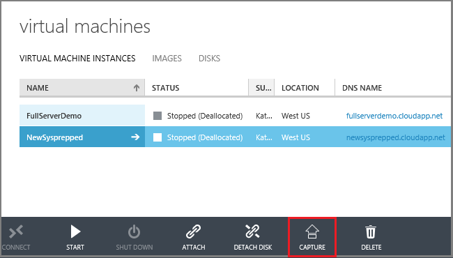
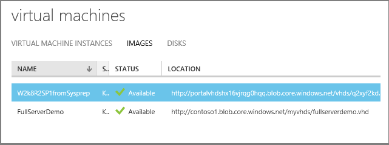

<properties urlDisplayName="Capture an image" pageTitle="Acquisire un'immagine di una macchina virtuale che esegue Windows Server" metaKeywords="Azure capture image vm, capturing vm" description="Learn how to capture an image of an Azure virtual machine (VM) running Windows Server 2008 R2. " metaCanonical="" services="virtual-machines" documentationCenter="" title="How to Capture an Image of a Virtual Machine Running Windows Server" authors="kathydav" solutions="" manager="timlt" editor="tysonn" />

<tags ms.service="virtual-machines" ms.workload="infrastructure-services" ms.tgt_pltfrm="vm-windows" ms.devlang="na" ms.topic="article" ms.date="11/24/2014" ms.author="kathydav" />

#Come acquisire una macchina virtuale Windows da usare come modello#

Questo articolo illustra come acquisire una macchina virtuale Linux che esegue Windows in modo da usarla come modello per creare altre macchine virtuali. Questo modello include il disco del sistema operativo e gli eventuali dischi dati connessi alla macchina virtuale. Poiché la configurazione di rete non è inclusa, è necessario definirla quando si creano le altre macchine virtuali che usano il modello.

Azure gestisce questo modello come immagine e la archivia in **Immagini personali**, che è anche la posizione in cui vengono archiviate le immagini caricate. Per altre informazioni sulle immagini, vedere [Informazioni sulle immagini di macchine virtuali in Azure] [].

##Operazioni preliminari##

Questa procedura presuppone che sia stata creata una macchina virtuale di Azure e che sia stato configurato il sistema operativo, inclusi gli eventuali dischi dati connessi. Se non si sono ancora effettuate queste operazioni, vedere le istruzioni seguenti:

- [Come creare una macchina virtuale personalizzata] []
- [Come collegare un disco dati a una macchina virtuale] []

##Acquisire la macchina virtuale##

1. Connettere la macchina virtuale facendo clic su **Connetti** sulla barra dei comandi. Per informazioni dettagliate, vedere [Come accedere a una macchina virtuale che esegue Windows Server] [].

2.	Aprire una finestra del Prompt dei comandi come amministratore.

3.	Modificare la directory in `%windir%\system32\sysprep` e quindi eseguire sysprep.exe.

4. 	Verrà visualizzata la finestra di dialogo **Utilità preparazione sistema**. Eseguire le operazioni seguenti:

	- In **Azione pulizia sistema** selezionare **Passare alla Configurazione guidata** e verificare che l'opzione **Generalizza** sia selezionata. Per altre informazioni sull'uso di Sysprep, vedere [Introduzione all'uso di SysPrep][].

	- In **Opzioni di arresto del sistema** selezionare **Arresta il sistema**.

	- Fare clic su **OK**.

	

7.	Sysprep arresta la macchina virtuale il cui stato nel [portale di gestione](http://manage.windowsazure.com) passa a **Interrotto**.

8.	Fare clic su **Macchine virtuali** e quindi selezionare la macchina virtuale di cui si vuole acquisire l'immagine.

9.	Nella barra dei comandi fare clic su **Acquisisci**.

	

	Viene visualizzata la finestra di dialogo **Acquisire la macchina virtuale**.

10.	In **Nome immagine** digitare un nome per la nuova immagine.

11.	Prima di aggiungere un'immagine di Windows Server al set di immagini personalizzate, è necessario eseguire Sysprep per generalizzare la macchina virtuale, come indicato nei passaggi precedenti. Fare clic su **Sysprep eseguito sulla macchina virtuale** per indicare che l'operazione è stata eseguita.

12.	Fare clic sul segno di spunta per acquisire l'immagine. Quando si acquisisce un'immagine di una macchina virtuale generalizzata, quest'ultima viene eliminata.

	La nuova immagine è ora disponibile in **Immagini**.

	

##Passaggi successivi##
L'immagine è pronta per essere usata come modello per la creazione di macchine virtuali. Per effettuare questa operazione, creare una macchina virtuale personalizzata usando il metodo **Da raccolta** e selezionare l'immagine creata. Per istruzioni, vedere [Come creare una macchina virtuale personalizzata] [].

	
[Informazioni sulle macchine virtuali in Azure]: http://msdn.microsoft.com/it-it/library/azure/dn790290.aspx
[Come creare una macchina virtuale personalizzata]: ../virtual-machines-create-custom/
[Come collegare un disco dati a una macchina virtuale]: ../storage-windows-attach-disk/
[Come accedere a una macchina virtuale che esegue Windows Server]:http://www.windowsazure.com/it-it/manage/windows/how-to-guides/log-on-a-windows-vm/
[Come usare Sysprep: un'introduzione]:http://technet.microsoft.com/it-it/library/bb457073.aspx
[Eseguire Sysprep.exe]: ./media/virtual-machines-capture-image-windows-server/SysprepCommand.png
[Immettere opzioni Sysprep.exe]: ./media/virtual-machines-capture-image-windows-server/SysprepGeneral.png
[La macchina virtuale viene arrestata]: ./media/virtual-machines-capture-image-windows-server/SysprepStopped.png
[Acquisire un'immagine della macchina virtuale]: ./media/virtual-machines-capture-image-windows-server/CaptureVM.png
[Immettere il nome dell'immagine]: ./media/virtual-machines-capture-image-windows-server/Capture.png
[Acquisizione dell'immagine eseguita correttamente]: ./media/virtual-machines-capture-image-windows-server/CaptureSuccess.png
[Usare l'immagine acquisita]: ./media/virtual-machines-capture-image-windows-server/MyImagesWindows.png

<!--HONumber=35_1-->
