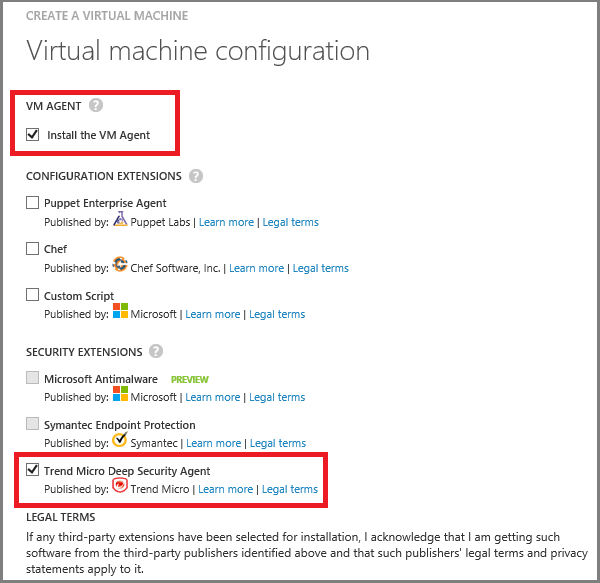

<properties pageTitle="Come installare e configurare Trend Micro Deep Security come servizio in una macchina virtuale di Azure" description="Descrive come installare e configurare Trend Micro Security in una macchina virtuale in Azure." services="virtual-machines" documentationCenter="" authors="KBDAzure" manager="timlt" editor=""/>

<tags ms.service="virtual-machines" ms.workload="infrastructure-services" ms.tgt_pltfrm="vm-multiple" ms.devlang="na" ms.topic="article" ms.date="09/24/2014" ms.author="kathydav"/>

#Come installare e configurare Trend Micro Deep Security come servizio in una macchina virtuale di Azure

 Questo articolo illustra come installare e configurare Trend Micro Deep Security come servizio in una macchina virtuale (VM) nuova o esistente che esegue Windows Server. Deep Security come servizio offre protezione antimalware, firewall, sistema di prevenzione delle intrusioni e monitoraggio dell'integrità. 

Il client viene installato come estensione di sicurezza usando l'agente di macchine virtuali. In una nuova macchina virtuale l'agente di macchine virtuali viene installato insieme a Deep Security Agent. In una macchina virtuale esistente in cui non è presente l'agente di macchine virtuali, sarà necessario prima scaricarlo e installarlo. In questo articolo vengono descritte entrambe le situazioni.

 Se si dispone di una sottoscrizione Trend Micro per una soluzione locale, è possibile usarla per proteggere le macchine virtuali di Azure. Se non si è ancora clienti, è possibile iscriversi per una sottoscrizione di prova. Per altre informazioni su questa soluzione, vedere il post di blog relativo all'[estensione dell'agente di macchine virtuali Microsoft Azure per Deep Security](http://go.microsoft.com/fwlink/p/?LinkId=403945).

## Installare Deep Security Agent in una nuova macchina virtuale

Il [portale di gestione di Azure](http://manage.windowsazure.com) consente di installare l'agente di macchine virtuali e l'estensione di sicurezza di Trend Micro quando si usa l'opzione **Da raccolta** per creare la macchina virtuale. L'uso di questo approccio rappresenta un modo semplice per aggiungere la protezione di Trend Micro quando si crea un'unica macchina virtuale.

L'opzione **Da raccolta** apre una procedura guidata che consente di configurare la macchina virtuale. L'ultima pagina della procedura guidata consente di installare l'agente di macchine virtuali e l'estensione di sicurezza di Trend Micro. Per istruzioni generali, vedere [Creare una macchina virtuale che esegue Windows Server](http://go.microsoft.com/fwlink/p/?LinkId=403943). Quando si raggiunge l'ultima pagina della procedura guidata, eseguire le operazioni seguenti:

1.	In Agente di macchine virtuali selezionare **Installa agente di macchine virtuali**.

2.	In Estensioni di sicurezza fare clic su **Trend Micro Deep Security Agent**.

3.	Fare clic sul segno di spunta per creare la macchina virtuale.

	

## Installare Deep Security Agent in una macchina virtuale esistente

A questo scopo è necessario disporre di quanto segue:

- Modulo Azure PowerShell 0.8.2 o versioni successive. Per istruzioni e un collegamento alla versione più recente, vedere l'argomento relativo alla [modalità di installazione e configurazione di Azure PowerShell](http://go.microsoft.com/fwlink/p/?LinkId=320552).  

- Agente di macchine virtuali. Per istruzioni e un collegamento al download, vedere il post di blog relativo all'[agente di macchine virtuali ed estensioni, parte 2](http://go.microsoft.com/fwlink/p/?LinkId=403947).

Aprire una sessione di Azure PowerShell ed eseguire i comandi riportati di seguito. Assicurarsi di sostituire i segnaposto, ad esempio MyServiceName, con i valori personalizzati.

1.	Ottenere il nome del servizio cloud, il nome della macchina virtuale e la VM, quindi archiviare ognuna di queste variabili in modo che i comandi seguenti possano farne uso:
	
`$servicename = MyServiceName`
	
`$name = MyVmName`
	
`$vm = Get-AzureVM -ServiceName $servicename -Name $name`

	> [AZURE.NOTE] Se non si conosce il servizio cloud e il nome della VM, eseguire Get-AzureVM per visualizzare tali informazioni per tutte le VM nella sottoscrizione corrente.

2.	Aggiungere Deep Security Agent alla macchina virtuale:

 `Set-AzureVMExtension -Publisher TrendMicro.DeepSecurity -ExtensionName TrendMicroDSA -VM $vm.VM`

	> [AZURE.NOTE] Se si vuole installare una versione specifica, eseguire il comando seguente per ottenere un elenco delle versioni disponibili: `Get-AzureVMAvailableExtension TrendMicro.DeepSecurity -ExtensionName TrendMicroDSA`. Quindi, includere il parametro Version quando si esegue Set-AzureVMExtension.

3.	Aggiornare la macchina virtuale. In questo modo viene installato Deep Security Agent:

 `Update-AzureVM -ServiceName $servicename -Name $name -VM $vm.VM`

## Passaggi successivi
Terminata l'installazione dell'agente, l'esecuzione inizierà dopo qualche minuto. In seguito sarà necessario attivare Deep Security sulla macchina virtuale in modo che venga gestita da un Deep Security Manager. Vedere quanto segue:

- Articolo di Trend Micro sulla [sicurezza cloud immediata per Microsoft Azure relativo a questa soluzione](http://go.microsoft.com/fwlink/?LinkId=404101).
- Script di [Windows PowerShell di esempio](http://go.microsoft.com/fwlink/?LinkId=404100) per configurare la macchina virtuale.
- [Istruzioni](http://go.microsoft.com/fwlink/?LinkId=404099) per l'esempio.

##Risorse aggiuntive
[Come accedere a una macchina virtuale che esegue Windows Server]

[Gestire le estensioni]

<!--Link references-->
[Come accedere a una macchina virtuale che esegue Windows Server]: ../virtual-machines-log-on-windows-server/
[Gestire le estensioni]: http://go.microsoft.com/fwlink/p/?linkid=390493&clcid=0x409

<!--HONumber=42-->
