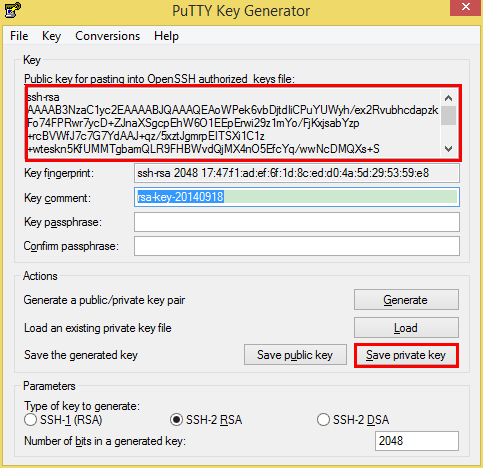
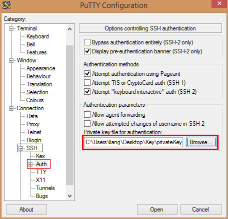
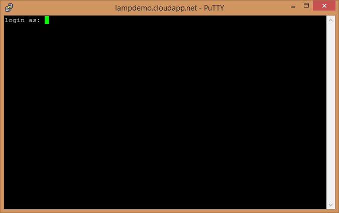

<properties
	pageTitle="Come installare MySQL in Azure"
	description="Informazioni su come installare lo stack LAMP in una macchina virtuale Linux in Azure. È possibile eseguire l&#39;installazione in Ubuntu o CentOS."
	services="virtual-machines"
	documentationCenter=""
	authors="SuperScottz"
	manager="timlt"
	editor=""/>

<tags
	ms.service="virtual-machines"
	ms.workload="infrastructure-services"
	ms.tgt_pltfrm="vm-linux"
	ms.devlang="na"
	ms.topic="article"
	ms.date="03/12/2015"
	ms.author="mingzhan"/>

#Come installare MySQL in Azure

In questo argomento, si presuppone che il lettore disponga già di un account Azure. In caso contrario, è consigliato per iscriversi, visitando il sito [Azure](http://azure.microsoft.com).

##Creazione di un'immagine di macchina virtuale in Microsoft Azure.
Di seguito verrà creata una nuova macchina virtuale dal portale di gestione di Microsoft Azure.
###Generare una “chiave di autenticazione SSH”
La chiave SSH è necessaria per accedere al portale di Azure.

- Scaricare e installare puttygen da [qui](http://www.chiark.greenend.org.uk/~sgtatham/putty/download.html). 
- Eseguire puttygen.exe.
- Fare clic su “Generate” per generare le chiavi.

 
 
- Dopo la generazione della chiave, si prospetterà uno scenario come indicato di seguito. 
 
 

- Copiare la chiave pubblica e salvarla in un file denominato  “publicKey.key”. Non fare clic su “Save public key” poiché il formato della chiave pubblica salvata è diverso dalla chiave pubblica richiesta.
- Fare clic su "Save private key"  e salvarla in un file denominato “privateKey.ppk”. 

###Accedere al portale di Azure

Andare a https://portal.azure.com/, quindi accedere.

###Creare una macchina virtuale Linux

Fare clic su "Nuovo" in basso a sinistra, creare un'immagine seguendo le istruzioni, scegliendo immagine Linux più adatta alle proprie esigenze. In questo esempio, viene scelto Ubuntu 14.04.

  

###Impostare il NOME HOST

"NOME HOST": si tratta dell'URL che è possibile utilizzare per accedere alla macchina virtuale. È sufficiente specificare il nome DNS, ad esempio "mysqlnode1", Azure genera l'URL come "mysqlnode1.cloudapp.net"; CHIAVE DI AUTENTICAZIONE SSH": questa è la chiave pubblica che genera per puttygen, è necessario copiare il contenuto nel file "publicKey.key".

  
  

##Aprire la porta predefinita di MySQL
Gli endpoint in Microsoft azure sono costituiti da un protocollo, insieme a una porta pubblica e privata. La porta si intende privata poiché il servizio è in ascolto nel computer locale. La porta pubblica è la porta ascoltata dal servizio esternamente. 3306 è il numero di porta predefinito su cui è in ascolto MySQL. Fare clic su "SFOGLIA" ⇒ "MACCHINA VIRTUALE", quindi fare clic sull'immagine creata.
 
   

##Connettersi all'immagine creata
È possibile scegliere qualsiasi strumento SSH per connettersi alla macchina virtuale. In questo esempio, viene usato Putty.
 

- Innanzitutto scaricare Putty: l’URL di download di Putty è qui.
- Dopo il download di Putty, fare clic sul file eseguibile “PUTTY.EXE”. L'impostazione dell’applicazione è come indicata di seguito.

     The “Host Name (or IP address)” is the URL as “DNS NAME” when you create an image.
     
     The “Port” we can chose 22.  This is default port of SSH services.

   
 
- Prima di selezionare Open, fare clic sulla scheda Connection \> SSH \> AUTH per individuare il file generato da Puttygen e che contiene la chiave privata. Per informazioni sul campo da compilare, vedere la schermata seguente.

   
 
- Fare clic su "Open": si potrebbe ricevere un avviso da una finestra di messaggio che informa che il computer in cui si esegue la connessione potrebbe non essere la macchina a cui ci si desidera connettere. Se il nome DNS e il numero di porta sono stati configurati correttamente, fare clic su Yes.
  
 

- Successivamente, viene presentato uno scenario simile al seguente. 
 
 

##Installare MySQL nella macchina virtuale.
Sono supportati tre metodi di installazione per MySQL: pacchetti binari, pacchetti rpm e pacchetti di origine. Per considerazioni sulle prestazioni, si utilizzerà pacchetto rpm per MySQL 5.6 come esempio per questo articolo. Le prestazioni di MySQL5.6 sono migliorate significativamente rispetto alla versione MySQL5.5. Ulteriori informazioni sono disponibili [qui](http://www.mysqlperformanceblog.com/2013/02/18/is-mysql-5-6-slower-than-mysql-5-5/).

###Come installare MySQL5.6 in Ubuntu o Debian
Verrà utilizzato Ubuntu 14.04 LTS come esempio per questo articolo.

- Passaggio 1: installare MySQL Server 5.6

    Installare mysql-server 5.6 con il comando apt-get

              # azureuser@mysqlnode1:~$ sudo apt-get update
              # azureuser@mysqlnode1:~$ sudo apt-get -y install mysql-server-5.6

    Durante l'installazione, verrà visualizzata una finestra pop-up in cui viene richiesto di impostare la password root di MySQL. Occorre specificare la nuova password dell’utente root di MySQL. Di seguito viene riportata una schermata.

 

    Confermare la password.

 
 
- Passaggio 2: accedere al server MySQL

    Al termine dell'installazione del server MySQL, il servizio MySQL viene avviato automaticamente. È possibile eseguire l'accesso a MySQL Server con l’account utente root. Per accedere a MySQL Server, utilizzare il comando seguente. verrà richiesto se la password root di mysql impostata durante l'installazione del server mysql.

             # azureuser@mysqlnode1:~$ mysql -uroot -p

- Passaggio 3: controllare il servizio MySQL nella macchina virtuale
    
    Dopo l'accesso, assicurarsi che il servizio MySQL sia in esecuzione, è possibile indicare all’utente di utilizzare i comandi per avviare e riavviare il servizio.

    \(a\) Per ottenere lo stato del servizio MySQL

             #sudo service mysql status

    \(b\) Per avviare il servizio MySQL

             #sudo service mysql start

    \(b\) Per arrestare il servizio MySQL

             #sudo service mysql stop

    \(b\) Per riavviare il servizio MySQL

             #sudo service mysql restart

###Come installare MySQL nella famiglia di sistemi operativi Redhat o Oracle Linux
- Passaggio 1: per fare in modo che il repository Yum di MySQL ottenga i permessi di root, eseguire il comando: 

            #sudo su -
            #[root@azureuser ~]# wget http://repo.mysql.com/mysql-community-release-el6-5.noarch.rpm 
            #[root@azureuser ~]# yum localinstall -y mysql-community-release-el6-5.noarch.rpm 

- Passaggio 2: selezione di una serie di rilascio
 
            #[root@azureuser ~]# vim /etc/yum.repos.d/mysql-community.repo

    Si tratta di una voce tipica per il subrepository di una serie di rilascio nel file:

        \# *Enable to use MySQL 5.6*

        [mysql56-community]
        name=MySQL 5.6 Community Server

        baseurl=http://repo.mysql.com/yum/mysql-5.6-community/el/6/$basearch/

        enabled=1

        gpgcheck=1

        gpgkey=file:/etc/pki/rpm-gpg/RPM-GPG-KEY-mysql

- Passaggio 3: installazione di MySQL con Yum. Installare MySQL con il comando seguente:

           #[root@azureuser ~]#yum install mysql-community-server 

    Consente di installare il pacchetto per il server MySQL, nonché altri pacchetti richiesti.

- Passaggio 4: controllare lo stato di esecuzione di MySQL

    È possibile controllare lo stato del server MySQL con il comando seguente:
   
           #[root@azureuser ~]#service mysqld status

    È possibile verificare se la porta predefinita del server MySQL è in esecuzione:

           #[root@azureuser ~]#netstat  –tunlp|grep 3306

- Passaggio 5: avviare e arrestare il Server MySQL

    Avviare il server MySQL con il comando seguente:

           #[root@azureuser ~]#service mysqld start

    Arrestare il server MySQL con il comando seguente:

           #[root@azureuser ~]#service mysqld stop

    Per fare in modo che MySQL venga avviato all'avvio del sistema, eseguire il comando seguente:

           #[root@azureuser ~]#chkconfig mysqld on

###Come installare MySQL in Suse Linux

- Passaggio 1: installare MySQL Server

    Per elevare le autorizzazioni, eseguire il comando:

           #sudo su -

    Installare MySQL con il comando seguente:

           #mysql-test:~ # zypper update

           #mysql-test:~ # zypper install mysql-server mysql-devel mysql

- Passaggio 2: controllare lo stato di esecuzione di MySQL

    È possibile controllare lo stato del server MySQL con il comando seguente:

           #mysql-test:~ # rcmysql status

    È possibile verificare se la porta predefinita del server MySQL è in esecuzione:

           #mysql-test:~ # netstat  –tunlp|grep 3306

- Passaggio 3: avviare e arrestare il Server MySQL

    Avviare il server MySQL con il comando seguente:

           #mysql-test:~ # rcmysql start

    Arrestare il server MySQL con il comando seguente:

           #mysql-test:~ # rcmysql stop

    Per fare in modo che MySQL venga avviato all'avvio del sistema, eseguire il comando seguente:

           #mysql-test:~ # insserv mysql
<!--HONumber=52-->
