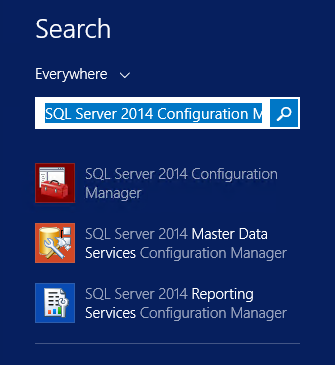
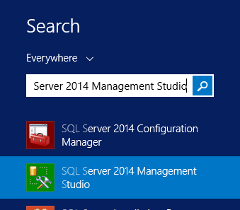
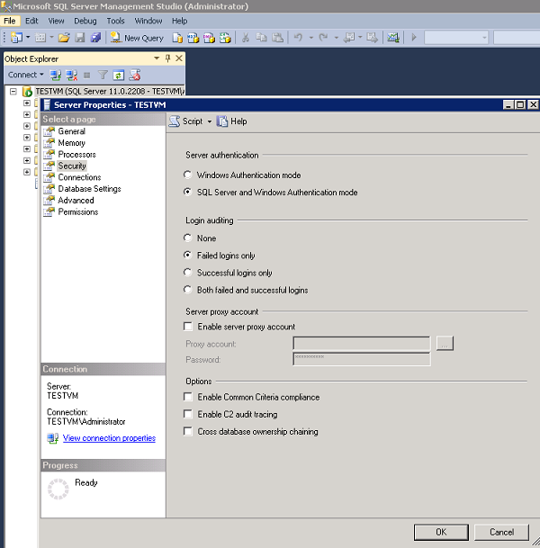
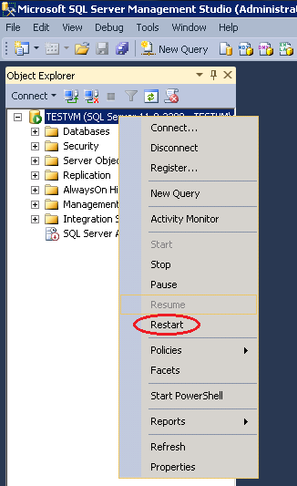
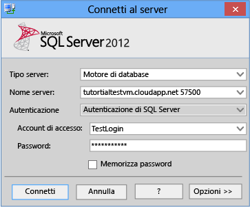

<properties  linkid="manage-windows-commontask-install-sql-server" urlDisplayName="Install SQL Server" pageTitle="Provision a SQL Server virtual machine in Azure " metaKeywords="Azure tutorial creating SQL Server, SQL Server vm, configuring SQL Server" description="A tutorial that teaches you how to create and configure a SQL Server virtual machine on Azure." metaCanonical="" services="virtual-machines" documentationCenter="" title="Provisioning a SQL Server Virtual Machine on Azure" authors="selcint" solutions="" manager="clairt" editor="tyson" />

# Provisioning di una macchina virtuale di SQL Server in Azure

Nella raccolta di macchine virtuali di Azure sono disponibili numerose immagini che contengono Microsoft SQL Server. È possibile selezionare una delle immagini di macchina virtuale dalla raccolta ed eseguire il provisioning della macchina virtuale nell'ambiente Azure con pochi clic.

In questa esercitazione si apprenderà come:

* [Effettuare la connessione al portale di gestione di Azure ed eseguire il provisioning di una macchina virtuale dalla raccolta](#Provision)
* [Aprire la macchina virtuale tramite Desktop remoto e completare la configurazione](#RemoteDesktop)
* [Completare la procedura di configurazione per connettersi alla macchina virtuale mediante SQL Server Management Studio in un altro computer](#SSMS)
* [Passaggi successivi](#Optional)

## <a  id="Provision">Effettuare la connessione al portale di gestione di Azure ed eseguire il provisioning di una macchina virtuale dalla raccolta</a>

1.  Accedere al [portale di gestione di Azure][1] con il proprio account. Se non si dispone di un account Azure, provare la [versione di valutazione gratuita di Azure][2].

2.  Nel portale di gestione di Azure, nella parte sinistra della pagina Web fare clic su **+NEW**, su **COMPUTE**, su **VIRTUAL MACHINE** e infine su **FROM GALLERY**.

3.  Nella pagina **Create a Virtual Machine** selezionare un'immagine della macchina virtuale contenente SQL Server e quindi fare clic sulla freccia Next nella parte inferiore destra della pagina. Per le informazioni più aggiornate sulle immagini di SQL Server supportate in Azure, vedere l'argomento [Introduzione a SQL Server in Macchine virtuali di Azure][3] nel set di documentazione [SQL Server in Macchine virtuali di Azure][4].
    
    > [WACOM.NOTE] Se si dispone di una macchina virtuale creata utilizzando l'immagine della piattaforma dell'edizione di valutazione di SQL Server 2012 disponibile durante il periodo di anteprima, non sarà possibile aggiornarla a un'immagine della versione con pagamento su base oraria nella raccolta. È possibile scegliere una delle due opzioni seguenti: 
    > - È possibile creare una nuova macchina virtuale utilizzando la versione di SQL Server a pagamento su base oraria dalla raccolta ed eseguire la migrazione dei file di database alla nuova macchina virtuale attenendosi alla procedura descritta nell'argomento [Come eseguire la migrazione dello schema e dei file di database di SQL Server tra macchine virtuali in Azure utilizzando dischi dati][5]. **Oppure**,
    
    > * È possibile eseguire l'aggiornamento di un'istanza esistente   dell'edizione di valutazione di SQL Server 2012 a un'altra   versione di SQL Server 2012 nell'ambito del contratto [Mobilità   delle licenze tramite Software Assurance in Azure][6],   attenendosi alla procedura illustrata nell'argomento [Eseguire   l'aggiornamento a un'edizione diversa di SQL Server 2012][7].   Per informazioni su come acquistare una copia di SQL Server con   licenza, vedere [Come acquistare SQL Server][8].

4.  Nella pagina **Virtual Machine Configuration** specificare le informazioni seguenti:
    * Specificare un nome in **VIRTUAL MACHINE NAME**.
    * Nella casella **NEW USER NAME** digitare un nome utente univoco per l'account di amministratore locale della macchina virtuale.
    * Nella casella **NEW PASSWORD** immettere una password complessa. Per ulteriori informazioni, vedere [Password complesse][9].
    * Nella casella **CONFIRM PASSWORD** ridigitare la password.
    * Selezionare un valore appropriato per **SIZE** nell'elenco a discesa.
    
    >[WACOM.NOTE] La dimensione della macchina virtuale viene specificata durante il provisioning: 
    >- Medium è la dimensione minima consigliata per i carichi di lavoro di produzione. 
    >- Qualora si utilizzi SQL Server Enterprise Edition, la dimensione minima consigliata per una macchina virtuale è Large. 
    >- Selezionare Large o superiore per l'utilizzo di SQL Server Enterprise Edition. 
    >- Selezionare A6 per l'utilizzo dell'immagine di SQL Server 2012 Enterprise per data warehouse.
    >- Selezionare A7 per l'utilizzo dell'immagine di SQL Server 2014 Evaluation per data warehouse. 
    >- La dimensione selezionata limita il numero di dischi dati che è possibile configurare. Per informazioni aggiornate sulle dimensioni di macchine virtuali disponibili e sul numero di dischi dati che è possibile collegare a una macchina virtuale, vedere [Dimensioni delle macchine virtuali e dei servizi cloud per Azure][10].
    
    Fare clic sulla freccia Next nella parte inferiore destra per continuare.
    
    

5.  Nella pagina **Virtual machine mode** specificare le informazioni seguenti:
    * Selezionare **Standalone Virtual Machine**.
    * Nella casella **DNS NAME** immettere la prima parte di un nome DNS a scelta, affinché completi un nome nel formato **TESTNAME.cloudapp.net**
    * Nella casella **REGION/AFFINITY GROUP/VIRTUAL NETWORK** selezionare la regione in cui verrà ospitata questa immagine virtuale.
    
    Fare clic sulla freccia Next per continuare.
    
    

6.  Nella pagina **Virtual machine options**:
    * Nella casella **AVAILABILITY SET** selezionare **(none)**.
    * Leggere e accettare le note legali.
    
    

7.  Fare clic sul segno di spunta nell'angolo inferiore destro per continuare.

8.  Attendere durante la preparazione della macchina virtuale in Azure. Lo stato della macchina virtuale attraverserà le fasi seguenti:
    
    * Starting (Provisioning)
    * Stopped
    * Starting (Provisioning)
    * Running (Provisioning)
    * Running

## <a  id="RemoteDesktop">Aprire la macchina virtuale tramite Desktop remoto e completare la configurazione</a>

1.  Al termine del provisioning, fare clic sul nome della macchina virtuale per passare alla pagina DASHBOARD. Nella parte inferiore della pagina fare clic su **Connect**.
    
    
2.  Scegliere di aprire il file .rpd utilizzando il programma Desktop remoto Windows (`%windir%\system32\mstsc.exe`).

3.  Nella finestra di dialogo **Protezione di Windows** immettere la password per l'account Administrator locale specificata in uno dei passaggi precedenti. (Potrebbe essere richiesta la verifica delle credenziali della macchina virtuale).

4.  In occasione del primo accesso alla macchina virtuale, potrebbe essere necessario completare diversi processi, come la configurazione del desktop, l'aggiornamento di Windows e il completamento delle attività di configurazione iniziali di Windows (sysprep). Al termine delle attività di configurazione iniziali di Windows, verranno completate le attività di configurazione di SQL Server. Il completamento di queste attività potrebbe richiedere qualche minuto. `SELECT @@SERVERNAME` potrebbe non restituire il nome corretto fino al termine dell'installazione di SQL Server.

Dopo avere eseguito la connessione alla macchina virtuale con Desktop remoto Windows, la macchina virtuale funziona come qualsiasi altro computer. Eseguire normalmente la connessione all'istanza predefinita di SQL Server con SQL Server Management Studio (in esecuzione nella macchina virtuale).

## <a  id="SSMS">Completare la procedura di configurazione per connettersi alla macchina virtuale mediante SQL Server Management Studio in un altro computer</a>

Prima di poter eseguire la connessione all'istanza di SQL Server da Internet, è necessario completare le attività riportate di seguito, come descritto nelle sezioni seguenti:

* [Creare un endpoint TCP per la macchina virtuale](#Endpoint)
* [Aprire le porte TCP in Windows Firewall](#FW)
* [Configurare SQL Server per l'ascolto sul protocollo TCP](#TCP)
* [Configurare SQL Server per l'autenticazione in modalità mista](#Mixed)
* [Creare gli account di accesso di SQL Server](#Logins)
* [Determinare il nome DNS della macchina virtuale](#DNS)
* [Eseguire la connessione al motore di database da un altro computer](#cde)
* [Connessione al motore di database dall'applicazione] (#cdea)

Il percorso di connessione è riepilogato nel diagramma seguente:

### <a  id="Endpoint">Creare un endpoint TCP per la macchina virtuale</a>

Nella macchina virtuale deve essere presente un endpoint per l'ascolto delle comunicazioni TCP in entrata. In questo passaggio di configurazione di Azure, il traffico della porta TCP in ingresso viene indirizzato a una porta TCP accessibile alla macchina virtuale.

1.  Nel portale di gestione di Azure fare clic su **VIRTUAL MACHINES**.

2.  Fare clic sulla macchina virtuale appena creata. Verranno visualizzate le informazioni sulla macchina virtuale.

3.  Nella parte superiore della pagina selezionare **ENDPOINTS** e quindi fare clic su **ADD ENDPOINT** nella parte inferiore della pagina.
    
    

4.  Nella pagina **Add Endpoint to Virtual Machine** fare clic su **Add Endpoint** e quindi sulla freccia Next per continuare.
    
    

5.  Nella pagina **Specify the details of the endpoint** specificare le informazioni seguenti:
    
    * Nella casella **NAME** specificare un nome per l'endpoint.
    * Nella casella **PROTOCOL** selezionare **TCP**. È possibile immettere la porta di ascolto predefinita di SQL Server **1433** nella casella **Private Port**. Allo stesso modo, è possibile specificare **57500** nella casella **PUBLIC PORT**. Si noti che molte organizzazioni selezionano numeri di porta diversi per evitare attacchi dannosi al sistema di sicurezza.
    
    

6.  Fare clic sul segno di spunta per continuare. La creazione dell'endpoint è completata.
    
    

### <a  id="FW">Aprire le porte TCP in Windows Firewall per l'istanza predefinita del motore di database</a>

1.  Connettersi alla macchina virtuale tramite Desktop remoto. Dopo avere eseguito l'accesso, nel menu Start fare clic su **Esegui**, digitare **WF.msc** e quindi fare clic su **OK**.
    
    
2.  In **Windows Firewall con protezione avanzata**, nel riquadro sinistro fare clic con il pulsante destro del mouse su **Regole connessioni in entrata** e quindi fare clic su **Nuova regola** nel riquadro Azioni.
    
    

3.  Nella finestra di dialogo **Tipo di regola** selezionare **Porta** e quindi fare clic su **Avanti**.

4.  Nella finestra di dialogo **Protocollo e porte** selezionare **TCP**. Selezionare **Porte locali specifiche** e quindi digitare il numero di porta dell'istanza del motore di database (**1433** per l'istanza predefinita o il numero di porta specificato per la porta privata nel passaggio di creazione dell'endpoint).
    
    

5.  Fare clic su **Avanti**.

6.  Nella finestra di dialogo **Operazione** selezionare **Consenti la connessione** e quindi fare clic su **Avanti**.
    
    **Nota sulla sicurezza:** Per un ulteriore livello di sicurezza, è possibile selezionare **Consenti solo le connessioni protette**. Selezionare questa opzione se si desidera configurare ulteriori opzioni di sicurezza per l'ambiente in uso.
    
    

7.  Nella finestra di dialogo **Profilo** selezionare **Pubblico** e quindi fare clic su **Avanti**.
    
    **Nota sulla sicurezza:** La selezione di un profilo **Pubblico** consente l'accesso tramite Internet. Se possibile, scegliere un profilo più restrittivo.
    
    

8.  Nella finestra di dialogo **Nome** digitare un nome e una descrizione per la regola e quindi fare clic su **Fine**.
    
    

Aprire altre porte per altri componenti in base alle esigenze. Per ulteriori informazioni, vedere [Configurare Windows Firewall per consentire l'accesso a SQL Server][11].

### <a  id="TCP">Configurare SQL Server per l'ascolto sul protocollo TCP</a>

1.  Quando si è connessi alla macchina virtuale tramite Desktop remoto, nel menu Start fare clic su **Tutti i programmi**, **Microsoft SQL Server** <em> </em>versione<strong>, </strong>Strumenti di configurazione<strong> e infine su </strong>Gestione configurazione SQL Server.
    
    

2.  In Gestione configurazione SQL Server, nel riquadro console espandere **Configurazione di rete SQL Server**.

3.  Nel riquadro console fare clic su **Protocolli per *nome istanza***. (L'istanza predefinita è **Protocolli per MSSQLSERVER**).

4.  Nel riquadro dei dettagli fare clic con il pulsante destro del mouse su TCP: dovrebbe risultare abilitato per le immagini della raccolta per impostazione predefinita. Per le immagini personalizzate, fare clic su **Abilita** (se lo stato corrispondente è Disabilitato).
    
    

5.  Nel riquadro console fare clic su **Servizi di SQL Server**. Il riavvio del motore di database può essere rimandato fino al termine del passaggio successivo.

6.  Nel riquadro dei dettagli fare clic con il pulsante destro del mouse su **SQL Server (*nome istanza*)** (l'istanza predefinita è **SQL Server (MSSQLSERVER)**) e quindi scegliere **Riavvia** per arrestare e riavviare l'istanza di SQL Server.
    
    

7.  Chiudere Gestione configurazione SQL Server.

Per ulteriori informazioni su come abilitare i protocolli per il motore di database di SQL Server, vedere [Abilitare o disabilitare un protocollo di rete del server][12].

### <a  id="Mixed">Configurare SQL Server per l'autenticazione in modalità mista</a>

Il motore di database di SQL Server non può utilizzare l'Autenticazione di Windows senza ambiente di dominio. Per connettersi al motore di database da un altro computer, configurare SQL Server per l'autenticazione in modalità mista. L'autenticazione in modalità mista consente sia l'autenticazione di SQL Server sia l'autenticazione di Windows. Se è stata configurata una Rete virtuale di Azure, potrebbe non essere necessario configurare l'autenticazione in modalità mista. Per ulteriori informazioni, vedere l'argomento [Considerazioni relative alla connettività per SQL Server in Macchine virtuali di Azure][13] nel set di documentazione [SQL Server in Macchine virtuali di Azure][14].

1.  Quando si è connessi alla macchina virtuale tramite Desktop remoto, nel menu Start fare clic su **Tutti i programmi**, **Microsoft SQL Server *versione*** e quindi su **SQL Server Management Studio**.
    
    
    
    Alla prima apertura di Management Studio è necessario creare gli utenti dell'ambiente Management Studio. L'operazione potrebbe richiedere alcuni istanti.

2.  All'apertura verrà visualizzata la finestra di dialogo **Connetti al server** di Management Studio. Nella casella **Nome server** digitare il nome della macchina virtuale da connettere al motore di database con Esplora oggetti. Anziché il nome della macchina virtuale come **Nome server** è inoltre possibile utilizzare **(locale)** o un singolo punto. Selezionare **Autenticazione di Windows** e lasciare ***nome\_macchina\_virtuale*\ministratore\_locale** nella casella **Nome utente**. Fare clic su **Connetti**.
    
    

3.  In Esplora oggetti di SQL Server Management Studio fare clic con il pulsante destro del mouse sul nome dell'istanza di SQL Server (nome della macchina virtuale) e quindi scegliere **Proprietà**.
    
    

4.  Nella pagina **Sicurezza**, in **Autenticazione server** selezionare **Autenticazione di SQL Server e di Windows** e quindi fare clic su **OK**.
    
    

5.  Nella finestra di dialogo di SQL Server Management Studio fare clic su **OK** per confermare il requisito del riavvio di SQL Server.

6.  In Esplora oggetti fare clic con il pulsante destro del mouse sul server e quindi scegliere **Riavvia**. (Se SQL Server Agent è in esecuzione, anch'esso dovrà essere riavviato).
    
    

7.  Nella finestra di dialogo di SQL Server Management Studio fare clic su **Sì** per accettare il riavvio di SQL Server.

### <a  id="Logins">Creare gli account di accesso di SQL Server</a>

Per connettersi al motore di database da un altro computer, configurare almeno un account di accesso con autenticazione di SQL Server.

1.  In Esplora oggetti di SQL Server Management Studio espandere la cartella dell'istanza del server in cui si desidera creare il nuovo account di accesso.

2.  Fare clic con il pulsante destro del mouse sulla cartella **Sicurezza** scegliere **Nuovo** e quindi **Account di accesso...**.
    
    

3.  Nella finestra di dialogo **Account di accesso - Nuovo**, nella pagina **Generale** immettere il nome del nuovo utente nella casella **Nome account di accesso**.

4.  Selezionare **Autenticazione di SQL Server**.

5.  Nella casella **Password** digitare una password per il nuovo utente. Digitare di nuovo la password nella casella **Conferma password**.

6.  Per applicare le opzioni dei criteri password per la complessità e l'imposizione, selezionare **Applica criteri password** (scelta consigliata). Si tratta di un'opzione predefinita quando si seleziona l'autenticazione di SQL Server.

7.  Per applicare le opzioni dei criteri password per la scadenza, selezionare **Imponi scadenza password** (scelta consigliata). Per abilitare questa casella di controllo, è necessario che sia selezionata l'opzione Applica criteri password. Si tratta di un'opzione predefinita quando si seleziona l'autenticazione di SQL Server.

8.  Per forzare un utente a creare una nuova password dopo il primo utilizzo dell'account di accesso, selezionare **Richiedi modifica della password all'accesso successivo** (scelta consigliata se il nome di accesso verrà utilizzato da un altro utente. Se si tratta del proprio nome di accesso, non selezionare questa opzione). Per abilitare questa casella di controllo, è necessario che sia selezionata l'opzione Imponi scadenza password. Si tratta di un'opzione predefinita quando si seleziona l'autenticazione di SQL Server.

9.  Nell'elenco **Database predefinito** selezionare un database predefinito per il nome di accesso. **master** è il valore predefinito per questa opzione. Se il database utente non è ancora stato creato, lasciare questa opzione impostata su **master**.

10. Nell'elenco **Lingua predefinita** lasciare il valore predefinito **default**.
    
    

11. Se si tratta del primo account di accesso che si crea, è possibile assegnarlo all'amministratore di SQL Server. A questo scopo, nella pagina **Ruoli del server** selezionare **sysadmin**.
    
    **Nota sulla sicurezza:** I membri del ruolo predefinito del server dispongono del controllo completo sul motore di database. È consigliabile limitare attentamente le appartenenze a questo ruolo.
    
    

12. Fare clic su OK.

Per ulteriori informazioni sugli account di accesso di SQL Server, vedere [Creazione di un account di accesso][15].

### <a  id="DNS">Determinare il nome DNS della macchina virtuale</a>

Per connettersi al motore di database di AQL Server da un altro computer, è necessario conoscere il nome DNS (Domain Name System) della macchina virtuale. (Si tratta del nome utilizzato da Internet per identificare la macchina virtuale. È possibile utilizzare l'indirizzo IP, ma questo indirizzo può cambiare se Azure sposta le risorse per la ridondanza o la manutenzione. Il nome DNS rimane stabile in quanto può essere reindirizzato a un nuovo indirizzo IP).

1.  Nel portale di gestione di Azure (o dal passaggio precedente) selezionare **VIRTUAL MACHINES**.

2.  Nella pagina **VIRTUAL MACHINE INSTANCES**, nella colonna **DNS NAME** trovare e copiare il nome DNS per la macchina virtuale preceduto da **http://**. (Nell'interfaccia utente potrebbe non essere visualizzato l'intero nome, ma è possibile fare clic su di esso con il pulsante destro del mouse e scegliere Copia).
    
    

### <a  id="cde">Eseguire la connessione al motore di database da un altro computer</a>

1.  In un computer connesso a Internet aprire SQL Server Management Studio.

2.  Nella casella **Connetti al server** o **Connetti al motore di database**, nella casella **Nome server** immettere il nome DNS della macchina virtuale (determinato nell'attività precedente) e un numero di porta di endpoint pubblica nel formato *NomeDNS,Numero porta*, ad esempio **tutorialtestVM.cloudapp.net,57500**.

3.  Nella casella **Autenticazione** selezionare **Autenticazione di SQL Server**.

4.  Nella casella **Account di accesso** digitare il nome di un account di accesso creato in una delle attività precedenti.

5.  Nella casella **Password** digitare la password dell'account di accesso creato in una delle attività precedenti.

6.  Fare clic su **Connetti**.
    
    

### <a  id="cdea"> Connessione al motore di database dall'applicazione</a>

Se è possibile connettersi a un'istanza di SQL Server in esecuzione in una macchina virtuale di Azure tramite Management Studio, dovrebbe essere possibile connettersi anche con una stringa di connessione simile a quella riportata di seguito.

    connectionString="Server=<DNS _Name>;Integrated Security=false;User ID=<login _name>;Password=<your _password>;"providerName="System.Data.SqlClient"

Per ulteriori informazioni, vedere l'argomento relativo alla [risoluzione dei problemi di connessione al motore di database di SQL Server][16].

## <a  id="Optional">Passaggi successivi</a>
Si è appreso come creare e configurare un'istanza di SQL Server in una macchina virtuale di Azure utilizzando l'immagine della piattaforma. Per l'utilizzo di SQL Server in Macchine virtuali di Azure, è consigliabile seguire le linee guida dettagliate fornite nel set di documentazione [SQL Server in Macchine virtuali di Azure][4] in MSDN Library. In questo set di documentazione è inclusa una serie di articoli ed esercitazioni che offrono linee guida dettagliate. Nella serie sono incluse le sezioni seguenti:

[SQL Server in Macchine virtuali di Azure][4]

[Introduzione a SQL Server in Macchine virtuali di Azure][3]

[Preparazione della migrazione a SQL Server in Macchine virtuali di Azure][17]

* Come eseguire la migrazione dello schema e dei file di database di SQL tra macchine virtuali in Azure utilizzando dischi dati

[Distribuzione di SQL Server in Macchine virtuali di Azure][18]

* Come copiare i file di dati e dell'installazione di SQL Server in un disco dati dall'ambiente locale ad Azure utilizzando CSUpload
* Come creare una macchina virtuale di base locale utilizzando Hyper-V
* Come creare una macchina virtuale SQL Server in Azure utilizzando il disco di SQL Server locale
* Come creare una macchina virtuale SQL Server in Azure utilizzando la macchina virtuale SQL Server locale esistente
* Modalità di utilizzo di PowerShell per la configurazione di una macchina virtuale di SQL Server in Azure
* Come utilizzare un disco dati collegato per archiviare i file di database

[Considerazioni relative alla connettività per SQL Server in Macchine virtuali di Azure][19]

* Esercitazione: Configurare e connettersi a più macchine virtuali di SQL Server nello stesso servizio cloud di Azure
* Esercitazione: Configurare e connettersi a una macchina virtuale di SQL Server in un altro servizio cloud di Azure
* Esercitazione: Connessione dell'applicazione ASP.NET a SQL Server in Azure tramite una rete virtuale

[White paper: Linee guida sulle prestazioni per SQL Server nelle macchine virtuali di Azure][20]

[Considerazioni relative alle prestazioni per SQL Server in Macchine virtuali di Azure][21]

[Considerazioni relative alla sicurezza per SQL Server in Macchine virtuali di Azure][22]

[Risoluzione dei problemi e monitoraggio per SQL Server in Macchine virtuali di Azure][23]

[Disponibilità elevata e ripristino di emergenza di SQL Server in Macchine virtuali di Azure][24]

* Esercitazione: Gruppi di disponibilità AlwaysOn in Azure (GUI)
* Esercitazione: Gruppi di disponibilità AlwaysOn in Azure (PowerShell)
* Esercitazione: Gruppi di disponibilità AlwaysOn in ambiente IT ibrido
* Esercitazione: Mirroring del database per la disponibilità elevata in Azure
* Esercitazione: Mirroring del database per il ripristino di emergenza in Azure
* Esercitazione: Mirroring del database per il ripristino di emergenza nell'ambiente IT ibrido
* Esercitazione: Log shipping per il ripristino di emergenza nell'ambiente IT ibrido

[Backup e ripristino per SQL Server in Macchine virtuali di Azure][25]

[SQL Server Business Intelligence in Macchine virtuali di Azure][26]

* Utilizzare PowerShell per creare una VM di Azure con SQL Server BI e SharePoint 2010
* Utilizzare PowerShell per creare una VM di Azure con SQL Server BI e SharePoint 2013
* Utilizzare PowerShell per creare una macchina virtuale di Azure con un server di report in modalità nativa
* [White paper: Distribuire SQL Server Business Intelligence in Macchine virtuali di Azure][27]

[SQL Server Data warehouse nelle macchine virtuali di Azure][28]

[1]: http://manage.windowsazure.com
[2]: http://www.windowsazure.com/en-us/pricing/free-trial/
[3]: http://go.microsoft.com/fwlink/p/?LinkId=294720
[4]: http://go.microsoft.com/fwlink/p/?LinkId=294719
[5]: http://go.microsoft.com/fwlink/p/?LinkId=294738
[6]: http://www.windowsazure.com/en-us/pricing/license-mobility/
[7]: http://msdn.microsoft.com/library/cc707783.aspx
[8]: http://www.microsoft.com/en-us/sqlserver/get-sql-server/how-to-buy.aspx
[9]: http://msdn.microsoft.com/library/ms161962.aspx
[10]: http://go.microsoft.com/fwlink/p/?LinkId=294819
[11]: http://msdn.microsoft.com/en-us/library/cc646023.aspx
[12]: http://msdn.microsoft.com/en-us/library/ms191294.aspx
[13]: http://go.microsoft.com/fwlink/?LinkId=294723
[14]: http://go.microsoft.com/fwlink/?LinkId=294719
[15]: http://msdn.microsoft.com/en-us/library/aa337562.aspx
[16]: http://social.technet.microsoft.com/wiki/contents/articles/how-to-troubleshoot-connecting-to-the-sql-server-database-engine.aspx
[17]: http://go.microsoft.com/fwlink/p/?LinkId=294721
[18]: http://go.microsoft.com/fwlink/p/?LinkId=294722
[19]: http://go.microsoft.com/fwlink/p/?LinkId=294723
[20]: http://msdn.microsoft.com/library/windowsazure/dn248436.aspx
[21]: http://go.microsoft.com/fwlink/?LinkId=294724
[22]: http://go.microsoft.com/fwlink/p/?LinkId=294725
[23]: http://go.microsoft.com/fwlink/p/?LinkId=294726
[24]: http://go.microsoft.com/fwlink/p/?LinkId=294727
[25]: http://go.microsoft.com/fwlink/p/?LinkId=294728
[26]: http://go.microsoft.com/fwlink/p/?LinkId=294729
[27]: http://msdn.microsoft.com/library/windowsazure/dn321998.aspx
[28]: http://msdn.microsoft.com/library/windowsazure/dn387396.aspx