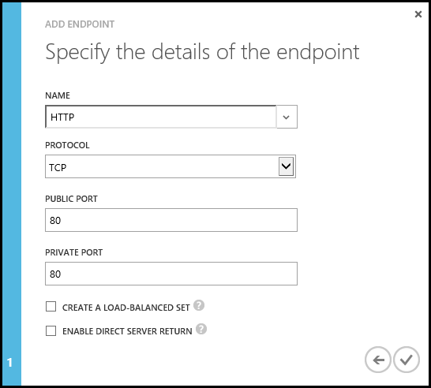

<properties linkid="develop-python-web-app-with-django" urlDisplayName="Web with Django (Windows)" pageTitle="Python web app with Django - Azure tutorial" metaKeywords="Azure Django web app, Azure Django virtual machine" description="A tutorial that teaches you how to host a Django-based website on Azure using a Windows Server 2008 R2 virtual machine." metaCanonical="" services="virtual-machines" documentationCenter="Python" title="Django Hello World Web Application" authors="" solutions="" manager="" editor="" />

Applicazione Web Hello World Django
===================================

[Windows](/en-us/develop/python/tutorials/web-app-with-django/ "Windows")[Mac/Linux](/en-us/develop/python/tutorials/django-hello-world-(maclinux)/ "MacLinux")

In questa esercitazione viene illustrato come ospitare un sito Web basato su Django in Azure utilizzando una macchina virtuale Windows Server. In questa esercitazione si presuppone che l'utente non abbia mai utilizzato Azure. Al termine dell'esercitazione, si disporrà di un'applicazione basata su Django in esecuzione nel cloud.

Si apprenderà come:

-   Configurare una macchina virtuale di Azure per l'hosting di Django. Sebbene nell'esercitazione la procedura venga illustrata in **Windows Server**, è possibile eseguirla anche con una macchina virtuale Linux ospitata in Azure.
-   Creare una nuova applicazione Django da Windows.

Seguendo questa esercitazione, verrà creata una semplice applicazione Web Hello World, ospitata in una macchina virtuale di Azure.

Di seguito è riportata una schermata dell'applicazione completata:

[WACOM.INCLUDE [create-account-and-vms-note](../includes/create-account-and-vms-note.md)]

Creazione e configurazione di una macchina virtuale di Azure per l'hosting di Django
------------------------------------------------------------------------------------

1.  Attenersi alle istruzioni riportate [qui](/en-us/manage/windows/tutorials/virtual-machine-from-gallery/) per creare una macchina virtuale di Azure della distribuzione *Windows Server 2012 Datacenter*.

2.  Impostare Azure in modo da dirigere il traffico della porta **80** proveniente dal Web alla porta **80** della macchina virtuale:

    -   Passare alla macchina virtuale appena creata nel portale di Azure e fare clic sulla scheda *ENDPOINTS*.
    -   Fare clic sul pulsante *ADD ENDPOINT* nella parte inferiore della schermata. 

-   Selezionare il protocollo *TCP* e aprire *PUBLIC PORT 80* come *PRIVATE PORT 80*. 
    1.  Utilizzare *Desktop remoto* di Windows per accedere in remoto alla macchina virtuale di Azure appena creata.

**Nota importante:** tutte le istruzioni riportate di seguito presuppongono che l'accesso alla macchina virtuale sia stato eseguito in modo corretto e che i comandi vengano eseguiti dalla macchina virtuale anziché da quella locale.

Configurazione dell'ambiente di sviluppo
----------------------------------------

Per configurare gli ambienti Python e Django, vedere la [Guida all'installazione](../python-how-to-install/) per ulteriori informazioni.

**Nota 1:** è necessario installare *solo* il prodotto **Django** dal programma di installazione di WebPI Windows nella macchina virtuale di Azure per poter eseguire *questa* esercitazione specifica.

**Nota 2:** per scaricare il programma di installazione WebPI, può essere necessario configurare le impostazioni di sicurezza avanzate di Internet Explorer (Start/Strumenti di amministrazione/Server Manager, quindi fare clic su **Configura Protezione avanzata di Internet Explorer** e disattivare l'opzione).

Configurazione di IIS con FastCGI
---------------------------------

1.  Installare IIS con il supporto di FastCGI

         start /wait %windir%\System32\PkgMgr.exe /iu:IIS-WebServerRole;IIS-WebServer;IIS-CommonHttpFeatures;IIS-StaticContent;IIS-DefaultDocument;IIS-DirectoryBrowsing;IIS-HttpErrors;IIS-HealthAndDiagnostics;IIS-HttpLogging;IIS-LoggingLibraries;IIS-RequestMonitor;IIS-Security;IIS-RequestFiltering;IIS-HttpCompressionStatic;IIS-WebServerManagementTools;IIS-ManagementConsole;WAS-WindowsActivationService;WAS-ProcessModel;WAS-NetFxEnvironment;WAS-ConfigurationAPI;IIS-CGI

2.  Configurare il gestore FastCGI Python

         %windir%\system32\inetsrv\appcmd set config /section:system.webServer/fastCGI "/+[fullPath='c:\Python27\python.exe', arguments='C:\Python27\Scripts\wfastcgi.py']"

3.  Registrare il gestore per il sito

         %windir%\system32\inetsrv\appcmd set config /section:system.webServer/handlers "/+[name='Python_via_FastCGI',path='*',verb='*',modules='FastCgiModule',scriptProcessor='c:\Python27\python.exe|C:\Python27\Scripts\wfastcgi.py',resourceType='Unspecified']"

4.  Configurare il gestore per l'esecuzione dell'applicazione Django

         %windir%\system32\inetsrv\appcmd.exe set config -section:system.webServer/fastCgi /+"[fullPath='C:\Python27\python.exe', arguments='C:\Python27\Scripts\wfastcgi.py'].environmentVariables.[name='DJANGO_SETTINGS_MODULE',value='DjangoApplication.settings']" /commit:apphost

5.  Configurare PYTHONPATH in modo che l'applicazione Django possa essere rilevata dall'interprete Python

         %windir%\system32\inetsrv\appcmd.exe set config -section:system.webServer/fastCgi /+"[fullPath='C:\Python27\python.exe', arguments='C:\Python27\Scripts\wfastcgi.py'].environmentVariables.[name='PYTHONPATH',value='C:\inetpub\wwwroot\DjangoApplication']" /commit:apphost

    Dovrebbe essere visualizzata la schermata seguente:

    

6.  Indicare al gateway FastCGI - WSGI quale gestore WSGI utilizzare:

         %windir%\system32\inetsrv\appcmd.exe set config -section:system.webServer/fastCgi /+"[fullPath='C:\Python27\python.exe', arguments='C:\Python27\Scripts\wfastcgi.py'].environmentVariables.[name='WSGI_HANDLER',value='django.core.handlers.wsgi.WSGIHandler()']" /commit:apphost

7.  Scaricare wfastcgi.py da [codeplex](http://go.microsoft.com/fwlink/?LinkID=316392&clcid=0x409) e salvarlo in C:\\Python27\\Scripts. Questo è il percorso utilizzato dai comandi precedenti per la registrazione del gestore FastCGI. In alternativa, è possibile installarlo con il programma di installazione della piattaforma Web. Cercare "WFastCGI".

Creazione di una nuova applicazione Django
------------------------------------------

1.  Avviare cmd.exe

2.  Passare a C:\\inetpub\\wwwroot

3.  Digitare il comando seguente per creare un nuovo progetto Django.

    C:\\Python27\\python.exe -m django.bin.django-admin startproject DjangoApplication

    

Lo script **django-admin.py** genera una struttura di base per i siti Web basati su Django:

-   **manage.py** consente di attivare e disattivare l'hosting del sito Web basato su Django
-   **DjangoApplication\\settings.py** contiene le impostazioni Django per l'applicazione.
-   **DjangoApplication\\urls.py** contiene il codice di mapping tra ogni URL e la relativa visualizzazione.

1.  Creare un nuovo file denominato **views.py** nella sottodirectory *DjangoApplication* della directory *C:\\inetpub\\wwwroot\\DjangoApplication*, come elemento di pari livello di **urls.py**. Questo file conterrà la visualizzazione del rendering della pagina "hello world". Avviare l'editor e immettere quanto segue:

        from django.http import HttpResponse
        def hello(request):
            html = "<html><body>Hello World!</body></html>"
            return HttpResponse(html)

2.  Sostituire ora il contenuto del file **urls.py** con il codice seguente:

        from django.conf.urls.defaults import patterns, include, url
        from DjangoApplication.views import hello
        urlpatterns = patterns('',
            (r'^$',hello),
            )

3.  Caricare infine la pagina Web nel browser.

Arresto della macchina virtuale di Azure
----------------------------------------

Al termine dell'esercitazione, arrestare e/o rimuovere la macchina virtuale di Azure creata per liberare le risorse per altre esercitazioni e per evitare di incorrere in addebiti per l'utilizzo di Azure.

