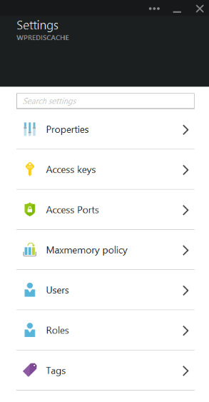
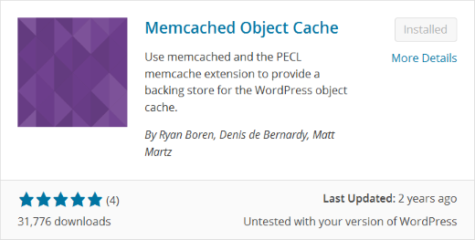

<properties 
   pageTitle="Connessione di un'app Web in Servizio app di Azure a Cache Redis mediante il protocollo Memcache" 
   description="Connessione di un'app Web in Servizio app di Azure a Cache Redis mediante il protocollo Memcache" 
   services="app-service\web" 
   documentationCenter="php" 
   authors="SyntaxC4" 
   manager="wpickett" 
   editor="riande"/>
   
<tags
   ms.service="app-service-web"
   ms.devlang="php"
   ms.topic="article"
   ms.tgt_pltfrm="windows"
   ms.workload="web" 
   ms.date="03/31/2015"
   ms.author="cfowler"/>

# Connessione di un'app Web in Servizio app di Azure a Cache Redis mediante il protocollo Memcache

Questo articolo illustrerà come connettere un'app Web di WordPress in [Servizio app di Azure](http://go.microsoft.com/fwlink/?LinkId=529714) a [Cache Redis di Azure][12] mediante il protocollo [Memcache][13]. Se si dispone di un'app Web esistente che usa un server Memcached per l'inserimento nella cache in memoria, è possibile sottoporla a migrazione in Servizio app di Azure e usare la soluzione di memorizzazione nella cache del produttore in Microsoft Azure apportando modifiche minime o addirittura nessuna modifica al codice dell'applicazione. È inoltre possibile sfruttare la familiarità già acquisita con Memcache per creare app distribuite e con scalabilità elevata in Servizio app di Azure con Cache Redis di Azure per l'inserimento nella cache in memoria, usando framework di applicazioni comuni, ad esempio .NET, PHP, Node.js, Java e Python.  

Le app Web di Servizio app di Azure rendono possibile questo scenario di applicazioni con lo shim Memcache per app Web, ovvero un server locale Memcached che funziona come proxy Memcache per memorizzare nella cache le chiamate a Cache Redis di Azure. In questo modo qualsiasi app può comunicare usando il protocollo Memcache per memorizzare i dati nella cache con Cache Redis. Questo shim Memcache funziona a livello di protocollo, in modo da poter essere usato da qualsiasi applicazione o framework di applicazioni, purché comunichi usando il protocollo Memcache.

## Prerequisiti

Lo shim Memcache per app Web può essere usato con qualsiasi applicazione, purché comunichi tramite il protocollo Memcache. Per questo particolare esempio, l'applicazione di riferimento è un sito WordPress scalabile di cui è possibile eseguire il provisioning da Azure Marketplace. 

Seguire la procedura descritta in questi post:

* [Provisioning di un'istanza del servizio Cache Redis di Azure][1]
* [Distribuzione di un sito WordPress scalabile in Azure][0]

Dopo aver distribuito il sito WordPress scalabile e aver eseguito il provisioning di un'istanza di Cache Redis, si è pronti per abilitare lo shim Memcache nelle app Web di Servizio app di Azure.

## Abilitare lo shim Memcache per app Web

Per configurare lo shim Memcache, è necessario creare tre impostazioni di app. Questa operazione può essere eseguita usando un'ampia gamma di metodi, inclusi il [portale di Azure](http://go.microsoft.com/fwlink/?LinkId=529715), il [vecchio portale][3], i [cmdlet PowerShell di Azure][5] o gli [strumenti da riga di comando multipiattaforma di Azure][5]. Ai fini di questo post, verrà usato il [portale di Azure][4] per configurare le impostazioni dell'app. I seguenti valori possono essere recuperati dal pannello **Impostazioni** dell'istanza di Cache Redis.



### Aggiungere l'impostazione di app REDIS_HOST

La prima impostazione di app che è necessario creare è **REDIS_HOST**. Questa impostazione definisce la destinazione a cui lo shim inoltra le informazioni della cache. Il valore richiesto per l'impostazione di app REDIS_HOST può essere recuperato dal pannello **Proprietà** dell'istanza di Cache Redis.


Impostare la chiave dell'impostazione di app su **REDIS_HOST** e il valore dell'impostazione di app sul **nome host** dell'istanza di Cache Redis.


### Aggiungere l'impostazione di app REDIS_KEY

La seconda impostazione di app che è necessario creare è **REDIS_KEY**. Questa impostazione fornisce il token di autenticazione necessario per accedere in modo sicuro all'istanza di Cache Redis. Il valore richiesto per l'impostazione di app REDIS_KEY può essere recuperato dal pannello **Chiavi di accesso** dell'istanza di Cache Redis.


Impostare la chiave dell'impostazione di app su **REDIS_KEY** e il valore dell'impostazione di app sulla **chiave primaria** dell'istanza di Cache Redis.


### Aggiungere l'impostazione di app MEMCACHESHIM_REDIS_ENABLE

L'ultima impostazione di app viene usata per abilitare lo shim Memcache in app Web che useranno REDIS_HOST e REDIS_KEY per la connessione a Cache Redis di Azure e per l'inoltro delle chiamate alla cache. Impostare la chiave dell'impostazione di app su **MEMCACHESHIM_REDIS_ENABLE** e il valore su **true**.


Dopo aver aggiunto le tre (3) impostazioni di app, fare clic su **Salva**.

## Abilitare l'estensione Memcache per PHP

Affinché l'applicazione supporti il protocollo Memcache, è necessario installare l'estensione Memcache per PHP (framework del linguaggio per il sito WordPress).

### Scaricare l'estensione php_memcache

Passare a [PECL][6]. Nella categoria di memorizzazione nella cache fare clic su [memcache][7]. Nella colonna dei download fare clic sul collegamento relativo alle DLL.


Scaricare il link Non-Thread Safe (NTS) x86 per la versione di PHP abilitata nelle app Web (il valore predefinito è PHP 5.4).


### Abilitare l'estensione php_memcache

Dopo il download del file, decomprimerlo e caricare il file **php_memcache.dll** nella directory **d:\\home\\site\\wwwroot\\bin\\ext**. Dopo il caricamento del file php_memcache.dll nell'app Web, è necessario abilitare l'estensione nel runtime PHP. Per abilitare l'estensione Memcache nel portale di Azure, aprire il pannello **Impostazioni applicazione** per l'app Web, quindi aggiungere una nuova impostazione di app con chiave **PHP_EXTENSIONS** e valore **bin\\ext\\php_memcache.dll**.


> Se l'app Web deve caricare più estensioni PHP, il valore di PHP_EXTENSIONS deve essere un elenco di percorsi relativi di file DLL delimitati da virgole.


Al termine, fare clic su **Salva**.

## Installare il plug-in Memcache WordPress

Nella pagina dei plug-in di WordPress fare clic sul pulsante **Aggiungi nuovo**.


Nella casella di ricerca digitare **memcached** e premere **INVIO**.


Trovare la **cache oggetti Memcached** nell'elenco, quindi fare clic sul pulsante **Installa ora**.



### Abilitare il plug-in Memcache WordPress

>[AZURE.NOTE] Seguire le istruzioni in questo blog nella pagina relativa a [come abilitare un'estensione del sito nelle app Web][8] per installare Visual Studio Online.

Nel file  `wp-config.php` aggiungere il seguente frammento di codice al di sopra del commento di arresto della modifica verso la fine del file.

```php
$memcached_servers = array(
	'default' => array('localhost:' . getenv("MEMCACHESHIM_PORT"))
);
```

Dopo che il frammento di codice è stato incollato, il documento verrà salvato automaticamente.

Il passaggio successivo consiste nell'abilitare il plug-in della cache di oggetti. Questa operazione viene eseguita trascinando **object-cache.php** dalla cartella **wp-content/memcached** sulla cartella **wp-content** per abilitare la funzionalità di cache di oggetti Memcached.


Ora che il file **object-cache.php** si trova nella cartella **wp-content** , la cache di oggetti Memcached è abilitata.


## Verificare il corretto funzionamento del plug-in della cache di oggetti Memcached

Tutti i passaggi per abilitare lo shim Memcache per app Web sono stati completati. Resta solo da verificare che i dati popolino l'istanza di Cache Redis.

### Abilitare il supporto della porta non SSL in Cache Redis di Azure

>[AZURE.NOTE] Alla data in cui viene scritto questo documento, l'interfaccia della riga di comando Redis non supporta la connettività SSL e pertanto sono necessarie le seguenti operazioni.

Nel portale di Azure passare all'istanza di Cache Redis creata per questa app Web. Una volta aperto il pannello della cache, fare clic sull'icona **Impostazioni**.


Selezionare **Porte di accesso** dall'elenco.


Fare clic su **No** per **Consenti accesso solo tramite SSL**.


La porta non SSL ora risulta impostata. Fare clic su **Salva**.


### Connettersi a Cache Redis di Azure da redis-cli

>[AZURE.NOTE] In questo passaggio si presuppone che Redis sia installato in locale nel computer di sviluppo. [Per installare Redis in locale, seguire queste istruzioni][9].

Aprire la console della riga di comando desiderata e digitare il seguente comando:

```shell
redis-cli -h <hostname-for-redis-cache> -a <primary-key-for-redis-cache> -p 6379
```

Sostituire **<hostname-for-redis-cache>** con il nome host effettivo xxxxx.redis.cache.windows.net e **<primary-key-for-redis-cache>** con la chiave di accesso della cache, quindi premere **INVIO**. Dopo che l'interfaccia della riga di comando si è connessa all'istanza di Cache Redis, inviare un comando Redis. Nella seguente schermata si è scelto di elencare le chiavi.


La chiamata per elencare le chiavi deve restituire un valore. In caso contrario, provare a passare all'app web e ripetere l'operazione.

## Conclusioni

Congratulazioni. L'app di WordPress dispone ora di una cache in memoria centralizzata per garantire una velocità effettiva maggiore. Tenere presente che lo shim Memcache per app Web può essere usato con qualsiasi client Memcache, indipendentemente dal linguaggio di programmazione o dal framework di applicazioni. Pubblicare eventuali commenti o domande sullo shim Memcache per app Web sui [forum MSDN][10] o su [Stackoverflow][11].

>[AZURE.NOTE] Per iniziare a usare Servizio app di Azure prima di registrarsi per ottenere un account Azure, andare a [Prova il servizio app](http://go.microsoft.com/fwlink/?LinkId=523751), dove è possibile creare un'app Web iniziale temporanea nel servizio app. Non è necessario fornire una carta di credito né impegnarsi in alcun modo.

## Modifiche apportate
* Per una guida relativa al passaggio da Siti Web al servizio app, vedere: [Servizio app di Azure e relativo impatto sui servizi di Azure esistenti](http://go.microsoft.com/fwlink/?LinkId=529714)
* Per una guida sul passaggio dal vecchio al nuovo portale, vedere: [Informazioni di riferimento per l'esplorazione del portale di anteprima](http://go.microsoft.com/fwlink/?LinkId=529715)


[0]: http://bit.ly/1F0m3tw
[1]: http://bit.ly/1t0KxBQ
[2]: http://manage.windowsazure.com
[3]: http://portal.azure.com
[4]: powershell-install-configure.md
[5]: /downloads
[6]: http://pecl.php.net
[7]: http://pecl.php.net/package/memcache
[8]: http://blog.syntaxc4.net/post/2015/02/05/how-to-enable-a-site-extension-in-azure-websites.aspx
[9]: http://redis.io/download#installation
[10]: https://social.msdn.microsoft.com/Forums/home?forum=windowsazurewebsitespreview
[11]: http://stackoverflow.com/questions/tagged/azure-web-sites
[12]: /services/cache/
[13]: http://memcached.org


<!--HONumber=52-->